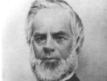

  
[Intangible Textual Heritage](../../index)  [New Thought](../index) 
[Index](index)  [Previous](qm05)  [Next](qm07) 

------------------------------------------------------------------------

[Buy this Book at
Amazon.com](https://www.amazon.com/exec/obidos/ASIN/1602062145/internetsacredte)

------------------------------------------------------------------------

[Buy this Book on
Kindle](https://www.amazon.com/exec/obidos/ASIN/B002I630CY/internetsacredte)

------------------------------------------------------------------------

  
*The Quimby Manuscripts*, Phineas Parkhurst Quimby, ed. by Horatio W.
Dresser \[1921\], at Intangible Textual Heritage

------------------------------------------------------------------------

p. 27

### 3

### Quimby's Restoration to Health

IDEALLY speaking it is of secondary consequence where an original mind
begins to investigate human life. What signifies is the searching
thought which discloses real conditions, laws, the causes of our misery
and the way to freedom. Such thinking is likely to be productive in high
degree if it be concrete, adapted to the actual state of the world,
without too much theorizing, with a view to direct benefits.

In Mr. Quimby's preliminary researches we find a capital instance. He
began with a purely conventional point of view, defending in thought and
attitude the prevailing medical practice of the day, and so he took the
world as he found it. Moreover, he had a personal need. This is the way
he states the situation he was in in an article already published in
part in "The True History of Mental Science." [1](#fn_5)

"Can a theory be found, capable of practice, which can separate truth
from error? I undertake to say there is a method of reasoning which,
being understood, can separate one from the other. Men never dispute
about a fact that can be demonstrated by scientific reasoning.
Controversies arise from some idea that has been turned into a false
direction, leading to a false position. The basis of my reasoning is
this point: that whatever is true to a person, if he cannot prove it, is
not necessarily true to another. Therefore, because a person says a
thing is no reason that he says true. The greatest evil that follows
taking an opinion for a truth is disease. Let medical and religious
opinions, which produce so vast an amount of misery, be tested by the
rule I have laid down, and it will be seen how much they are founded in
truth. For twenty years I have been testing them, and I have failed to
find one single principle of truth in either. This is not from any
prejudice against

p. 28

the medical faculty, for, when I began to investigate the mind, I was
entirely on that side. I was prejudiced in favor of the medical faculty;
for I never employed any one outside of the regular faculty, nor took
the least particle of quack medicine.

"Some thirty years ago I was very sick, and was considered fast wasting
away with consumption. [1](#fn_6) At that time I
became so low that it was with difficulty I could walk about. I was all
the while under the allopathic practice, and I had taken so much calomel
that my system was said to be poisoned with it; and I lost many of my
teeth from that effect. My symptoms were those of any consumptive; and I
had been told that my liver was affected and my kidneys were diseased,
and that my lungs were nearly consumed. I believed all this, from the
fact that I had all the symptoms, and could not resist the opinions of
the physician while having the proof with me. In this state I was
compelled to abandon my business; and, losing all hope, I gave up to
die,—not that I thought the medical faculty had no wisdom, but that my
case was one that could not be cured.

"Having an acquaintance who cured himself by riding horseback, I thought
I would try riding in a carriage, as I was too weak to ride horseback.
My horse was contrary; and once, when about two miles from home, he
stopped at the foot of a long hill, and would not start except as I went
by his side. So I was obliged to run nearly the whole distance. Having
reached the top of the hill I got into the carriage; and, as I was very
much exhausted, I concluded to sit there the balance of the day, if the
horse did not start. Like all sickly and nervous people, I could not
remain easy in that place; and, seeing a man ploughing, I waited till he
had ploughed around a three-acre lot, and got within sound of my voice,
when I asked him to start my horse. He did so, and at the time I was so
weak I could scarcely lift my whip. But excitement took possession of my
senses, and I drove the horse as fast as he could go, up hill and down,
till I reached home; and, when I got into the stable, I felt as strong
as I ever did."

Here, then, was a significant fact, this reaction produced

p. 29

by excitement, suggesting that medical diagnosis was wrong. No other
experience seems to have followed this one, and when Quimby began to
experiment with mesmerism he still accepted the prevailing medical
theories. So, too, he began by taking devotees of mesmerism at their own
word, since that appeared to be the best way to learn the truth
concerning their phenomena.

There are two reasons for bearing these facts in mind, first that we may
note how far he travelled to the point where he lost all faith in the
medical faculty and proposed a theory of disease of his own; second,
because we can hardly understand the interests of his intermediate
period unless we realize that he was still in process and had not at
first wholly rejected the physical theory of disease. Some other
investigation might have been as profitable to him. The point is that he
learned so much from his mesmeric experiments that he gave them up
forever, and in giving them up came to himself and found a new truth of
incalculable benefit to humanity.

There is no reason for apologizing as if it were discreditable that
Quimby was once a mesmerist and was known through his ability to
"magnetize" a patient or hypnotic subject. There was nothing to be
ashamed of in this procedure. The only unpardonable thing that has been
said about him is that he was "an ignorant mesmerist" and that he
remained so. Ignorant he was not by any means, and he ceased to be a
mesmerist because he was exceptionally skilful, so acute in exercising
his powers that he learned the limitations of all such experiments.

We have his own statement to the effect that when he began to
investigate mesmerism he was still an entire believer in the medical
science and practice of the day. We also have his own exposition of the
experiences which led to his change in point of view. We have
contemporary testimony to his exceptional powers and the impression
produced by his public experiments. Then too we have the testimony of
his son, George, associated with his father as secretary when the
mesmeric experiments were things of the past. Finally, we have the
direct information coming to us from those who were most intimately
acquainted with Quimby's practice in his later years, from 1859 to 1866
in Portland.

In the account of his father's life published in the *New England
Magazine*, George Quimby says,

p. 30

"He had a very inventive mind, and was always interested in mechanics,
philosophy and scientific subjects. During his middle life, he invented
several devices on which he obtained letters patent. He was very
argumentative, and always wanted proof of anything, rather than an
accepted opinion. Anything which could be demonstrated he was ready to
accept; but he would combat what could not be proved with all his
energy, rather than admit it as a truth.

"With a mind of this combination, it is not strange that, when a
gentleman visited Belfast, about the year 1838, and gave lectures and
experiments in mesmerism, Mr. Quimby should feel deeply interested in
the subject. Here was a new, to him at least, phenomenon; and he at once
began to investigate the subject; and on every occasion when he could
find a person who would allow him to try, he would endeavor to put him
into a mesmeric sleep. He met with many failures, but occasionally would
find a person whom he could influence.

"At that time Mr. Quimby was of medium height, small in stature, his
weight about one hundred and twenty-five pounds, quick motioned and
nervous, with piercing black eyes, black hair and whiskers; a
well-shaped, well-balanced head; high, broad forehead, and a rather
prominent nose, and a mouth indicating strength and firmness of will;
persistent in what he undertook, and yet not easily defeated or
discouraged.

"In the course of his trials with subjects, he met with a young man
named Lucius Burkmar, over whom he had the most wonderful influence; and
it is not stating it too strongly to assert that with him he made some
of the most astonishing exhibitions of mesmerism and clairvoyance that
have been given in modern times.

"At the beginning of these experiments, Mr. Quimby firmly believed that
the phenomenon was the result of animal magnetism, and that electricity
had more or less to do with it. Holding to this, he was never able to
perform his experiments with satisfactory results when the 'conditions'
were not right, as he believed they should be.

"For instance, during a thunder-storm his trials would prove failures.
If he pointed the sharp end of a steel instrument at Lucius, he would
start as if pricked with a pin; but when the blunt end was pointed
toward him, he would remain unmoved.

p. 31

"One evening, after making some experiments with excellent results, Mr.
Quimby found that during the time of the tests there had been a severe
thunder-storm, but, so interested was he in his experiments, he had not
noticed it.

"This led him to further investigate the subject; and the results
reached were that, instead of the subject being influenced by any
atmospheric disturbance, the effects produced were brought about by the
influence of one mind on another. From that time he could produce as
good results during a storm as in pleasant weather, and could make his
subject start by simply pointing a finger at him as well as by using a
steel instrument.

"Mr. Quimby's manner of operating with his subject was to sit opposite
to him, holding both his hands in his, and looking him intently in the
eye for a short time, when the subject would go into the state known as
the mesmeric sleep, which was more properly a peculiar condition of mind
and body, in which the natural senses would, or would not, operate at
the will of Mr. Quimby. When conducting his experiments, all
communications of Mr. Quimby with Lucius were mentally given, the
subject replying as if spoken to aloud.

"For several years, Mr. Quimby traveled with young Burkmar through Maine
and New Brunswick, giving exhibitions, which at that time attracted much
attention and secured notices through the columns of the newspapers.

"It should be remembered that at the time Mr. Quimby was giving these
exhibitions . . . the phenomenon was looked upon in a far different
light from that of the present day. At that time it was a deception, a
fraud, a humbug; and Mr. Quimby was vilified and frequently threatened
with mob violence, as the exhibitions smacked too strongly of witchcraft
to suit the people.

"As the subject gained more prominence, thoughtful men began to
investigate the matter, and Mr. Quimby was often called upon to have his
subject examine the sick. He would put Lucius into the mesmeric state,
and prescribe remedies for its cure. [1](#fn_7)

p. 32

"After a time Mr. Quimby became convinced that whenever the subject
examined a patient his diagnosis of the case would be identical with
what either the patient himself or some one present believed, instead of
Lucius really looking into the patient, and giving the true condition of
the organs; in fact, that he was reading the opinion of some one, rather
than stating truth acquired by himself.

"Becoming firmly satisfied that this was the case, and having seen how
one mind could influence another, and how much there was that had always
been considered as true, but was merely some one's opinion, Mr. Quimby
gave up his subject, Lucius, and began the developing of what is now
known as mental healing, or curing disease through the mind . . .

"While engaged in his mesmeric experiments, Mr. Quimby became more and
more convinced that disease was an error of the mind, and not a real
thing. As the truths of his discovery began to develop, and grow in him,
just in the same proportion did he begin to lose faith in the efficacy
of mesmerism as a remedial agent in the cure of the sick; and after a
few years he discarded it altogether.

"Instead of putting the patient into a mesmeric sleep, Mr. Quimby would
sit by him; and, having given him a detailed account of what his
troubles were, he would simply converse with him and explain the causes
of the troubles, and thus change the mind of the patient . . ."

Despite the fact, however, that Lucius when in the mesmeric sleep would
often read what was in the mind of the patient and diagnose the case
according to opinions expressed by [physicians](errata.htm#8), Lucius
also discerned at other times the actual state of the body. That he
possessed remarkable clairvoyant power in such cases is shown by
experiments in which Lucius described events and things at a distance,
when en rapport with the mind of some one in the audience who thought of
some distant place which he wanted Lucius to visit. There is also
documentary evidence to show that Lucius could accurately describe the
condition of the body after death.

There was much to learn from these experiments, therefore, besides the
significant fact that a patient would often feel in regard to his own
body as medical diagnosis suggested that he feel. Lucius would sometimes
prescribe a remedy

p. 33

so simple or so absurd that Mr. Quimby saw there could be no
[virtue](errata.htm#9) in the medicine. Plainly, both the disease and
its cure must be explained on another basis. This we see clearly when we
realize that Mr. Quimby himself experienced the benefits of the
clairvoyant descriptions, thereby overcoming what had appeared to be
threatening diseases, although the true explanation was not the one
offered by Lucius.

In the article quoted from above, written when Mr. Quimby had developed
and proved his theory of disease so that he could look back and
understand the whole phenomenon, so new and at first so baffling in his
mesmeric period, he says,

"When I commenced to mesmerise, I was not well, according to the medical
science; but in my researches I found a remedy for my disease. Here was
where I first discovered that mind was capable of being changed.

"Also that, disease being a deranged state of mind, the cause I found to
exist in our belief. The evidence of this theory I found in myself; for,
like all others, I had believed in medicine. Disease and its power over
life, and its curability, are all embraced in our belief. Some believe
in various remedies, and others believe that the spirits of the dead
prescribe. I have no confidence in the virtue of either. I know that
cures have been made in these ways. I do not deny them. But the
principle on which they are done is the question to solve; for disease
can be cured, with or without medicine, on but one principle. I have
said I believed in the old practice and its medicines, the effects of
which I had within myself; for, knowing no other way to account for the
phenomena, I took it for granted that they were the result of medicine.

"With this mass of evidence staring me in the face, how could I doubt
the old practice? Yet, in spite of all my prejudices, I had to yield to
a stronger evidence than man's opinion, and discard the whole theory of
medicine, practised by a class of men, some honest, some ignorant, some
selfish, and all thinking that the world must be ruled by their
opinions.

"Now for my particular experience. I had pains in the back, which, they
said, were caused by my kidneys, which were partially consumed. I also
was told that I had ulcers on my lungs. Tinder this belief, I was
miserable enough to be of no account in the world. This was the state I
was in when

p. 34

\[paragraph continues\] I commenced to
mesmerise. On one occasion, when I had my subject \[Lucius\] asleep, he
described the pains I felt in my back (I had never dared to ask him to
examine me, for I felt sure that my kidneys were nearly gone) and he
placed his hand on the spot where I felt the pain. He then told me that
my kidneys were in a very bad state, that one was half-consumed, and a
piece three inches long had separated from it, and was only connected by
a slender thread. This was what I believed to be true, for it agreed
with what the doctors told me, and with what I had suffered; for I had
not been free from pain for years. My common sense told me that no
medicine would ever cure this trouble, and therefore I must suffer till
death relieved me. But I asked him if there was any remedy. He replied,
'Yes, I can put the piece on so it will grow, and you will get well.' At
this I was completely astonished, and knew not what to think. He
immediately placed his hands upon me, and said he united the pieces so
they would grow. The next day he said they had grown together, and from
that day I never have experienced the least pain from them.

"Now what is the secret of the cure? I had not the least doubt but that
I was as he had described; and, if he had said, as I expected that he
would, that nothing could be done, I should have died in a year or so.
But, when he said he could cure me in the way he proposed, I began to
think: and I discovered that I had been deceived into a belief that made
me sick. The absurdity of his remedies made me doubt the fact that my
kidneys were diseased, for he said in two days they were as well as
ever. If he saw the first condition, he also saw the last; for in both
cases he said he could see. I concluded in the first instance that he
read my thoughts, and when he said he could cure me he drew on his own
mind; and his ideas were so absurd that the disease vanished by the
absurdity of the cure. This was the first stumbling-block I found in the
medical science. I soon ventured to let him examine me
[further](errata.htm#10), and in every case he would describe my
feelings, but would vary the amount of disease; and his explanation and
remedies always convinced me that I had no such disease, and that my
troubles were of my own make.

"At this time I frequently visited the sick with Lucius, by invitation
of the attending physician; and the boy examined the patient and told
facts that would astonish everybody,

p. 35

and yet every one of them was believed. For instance, he told a person
affected as I had been, only worse, that his lungs looked like a
honeycomb, and his liver was covered with ulcers. He then prescribed
some simple herb tea, and the patient recovered; and the doctor believed
the medicine cured him. But I believed that the doctor made the disease;
and his faith in the boy made a change in the mind, and the cure
followed. Instead of gaining confidence in the doctors, I was forced to
the conclusion that their science is false. Man is made up of truth and
belief; and, if he is deceived into a belief that he has, or is liable
to have, a disease, the belief is catching, and the effect follows it. I
have given the experience of my emancipation from this belief and from
confidence in the doctors, so that it may open the eyes of those who
stand where I was. I have risen from this belief; and I return to warn
my brethren, lest, when they are disturbed, they shall get into this
place of torment prepared by the medical faculty. Having suffered
myself, I cannot take advantage of my fellow-men by introducing a new
mode of curing disease and prescribing medicine. My theory exposes the
hypocrisy of those who undertake to cure in that way. They make ten
diseases to one cure, thus bringing a surplus of misery into the world,
and shutting out a healthy state of society. They have a monopoly, and
no theory that lessens disease can compete with them. When I cure, there
is one disease the less; but not so when others cure, for the supply of
sickness shows that there is more disease on hand than there ever was.
Therefore, the labor for health is slow, and the manufacture of disease
is greater. The newspapers teem with advertisements of remedies, showing
that the supply of disease increases. My theory teaches man to
manufacture health; and, when people go into this occupation, disease
will diminish, and those who furnish disease and death will be few and
scarce."

------------------------------------------------------------------------

### Footnotes

[27:1](qm06.htm#fr_5) By Julius A. Dresser, 1887.

[28:1](qm06.htm#fr_6) This statement was written
in 1863.

[31:1](qm06.htm#fr_7) These descriptions and the
remedies prescribed were in accord with the medical practice of the day,
as Mr. Quimby was not yet enlightened in regard to the mental factors of
disease. The discovery on Mr. Quimby's part that mind was the chief
consideration marked a turning-point in his thought. Ed.

------------------------------------------------------------------------

[Next: 4. The Mesmeric Period](qm07)
