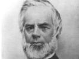

  
[Intangible Textual Heritage](../../index)  [New Thought](../index) 
[Index](index)  [Previous](qm14)  [Next](qm16) 

------------------------------------------------------------------------

[Buy this Book at
Amazon.com](https://www.amazon.com/exec/obidos/ASIN/1602062145/internetsacredte)

------------------------------------------------------------------------

[Buy this Book on
Kindle](https://www.amazon.com/exec/obidos/ASIN/B002I630CY/internetsacredte)

------------------------------------------------------------------------

  
*The Quimby Manuscripts*, Phineas Parkhurst Quimby, ed. by Horatio W.
Dresser \[1921\], at Intangible Textual Heritage

------------------------------------------------------------------------

p. 152

### 12

### Mrs. Eddy 1862-1875 [1](#fn_46)

We have noted the fact that Mrs. Eddy, then Mrs. Patterson, was a
patient under Dr. Quimby's care during the period of his practice in
Portland. At that time Mrs. Eddy was recovering from invalidism of long
standing. Hence she was greatly handicapped at first. She had firmly
believed in doctors and medicine, and accepted the conventional
teachings in regard to disease. But while burdened with these
allegiances she also possessed a strong desire to make the change to the
new point of view as thoroughly and quickly as possible. To understand
her relationship to Dr. Quimby and his teachings we need then to put
ourselves appreciatively into the point of view of her inner life.

Dr. D. Patterson, Mrs. Eddy's husband, became interested in the new
method of healing and urged his wife to consult Dr. Quimby. Two of his
letters to Dr. Quimby have been preserved and are here printed in full.

#### DR. D. PATTERSON TO P. P. QUIMBY

No. 1

Rumney, N. H., Oct. 14, 1861.       

*Dr. Quimby*,

DEAR SIR: I have heard that you intended to come to Concord, N. H. this
fall to stop a while for the benefit of the suffering portion of our
race: do you intend, and if so, how soon? My wife has been an invalid
for a number of years; is not able to sit up but a little, and we wish
to have the benefit of your wonderful power in her case. If you axe soon
coming to Concord I shall carry her up to you, and if you

p. 153

are not coming there we may try to carry her to Portland if you remain
there.

Please write me at your earliest convenience and oblige,

Yours truly,

(Address)                     DR. D. PATTERSON,                     
RUMNEY, N.H.

No. 2

No. 76 UNION ST., LYNN, MASS. Apl. 24th, 1865.     

*Dr. P. P. Quimby*.

DEAR SIR: My wife arrived safely Sat. eve., and is greatly improved in
her health, but says she did not settle with you. If you will send your
bill by mail, I will send the balance due you by the same conveyance.

Yours,                   
D. PATTERSON.  

The first of these letters is especially important since it gives the
date of the request for Dr. Quimby's treatment. Dr. Quimby's
circular [1](#fn_47) deeply interested Mrs. Eddy
and as he was unable to leave his practice in Portland to visit Mrs.
Eddy in New Hampshire, Mrs. Eddy wrote personal appeals from Rumney, and
from a water cure in Hill, N. H., whither she had gone for treatment but
without avail. It is plain that Mrs. Eddy had now reached the limit of
endurance and the end of her faith in material methods of treatment. No
record of Dr. Quimby's answer has been preserved, but doubtless he wrote
to her with all the more interest and conviction in view of the fact
that she had given up hope in all other directions. For under such
conditions he anticipated the best results.

There is no record of the exact date of Mrs. Eddy's arrival in Portland,
hut one of Dr. Quimby's patients, still living, was present in the
office when she came and distinctly remembers seeing the invalid
assisted up the steps to his office. In the journal of Mr. Julius A.
Dresser, under date of October 17, 1862, mention is made for the first
time of this new patient, who manifested special interest in Dr.
Quimby's teaching and was eager to converse with the patients who best
understood the new theory. Mr. Dresser

p. 154

devoted the larger part of his time at that period to conversations with
patients, and it was natural that he should talk at length with Mrs.
Eddy. These conversations were highly important because they gave Mrs.
Eddy her first connected idea of Quimby's great truth.

First of all, Mr. Dresser could speak with the conviction of one whose
life had been saved at the point of death with typhoid pneumonia. Again,
he had seen the results in hundreds of cases,, since his own cure in
June, 1860, and could substantiate whatever he said by describing the
conditions and the appearance of patients when they first came for
treatment and by telling how great were the changes wrought by Quimby's
wisdom. Mrs. Eddy indicated her increasing interest in this "wisdom,"
and her desire to read a statement of it in Quimby's own words.
Accordingly Mr. Dresser loaned her Vol: 1 of the manuscripts, as he
possessed a copy in his own handwriting, this copy having been preserved
with the others until the present time. [1](#fn_48)

The turning-point with Mrs. Eddy, as with all who came to Dr. Quimby,
was of course the silent spiritual treatment which she received at
regular intervals during her stay in Portland. Dr. Quimby always
depended primarily on this silent work to bring about the fundamental or
decisive change, to overcome the adverse influences and start the
reaction in favor of health. In Mrs. Eddy's case there were years of
invalidism to overcome, together with the beliefs and habits which bound
her to another mode of life. Hence a gradual change in consciousness and
attitude followed upon the remarkable effects of the silent treatment
which lifted her out of her invalidism. To understand what Dr. Quimby
accomplished for her we should not only bear in mind that the silent
treatment took her past the decisive point, but note that the
conversations were in their way no less essential, and that these were
made good by the many opportunities to listen to the reading of
manuscripts, to hear discussions and to read the manuscripts herself. We
have the direct testimony of those who were present during the
conversations and readings in the office to the effect that Mrs. Eddy
showed unusual eagerness to acquire all she could through these
exceptional opportunities. Indeed her zeal seems at

p. 155

times to have exceeded her understanding, for some of her letters
indicate that she made ventures beyond her returning strength. She was
nervously susceptible in type, easily took on the feelings or mental
atmospheres of the sick. Hence the problem in her case was not merely
that of the recovery of her health; it was to find a way to
temperamental control so that she could apply the new "Science" and yet
keep free.

After her return from Portland to Sanbornton Bridge (1863) she was not
sure of herself in all respects and found it necessary to send for
absent treatment on occasion, but she had begun to care for the sick by
Quimby's method. Later, at Warren, Maine, (1864) she acquired the power
to detect others’ feelings and atmospheres, had become accustomed to the
feeling of Quimby's presence during absent treatments and had advanced
to knowledge of that presence when there was no apparent reason for his
coming.

It was at Warren that Mrs. Eddy gave her first public lectures
expounding Quimby's views. She felt impelled to give these lectures
because she found herself classified as a spiritualist and a public
denial seemed necessary—she disclaimed any connection with phenomena
involving rappings, trances, or any agency in healing the sick said to
come from the dead, and contrasted Quimby's science of healing with
Rochester rappings, spiritualism and deism in general. Her remarks
attracted attention and a newspaper editor asked her for a communication
on the subject.

Throughout this period, from the time of her acquaintance with Dr.
Quimby by reputation and then as her healer in Portland and by means of
"angel visits," Mrs. Eddy looked up to Quimby as the great discoverer
and healer of the day, the one whose privilege it was to rediscover the
truth which Jesus taught. She felt and expressed the profound gratitude
and loyalty of one who had been marvellously restored to health. She
made no claims for herself. She did not make light of Quimby's teaching
or identify it with either mesmerism, magnetism or any other of the isms
of the day, as we shall soon see more plainly, in her communication to a
Portland paper. In fact, she showed herself more than an ardent
disciple; she was eager to come to Quimby's defense, lest he should be
misunderstood and classed with the isms and humbugs then current.

In order to depreciate Mrs. Eddy's indebtedness to Dr.

p. 156

\[paragraph continues\] Quimby, some
critics have tried to make out that she was not cured by him. The
recurrence of weakness seems to confirm this. Mrs. Eddy several times
wrote for absent healing, and on one occasion felt it necessary to
return to Portland for treatment. She frankly confessed that she had
temporary recurrences of former troubles. But the critics who make this
charge overlook the fact that she was at the point of death when she
first went to Portland, and the fact that she was brought out of that
condition so that she could walk, as she herself says in her
communication to the Courier, unaided after only a week's treatment; and
that Dr. Quimby gave her the therapeutic impetus and the wisdom which
carried her through to the point where she herself began to understand
and to demonstrate.

SONNET.  
*Suggested by Reading the Remarkable Cure of Captain F. W Deering* [1](#fn_49)  
For the *Courier*.  
TO DR. P. P. QUIMBY

’Mid light of science sits the sage profound,  
Awing with classics and his starry lore,  
Climbing to Venus, chasing Saturn round,  
Turning his mystic pages o’er and o’er,  
Till, from empyrean space, his wearied sight  
Turns to the oasis on which to gaze,  
More bright than glitters on the brow of night  
The self-taught man walking in wisdom's ways.  
Then paused the captive gaze with peace entwined,  
And sight was satisfied with thee to dwell;  
But not in classics could the book-worm find  
That law of excellence whence came the spell  
Potent o’er all,—the captive to unbind,  
To heal the sick and faint, the halt and blind.  
                                   MARY M. PATTERSON.

The confessions of weakness were evidences of the
[regenerative](errata.htm#24) work in process, as she realizes when it
comes to her that to see the great new truth and to live by it
consciously are two different things. For the mere restoration to
physical health was only the beginning. There remained the great problem
of a temperament which made her unduly aware of the ills and feelings of
others. The problem of one's temperament is not to be solved in a week.
Hence

p. 157

to Dr. Quimby she wrote as much of her weaknesses and failures as of her
faith in his new Science that, seeing precisely where she stood, he
might help her to take the next great step. Dr. Quimby always encouraged
this frank statement of a patient's actual needs. Mrs. Eddy responded in
full faith. Meanwhile her public lectures and her conversations with
interested persons showed how strong was her belief that Quimby
possessed the true Science of the Christ. This faith is shown, for
example, in the sonnet written at the time of one of Dr. Quimby's great
cures, and in her article in a Portland daily paper.

The following is from Mrs. Eddy's article published in the Portland
*Evening Courier* in 1862. It plainly shows the writer's real attitude
toward her restorer.

"When our Shakespeare decided that 'there were more things in this world
than were dreamed of in your philosophy,' I cannot say of a verity that
he had a foreknowledge of P. P. Quimby. And when the school Platonic
anatomized the soul and divided it into halves, to be reunited by
elementary attractions, and heathen philosophers averred that old Chaos
in sullen silence blooded o'er the earth until her inimitable form was
hatched from the egg of night, I would not at present decide whether the
fallacy was found in their premises or conclusions, never having dated
my existence be fore the flood. When the startled alchemist discovered,
as he supposed, an universal solvent, or the philosopher's stone, and
the more daring Archimedes invented a lever wherewithal to pry up the
universe, I cannot say that in either the principle obtained in nature
or in art, or that it worked well, having never tried it. But, when by a
falling apple an immutable law was discovered, we gave it the crown of
science, which is incontrovertible and capable of demonstration: hence
that was wisdom and truth. When from the evidence of the senses my
reason takes cognizance of truth, although it may appear in quite a
miraculous view, I must acknowledge that as science which is truth
uninvestigated. Hence the following demonstration:—

"Three weeks since I quitted my nurse and sick-room *en route* for
Portland. The belief of my recovery had died out of the hearts of those
who were most anxious for it. With this mental and physical depression I
first visited P. P. Quimby; and in less than one week from that time I
ascended

p. 158

by a stairway of one hundred and eighty-two steps to the dome of the
City Hall, and am improving ad infinitum. To the most subtle reasoning,
such a proof, coupled, too, as it is with numberless similar ones,
demonstrates his power to heal. Now for a brief analysis of this power.

"Is it spiritualism. Listen to the words of wisdom. 'Believe in God,
believe also in me; or believe me for the very work's sake.' Now, then,
his works are but the result of superior wisdom, which can demonstrate a
science not understood: hence it were a doubtful proceeding not to
believe him for the work's sake. Well, then, he denies that his power to
heal the sick is borrowed from the spirits of this or another world; and
let us take the Scriptures for proof. 'A kingdom divided against itself
[cannot](errata.htm#25) stand.' How, then, can he receive the friendly
aid of the disenthralled spirit, while he rejects the faith of the
solemn mystic who crosses the threshold of the dark unknown to conjure
up from the vasty deep the awe-struck spirit of some invisible squaw?

"Again, is it by animal magnetism that he heals the sick? Let us
examine. I have employed electro-magnetism and animal magnetism, and for
a brief interval have felt relief, from the equilibrium which I fancied
was restored to an exhausted system or by a diffusion of concentrated
action. But in no instance did I get rid of a return of all my ailments,
because I had not been helped out of the error in which opinions
involved us. My operator believed in disease independent of the mind;
hence, I could not be wiser than my teacher. But now I can see dimly at
first, and only as trees walking, the great principle which underlies
Dr. Quimby's faith and works; and just in proportion to my light
perception of truth is my recovery. This truth which he opposes to the
error of giving intelligence to matter and placing pain where it never
placed itself, if received understandingly, changes the currents of the
system to their normal action; and the mechanism of the body goes on
undisturbed. That this is a science capable of demonstration becomes
clear to the minds of those patients who reason upon the process of
their cure. The truth which he establishes in the patient cures him
(although he may be wholly unconscious thereof); and the body, which is
full of light, is no longer in disease. At present I am too much in
error to elucidate the truth, and can touch only the key-note for the
master

p. 159

hand to wake the harmony. May it be in essays instead of notes! say I.
After all, this is a very spiritual doctrine; but the eternal years of
God are with it, and it must stand firm as the rock of ages. And to many
a poor sufferer may it be found, as by me, 'the shadow of a great rock
in a weary land'."

The day following the publication of the above article, it was
criticized by the Portland *Advertiser;* and Mrs. Eddy then wrote a
second article, replying to the criticism. In it appeared the following
paragraph, referring to Quimby and his doctrine:

"P. P. Quimby stands upon the plane of wisdom with his truth. Christ
healed the sick, but not by jugglery or with drugs. As the former speaks
as never man before spake, and heals as never man healed since. Christ,
is he not identified with truth, and is not this the Christ which is in
him? We know that in wisdom is life, 'and the life was the light of
man.' P. P. Quimby rolls away the stone from the sepulchre of error, and
health is the resurrection. But we also know that 'light shineth in
darkness, and the darkness comprehended it not.'"

"These excerpts" says J. A. Dresser, "are in plain language, and they
speak for themselves. The statements are made with too evident an
understanding of their truth to be doubted or questioned, or afterward
reversed in any particular. It should be borne in mind that your speaker
was there at the time, and was familiar with all the circumstances she
relates and the views expressed. The devoted regard the lady formed for
her deliverer, Quimby, and for the truth he taught her, which proved her
salvation, was continued to be held by her from this time (the autumn of
1862) up to a period at least four years later; for in January, 1866,
Quimby's death occurred, and on February 15 she sent to me a copy of a
poem she had written to his memory, and accompanied it by letter."

This letter, which was published in full in "The True History of Mental
Science," 1887, was both an expression of gratitude and a personal
appeal. Knowing that Mr. Dresser was Quimby's most enthusiastic
follower, Mrs. Eddy expressed the hope that he would take up the work of
their much-loved friend. She then goes on to speak of a fall on the
sidewalk which left her momentarily unconscious.

p. 160

When she was brought to, she found herself in a crippled condition like
that which Dr. Quimby had cured in 1862. The attending physician
declared that she would never walk again. But so firm was her faith in
Quimby's principle that she was out of bed in two days, with the
declaration that she would walk. Nevertheless she found that the mishap
had thrown her back into the old associations for the time being, also
that her friends were helping her back into the spinal affection from
which she had suffered so long. In this state of suspense between
opposing forces she appealed to Mr. Dresser for help, according. to
Quimby's method of silent spiritual treatment. If another person were in
her condition she believed she could give help in this way, that is, if
the other had not attributed intelligence to matter. But despite her
strung faith that all intelligence should be identified with Divine
power, she found herself weakening. Hence her appeal to one who had
followed Dr. Quimby with such ardor and understanding.

The poem, which had been printed in a Lynn newspaper, is as follows:—

LINES ON THE DEATH OF DR. P. P. QUIMBY, WHO HEALED WITH THE TRUTH THAT
CHRIST TAUGHT, IN CONTRADISTINCTION TO ALL ISMS.

Did sackcloth clothe the sun, and day grow night,  
  All matter mourn the hour with dewy eyes,  
When Truth, receding from our mortal sight,  
  Had paid to error her last sacrifice?  
Can we forget the power that gave us life?  
  Shall we forget the wisdom of its way?  
Then ask me not, amid this mortal strife,  
  This keenest pang of animated, clay,  
To mourn him less: to mourn him more were just,  
  If to his memory ’twere a tribute given  
For every solemn, sacred, earnest trust  
  Delivered to us ere he rose to heaven.  
Heaven but the happiness of that calm soul,  
  Growing in stature to the throne of God:  
Rest should reward him who bath made us whole,  
  Seeking, though tremblers, where his footsteps trod.  
LYNN, Feb. 22, 1866.                     MARY M. PATTERSON.

It is interesting to realize how much depended on the answer to that
letter. Had Mr. Dresser decided to take up Dr. Quimby's work at that
time, no one would have disputed

p. 161

his right to do so or his worthiness, since he was the best fitted of
Quimby's followers to succeed him. But, lacking the confidence to take
over the work of a master hand, he expressed his unfitness and declined
the opportunity which Mrs. Eddy's appeal put before him. There was then
no resource for Mrs. Eddy save to apply the Quimby method in her own
way.

On the other hand, as we have seen above, Mrs. Eddy was for sometime in
the throes of proving Quimby's principle in her own way. With no healer
to depend on, she had to look to that principle alone. She still
remained loyal to Quimby. There is no reason for believing that her
attitude toward him changed in any way until sometime in 1872. He was to
her the modern representative of the great saving truths taught by
Jesus. He had developed the method by which those truths could once more
be applied to the healing of the sick. Her own necessity had proved the
efficacy of that method anew. There was no reason for any revelation.
There was no reason for any kind of claim in her own behalf. Her
revelation was simply this: that when hard pressed she too could
demonstrate the wisdom and power of the Science which Quimby had taught.
It always comes to a person with the force of a revelation when one
realizes that it is within one's power actually to apply a line of
teaching which hitherto has seemed so wonderful that apparently its
discoverer is the only person who can demonstrate it. This proof of his
teaching was precisely what Dr. Quimby hoped his followers would make.
For, as we have noted, he himself made no special claims. He knew that
his teaching, fundamentally speaking, was eternally true. He knew that
it was all to be found in the Bible. What he had discovered was a' new
key to unlock supposed mysteries which had been kept from the world
throughout the Christian centuries. Years of experience were required on
Dr. Quimby's part to work out this Science and to prove its efficacy.
Quimby's followers really demonstrated it for themselves only so far as
they added to the great work wrought for them by Quimby the personal
proof which experience must give. Mrs. Eddy's case was no exception. A
challenging experience gave her the conclusive evidence that the Science
of the Christ had been brought to light once more.

Some allowance must always be made for the personal

p. 162

equation. Readers of the works of Rev. Warren F. Evans, the first author
to produce a book on the rediscovered science of healing, have found in
that writer's six volumes one type of interpretation of Quimby's
teaching. Well versed in philosophy, the teachings of Swedenborg, and
especially in the idealism of Berkeley, Evans put Quimby's views in
terms of idealism, with scant emphasis on the realities of the material
world. The interpretation made by Mrs. Eddy went farther in the same
direction, that is, in her emphasis on the intelligence and power of
spirit, as if the world of nature had no existence. The original sources
of this interpretation, as based on Quimby's writings, have never been
disclosed until the publication of the present volume.

The direct sources were "Questions and Answers," and Vol. 1 of the
manuscripts, supplemented by notes based on the readings and
conversations in Dr. Quimby's office. Given Mrs. Eddy's version of
Christian Science as it is to be found in her various books, in "The
Science of Man" and other small writings, and in the different editions
of "Science and Health," including the first, the reader will be able to
trace out her version of the Quimby theory from its inception. Given the
present volume in its fulness, the reader will also see what the later
version of Christian Science might have been had Mrs. Eddy enjoyed the
benefit of all the Quimby manuscripts. For .he later writings are in
various respects correctives of the view which underestimates the place
and reality of the natural world.

It is not necessary to trace out the changes made in the writings which
were in Mrs. Eddy's possession. The manuscript known as "Questions and
Answers" [1](#fn_50) is the typical instance.
With great care Miss Milmine [2](#fn_51)
followed all these changes throughout the period which intervened
between 1866 and 1875, when Mrs. Eddy, then Mrs. Glover, lived in Maine
and in Stoughton, Mass. She has shown how "Questions and Answers"
gradually became "The Science of Man, by which the sick are healed,
Embracing Questions and Answers in Moral Science, arranged for the
learner by Mrs. Mary Baker Glover," 1870. She has disclosed the fact
that this manuscript was still attributed to Dr. Quimby while Mrs. Eddy
lived in Stoughton, but that Mrs. Eddy

p. 163

introduced a preface of her own which was later incorporated into the
text, which in turn was put forth as Mrs. Eddy's (Mrs. Glover's) own
during the period of her work in Lynn. Thus we have before us all the
stages which led from entire fidelity to Quimby to the later attitude as
expressed in "Science and Health" after the first edition. Then, too, in
the *New York Times*, July 10, 1904, portions of "Questions and Answers"
were printed side by side with passages from "Science and Health,"
together with a facsimile showing emendations in Mrs. Eddy's copy of the
manuscript in her own hand. The article in the *Times* was conclusive
evidence regarding this important transition from "Questions and
Answers" to "The Science of Man." All that was needed to make the
textual history complete was the publication in full of "Questions and
Answers" in the present volume.

From all the evidence before us it is perfectly clear, that until
sometime in 1872, at the close of her intermediate period, Mrs. Eddy
maintained her attitude of loyalty to Quimby as expressed in her
letters, 1862-65, and her newspaper contributions and lectures of those
years. We find her in the Stoughton period still attributing "Questions
and Answers" to him without qualification. After that time, as Miss
Milmine has clearly shown, changes in terminology were gradually
introduced, and Dr. Quimby was no longer mentioned as the writer and
discoverer. What followed is not for us to chronicle here.

For our present purposes it is a question of the gradual development of
Dr. Quimby's own views, which have reached a certain stage of clearness
only in the case of "Questions and Answers." Dr. Quimby was not at his
best when thus answering questions, but rather when giving the silent
treatment and conversing with his patients. While Mrs. Eddy was limited
to a few manuscripts, in so far as she copied or rewrote them for her
own purpose as a teacher, she had also had the benefit of that decisive
silent healing and the touch with a quickening personality which gave
her the directive impetus for her own work. This is the main
consideration. And this ought not to be lost sight of in our interest in
tracing the vicissitudes of such a manuscript as "Questions and
Answers."

For better or worse, that manuscript is Quimby's. We may read it as a
secondary expression of what Quimby

p. 164

believed, or we may read it to see just how it led to the development of
the later Christian Science. One should guard against claiming too much
either for this particular manuscript or for the use to which it was put
by Mrs. Eddy. For no one who knows the facts from within has ever
claimed that Dr. Quimby actually wrote Mrs. Eddy's book, "Science and
Health." What has been claimed, and rightfully so, is that from Dr.
Quimby in the period under consideration in this chapter Mrs. Eddy, then
Mrs. Patterson, having been restored to health by the great healer, whom
she publicly acknowledged as working by the truth which Jesus taught,
acquired the essential ideas and methods which gave being to her version
of Christian Science.

"Question and Answers," used as the basis for teaching for several
years, was the connecting link. The "Science of Man" stands for another
link in the chain of development, the first and second editions of
"Science and Health" for other links. To understand all these in their
connection is to understand the origin and the various expressions of
the later Christian Science.

------------------------------------------------------------------------

### Footnotes

[152:1](qm15.htm#fr_46) Fourteen of Mrs. Eddy's
personal letters were found with the "Quimby Manuscripts." While we are
not at liberty to print the text of these letters, it may be said that
they corroborate the statements made in this chapter and elsewhere
regarding the relations of Mrs. Eddy to Dr. Quimby and her acceptance of
his theories.

[153:1](qm15.htm#fr_47) See page
[150](qm14.htm#page_150).

[154:1](qm15.htm#fr_48) See pages
[179](qm17.htm#page_179)-[229](qm17.htm#page_229).

[156:1](qm15.htm#fr_49) Printed from the
original manuscript preserved by George A. Quimby. See Appendix.

[162:1](qm15.htm#fr_50) See pages
[165](qm16.htm#page_165)-[178](qm16.htm#page_178).

[162:2](qm15.htm#fr_51) See Appendix page
[435](qm24.htm#page_435).

------------------------------------------------------------------------

[Next: 13. Questions and Answers](qm16)
