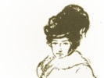

  
[Intangible Textual Heritage](../../../index)  [New
Thought](../../index)  [Shinn](../index)  [Index](index) 
[Previous](sds07)  [Next](sds09) 

------------------------------------------------------------------------

[Buy this Book at
Amazon.com](https://www.amazon.com/exec/obidos/ASIN/0875166105/internetsacredte)

------------------------------------------------------------------------

  
*The Secret Door to Success*, by Florence Scovel Shinn, \[1941\], at
Intangible Textual Heritage

------------------------------------------------------------------------

### THE WATCHMAN AT THE GATE

|                                                                                             |
|---------------------------------------------------------------------------------------------|
| "Also I set watchmen over you, saying, Hearken to the sound of the trumpet."—Jeremiah 6:17? |

 

We must all have a watchman at the gate of our thoughts. The Watchman at
the Gate is the superconscious mind.

We have the power to choose our thoughts.

Since we have lived in the race thought for thousands of years, it seems
almost impossible to control them. They rush through our minds like
stampeding cattle or sheep.

But a single sheep-dog can control the frightened sheep and guide them
into the sheep pen.

I saw a picture in the news-reels of a shepherd-dog controlling the
sheep. He had rounded up all but three. These three resisted and
resented. They baahed and lifted their front feet in protest, but the
dog simply sat down in front and never took his eyes off them. He did
not bark or threaten. He just sat and looked his determination. In a
little while the sheep tossed their heads and went in the pen.

We can learn to control our thoughts in the same way, by gentle
determination, not force.

We take an affirmation and repeat it continually, while our thoughts are
on the rampage.

We cannot always control our thoughts, but we *can control our words*,
and repetition impresses the subconscious, and we are then master of the
situation.

In the sixth chapter of Jeremiah we read: "I set a watchman over you,
saying, Hearken to the sound of the trumpet."

Your success and happiness in life depend upon the watchman at the gate
of your thoughts, for your thoughts, sooner or later, crystallize on the
external.

People think by running away from a negative situation, they will be rid
of it, but the same situation confronts them wherever they go.

They will meet the same experiences until they have learned their
lessons. This idea is brought out in the moving picture, "The Wizard of
Oz."

The little girl, Dorothy, is very unhappy because the mean woman in the
village wants to take away her dog, Toto.

She goes, in despair, to confide in her Aunt Em and Uncle Henry, but
they are too busy to listen, and tell her to "run along."

She says to Toto, "There is somewhere, a wonderful place high above the
skies where everybody is happy and no one is mean." How she would love
to be there!

A Kansas cyclone suddenly comes along, and she and Toto are lifted up,
high in the sky, and land in the country of Oz.

Everything seems very delightful at first, but soon she has the same old
experiences. The mean old woman of the village has turned into a
terrible witch, and is still trying to get Toto from her.

How she wishes she were back in Kansas.

She is told to find the Wizard of Oz. He is all powerful and will grant
her request.

She starts off to find his palace in the Emerald City.

On the way she meets a scarecrow. He is so unhappy because he hasn't a
brain.

She meets a man made of tin, who is so unhappy because he hasn't a
heart.

Then she meets a lion who is so unhappy because he has no courage.

She cheers them up by saying, "We'll all go to the Wizard of Oz and
he'll give us what we want"—the scarecrow a brain, the tin man a heart,
and the lion courage.

They encounter terrible experiences, for the bad witch is determined to
capture Dorothy and take away Toto and the ruby slippers which protect
her.

At last they reach the Emerald Palace of the Wizard of Oz.

They ask for an audience, but are told no one has ever seen the Wizard
of Oz, who lives mysteriously in the palace.

But through the influence of the good witch of the North, they enter the
palace. There they discover that the Wizard is just a fake magician from
Dorothy's home town in Kansas.

They are all in despair because their wishes cannot be granted!

But then the good witch shows them that their wishes are *already*
granted. The scarecrow has developed a brain by having to decide what to
do in the experiences he has encountered, the tin man finds he has a
heart because he loves Dorothy, and the lion has become courageous
because he *had* to show courage in his many adventures.

The good witch from the North says to Dorothy, "What have you learned
from your experiences?" and Dorothy replies, "I have learned that my
heart's desire is in my own home and in my own front yard." So the good
witch waves her wand, and Dorothy is at home again.

She wakes up and finds that the scarecrow, the tin man, and the lion are
the men who work on her uncle's farm. They are so glad to have her back.
This story teaches *that if you run away your problems will run after
you*.

Be *undisturbed* by a situation, and it will fall away of its own
weight.

There is an occult law of indifference. "None of these things moves me."
"None of these things disturbs me;" we might say in modern language.

When you can no longer be disturbed, all disturbance will disappear from
the external.

"When your eyes have seen your teachers, your teachers disappear."

"I set watchmen over you, saying, Hearken to the sound of the trumpet."

A trumpet is a musical instrument, used in olden times, to draw people's
attention to something; to victory, to order.

You will form the habit of giving attention to every thought and word,
when you realize their importance.

The imagination, the scissors of the mind, is constantly cutting out the
events to come into your life.

Many people are cutting out fear-pictures. Seeing things which are not
divinely planned.

With the "single eye," man sees only the Truth. He sees through evil,
knowing that out of it comes good. He transmutes injustice into justice,
and disarms his seeming enemy by sending *goodwill*.

We read in mythology of the Cyclops, a race of giants, said to have
inhabited Sicily. These giants had only one eye in the middle of the
forehead.

The seat of the imagining faculty is situated in the forehead (between
the eyes). So these fabled giants came from this idea.

You are indeed a giant when you have a single eye. Then every thought
will be a constructive thought, and every word, a word of Power.

Let the third eye be the watchman at the gate.

"If therefore thine eye be single, thy whole body is full of light."

With the single eye your body will be transformed into your spiritual
body, the "body electric" made in God's likeness and image
(imagination).

By seeing clearly the perfect plan, we could redeem the world: with our
*inner eye* seeing a world of peace and plenty and good will.

"Judge not by appearances, judge righteous judgment."

"Nation shall not lift up sword against nation, neither shall they learn
war anymore."

The occult law of indifference means that you are undisturbed by adverse
appearances. You hold steadily to the *constructive thought*, which
*wins out*.

Spiritual law transcends the law of Karma.

This is the attitude of mind which must be held by the healer or
practitioner towards his patient.

Indifferent to appearances of lack, loss or sickness, he brings about
the change in mind, body and affairs.

Let me quote from the thirty-first chapter of Jeremiah. The keynote is
one of rejoicing. It gives a picture of the individual freed from
negative thinking.

"For there shall be a day that the watchmen upon the mount Ephraim shall
cry, Arise ye, and let us go up to Zion unto the Lord our God."

The Watchman at the Gate neither slumbers nor sleeps. It is the "eye
which watches over Israel."

But the individual, living in a world of negative thought, is not
conscious of this inner eye.

He may occasionally have flashes of intuition or illumination, then
falls back into a world of chaos.

It takes determination and eternal vigilance to check up on words and
thoughts. Thoughts of fear, failure, resentment and ill-will must be
dissolved and dissipated.

Take the statement: "Every plant my father in heaven has not planted
shall be rooted up."

This gives you a vivid picture of rooting up weeds in a garden. They are
thrown aside, and dry up because they are without soil to nourish them.

You nourish negative thoughts by giving them your attention. Use the
occult law of indifference and refuse to be interested.

Soon you will starve out the "army of the aliens." Divine ideas will
crowd your consciousness, false ideas fade away, and you will desire
only that which God desires through you.

The Chinese have a proverb, "The Philosopher leaves the cut of his coat
to the tailor."

So leave the plan of your life to the Divine Designer, and you will find
all conditions permanently perfect.

 

*The ground I am on is holy ground. I now expand rapidly into the divine
plan of my life, where all conditions are permanently perfect*.

------------------------------------------------------------------------

[Next: The Way of Abundance](sds09)
