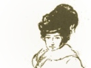

  
[Intangible Textual Heritage](../../../index)  [New
Thought](../../index)  [Shinn](../index)  [Index](index) 
[Previous](sds12)  [Next](sds14) 

------------------------------------------------------------------------

[Buy this Book at
Amazon.com](https://www.amazon.com/exec/obidos/ASIN/0875166105/internetsacredte)

------------------------------------------------------------------------

  
*The Secret Door to Success*, by Florence Scovel Shinn, \[1941\], at
Intangible Textual Heritage

------------------------------------------------------------------------

### RIVERS IN THE DESERT

|                                                                                                                                                                     |
|---------------------------------------------------------------------------------------------------------------------------------------------------------------------|
| "Behold, I will do a new thing: now it shall spring forth; shall ye not know it? I will even make a way in the wilderness, and rivers in the desert."—Isaiah 43:19. |

 

In this 43rd chapter of Isaiah, are many wonderful statements, showing
the irresistible power of Supreme Intelligence, coming to man's rescue
in times of trouble. *No matter how impossible the situation seems,
Infinite Intelligence knows the way out*.

Working with God-Power, man becomes unconditioned and absolute. Let us
get a realization of this hidden power we can call upon at any moment.

Make your contact with Infinite Intelligence, (the God within) and all
appearance of evil evaporates, for it comes from man's "vain
imaginings."

In my question and answer class I would be asked, "How do you make a
conscious contract with this Invincible Power?"

I reply, "By your word." "By your word you are justified."

The Centurion said to Jesus Christ, "Speak the word master and my
servant shall be healed."

"Whosoever calleth on the name of the Lord shall be delivered." Notice
the word, "call:" you are calling on the Lord or Law, when you make an
affirmation of Truth.

As I always say, take a statement which "clicks," that means, gives you
a feeling of security.

People are enslaved by ideas of lack; lack of love, lack of money, lack
of companionship, lack of health, and so on.

They are enslaved by the ideas of interference and incompletion. They
are asleep in the Adamic Dream: Adam (generic man,) ate of "Maya the
tree of illusion" and saw two powers, good and evil.

The Christ mission was to wake people up to the Truth of one Power, God.
"Awake thou that sleepeth."

*If you lack any good thing, you are still asleep to your good*.

How do you awake from the Adamic dream of opposites, after having slept
soundly in the race thought for hundreds of years?

Jesus Christ said, "When two of you agree, it shall be done." It is the
law of agreement.

It is almost impossible to see clearly, your good, for yourself: that is
where the healer, practitioner or friend is necessary.

Many successful men say they have succeeded because their wives believed
in them. -

 I will quote from a current newspaper, giving Walter P. Chrysler's
tribute to his wife: "Nothing," he once said, "has given me more
satisfaction in life, than the way my wife had faith in me from the very
first, through all those years." Chrysler wrote of her, "It seemed to me
I could not make any one understand that I was ambitious except Della. I
could tell her and she would nod. It seems to me I even dared to tell
her that I intended, some day, to be master mechanic." She always backed
his ambitions.

Talk about your affairs as little as possible, and then only to the ones
who will give you encouragement and inspiration. The world is full of
"Wet blankets," people who tell you "it can't be done," that you are
aiming too high..

As people sit in Truth meetings and services, often a word or an idea
will open a way in the wilderness.

Of course the Bible is speaking of states of consciousness. You are in a
wilderness or desert, when you are out of harmony—when you are angry,
resentful, fearful or undecided. Indecision is the cause of much ill
health, being unable "to make up your mind."

One day when I was in a bus, a woman stopped it and asked the conductor
its destination. He told her, but she was undecided. She got half way
on, and then got off, then on again: the conductor turned to her and
said, "Lady make up your mind!"

So it is with so many people: "Ladies make up your minds!"

The intuitive person is never undecided: he is given his leads and
hunches, and goes boldly ahead, knowing he is on the magic path.

In Truth, we always ask for definite leads just what to do; you will
always receive one if you ask for it. Sometimes it comes as intuition,
sometimes from the external.

One of my students, named Ada, was walking down the street, undecided
whether to go to a certain place, or not; she asked for a lead. Two
women were walking in front of her. One turned to the other and said,
"Why don't you go Ada?"—The woman's name just happened to be Ada—my
friend took it as a definite lead, and went on to her destination, and
the outcome was very successful.

We really lead magic lives, guided and provided for at every step; *if
we have ears to hear and eyes that see*.

Of course we have left the plane of the intellect and are drawing from
the superconscious, the God within, which says, "This is the way, walk
ye in it."

Whatever you should know, will be revealed to you. Whatever you lack,
will be provided! "Thus saith the Lord which maketh a way in the sea and
a path in the mighty waters."

"Remember ye not the former things, neither consider the things of old."

People who live in the past have severed their contact with the
wonderful now. God knows only the now; now is the appointed time, today
is the day.

Many people lead lives of limitation, hoarding and saving, afraid to use
what they have; which brings more lack and more limitation.

I give the example of a woman who lived in a small country town: she
could scarcely see to get about, and had very little money. A kind
friend took her to an oculist, and presented her with glasses, which
enabled her to see perfectly. Sometime later she met her on the street
without the glasses. She exclaimed, "Where are your glasses?"

The woman replied, "Well, you don't expect me to hack ’em out by using
them every day, do you? I only wear them on Sundays."

*You must live in the now and be wide awake to your opportunities*.

"Behold, I will do a new thing: now it shall spring forth; shall ye not
know it? I will even make a way in the wilderness, and rivers in the
desert."

This message is meant for the individual: think of your problem and know
that Infinite Intelligence knows the way of fulfillment. I say the
*way*, for before you called you were answered. *The supply always
precedes the demand*.

*God is the Giver and the Gift and now creates His own amazing
channels*.

When you have asked for the Divine Plan of your life to manifest, you
are protected from getting the things that are not in the Divine Plan.

You may think that all your happiness depends upon obtaining one
particular thing in life; later on, you praise the Lord that you didn't
get it.

Sometimes you are tempted to follow the reasoning mind, and argue with
your intuitive leads, suddenly the Hand of Destiny pushes you into your
right place; under grace, you find yourself back on the magic path
again.

You are now wide awake to your good—you have the ears that hear (your
intuitive leads,) and the eyes which see the open road of fulfillment.

 

*The genius within me is released. I now fulfill my destiny*.

------------------------------------------------------------------------

[Next: The Inner Meaning of Snow White and the Seven Dwarfs](sds14)
