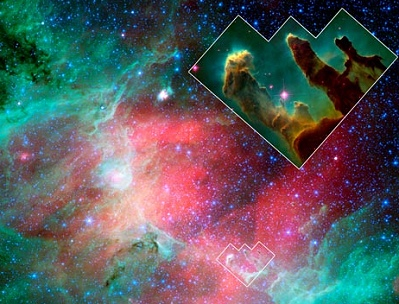

  
[Intangible Textual Heritage](../../index)  [New Thought](../index) 

------------------------------------------------------------------------

[Buy this Book at
Amazon.com](https://www.amazon.com/exec/obidos/ASIN/B00086EZJI/internetsacredte)

------------------------------------------------------------------------

<table width="75%">
<colgroup>
<col style="width: 50%" />
<col style="width: 50%" />
</colgroup>
<tbody>
<tr class="odd">
<td width="50%" data-valign="TOP"></td>
<td width="50%" data-valign="CENTER"><h1 id="the-secret-of-the-universe" data-align="CENTER">The Secret of the Universe</h1>
<h2 id="by-nathan-r.-wood" data-align="CENTER">by Nathan R. Wood</h2>
<h4 id="section" data-align="CENTER">[1932]</h4></td>
</tr>
</tbody>
</table>

------------------------------------------------------------------------

[Contents](#contents)    [Start Reading](sotu00)    [Page
Index](pageidx)    [Text \[Zipped\]](sotutxt.zip)

------------------------------------------------------------------------

|                                                                                                                           |
|---------------------------------------------------------------------------------------------------------------------------|
|  |

Many New Thought books leave one wanting a bit more. They claim that
there is a deeper secret of life, but refrain from explaining it. Nathan
R. Woods, who apparently wrote this during the 1920s, finally publishing
it in 1932, pulls no punches. He attempts to get to the heart of the
issue by addressing the question: what is The Secret of the Universe?
It's all here, in a couple of hundred pages.

This is where science (justifiably) fears to tread; nothing can be
experimented with in this field of inquiry, so it is powerless.
\[Spoiler Alert\] I quote Mr. Wood: "The Triunity of Father, Son and
Holy Spirit reflected and expressed in the triunities of space, matter,
time and man is the secret of the universe." That's it, that's the
entire secret.

He means the *Christian* Triunity, er, Trinity, by the way,—he downplays
other religions' trinities (p. [89](sotu05.htm#page_89)), and the loss
is his (he could have padded the book to five hundred pages, easily). He
is incorrect when he states that the concept of a Trinity in Hinduism
was introduced by Christianity. As usual, the Hindu trinity is not a
one-to-one match with the Christian. However, the association between
A-U-M, Brahma, Vishnu and Shiva, and all kinds of triple phenomena can
easily be found in the [Upanishads](../../hin/upan/index), which predate
the Christian era by over five centuries. So this idea of an
all-pervading triple principle in the Universe is not exactly new, nor
is it specifically Christian in origin. Mr. Wood is playing a very old
game here, and not something he discovered.

His physics is ill-construed. He pooh-poohs the concept of Time as the
Fourth Dimension (doesn't fit into a trinity). He inserts a page of math
in the middle of the book—surely a book with this title would be chock
full of math,—but it is clear that he doesn't seem to understand basic
Algebra, let alone the essential relationship between space, time and
mass. This book is engagingly written, and had a whole dust-jacket of
testimonials, mostly from clergy. Whether The Secret is in this book, I
will leave to your judgment. —J.B. Hare, June 13,
2008

------------------------------------------------------------------------

 [Title Page](sotu00)  
[Introduction](sotu01)  
[Contents](sotu02)  

### Part I. The Pattern of the Universe

[I. The Outer Universe](sotu03)  
[II. The Inner Universe](sotu04)  
[III. The Demand of the Universe](sotu05)  

### Part II. The Problems of the Universe

[Introduction. The Secret of All Things](sotu06)  
[I. The Secret of the Universe and the Problem of the Unity of All
Things](sotu07)  
[II. The Secret of the Universe, and the Problem of Space and
Matter](sotu08)  
[III. The Secret of the Universe and the Problem of Space, Motion and
Time](sotu09)  
[IV. The Secret of the Universe and the Problem of Relativity](sotu10)  
[V. The Secret of the Universe and the Problem of Being, or
Existence](sotu11)  
[VI. The Secret of the Universe and the Problem of Change and
Progress](sotu12)  
[VII. The Secret of the Universe and the Problem of Ethics, or the
Good](sotu13)  
[VIII. The Secret of the Universe and the Problem of Reality, or the
True](sotu14)  
[IX. The Secret of the Universe and the Problem of Aesthetics, or the
Beautiful](sotu15)  
[Conclusion: The Secret of the Universe and the Riddles of the
Universe](sotu16)  
