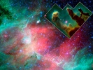

  
[Intangible Textual Heritage](../../index)  [New Thought](../index) 
[Index](index)  [Previous](sotu09)  [Next](sotu11) 

------------------------------------------------------------------------

[Buy this Book at
Amazon.com](https://www.amazon.com/exec/obidos/ASIN/B00086EZJI/internetsacredte)

------------------------------------------------------------------------

  
*The Secret of the Universe*, by Nathan R. Wood, \[1932\], at Intangible
Textual Heritage

------------------------------------------------------------------------

p. 146

### IV. THE SECRET OF THE UNIVERSE AND THE PROBLEM OF RELATIVITY

What is the Fourth Dimension?—Is time the fourth
dimension?—The principle of the "light-year"—The Multiplication Table of
Space, Motion and Time—The formula of the physicist—What you cannot do
with space, motion and time—The Absolute Relationships of Space, Motion
and Time—In how many dimensions do events occur?—The Formula of the True
Relativity.

What is the fourth dimension?

This is not to-day a fantastic question, an idle puzzle. It has never
really been so. An eager and deep-seated instinct has asked the question
and great significances hover around it.

#### *What is the Fourth Dimension?*

What is that fourth dimension, which apparently does not exist, but to
which reason strongly leads? It comes from motion in space, and its
logic is beyond question. We may easily follow the steps of the standard
argument:

The motion of a point generates one dimension, or a line, an unbroken
series of locations or points. That is very clear. A moving point
creates a line.

The second step is equally evident:

The motion of a line or series of points generates a plane, or two
dimensions. We can see this also without difficulty. A line moving
sideways creates a second dimension.

And the third step is equally clear:

The motion of a plane generates a solid, or three dimensions. This also
we easily realize. A plane, of two dimensions, held level, for instance,
and moved up and down, creates a third dimension.

p. 147

But now we come to ground without a chart. What does the motion of a
solid generate? Many say "A fourth dimension." That seems to follow out
the logic of the first three steps.

But no one has ever experienced a fourth dimension.

Does logic truly run away from reality in this matter? It seems to.
Indeed, once started on that way, it seems beyond control. If a fourth
dimension, why not a fifth? What would the motion of a four-dimensional
figure generate, except a fifth dimension? And why not a sixth and
seventh and eighth dimension? Can it be that logic runs out into an
endless chain of such dimensions, further and further from reality? Can
there really be such a divorce of logic from reality, and of logic based
not on uncertain premises, but on the three dimensions of space and of
geometry? How can the threefold reality of geometry so suddenly land us,
at one move, in a world of ever-increasing unrealities?

Yet surely the motion of three dimensions generates something. The
motion, the reality, of one dimension, a line, generates a second
dimension. The motion, the reality, of two dimensions, a plane, makes
three dimensions. What further reality do three dimensions generate?
What is the product of three dimensions? Or if there are other
dimensions also, what is the product of all possible dimensions?

#### *Is Time the Fourth Dimension?*

That fourth property or "fourth dimension," or, if there are more
dimensions, the final property, of space is not time.

Einstein, who roams much in the realm of the fourth dimension, regards
time as the "fourth dimension," because,

p. 148

he says, things happen in three dimensions of space and in one of time.
Indisputably things do happen in time as well as in space. Einstein
believes that this fourth property or "fourth dimension," or time, is
the "continuum," the thing which binds everything, including the
dimensions of space, together. A point in "four dimensions," or a thing
which happens, he rightly calls an "event," because it must be more than
a point, it must be something which happens, in order to have a place in
time. And he is sure that things occur in three dimensions of space and
in one of time. Equally sure are many of his followers. Indeed much of
the fabric of the newest scientific view of the universe, with its
overthrow of classical physics, is built up on the assumption that,
because things happen in three dimensions of space and also in time,
this is a four-dimensional world, with three dimensions of space and one
of time. And many announcements in astronomy and physics, scientific in
their working out and terminology, are in reality based upon the purely
speculative foundation of the theory of "Space-time," and are of no more
certain validity than their basic speculation.

And now it is announced that the entire physical universe becomes one
single reality,—namely, space,—and that space has swallowed up time, by
making time its fourth dimension.

And finally, on the other hand, a new geometry, to embrace all the facts
of the physical universe, is projected, with time as a dimension of
space set forth as the basis of the new system.

But is time the fourth dimension of space? All of these things depend
upon that assumption. Do the evidences which are brought to demonstrate
that time is

p. 149

the fourth dimension of space stand up against the strong wind of common
sense or of reason? That is what we have a right to consider for
ourselves.

#### *Do Light-Years Make Time the Fourth Dimension?*

In order to prove that time is the fourth dimension it is very much the
thing to-day to point out that when one would measure vast distances in
the universe one must go beyond the old space methods and use time units
as well as space units of measurement. When we have a vast astronomical
distance to be expressed, we call in the aid of time. We say that such a
star is a million "light-years" away. We mean by a light-year the
distance which light, at the rate of approximately 186,000 miles a
second, goes in one year. Does not this prove that time is fundamental
in great basic measurements? Does it not mean that time is an essential
element of space? Does it not show that time is a "fourth dimension" of
space?

At the cost of disagreeing with what many minds regard as an axiom
to-day, one can only say, if one is doubtful, "It does not seem to me to
prove what you I say that it proves." Far the fact is that the now
common light-year measure of distance does not arise from the nature of
distance or of space. *It arises entirely from the limitations of our
minds*. Because we cannot grasp more than a certain number of smaller
units of distance, we combine them into larger units for our mental
convenience. It is exactly as when, to avoid \`too great a number of
inches, we say feet, instead of inches, or when, to avoid too great a
number of feet, we say miles instead of feet. In time-measurements,
also, when seconds grow too many, we say minutes, and

p. 150

when minutes become too many, we say hours, and when hours multiply too
largely, we say weeks, and when weeks add themselves into a great total,
we say years. We manufacture larger units to bring the total number
better within the grasp of our minds. We manufacture light-years simply
as a larger unit of measurement. If the use of time in measuring
distance lay in the real nature of measurement of space, we should have
to use time in all measurements of space. We should have to use it as a
factor in measuring short distances. But we do not use it so at all. We
do not use time as a factor in measuring feet or metres, or in measuring
miles on the earth. The only people who use it so are those whose mental
ability is so low that they cannot compute space distances at all, and
who say, "It is so many days' journey," or "so many hours' journey," or
"it is as far as a horse would travel between sunrise and sunset," or
"as far as a man could walk, carrying a sheep, between moon and moon."
Such things, day's journeys of a horse, or month's journeys of a man, or
year's journeys of a light-ray, do not mean that time is a dimension of
space. They signify simply a greater or less degree of mental inability
to grasp large numbers of units of distance. Equally well the savage
meets the difficulty by saying, "It is ten times as far as from the
mountain range to the distant river," or the scientist by saying, "It is
a million times as far as the distance from the earth to the sun," or
the mathematician by saying, "It is a trillion miles carried to the 10th
power." It is all a matter of constructing larger units of measurement,
so as to bring down the total number of units to the

p. 151

range of our comprehension. It does not at all show that time is a
dimension of space.

#### *The Multiplication Table of Space, Motion and Time*

But the sensible way to settle the question is not by arguing against a
mistaken association of time with space. It is by working out and
presenting the actual relations. It is useless to argue that time and
space are not related. They are related. They are commensurate. They are
indeed so commensurate that we can describe one in terms of the other.
The trouble is not that this is true. The facts should never give us
trouble. The trouble is that it is only a part of the truth. It is only
what the triunity of space, motion and time shows of all three of those
elements. *They are all three commensurate. And it is only through its
part in that triunity, and by its connection with space through motion,
that time is commensurate with space*. It is only through motion that we
can measure space and time in connection with each other.

We can measure space by motion and express the result in terms of time.

100 miles covered by a motion of 25 miles an hour, and divided by 25 to
get the number of hours, results in an elapsed time of 4 hours. 100 ÷ 25
= 4. Hence the basic rule:

1\. *Space measured or divided by motion gives time*.

The distance, divided by the rate of motion at which you travel, will
tell you how long, or how much time, it will take you.

This is the basic rule. Space can be measured by motion in terms of time
because motion touches both

p. 152

space and time and is expressed in terms of both. There is no direct
relation between space and time. 100 miles and 4 hours have no
connection unless there is motion *which covers those miles in those
hours* and links the two together. The time is related to the space
through the motion.

Now this is because motion must always touch both space and time, and be
commensurate with both, and with both at once. Motion can be expressed
only by both space and time at once. Space can be reckoned by
itself,—*e. g.*, "100 miles." Time can be reckoned by itself—*e. g.*, "4
hours." But motion can be reckoned only by space and time, and only by
both at once. "A rate of motion of 25 miles" means nothing. "A rate of
motion of one hour" means nothing. But "a rate of motion of 25 miles an
hour," both space and time at once, is well defined.

And this is the triune relationship which we have already seen,—that
motion comes out of space and passes into time and so links space and
time together. It is the principle of the space-motion-time universe.
The creative power, whose omnipresent outspreading into dimensions is
space, emerges into energy and motion, and motion issues in
successiveness or time.

Time then is related to space through motion, and only through motion,
and only in the triune relation of space-motion-time.

 

We can also use time by motion, with space as its result. Using a time
of 4 hours, a motion of 25 miles an hour will cover 100 miles. 4 × 25 =
100. That is, for the second rule:

p. 153

2\. *Time multiplied by motion gives space*.

The time elapsed, multiplied by the rate of motion, will give you the
distance you travelled.

This is manifestly the reverse of the first rule. Because space divided
by motion gives time, time multiplied by motion gives space again. *The
quotient multiplied by the divisor gives the original number again*.
That is what it means. The time multiplied by the motion does not
actually produce space. Both motion and time presuppose space. It is
simply an arithmetical transaction in which we multiply the quotient by
the divisor to get the original dividend, the 4 by the 25 to get the 100
out of which they both came. And the connection of the time with the
space, whether we are dividing the space or multiplying the time, is
always through the motion. There is no connection between 100 miles and
4 hours, unless motion comes and spans the 100 miles in the 4 hours, and
so binds the two together, or in turn multiplies the time to give the
original space again. It is the triune formula.

 

A third relation also issues from the first. Since "space divided by
motion gives time," therefore:

3\. *Space divided by time gives motion*.

The distance, divided by the time it took you to cover it, gives you
your rate of motion.

A space of 100 miles covered in 4 hours, and divided by the 4 to get the
miles for one hour, shows a motion of 25 miles an hour. 100 ÷ 4 = 25.

This does not mean that time measures and divides space as motion does.
We cannot measure space by time. We cannot cover 100 miles by 4 hours.
They

p. 154

are not commensurate, that is, they are not commensurate unless motion
comes between, and connects them. But "100 miles covered in 4 hours"
means "100 miles covered by motion in 4 hours." It was the motion which
measured and divided the space and gave the time.

"The space divided by the time gives the motion" simply sets forth then
the converse of the basic fact that "the space divided by the motion
gives the time." For you can always divide the original number by the
quotient to get the divisor. As 100 ÷ 25 = 4, so 100 ÷ 4 = 25. It is an
arithmetical transaction. And it expresses again the basic fact that
"space measured or divided by motion gives time,"—the triune principle
of the space-motion-time universe.

 [\*](#fn_3) (The physicist uses the constant
formula in his work: v = d/t,—"the velocity = the distance ÷ the time."
Or, which means the same thing, "the rate of motion = the space ÷ the
time." Or we can put the equation in the other order: d/t = v, "the
space ÷ the time = the rate of motion."

We see now, in the light of the universal triunity, and of the triune
relations of space, motion and time, the great reason which underlies
this working formula of d/t = v, or the space / the time = the rate of
motion. It is not

p. 155

because the time measures and divides the space. We cannot measure or
divide space by time. Space and time are not in themselves commensurate.
100 miles has nothing to do with 4 hours, for instance,—*unless motion
covers that 100 miles in that 4 hours, and links the two together*. Then
"100 miles ÷ a motion of 25 miles an hour gives a time of 4 hours." "The
space ÷ the rate of motion = the time." Or, in terms of the physicist's
equation, d/v = t, or t = d/v. That is the basic relationship,—"space ÷
motion gives time,"—without which there are no relationships between
space, motion and time. But because d ÷ v = t, or d/v = t, you can, if
you have the distance and the time, and want to find the velocity,
divide the dividend by the quotient, divide the d by the t, to get the
divisor or velocity, v. Then at once you have as a working rule, based
on our triune law that space / motion = time, or  d/v = t, the reverse
rule, dividend/quotient = divisor, or space /time = motion, or the
useful tool of the physicist, that d/t = v. The triune law of all
things, and of space, motion and time, gives the reason. d/t= v simply
because d/v= t;—the distance divided by the time equals the speed,
because the distance divided by the speed equals the time.

p. 156

\[paragraph continues\] You can always
divide the distance by the time and get the velocity,—even though
distance and time are not in themselves commensurate, because "the
distance or space covered and divided by the velocity or rate of motion
gives the time.")

 

And a fourth rule follows as a consequence of the basic rule. Since
"space measured or divided by motion gives time," then you can reverse
the process, and find that:

4\. *"Motion multiplied by time gives space."*

The rate of motion, multiplied by the time elapsed, gives you the
distance.

A motion of 25 miles an hour, for a time of 4 hours, covers a space of 4
times 25 miles, or 100 miles. The motion multiplied by the time gives
the space. 25 × 4 = 100.

This obviously does not mean that the 100 mile space exists as the
product of the 25 mile motion and the 4 hour time. What it means is that
you can multiply the divisor by the quotient and get the original number
or dividend. Since the space divided by the motion gives the time, then
the motion multiplied by the time will give the space again. It is a
matter of arithmetic. It comes from the basic fact that the space
divided by the rate of motion gave the time. It expresses and shows in
reverse the triune formula of space-motion-time.

 

These four rules all express the same relationships,—that space is
always the source in this triunity,—motion is always next,—motion alone
is directly commensurate with space and can measure space,—time always

p. 157

results when motion measures space,—motion can be measured only in terms
of both time and space, which it links together, they are all three then
commensurate with each other in this triunity of the three,—but time is
commensurate with space and can be related to space only as a part of
that triunity, as it is linked with space through motion, or comes from
space through motion.

 

\[There are no other such relations between the three. For other
operations are not possible. The following paragraphs seem meaningless
because to a certain extent they are meaningless. But their
impossibility is instructive. Yet you may skip these "cannots" if you
will.

*You cannot divide motion by time*.

"A rate of twenty-five miles an hour divided by four, the number of
hours passed," means nothing, and gets no results.

*You cannot divide motion by space*.

"A rate of 25 miles an hour divided by 100, the number of miles
traversed," means nothing at all. If you say "25 ÷ 100 = ¼ miles," it
means simply that 1/100 of 25 miles an hour is ¼ mile an hour. But it
has no significance in the relations of space, motion and time, any more
than the similar facts that 1/200 of 25 miles an hour = ⅛ mile an hour,
or that 1/50 of 25 miles an hour = ½ mile an hour. It has nothing to do
with one hundred as the number of miles.

*And you cannot divide time by space*.

"Four hours divided by 100, a certain number of miles," means nothing.
You can, it is true, divide the four hours by 100, and get 1/25 of an
hour, the time required to go one mile. But it means simply that we

p. 158

have reduced the dividend, 100 miles, in "100 ÷ 25=4," to one mile by
dividing by 100, and so as a matter of arithmetic we must divide the
quotient, four hours, by 100 also, and we get 1/25 of an hour. We could
equally well divide the 100 by fifty and get two miles, and the four
hours by fifty and get 2/25 of an hour. We simply reduce both dividend
and quotient by the same ratio, and we chose to divide the 100 miles by
100 in order to reduce the distance to one mile. In reducing the
dividend and the quotient by the same ratio we have but stated anew, on
a scale 1/100 as large, the formula that "the distance or space ÷ the
rate of motion gives the time."

*And you cannot divide time by motion*.

"Four hours divided by a rate of motion of twenty-five miles an hour"
means nothing and accomplishes nothing. You can only multiply the time
by the rate of motion, the quotient by the divisor, and get the dividend
or distance.

*And you cannot multiply space by motion*.

"One hundred miles multiplied by a rate of twenty-five miles an hour,"
would be 2,500 miles, which is arithmetically correct, but an absurdity.
You can only divide the one hundred by the twenty-five, and get four,
the number of hours elapsed. You can only divide the space by the rate
of motion and get the time.

*Neither of course can you multiply motion by space*.

"Twenty-five miles an hour multiplied by one hundred, the total number
of miles traversed," would again be 2,500, this time "2,500 miles an
hour," which is again absurd and meaningless.

*Neither can you multiply space by time*.

p. 159

"One hundred miles multiplied by four, a certain numbers of hours,"
means nothing. You can only *divide* the one hundred miles by four, the
number of hours passed in motion, and get the twenty-five miles an hour,
the rate of motion.

*Neither of course can you multiply time by space*.

"Four hours multiplied by one hundred, a certain number of miles," means
nothing. There is no connection, no relevancy, between the hours and the
miles. It is only *when the four hours are the time resulting as a
certain motion covers the space of one hundred miles* that you can
relate the four hours and the one hundred miles to each other. They are
related to each other solely through the motion. And then you can only
*divide* the space by the time, the one hundred by the four, and get
twenty-five, the miles per hour, because the space was the dividend and
the time was the quotient in "the space ÷ the rate of motion = the
time."\]

 

These include all the possible or impossible combinations of the
three,—space, motion and time. Even the impossibilities emphasize the
relationship which the four possible combinations so clearly express.
This relationship is so self-evident as to be axiomatic:

#### *The Axioms of Space, Motion and Time*

1\. Space can be measured or divided by rate of motion, with time as the
result. This is the basic relation: *"Space measured or divided by
motion gives time."*

2\. Space therefore, the dividend, can as a matter of arithmetic be
divided by time, the quotient,

p. 160

with the rate of motion, the original divisor, as the result.

3\. The rate of motion and the time can be multiplied, either one by the
other, the divisor multiplied by the quotient, or the quotient
multiplied by the divisor, the rate of motion multiplied by the time, or
the time multiplied by the rate of motion, with the dividend, the
distance or space traversed by that motion in that time, discovered
again by the multiplication.

4\. Space is the source. It is space which is traversed and measured or
divided up by the rate of motion, with time as the result.

5\. Motion links space and time together; it emerges from space and
issues in time; and it can be measured and expressed only in terms of
both space and time.

6\. Time is commensurate with space to this extent, and only to this
extent, that since time is the product when motion emerges and traverses
space, time is commensurate with space through motion.

 

Two facts stand clear in these relationships:

First, that all these relationships express the absolute formula of
triunity, namely, that space is the basis, motion traverses the space,
and time is the result.

Second, that time is related to space only through motion, and is not
the "fourth dimension" of space. It is, rather, the third factor in the
triunity of space, motion and time.

p. 161

#### *Light-Years Agree with This*

Light-year measurement is in entire harmony with these axioms. The
astronomer knows a certain vast distance. It is a distance so vast that
the figures benumb the mind, and convey no real impression. He wants to
express the distance vividly. He says "We will measure it by motion. A
certain motion, the speed of light, moving at a rate of 186,000 miles a
second, spends so many years, so many light-years, or years of that
motion of light, in covering that space." It is that *space* measured or
divided by that rate of *motion* of light, with years, or time, as a
result. It is the triune formula, *"Space measured or divided by motion
gives time."*

Or let us put it not from the astronomers' point of view but from the
hearers' or readers' point of view. Here, then, is a vast distance. We
do not know that distance, as the astronomer does. But we do know the
speed of light. And we do know how long a year is. And so the astronomer
tells us that the speed of light, multiplied by a certain number of
years during which that light moves, gives the total distance over which
that light has moved. It is the rate of motion which traversed the
distance, multiplied by the time elapsed, to give the distance,—the
motion multiplied by the time to give the space. *It is the triune
formula,—"The motion multiplied by the time, the divisor multiplied by
the quotient, gives the original space."*

It reveals time yet again, very strikingly, not as a "fourth dimension"
of space, bound in direct union with space, but rather as having its
sole connection

p. 162

with space through motion, whether it is "space divided by motion gives
time" or "the motion multiplied by the time gives the original space;"
and as having its only connection with space in the fact that time is
the third factor in the vast triunity of space, motion and time.

#### *In How Many Dimensions Do Events Occur?*

The theory of relativity has this value, besides others, that it clearly
recognizes the great fact of Motion as the essence of all physical
things. It realizes that things "happen" rather than merely "exist," and
are "events" instead of inert and static things, because they are
actions, motions, conjunctions of forces, collisions or propulsions of
electrons, with their incredible motion. And of course where motion so
exists time enters as an element. For time in the physical world is the
successiveness of motion in space.

But it is not correct to say that things occur in three dimensions of
space and in one of time, and so to make time a fourth dimension or
property of space, even though this is almost an axiom of much
present-day thought. It is an evanescent point of view.

For, as a matter of fact, events do not so occur.

*They occur in three dimensions of space and in three dimensions of
time*.

Every event is in future, present and past.

It occurs in present time.

Before its occurrence in present time it is in future time.

After its [occurrence](errata.htm#1) in present time it is in past time.
It cannot be in time without being in all these three elements of time.

p. 163

As for those important events which we call thoughts, many of those,
which have nothing to do with the outer world, but which are always
consecutive, *occur in no dimensions of space and in three dimensions of
time*.

But of things in the physical world, all of which, being motion, do
"happen" or "occur," all of them occur in three dimensions of space and
in three of time. Time is not the fourth dimension of space. Time in the
physical world is, as we have seen, self-evidently the outcome of the
relation of space to motion. It is the successiveness of motion in
space. It is the third element in that universal triunity of space,
matter and time. But it is not a fourth property added to the triunity
of space. It is the third property in the greater triunity of space,
matter and time. And it is itself a triunity, of future, present and
past. For the True Relativity is not a vast and shifting irregularity, a
systematized uncertainty. The True Relativity is a vast, invariable,
regulated, infinite interplay and triunity of Space, Motion and Time. It
is a Triuniverse in the reflection and image of a Triune Creator and
Ground of the universe.

------------------------------------------------------------------------

### Footnotes

[154:\*](sotu10.htm#fr_3) The general reader may
omit the reading of this parenthesis, if he so prefers.

------------------------------------------------------------------------

[Next: V. The Secret of the Universe and the Problem of Being, or
Existence](sotu11)
