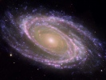

  
[Intangible Textual Heritage](../../index)  [New Thought](../index) 
[Index](index)  [Next](ssug01) 

------------------------------------------------------------------------

  
*Self-Suggestion and the New Huna Theory of Mesmerism and Hypnosis*, by
Max Freedom Long, \[1958\], at Intangible Textual Heritage

------------------------------------------------------------------------

# SELF-SUGGESTION

##### AND THE NEW HUNA THEORY OF MESMERISM AND HYPNOSIS

###### BY

## MAX FREEDOM LONG

##### AUTHOR OF

###### *The Secret Science Behind Miracles The Secret Science At Work Growing Into Light*

#### Published by

#### HUNA RESEARCH PUBLICATIONS

#### Vista, Calif.

#### \[1956\]

Scanned, proofed and formatted at Intangible Textual Heritage, July
2009, by John Bruno Hare. This text is in the public domain in the US
because its copyright was not renewed in a timely fashion.

------------------------------------------------------------------------

[Next: Introduction](ssug01)
