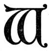

  
[Intangible Textual Heritage](../../index)  [New Thought](../index) 
[Index](index)  [Previous](tsoa02)  [Next](tsoa04) 

------------------------------------------------------------------------

[Buy this Book at
Amazon.com](https://www.amazon.com/exec/obidos/ASIN/1604590467/internetsacredte)

------------------------------------------------------------------------

[Buy this Book on
Kindle](https://www.amazon.com/exec/obidos/ASIN/B0025VL4BQ/internetsacredte)

------------------------------------------------------------------------

  
*The Secret of the Ages*, by Robert Collier, \[1926\], at Intangible
Textual Heritage

------------------------------------------------------------------------

p. 13

### I

### The World's Greatest Discovery

"You can do as much as you think you can,  
   But you'll never accomplish more;  
 If you're afraid of yourself, young man,  
   There's little for you in store.  
 For failure comes from the inside first,  
   It's there if we only knew it,  
 And you can win, though you face the worst,  
   If you feel that you're going to do it."  
                      —EDGAR A. GUEST. [\*](#fn_0)

|                    |
|--------------------|
|  |

What, in your opinion, is the most
significant discovery of this modern age?

The finding of Dinosaur eggs on the plains of Mongolia, laid—so
scientists assert—some 10,000,000 years ago?

The unearthing of the Tomb of Tut-ankh-Amen, with its matchless
specimens of a bygone civilization?

p. 14

The radio-active time clock by which Professor Lane of Tufts College
estimates the age of the earth at 1,250,000,000 years?

Wireless? The Aeroplane? Man-made thunderbolts?

No—not any of these. The really significant thing about them is that
from all this vast research, from the study of all these bygone ages,
men are for the first time beginning to get an understanding of that
"Life Principle" which—somehow, some way—was brought to this earth
thousands or millions of years ago. They are beginning to get an inkling
of the infinite power it puts in their hands—to glimpse the untold
possibilities it opens up.

This is the greatest discovery of modern times—that every man can call
upon this "Life Principle" at will, that it is as

p. 15

much the servant of his mind as was ever Aladdin's fabled
"Genie-of-the-lamp" of old; that he has but to understand it and work in
harmony with it to get from it anything he may need—health or happiness,
riches or success.

To realize the truth of this, you have but to go back for a moment to
the beginning of things.

*In the Beginning*—

It matters not whether you believe that mankind dates back to the
primitive Ape-man of 500,000 years ago, or sprang full-grown from the
mind of the Creator. In either event, there had to be a First Cause—a
Creator. Some Power had to bring to this earth the first germ of Life,
and the creation is no less wonderful if it started with the lowliest
form of plant life and worked up through countless

p. 16

ages into the highest product of today's civilization, than if the whole
were created in six days.

In the beginning, this earth was just a fire mist—six thousand or a
billion years ago—what does it matter which?

The one thing that does matter is that some time, some way, there came
to this planet the germ of Life—the Life Principle which animates all
Nature—plant, animal, man. If we accept the scientists’ version of it,
the first form in which Life appeared upon earth was the humble Algæ—a
jelly-like mass which floated upon the waters. This, according to the
scientists, was the beginning, the dawn of life upon the earth.

Next came the first bit of animal life–the lowly Amoeba, a sort of jelly
fish, consisting of a single cell, without vertebræ, and with very
little else to distinguish

p. 17

it from the water round about. But it had *life*—the first bit of animal
life—and from that life, according to the scientists, we can trace
everything we have and are today.

All the millions of forms and shapes and varieties of plants and animals
that have since appeared are but different manifestations of
*life*—formed to meet differing conditions. For millions of years this
"Life Germ" was threatened by every kind of danger—from floods, from
earthquakes, from droughts, from desert heat, from glacial cold, from
volcanic eruptions—but to it each new danger was merely an incentive to
finding a new resource, to putting forth Life in some new shape.

To meet one set of needs, it formed the Dinosaur—to meet another, the
Butterfly. Long before it worked up to man,

p. 18

we see its unlimited resourcefulness shown in a thousand ways. To escape
danger in the water, it sought land. Pursued on land, it took to the
air. To breathe in the sea, it developed gills. Stranded on land, it
perfected lungs. To meet one kind of danger it grew a shell. For
another, a sting. To protect itself from glacial cold, it grew fur. In
temperate climes, hair. Subject to alternate heat and cold, it produced
feathers. But ever, from the beginning, it showed its power to meet
every changing condition, to answer every creature need.

Had it been possible to kill this "Life Idea," it would have perished
ages ago, when fire and flood, drought and famine followed each other in
quick succession. But obstacles, misfortunes, cataclysms, were to it
merely new opportunities to assert its power. In fact, it required
obstacles

p. 19

to awaken it, to show its energy and resource.

The great reptiles, the monster beasts of antiquity, passed on. But the
"Life Principle" stayed, changing as each age changed, always
developing, always improving.

Whatever Power it was that brought this "Life Idea" to the earth, it
came endowed with unlimited resource, unlimited energy, unlimited LIFE!
No other force can defeat it. No obstacle can hold it back. All through
the history of life and mankind you can see its directing
intelligence—call it Nature, call it Providence, call it what you
will—rising to meet every need of life.

*The Purpose of Existence*

No one can follow it down through the ages without realizing that the
whole

p. 20

purpose of existence is GROWTH. Life is dynamic—not static. It is ever
moving forward—not standing still. The one unpardonable sin of nature is
to stand still, to stagnate. The [Giganotosaurus](errata.htm#0), that
was over a hundred feet long and as big as a house; the Tyrannosaurus,
that had the strength of a locomotive and was the last word in
frightfulness; the Pterodactyl or Flying Dragon—all the giant monsters
of Prehistoric Ages—are gone. They ceased to serve a useful purpose.
They did not know how to meet the changing conditions. They stood
still—stagnated—while the life around them passed them by.

Egypt and Persia, Greece and Rome, all the great Empires of antiquity,
perished when they ceased to grow. China built a wall about herself and
stood still for a thousand years. Today she is the

p. 21

football of the Powers. In all Nature, to cease to grow is to perish.

It is for men and women who are not ready to stand still, who refuse to
cease to grow, that this book is written. It will give you a clearer
understanding of your own potentialities, show you how to work with and
take advantage of the infinite energy all about you.

The terror of the man at the crossways, not knowing which road to take,
will be no terror to you. Your future is of your own making. For the
only law of Infinite Energy is the law of supply. The "Life Principle"
is your principle. To survive, to win through, to triumphantly surmount
all obstacles has been its everyday practice since the beginning of
time. It is no less resourceful now than ever it was. You have but to
supply the urge,

p. 22

to work in harmony with it, to get from it anything you may need.

For if this "Life Principle" is so strong in the lowest forms of animal
life that it can develop a shell or a poison to meet a need; if it can
teach the bird to circle and dart, to balance and fly; if it can grow a
new limb on a spider to replace a lost one, how much more can it do for
*you*—a reasoning, rational being, with a mind able to *work with* this
"Life Principle," with an energy and an initiative to urge it on!

The evidence of this is all about you. Take up some violent form of
exercise—rowing, tennis, swimming, riding. In the beginning your muscles
are weak, easily tired. But keep on for a few days. The "Life Principle"
promptly strengthens them, toughens them, to meet their new need. Do
rough manual labor—and

p. 23

what happens? The skin of your hands becomes tender, blisters, hurts.
Keep it up, and does the skin all wear off? On the contrary, the "Life
Principle" provides extra thicknesses, extra
toughness—[calluses](errata.htm#1), we call them—to meet your need.

All through your daily life you will find this "Life Principle" steadily
at work. Embrace it, work with it, take it to yourself, and there is
nothing you cannot do. The mere fact that you have obstacles to overcome
is in your favor, for when there is nothing to be done, when things run
along too smoothly, this "Life Principle" seems to sleep. It is when you
need it, when you call upon it urgently, that it is most on the job.

It differs from "Luck" in this, that fortune is a fickle jade who smiles
most often on those who need her least. Stake

p. 24

your last penny on the turn of a card—have nothing between you and ruin
but the spin of a wheel or the speed of a horse—and it's a thousand to
one "Luck" will desert you! But it is just the opposite with the "Life
Principle." As long as things run smoothly, as long as life flows along
like a song, this "Life Principle" seems to slumber, secure in the
knowledge that your affairs can take care of themselves.

But let things start going wrong, let ruin and disgrace stare you in the
face—*then* is the time this "Life Principle" will assert itself if you
but give it a chance.

*The "Open, Sesame!" of Life*

There is a Napoleonic feeling of power *that insures success* in the
knowledge that this invincible "Life Principle" is behind your every
act. Knowing that you have

p. 25

working with you a force which never yet has failed in anything it has
undertaken, you can go ahead in the confident knowledge that it will not
fail in your case, either. The ingenuity which overcame every obstacle
in making you what you are, is not likely to fall short when you have
immediate need for it. It is the reserve strength of the athlete, the
"second wind" of the runner, the power that, in moments of great stress
or excitement, you unconsciously call upon to do the deeds which you
ever after look upon as superhuman.

But they are in no wise superhuman. They are merely beyond the capacity
of your conscious self. Ally your conscious self with that sleeping
giant within you, rouse him daily to the task, and those "superhuman"
deeds will become your ordinary, everyday accomplishments.

p. 26

W. L. Cain, of Oakland, Oregon, writes: "I know that there is such a
power, for I once saw two boys, 16 and 18 years of age, lift a great log
off their brother, who had been caught under it. The next day, the same
two boys, with another man and myself, tried to lift the end of the log,
but could not even budge it."

How was it that the two boys could do at need what the four were unable
to do later on, when the need had passed? Because they never stopped to
question whether or not it *could* be done. They saw only the urgent
need. They concentrated all their thought, all their energy on that one
thing—never doubting, never fearing—and the Genie which is in all of us
waiting only for such a call, answered their summons and gave them the
strength—not of two men, but of ten!

p. 27

It matters not whether you are Banker or Lawyer, Business Man or Clerk.
Whether you are the custodian of millions, or have to struggle for your
daily bread. This "Life Principle" makes no distinction between rich and
poor, high and low. The greater your need, the more readily will it
respond to your call. Wherever there is an unusual task, wherever there
is poverty or hardship or sickness or despair, *there* is this Servant
of your Mind, ready and willing to help, asking only that you call upon
him.

And not only is it ready and willing, but it is always ABLE to help. Its
ingenuity and resource are without limit. It is Mind. It is Thought. It
is the Telepathy that carries messages without the spoken or written
word. It is the Sixth Sense that warns you of unseen dangers. No matter
how stupendous and

p. 28

complicated, nor how simple your problem may be—the solution of it is
somewhere in Mind, in Thought. And since the solution does exist, this
Mental Giant can find it for you. It can KNOW, and it can DO, every
right thing. Whatever it is necessary for you to know, whatever it is
necessary for you to do, you can know and you can do if you will but
seek the help of this Genie-of-your-Mind and work with it in the right
way.

------------------------------------------------------------------------

### Footnotes

[13:\*](tsoa03.htm#fr_0) From "A Heap o’ Livin’."
The Reilly & Lee Co.

------------------------------------------------------------------------

[Next: II. The Genie-of-Your-Mind](tsoa04)
