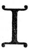

  
[Intangible Textual Heritage](../../index)  [New Thought](../index) 
[Index](index)  [Previous](tsoa18)  [Next](tsoa20) 

------------------------------------------------------------------------

[Buy this Book at
Amazon.com](https://www.amazon.com/exec/obidos/ASIN/1604590467/internetsacredte)

------------------------------------------------------------------------

[Buy this Book on
Kindle](https://www.amazon.com/exec/obidos/ASIN/B0025VL4BQ/internetsacredte)

------------------------------------------------------------------------

  
*The Secret of the Ages*, by Robert Collier, \[1926\], at Intangible
Textual Heritage

------------------------------------------------------------------------

p. 286 p. 287

### X

### “This Freedom”

"Ye shall know the truth  
 And the Truth shall make you free."

|                    |
|--------------------|
|  |

I have heard that quotation ever since I
was a little child. Most of us have. But to me it was never anything
much but a quotation—until a few years ago. It is only in the past
several years that I have begun to get an inkling of the real meaning of
it—an understanding of the comfort back of it. Perhaps to you, too, it
has been no more than a sonorous phrase. If so, you will be interested
in what I have since gotten from it.

To begin with, what is the "truth"

p. 288

that is so often referred to in all our religious teaching? The truth
about what? And what is it going to free us from?

The truth as I see it now is the underlying reality in everything we
meet in life. There is, for instance, one right way to solve any given
problem in mathematics. That one right way is the truth as far as that
problem is concerned. To know it is to free yourself from all doubt and
vain imagining and error. It is to free yourself from any trouble that
might arise through solving the problem incorrectly.

In the same way, there is but one BEST way of solving every situation
that confronts you. That BEST way is the truth. To know it is to make
you free from all worry or trouble in connection with that situation.
For if it is

p. 289

met in the RIGHT way, only good can come of it.

Then there is your body. There is only one RIGHT idea of every organism
in your body. One CORRECT method of functioning for each of them. And
Universal Mind holds that RIGHT idea, that CORRECT method. The
functioning of your body, the rebuilding of each cell and tissue, is the
work of your subconscious mind. If you will constantly hold before it
the thought that its model is perfection, that weakness or sickness or
deformity is merely ABSENCE of perfection—not a reality in itself—in
short, if you will realize the *Truth* concerning your body, your
subconscious mind will speedily make you free and keep you free from
every ill.

It matters not what is troubling you today. If you will KNOW that
whatever

p. 290

it may seem to be is merely the absence of the true idea, if you will
realize that the only thing that counts is the truth that Universal Mind
knows about your body, you can make that truth manifest.

Affirm the good, the true—and the evil will vanish. It is like turning
on the light—the darkness immediately disappears. For there is no actual
substance in darkness—it is merely absence of light. Nor is there any
substance in sickness or evil—it is merely the absence of health or
good.

That is the truth that was the mentality of Jesus—what Paul describes as
"the mind which was also in Christ Jesus."

Jesus declared that "we should know the truth, and the truth would make
us free." That truth was the power which

p. 291

\[paragraph continues\] He exercised. He
had so perfect an understanding of truth that it gave Him absolute
dominion over evil, enabled Him to heal diseases of every nature, even
to raise the dead. The power that He exercised then was not confined to
His time, nor limited to His own immediate followers. "Lo, I am with you
always," He said, "even unto the end of the world." And He is just as
available to us now as He was to His own disciples 1900 years ago.

"I have given you power to tread serpents and scorpions under foot and
to trample on all the power of the enemy; and in no case shall anything
do you harm."

That gift was never meant to be confined to His own disciples or to any
other one group. God has never dealt in special or temporary gifts. He
gives

p. 292

to *all*—to all who will accept—to all who have an understanding heart.

All sickness, all poverty, all sorrow, is the result of the incorrect
use of some gift of God, which in itself is inherently good. It is just
as though we took the numbers that were given us to work out a problem,
and put them in the wrong places. The result would be incorrect,
inharmonious. We would not be ex-pressing the truth. The moment we
rearrange those numbers properly, we get the correct answer—harmony—the
*truth!* There was nothing wrong with the principle of mathematics
before—the fault was all with us, with our incorrect arrangement of the
figures.

What is true of the principle of mathematics is true of every principle.
The principle is changeless, undying. It is only our expression of the
principle

p. 293

that changes as our understanding of it becomes more thorough. Lightning
held only terror for man until he made of electricity his servant. Steam
was only so much waste until man learned to harness it. Fire and water
are the most destructive forces known—until properly used, then they are
man's greatest helpers. There is nothing wrong with any gift of God—once
we find the way to use it. The truth is always there if we can find the
principle behind it. The figures in mathematics are never bad. It is
merely our incorrect arrangement of them.

The great need is an open mind and the desire for understanding. How far
in the science of mathematics would you get if you approached the study
of it with the preconceived notion that two plus two makes five, and
nothing you

p. 294

heard to the contrary was going to change that belief? "Except ye turn,
and become as little children, ye shell not enter into the kingdom of
heaven." You must drop all your preconceived ideas, all your prejudices.
You must never say—"Oh, that sounds like so-and-so. I don't want any of
it." Just remember that any great movement must have at least a grain of
truth back of it, else it could never grow to any size. Seek that grain
of truth. Be open-minded. Keep your eyes and ears open for the truth. If
you can do this, you will find that new wordings, different
interpretations, are but the outer shell. You can still see the Truth
beneath, the Christ that "before Abraham was, I am."

p. 295

*The Only Power*

He who is looking for wisdom, power, or permanent success, will find it
only within. Mind is the only cause. Your body is healthy or sick
according to the images of thought you impress upon your subconscious
mind. Ii you will hold thoughts of health instead of sickness, if you
will banish all thoughts of disease and decay, you can build up a
perfect body. Dr. William S. Patten of New York says, "To know and to
understand the organization of mind and to recognize the action of mind
is the first and the only requisite of a sound body."

For all disease starts in mind. It may be in your own conscious mind,
from reading of an epidemic or from meeting with circumstances which
education has taught you will bring about disease.

p. 296

\[paragraph continues\] It may be
suggested to your subconscious mind, as so frequently happens with young
children, by the fears and worries and thoughts of contagion of those
around you.

But whichever it is, it is FEAR that starts it. You visualize,
consciously or unconsciously, the disease that you fear, and because
that is the image held before your thought, your body proceeds to build
in accordance with that model. You believe that disease is necessary,
that you have got to expect a certain amount of it. You hear of it every
day, and subconsciously at least you are constantly in fear of it. And
through that very fear you create it, when if you would spend that same
amount of time thinking and believing in the necessity of HEALTH, you
would never need to know disease.

p. 297

Disease is not sent by God. It is not a visitation of Providence. If it
were, what would be the use of doctoring it? You couldn't fight against
the power of God!

God never sent us anything but good. He never gave us disease. When we
allow disease to take hold of us, it is because we have lost touch with
God—lost the perfect model of us that He holds in mind. And what we have
got to strive for is to get back the belief in that perfect model—to
forget the diseased image we are holding in our thought.

Remember the story of Alexander and his famous horse, Bucephalus? No one
could ride the horse because it was afraid of its shadow. But Alexander
faced it towards the sun—and rode it without trouble. Face towards the
sun and the

p. 298

shadows will fall behind you, too. Face towards the perfect image of
every organ, and the shadows of disease will never touch you.

There is no germ in a draft capable of giving you a cold. There is no
bacteria in exposure to the weather that can give you a fever or
pneumonia. It is you that gives them to yourself. The draft doesn't
reason this out. Neither does your body. They are both of them merely
phases of matter. They are not intelligent. It is your conscious mind
that has been educated to think that a cold must follow exposure to a
draft. This it is that suggests it to your subconscious mind and brings
the cold into being.

Before you decide again that you have a cold, ask yourself, Who is it
that is taking this cold? It cannot be my nose,

p. 299

for it has no intelligence. It does only what my subconscious mind
directs. And anyway, how could my pose know that a draft of air has been
playing on the back of my neck? If it wasn't my nose that decided it,
what was it? The only thing it can have been is my mind. Well, if mind
can tell me to have a cold, surely it can stop that cold, too. So let's
reverse the process, and instead of holding before the subconscious mind
images of colds and fevers, think only of health and life and strength.
Instead of trying to think back to discover how we "caught" cold, and
thus strengthening the conviction that we have one, let us deny its
existence and so knock the props out from under the creative faculties
that are originating the cold. Let us hold before our subconscious mind
only the perfect idea of nose and head

p. 300

and throat that is in Universal Mind. Let us make it use the Truth for
its pattern, instead of the illusory ideas of conscious mind.

Every form of disease or sickness is solely the result of wrong
thinking. The primary law of being is the law of health and life. When
you recognize this, when you hold before your mind's eye only a perfect
body, perfect organisms functioning perfectly, you will "realize the
truth that makes you free."

Farnsworth in his "Practical Psychology" tells of a physician who has
lived on a very restricted diet for years while at home. But about once
a year he comes to New York for a week. While here, he eats anything and
everything that his fancy dictates, and never suffers the least
inconvenience. As soon as he gets home he has to return to his

p. 301

diet. Unless he sticks to his diet, he expects to be ill—*and he is
ill*. "As a man thinketh, so is he." What one expects to get he is apt
to get, especially where health is concerned. For matter has no
sensation of its own. The conscious mind is what produces pain, is what
feels, acts or impedes action.

Functional disorders are caused by certain suggestions getting into the
subconsciousness and remaining there. They are not due to physical, but
to mental causes—due to wrong thinking. The oasis of all functional
disorders is in the mind, though the manifestation be dyspepsia,
melancholia, palpitation of the heart, or any one of a hundred others.
There is nothing organically wrong with the body. It is your mental
image that is out of adjustment. Change the one and you cure the other.

p. 302

In this day of the gymnasium and the daily dozen, it may sound
impractical to suggest that it is the mind, not the body, which needs
the care. But I am far from being the first to suggest it.

There is a very successful physician in London whose teaching is that
gymnastic exercise does more harm than good. He contends that the only
exercise necessary for the perfect development of the body is yawning
and stretching.

I would go farther than that. I would say that no physical exercise is
*essential* to the perfect development of the body. That since the only
cause is mind, the principal good of exercise is that when we go through
the motions we are impressing upon our subconscious mind the picture of
the perfect figure that we

p. 303

would have. And that mental visualization is what brings the results.

You can get the same results without the physical exercise by
visualizing in your mind's eye the figure of the man you want to be, by
intensely desiring it, by BELIEVING that you have it.

You can win to perfect health by knowing that there is but one right
idea in Universal Mind for every organism in your body—that this right
idea is perfect and undying—that you have only to hold it before you
subconscious mind to see it realized in your body. *This is the truth
that makes you free*.

------------------------------------------------------------------------

[Next: XI. The Law of Attraction](tsoa20)
