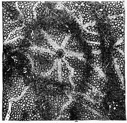

[Intangible Textual Heritage](../../index)  [Oahspe](../index) 
[Index](index)  [Previous](oah384)  [Next](oah386) 

------------------------------------------------------------------------

### Chapter VI

1\. GOD said: I declare in the name of Jehovih, the Whole. Through Him,
and by His hand have I been lifted up. hear me, O mortals! Give ear, O
ye spirits of the dead! The Father hath spoken; Him do I reval; in Him
bestow the tree of light.

 

   
Plate 33.--HYARTI, or NEBULA.

 

2\. I was in darkness, but am now in light. His presence is upon me.
Hearken, then, to my words, and be wise in your lives.

3\. Seek not to disprove Him; seek not to prove that these things can
not be; seek not to deny His person, nor p.
552 His spirit. Of such was my bondage. In bitterness of heart
was I bound in darkness. Those who deny, those who try to disprove Him,
are in darkness.

4\. He is the same to-day and forever. The prophets of old found Him; so
also can ye. But He cometh not to the denier, nor to the disprover.

 

   
Plate 34.--JI'NIQUIN SWAMP, IN ETHEREA.

 

5\. He who will find His Person must look for Him. He who will hear His
Voice must hearken. Then cometh light.

6\. All argument is void. There is more wisdom in the song of a bird
than in the speech of a philosopher. The first speaketh to the Almighty,
proclaiming his glory. The second ploddeth in darkness.

7\. By my hand were the ancient libraries burnt, to draw man away from
darkness.

8\. Kosmon said: What hath great learning found that is valuable?

9\. Shall learning, like riches, be acquired for one's own selfish
gratification?

10\. If a rich man with his horded wealth do little for the resurrection
of man, how much less doth the learned man with a head full of
knowledge? It neither feedeth nor clotheth the sick and distressed, nor
stayeth the debauchery and drunkenness of the great multitude.

11\. How shall we class the man of exact science? Where shall we find
him? How shall we know that he will not be disproved in time to come?

12\. Yesterday it was said, a man can not fast forty days and live;
to-day it is proven possible.

13\. Yesterday it was said, there is attraction of gravitation betwixt
the sun and the earth; to-day it is proven that there is no such thing.
That no man can see without eyes or hear without ears, in su'is
(clairvoyance and clairaudience); to-day hundreds of thousands know it
to be so.

14\. Yesterday it was said, thou shalt eat flesh and oil, because they
supply certain things for the blood, without which man can not live;
to-day it is proven otherwise.

15\. Yesterday the physician said: Take thou this, and it will heal
thee; to-day the same thing is proven to have no virtue.

16\. This only is proven: That man is vain and conceited, desiring to
make others believe he is wise when he is not.

17\. What healed the sick yesterday, will not to-morrow.

18\. Philosophy that was good yesterday, is folly to-day.

19\. Religions that were good for the ancients are worthless to-day.

20\. Crime and pauperism grow up in the heart of them, even worse than
in the regions of the earth where they are not preached.

21\. The physicians have not lessened the amount of sickness on the
earth.

22\. The lawyers have not lessened the rascality of the wicked, or
depleted the number of defrauders.

p. 553

23\. The march of Jehovih and His peoples is onward; it is like a tree
of light, forever growing, but man heedeth not the growth.

24\. Man bindeth his judgment by things that are past; he will not
quicken himself to see and understand the All Light.

------------------------------------------------------------------------

[Next: Chapter VII](oah386)
