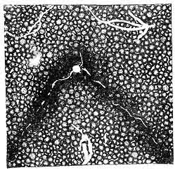

[Intangible Textual Heritage](../../index)  [Oahspe](../index) 
[Index](index)  [Previous](oah385)  [Next](oah387) 

------------------------------------------------------------------------

### Chapter VII

1\. ESFOMA said: I am the signs of the times.

2\. By my face the prophets foretell what is to be.

3\. I am the living mathematics; the unseen progress of things speaking
to the senses of man.

4\. My name is: THE SIGNS OF THE TIMES.

5\. Why have ye, the inhabitants of the earth, and ye angels of the
heavens, not beholden me in my march?

6\. I called out in the days of the pyramids: O ye kings and mighty
ones! Behold the signs of the times!

7\. And ye men of great learning, give ear; a voice speaketh in the
wind!

8\. Behold, Osiris and Isis shall go down. Anubi shall not judge the
people of the Almighty!

9\. I sent a storm into colleges of learning; the wise professors held
up their heads and said:

10\. I doubt the person of Osiris! I doubt Isis! Are they merely a
principle?

11\. The prophets looked here and looked there. They said: Behold the
signs of the times! Let us measure the increase in the growth of
skepticism to these ancient Gods.

12\. They said: Osiris shall go down; and so shall Isis and Anubi, and
Baal, and Ashtaroth, and Thammus.

13\. But kings heard not; they called their councils for stern
legislation.

14\. They saw, but denied my person and the power of my hand.

15\. Man calleth out: Give me a key for prophecy. Show me the way to
find the destiny of Gods and angels and mortals.

16\. Show me the key for the rise and fall of nations and empires.

 

   
Plate 35.--LO'IASK.

The position of the earth that led to the building of the Chinese Wall.
It came to pass in those days, that the spirit of the Father dwelt in
mortals, and they were turned away from the shedding of blood. And when
the earth came into Lo'iask, in etherea, His etherean angels penetrated
the darkness and inspeired the chosen of China to build a wall to
protect themselves from destruction. And a wall was built, the greatest
on the whole earth. Johovih said: Since these, my chosen people, have
achieved the age of peace on earth, let them shut themselves in, away
from the barbarians without, and they shall endure as a secluded people
till the coming of kosmon. And it was so.

 

17\. Then I come forth over all the land. Man beginneth to doubt, then
to disbelieve, and then to deny the popular Gods and Saviors of his
forefathers.

18\. They will not see which way the wind bloweth; with strong arms and
bloody hands they raise up against Jehovih.

19\. Then they go down in destruction; they and their Gods are known no
more.

20\. Jehovih hath said: All things are like a tree; which springeth up
from a p. 554 little seed to become mighty;
which beareth fruit for a season, and then falleth and is turned to
dust.

21\. One by one My Gods, and My false Gods, rise up and are powerful for
a season, and then are swept away in Esfoma's hands.

22\. Behold My thousands of Saviors, which I have sent to raise up the
inhabitants of the earth. Where are they this day?

23\. I give to mortals Gods and Lords and Saviors; according to the time
and place of the earth in My ethereans, so, bestow I them.

24\. But when they have fulfilled their time, lo, I take away their Gods
and Lords and Saviors. Not suddenly, nor without signs of the times of
their going.

------------------------------------------------------------------------

[Next: Chapter VIII](oah387)
