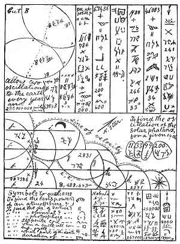

[Intangible Textual Heritage](../../index)  [Oahspe](../index) 
[Index](index)  [Previous](oah392)  [Next](oah394) 

------------------------------------------------------------------------

 

Plate 52.--Zero (line of velocity), with the two arrows, and the
parallel lines crossing, are the signs of the boundary to a vortex. The
oscillations of a planet are shown in the curves. In order to reduce the
Panic signs to English, see Book of Saphah.

------------------------------------------------------------------------

[Next: Plate 53](oah394)
