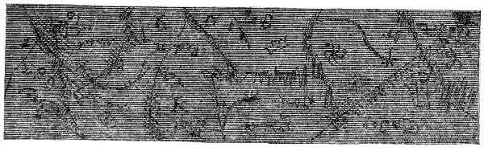
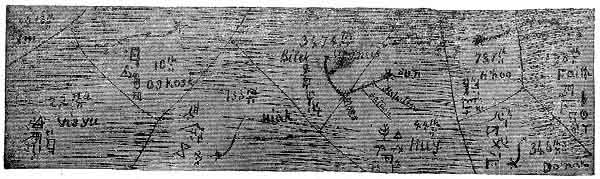

[Intangible Textual Heritage](../../index)  [Oahspe](../index) 
[Index](index)  [Previous](oah396)  [Next](oah398) 

------------------------------------------------------------------------

   
SEVENTH 3,000 YEARS (CUT 7.)  
   
EIGHTH 3,000 YEARS (CUT 8.)

Plate 56.--Travel of the great serpent during the fourth six thousand
years after the creation of man. Showing also the Orian fields in
etherea, with their comparative densities and symbols.

------------------------------------------------------------------------

[Next: Plate 57](oah398)
