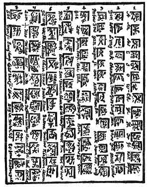

[Intangible Textual Heritage](../../index)  [Oahspe](../index) 
[Index](index)  [Previous](oah418)  [Next](oah420) 

------------------------------------------------------------------------

### Tablet of Kii

(PANIC.)

1\. ALPHABETICAL sounds, Panic and Chine.

2\. Gin, river. Woo, small lake. Long, large lake. Oak, house. Chan,
city. Shan, country. F'da, the earth. Gwo, sun-light. Fung, wind. Dan,
light, human understanding. Git'how, sun. Git, moon. Salock, stars.
Fuche, the firmament.

3\. M'bow, horse. Gow, cow. Gan, man. Du'gan, woman. Ji, boy. Du'ji,
girl. Aden, sky. G'shan, life. Sa, death. Da, ground. Shak, rock. Foam,
wind. Soo, square. Inq or inqu, round.

4\. Gui or gu, street. Loo, road. Him, sweet. Soap, sour. Bai, sick.
Eah, cure. Sam-shot, war. Du'ga, sword. Bek, weapon. Fox-ow, spear. So,
dart, a stone, a sling. Em, to go before.

5\. Hid, interview. Hout, dissatisfied. Work, spinal. Bow'mi, Goddess of
cattle. Son or songa, one who gives alms grudgingly. Shawn or shon, a
stone-cutter. Shaw, a servant. Go'ta, a plowman. Chon'gum, flax. Hark,
dark. Kin, roots, edibles. Hoe or hoa, pressure. M'how, priestess.

6\. Git'oo, light ahead, the way is clear. Wa'sha, darkness ahead, a
melancholia. Seang, a river ford, a passage. Chin, a great ruler. Gone,
pertaining to untruth, romance, fable. Gaup, a hostler, a lover of the
turf; one who lives indecently with beasts. p.
610 Show (o short), decline, falling or fallen. Gwo'oa, to weave,
to make cloth, also cloth, a covering, a poet, one who clothes things.
Min'bon, salutation, a prayer, supplication, especially standing. Kii,
truth, a tribe called Kii, a religious tribe on the continent of Pan. An
abused people are also Kii. Kii, learning, one who tries to understand.
Gwom, sickness, a talisman. Laum, soil, a tiller, harvest, rich.

 

   
Plate 74.--TABLET OF KII.  
\[Begin at 1, and read downward, then at 2, etc.\]

 

7\. Lun, sleep, trance, somnambula, intoxicated. Hoo, a marshal, leader,
organized, system. M'hoa or m'hoo, to shout. Baw, preach, sing. Di'sa,
young and therefore foolish. Wa'shu, a tribe of hunters, serpent
slayers, persons who feed on raw flesh. M'shu, makers of stone weapons,
also stone weapons with handles, axes. Ken'ong or ben'ang, young healer
of the sick, the gift of spirits. Chawnt, to sing a song, a monotonous
sound of not more than three notes, continued from sunrise to sunset
without ceasing. A method of inducing the trance state. C'yu, a lawyer,
an arbiter; one who fills the place of both lawyer and judge (a modern
referee). Hook, to make fast, a bond sworn on the sacred wheel, Eoin.
So'che, epidemic, a scourge, a judgment.

8\. Sai, faithful. Hon'yi, multitude, followers, rabble, fete of
sacrifice. Sung'soup, miscellany, variety, a people who marry with
strangers. Law, the feathered tribe, feathers. Shoe'ji, a gosling or
young aquatic bird, a man who can not go to the hunt or to war without
his mother; a shame-faced people. Shon, sharp, particularly witty, to
cut right and left, evil prophecy. Bog'wi, a circus, an exhibition of
trained animals, civilization, learning. M'wi, a tattling woman. Es,
spirit, the unseen world. Es'fom, the wind that is good. Sa'fom, evil
wind. Gut, a plague, a famine, black-rot, scabs, lepers.

------------------------------------------------------------------------

[Next: Tablet of Emp'agatu](oah420)
