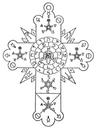

  
[Intangible Textual Heritage](../../../index)  [Thelema](../../index) 
[Frater Achad](../index) 

------------------------------------------------------------------------

<table width="75%">
<colgroup>
<col style="width: 50%" />
<col style="width: 50%" />
</colgroup>
<tbody>
<tr class="odd">
<td width="50%" data-valign="TOP"></td>
<td width="50%" data-valign="CENTER"><h1 id="i.n.r.i." data-align="CENTER">I.N.R.I.</h1>
<h3 id="de-mysteriis-rosæ-rubeæ-et-aureæ-crucis" data-align="CENTER">De Mysteriis Rosæ Rubeæ et Aureæ Crucis</h3>
<h2 id="by-frater-achad-charles-robert-stansfeld-jones" data-align="CENTER">by Frater Achad (Charles Robert Stansfeld Jones)</h2>
<h4 id="not-renewed" data-align="CENTER">[1924, not renewed]</h4></td>
</tr>
</tbody>
</table>

------------------------------------------------------------------------

[Contents](#contents)    [Start Reading](inri00)

------------------------------------------------------------------------

 [Title Page](inri00)  
[I.N.R.I.: De Mysteriis Rosæ Rubeæ et Aureæ Crucis](inri01)  
