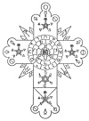

  
[Intangible Textual Heritage](../../../index)  [Thelema](../../index) 
[Frater Achad](../index)  [Index](index)  [Next](inri01) 

------------------------------------------------------------------------

*I.N.R.I: De Mysteriis Rosæ Rubeæ et Aureæ Crucis*, by Frater Achad
(Charles Robert Stansfeld Jones), \[1924\], at Intangible Textual
Heritage

------------------------------------------------------------------------

[  
Click to enlarge](img/rosecrss.jpg)  
The Complete Symbol of the Rose and Cross  

# I.N.R.I.

## DE MYSTERIIS ROSÆ RUBEÆ ET AUREÆ CRUCIS

### BY

# ONE

###### Whose Number is

# 777

Wherein, under the form of an admonition to an Adeptus Minor of the R.
R. et A. C., is disclosed the true Symbolism of the Rosy Cross for the
enlightenment of those who are worthy of the same.

Frater Achad (Charles Robert Stansfeld Jones)

#### Chicago, Ill., Published for the Collegium ad Spiritum Sanctum by the New Æon Publishing Co.

#### \[1924\]

Scanned at Intangible Textual Heritage, March 2007. Proofed and
formatted by John Bruno Hare. This text is in the public domain in the
United States because it was not renewed in a timely fashion at the US
Copyright Office as required by law at the time. These files may be used
for any non-commercial purpose provided this notice of attribution is
retained in all copies.

------------------------------------------------------------------------

[Next: I.N.R.I.: De Mysteriis Rosæ Rubeæ et Aureæ Crucis](inri01)
