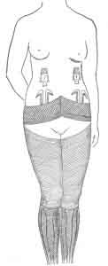
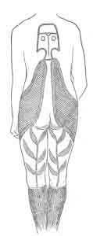

  
[Intangible Textual Heritage](../../index)  [Pacific](../index) 
[Index](index)  [Previous](ei16)  [Next](ei18) 

------------------------------------------------------------------------

  
*Te Pito Te Henua, or Easter Island*, by William J. Thompson, \[1891\],
at Intangible Textual Heritage

------------------------------------------------------------------------

### TATTOOING.

Tattooing is not practiced at the present time, none being observed upon
children and young persons. But all those advanced in life are
ornamented on all parts of the body. Unlike the Samoans and other
islanders, where a standard pattern is adhered to, the designs were only
limited by the fancy and ability of the artist. Both sexes were tattooed
(Figs. 4, *a* and *b*), but the women to a greater extent and with more
elaborate designs than the men. The material used in tattooing is
obtained by burning the leaf of an indigenous plant called "ti" which
is, moistened with the juice of a berry called "poporo." A tattoo comb
is made of bone or fish bones fastened to a stick, which is held in
position and struck with a sharp blow.

<table data-border="0" width="798">
<colgroup>
<col style="width: 50%" />
<col style="width: 50%" />
</colgroup>
<tbody>
<tr class="odd">
<td data-valign="TOP" width="50%">
  
FIG. 4, <em>a</em>. 
TATTOOING ON NATIVE WOMAN (FRONT VIEW).
</td>
<td data-valign="TOP" width="50%">
  
FIG. 4, <em>b</em>. 
TATTOOING ON NATIVE WOMAN (BACK VIEW).
</td>
</tr>
</tbody>
</table>

 

The highest ornamentation was as follows: A narrow band around the upper
part of the forehead, at the edge of the roots of hair, with little
circles extending down upon the forehead and joined to the band

p. 467

by a stem. From the coronet, a line extended around the outside edge of
the ear, with a circle on the lobe. The lips were freely tattooed, after
the manner of the Maoris, with lines curving around the chin and
extending towards the cheek-bones; the entire neck and throat covered
with oblique or wavy lines, with occasional patches of solid coloring; a
broad, wide girdle (Fig. 4, *a*) about the waist, from which bands rise
in front and behind, representing trees and foliage, surmounted by large
faces on the breast and back, and smaller ones on each side of the body.
Below the waist belt the lines were fine, like lace-work, and from the
thigh to the knee the appearance was that of silk tights with variegated
pattern. Below the knee there were various designs. terminating in a
point at the feet.

------------------------------------------------------------------------

[Next: Salutation](ei18)
