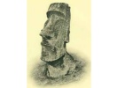

  
[Intangible Textual Heritage](../../index)  [Pacific](../index) 
[Index](index)  [Previous](ei41)  [Next](ei43) 

------------------------------------------------------------------------

  
*Te Pito Te Henua, or Easter Island*, by William J. Thompson, \[1891\],
at Intangible Textual Heritage

------------------------------------------------------------------------

p. 489

### ANAKENA BAY.

December 23.--A dip in the sea at daylight, and a breakfast of mutton
which had been slowly roasting all night on hot stones placed in the
ground and covered with earth to prevent the escape of heat, put us in
prime condition for the work in hand. Our route lay along the north
coast of the island and around Anakena Bay, the place where Hotu-Matua
and his followers landed when they arrived from the unknown and
much-disputed locality from which they migrated. On the sand beach of
this bay we found the small univalve, the remains of which were noticed
in all the caves and ruins on the island and which are still highly
esteemed by the natives as an article of food. Jelly-fish, such as are
known to the sailors as "Portuguese men-of-war," also abound, and are
esteemed a delicacy by the natives. The entire plain back of Anakena (La
Pérouse) Bay is covered with small platforms, cairns, tombs, and the
rains of dwellings of various sorts. Houses built of loose stones,
nearly circular in shape, are plentiful; but they belong to a
comparatively recent date, as is indicated by the fact that the stones,
of which they are constructed, have been taken from the platforms and
from the foundations of the thatched tents. Any sort of material that
came handy appears to have been freely used by the builders of these
houses. In several we found well-cut heads that had formerly ornamented
image platforms, built in the walls, some facing inside and others in
the opposite direction. The ruins in the vicinity show that this had
been the site, of a large settlement, and that it continued to be a
place of importance through many generations; but the greatest mystery
is how such a number of people obtained a sufficient supply of fresh
water.

Near Anakena is a large image in the best state of preservation of any
found about the platforms of the island. The traditions assert that this
was intended to represent a female, and that it was the last image
completed and set up in place. Our guides informed us that it was only
thrown down about twenty-four years ago, and previous to that time it
had remained for many years the only statue standing upon a platform on
the island. Camp Whitney was located at Hangaone Bay, where we found
shelter in a bug-infested cave. The water supply was obtained from an
ancient tomb near by, and was both scant in quantity and nasty in
quality. We were, however, in such an indifferent state of mind that
anything wet was acceptable.

December 24.--With the knowledge that we had a particularly hard march
before us, we struck camp early and got under way before it was fairly
in the morning. Around Cape Pokokoria the rugged nature of the ground
passed over was extremely exhausting. The slopes of Mount Puakalika are
in places covered with coarse hummock-grass and flowering vines, which
look green and attractive during the rainy season of the year, but which
were at this time almost as dry and parched as though scorched by fire.
The toilsome march of this day was heightened by the absence of water,
and all suffered severely from thirst.

p. 490

\[paragraph continues\] Starting out in
the morning with empty canteens, our throats soon became dry and
painful. A small quantity of water was found in the afternoon in Mount
Puakalika crater, thick and unpleasant to look upon, but affording
valuable relief to our sufferings.

------------------------------------------------------------------------

[Next: The Poike Plains](ei43)
