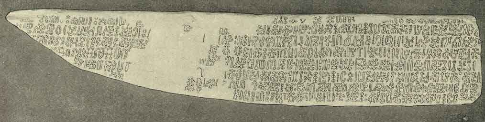
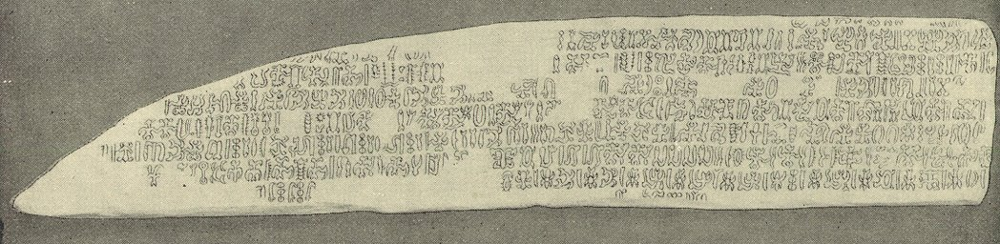

  
[Intangible Textual Heritage](../../index)  [Pacific](../index) 
[Index](index)  [Previous](ei50)  [Next](ei52) 

------------------------------------------------------------------------

  
*Te Pito Te Henua, or Easter Island*, by William J. Thompson, \[1891\],
at Intangible Textual Heritage

------------------------------------------------------------------------

p. 523

### TRANSLATION OF EASTER ISLAND TABLETS.

#### EAHA TO RAN ARIIKI KETE.

(Plates XL and XLI.)

1\. Eaha to ran ariiki kete mahua i uta nei?  
E tupu tomo a mata mea e rangi ran e tuatea to ran ariiki kete mahua i
uta nei.  
Ane rato mani rata karata te tuatea, karata te rangi ran karata te
tupuna.  
2. Eaha to ran ariiki kete mahua i uta nei?  
E ura e poopoo e koiro e nohoe e to ran ariiki kete mahua i uta nei.  
Ane, rato mani rata karata, to ura ki kara te poopoo e nehe e riku e
kava-kava atu.  
3. Eaha to ran ariiki kete mahua i uta nei?  
E nehe e riku e kava atua to ran ariiki kete mahua i uta nei.  
Ane rato mani rata karata to nehe karata riku karata rain kava atua.  
4. Eaha to ran ariiki kete mahua i uta nei?  
E a hao nei e kahi e atu e ature.  
Ane rato mani rata karata to kahi kaharta ahi rarata te ature ane
rato.  
5. Eaha to ran ariiki kete mahua i uta nei?  
E ufi e tra e kumaro to ran ariiki mahua i ata nei.  
Ane rato karata to ufi kumara toa e mahua i uta nei, ane rato maru.  
6. Eaha to ran ariiki kete mahua i uta nei?  
E honu e kea e pane to ran ariiki kete mahua i uta nei.  
Ane rato karata to honu to kea to pane.  
7. Eaha to rau ariiki kete mahua i uta nei  
E hetu e range e han e na e raa e mahua to ran ariiki kete mahua i
irunga nei.  
Ane rato karata te rangi e hon e na e, raa e mahua.  
8. Eaha te ran ariiki kete mahua i uta nei?  
E anuga nei karata to hehun rangi han na raa mahua.  
Ane rato karata te hehuu rangi han na raa mahua.  
9. Eaha to ran ariiki kete mahua i uta nei?  
E ariiki e tapairu to ran ariiki kete i mahua i mua nei.  
Ane rato karata to ariiki te tapairu.  
10. Eaha to ran ariiki kete mahua i uta nei?  
E oi e potupotu e ugarara e hata to ran ariiki kete mahua i uta nei.  
Ane rato karata main rata e oi e potupotu e ugarara e hata to ran ariiki
kete mahua i uta nei.

### ENGLISH TRANSLATION OF TABLET.

#### EASTER ISLAND ANTHEM.

What power has the Great King on the land?  
He has power to make the plants grow and to change the sky to different
colors.  
All hail the power of the Great King who makes us lenient to the p. 524 young plants, to admire the skies of
different colors, and to behold the clouds that rise.  
What power has the Great King on the land?  
He has the power to create the lobsters, white-bait, eels, ape-fish, and
everything in the sea.  
All hail the power of the Great King who gives us the knowledge of how
to catch the lobsters, white-bait, eels, ape-fish, and all marine
animals.  
What power has the Great King on the land?  
He has the power to produce the ferns, creeping plants, grass, bushes,
and all vegetation.  
All hail the power of the Great King who has taught us to love the
ferns, creeping plants, and all green things.  
What power has the Great King over the sea?  
He has the power to create the mighty fish that swim in the deep
water.  
All hail the power of the Great King who has given us the strength and
skill to catch the fish of the mighty deep.  
What power has the Great King on the land?  
He has the power to produce the yams, potatoes, and sugar-cane.  
All hail the power of the Great King who enables us to use as food yams,
potatoes, and sugar-cane.  
What power has the Great King on the land?  
He has the power to clothe the turtles in hard shell, the fish with
scales, and protects every living thing.  
All hail the power of the Great King who enables us to overcome the
defense of the turtles, fish, and all reptiles.  
What power has the Great King in the universe?  
He has the power to create the stars, the clouds, the dew, the rain, the
sun, and the moon.  
All hail the power of the Great King who enables us to appreciate the
blessings of the bright stars, the lowering clouds the gentle dew, the
falling rain, and the light of the sun and moon.  
What power has the Great King upon the land?  
He has the power to populate the earth, to create both kings and
subjects.  
All hail the power of the Great King who has created the human beings,
given authority to kings, and created loyal subjects.  
What power has the Great King upon the land?  
He has the power to create maggots, flies, worms, fleas, and all
creeping and flying insects.  
All hail the power of the Great King who enables us to withstand the
attacks of the maggots, flies, worms, fleas, and all manner of
insects.  
What power has the Great King?  
All hail the unlimited power of the Great King.

 

   
OBVERSE OF EASTER ISLAND WOODEN TABLET "EAHA TO RAN ARIIKI KETE"  
(Cat. NO. 129774, U. S. N. M. Easter Island. Collected and deposited by
Paymaster W. J. Thompson, U. S. N.)

   
REVERSE OF EASTER ISLAND WOODEN TABLET "EAHA TO RAN ARIIKI KETE"  
(Cat. NO. 129774, U. S. N. M. Easter Island. Collected and deposited by
Paymaster W. J. Thompson, U. S. N.)

 

------------------------------------------------------------------------

[Next: Text of the Easter Island Tablets: Father Mourning the Loss of
His Child](ei52)
