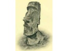
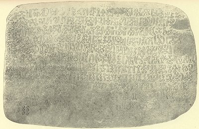
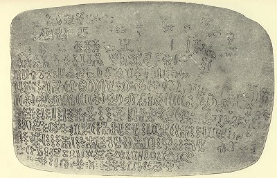

  
[Intangible Textual Heritage](../../index)  [Pacific](../index) 
[Index](index)  [Previous](ei52)  [Next](ei54) 

------------------------------------------------------------------------

  
*Te Pito Te Henua, or Easter Island*, by William J. Thompson, \[1891\],
at Intangible Textual Heritage

------------------------------------------------------------------------

p. 526

### TRANSLATION OF EASTER ISLAND TABLET.

#### "Ate-a-renga-hokan iti poheraa."

#### LOVE SONG.

(Plates XLIV and XLV.)

Ka tagi, Renga-a-manu ---- hakaopa;  
  Chiu runarame a ita metua.  
Ka ketu te nairo hihi ---- O to hoa!  
  Eaha ton tiena ---- e te hoa ---- e!

Ita haga ta poapatu ---- O te hoa!  
  Kahii te riva forani ---- O te hoa e!  
Auwe ka tagi ati ---- u ---- a ---- iti iti.  
  Eha ton tiena ---- e ta hoa ---- e.

Ta hi tiena ita have.  
   Horoa ita have.  
   Horoa moni e fahiti;  
          Ita ori miro;  
          Ana piri atu;  
          Ana piri atu;  
          Ana taga atu.

#### ENGLISH TRANSLATION.

#### NATIVE LOVE SONG,

Who is sorrowing? It is Renga-a-manu Hakopa?  
A red branch descended from her father.  
Open thine eyelids, my true love.  
Where is your brother, my love?  
At the feast in the Bay of Salutation  
We will meet under the feathers of your clan.  
She has long been yearning after you.  
Send your brother as a mediator of love between us,  
Your brother who is now at the house of my father.  
O, where is the messenger of love between us?  
When the feast of drift-wood is commemorated  
There we will meet in loving embrace.

 

   
OBVERSE OF EASTER ISLAND WOODEN TABLET "ATE A-RENGA-HOKAN ITI POHERAA"  
(From photographs in possession of Bishop of Axieri. From photograph by
Paymaster W. J. Thompson, U. S. N.)

   
REVERSE OF EASTER ISLAND WOODEN TABLET "ATE A-RENGA-HOKAN ITI POHERAA
"  
(From photographs in possession of Bishop of Axieri. From photograph by
Paymaster W. J. Thompson, U. S. N.)

 

------------------------------------------------------------------------

[Next: More Rongo-rongo plates](ei54)
