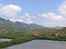

  
[Intangible Textual Heritage](../../index)  [Pacific](../index) 
[Index](index)  [Previous](hft25)  [Next](hft27) 

------------------------------------------------------------------------

[Buy this Book at
Amazon.com](https://www.amazon.com/exec/obidos/ASIN/B0024FAHH0/internetsacredte)

------------------------------------------------------------------------

  
*Hawaiian Folk Tales*, by Thomas G. Thrum, \[1907\], at Intangible
Textual Heritage

------------------------------------------------------------------------

p. 250

### XXIII

### KANEAUKAI

#### A LEGEND OF WAIALUA

###### THOS. G. THRUM

LONG ago, when the Hawaiians were in the darkness of superstition and
kahunaism, with their gods and lords many, there lived at Mokuleia,
Waialua, two old men whose business it was to pray to Kaneaukai for a
plentiful supply of fish. These men were quite poor in worldly
possessions, but given to the habit of drinking a potion of awa after
their evening meal of poi and fish.

The fish that frequented the waters of Mokuleia were the aweoweo, kala,
manini, and many other varieties that find their habitat inside the
coral reefs. Crabs of the white variety burrowed in the sand near the
seashore and were dug out by the people, young and old. The squid also
were speared by the skilful fishermen, and were eaten stewed, or salted
and sun-dried and roasted on the coals. The salt likely came from Kaena
Point, from salt-water evaporation in the holes of rocks so plentiful on
that stormy cape. Or it may have been made on the salt pans of
Paukauwila, near the stream of that name, where a few years ago this
industry existed on a small scale.

p. 251

But to return to our worshippers of Kaneaukai, One morning on going out
upon the seashore they found a log of wood, somewhat resembling the
human form, which they took home and set in a corner of their lowly hut,
and continued their habit of praying to Kaneaukai. One evening, after
having prepared a scanty supper of poi and salt, with perhaps a few
roasted kukui-nuts, as a relish, and a couple of cocoanut cups of awa as
their usual drink, they saw a handsome young man approaching, who
entered their hut and saluted them. He introduced himself by saying, "I
am Kaneaukai to whom you have been praying, and that which you have set
up is my image; you have done well in caring for it."

He sat down, after the Hawaiian custom, as if to share their evening
meal, which the two old men invited him to partake of with them, but
regretted the scanty supply of awa. He said: "Pour the awa back into the
bowl and divide into three." This they did and at once shared their meal
with their guest.

After supper Kaneaukai said to the two old men, "Go to Keawanui and you
will get fish enough for the present." He then disappeared, and the
fishermen went as instructed and obtained three fishes; one they gave to
an old sorceress who lived near by, and the other two they kept for
themselves.

Soon after this there was a large school of fish secured by the
fishermen of Mokuleia. So abundant were the fish that after salting all
they could, there was enough to give away to the neighbors; and even the
dogs had more than they desired.

p. 252

Leaving the Mokuleia people to the enjoyment of their unusual supply of
fish, we will turn to the abode of two kahunas, who were also fishermen,
living on the south side of Waimea Valley, Oahu. One morning, being out
of fish, they went out into the harbor to try their luck, and casting
their net they caught up a calcareous stone about as large as a man's
head, and a pilot fish. They let the pilot fish go, and threw the stone
back into the sea. Again they cast their net and again they caught the
stone and the pilot fish; and so again at the third haul. At this they
concluded that the stone was a representative of some god. The elder of
the two said: "Let us take this stone ashore and set it up as an idol,
but the pilot fish we will let go." So they did, setting it up on the
turn of the bluff on the south side of the harbor of Waimea. They built
an inclosure about it and smoothed off the rocky bluff by putting flat
stones from the immediate neighborhood about the stone idol thus
strangely found.

About ten days after the finding of the stone idol the two old kahunas
were sitting by their grass hut in the dusk of the evening, bewailing
the scarcity of fish, when Kaneaukai himself appeared before them in the
guise of a young man. He told them that they had done well in setting up
his stone image, and if they would follow his directions they would have
a plentiful supply of fish. Said he, "Go to Mokuleia, and you will find
my wooden idol; bring it here and set it up alongside of my stone idol."
But they demurred, as it was a dark night and there were usually
quicksands

p. 253

after a freshet in the Kamananui River. His answer was, 'Send your
grandsons." And so the two young men were sent to get the wooden idol
and were told where they could find it.

The young men started for Mokuleia by way of Kaika, near the place where
salt was made a few years ago. Being strangers, they were in doubt about
the true way, when a meteor (*hoku kaolele*) appeared and went before
them, showing them how to escape the quicksands. After crossing the
river they went on to Mokuleia as directed by Kaneaukai, and found the
wooden idol in the hut of the two old men. They shouldered it, and
taking as much dried fish as they could carry, returned by the same way
that they had come, arriving at home about midnight.

The next day the two old kahunas set up the wooden idol in the same
inclosure with the stone representative of Kaneaukai. The wooden image
has long since disappeared, having been destroyed, probably, at the time
Kaahumanu made a tour of Oahu after her conversion to Christianity, when
she issued her edict to burn all the idols. But the stone idol was not
destroyed. Even during the past sixty years offerings of roast pigs are
known to have been placed before it. This was done secretly for fear of
the chiefs, who had published laws against idolatry.

Accounts differ, various narrators giving the story some embellishments
of their own. So good a man as a deacon of Waialua in telling the above
seemed to believe that, instead of being a legend it was true; for an
old man, to whom he referred as authority, said

p. 254

that one of the young men who went to Mokuleia and brought the wooden
idol to Waimea was his own grandfather.

An aged resident of the locality gives this version: Following the
placement of their strangely found stone these two men dreamed of
Kaneaukai as a god in some far-distant land, to whom they petitioned
that he would crown their labors with success by granting them a
plentiful supply of fish. Dreaming thus, Kaneaukai revealed himself to
them as being already at their shore; that the stone which they had been
permitted to find and had honored by setting up at Kehauapuu, was
himself, in response to their petitions; and since they had been
faithful so far, upon continuance of the same, and offerings thereto,
they should ever after be successful in their fishing. As if in
confirmation of this covenant, this locality has ever since been noted
for the periodical visits of schools of the anae-holo and kala, which
are prevalent from April to July, coming, it is said, from Ohea,
Honuaula, Maui, by way of Kahuku, and returning the same way.

So strong was the superstitious belief of the people in this deified
stone that when, some twenty years ago, the road supervisor of the
district threw it over and broke off a portion, it was prophesied that
Kaneaukai would be avenged for the insult. And when shortly afterward
the supervisor lost his position and removed from the district,
returning not to the day of his death; and since several of his
relatives have met untimely ends, not a few felt it was the recompense
of his sacrilegious act.

------------------------------------------------------------------------

[Next: XXIV. The Shark-Man, Nanaue](hft27)
