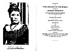

  
[Intangible Textual Heritage](../../index)  [Pacific](../index) 
[Index](index)  [Next](lku01) 

------------------------------------------------------------------------

##### AN ACCOUNT

###### OF

### THE CREATION OF THE WORLD

###### ACCORDING TO

### HAWAIIAN TRADITION

###### *TRANSLATED FROM ORIGINAL MANUSCRIPTS PRESERVED EXCLUSIVELY IN HER MAJESTY'S FAMILY*

###### BY

## LILIUOKALANI OF HAWAII

### PRAYER OF DEDICATION

#### THE CREATION

###### FOR

##### KA Ii MAMAO

###### FROM HIM TO HIS DAUGHTER

##### ALAPAI WAHINE

##### LILIUOKALANI'S GREAT-GRANDMOTHER

###### COMPOSED BY

###### KEAULUMOKU IN 1700 AND TRANSLATED BY LILIUOKALANI DURING HER IMPRISONMENT IN 1895 AT IOLANI PALACE AND AFTERWARDS AT WASHINGTON PLACE HONOLULU WAS COMPLETED AT WASHINGTON D.C. MAY 20, 1897

#### Lee and Shepard, Boston

#### \[1897\]

[  
Click to enlarge](img/title.jpg)  
Title page and Frontispiece (Best Available Image)  

 

**NOTICE OF ATTRIBUTION**  
Scanned at Intangible Textual Heritage, April 2005. John Bruno Hare,
redactor. This text is in the public domain in the United States because
it was published prior to 1923. These files may be used for any
non-commercial purpose provided this notice of attribution is left
intact in all copies.

------------------------------------------------------------------------

[Next: Introduction](lku01)
