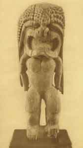

  
[Intangible Textual Heritage](../../index)  [Pacific](../index) 

------------------------------------------------------------------------

<table>
<colgroup>
<col style="width: 50%" />
<col style="width: 50%" />
</colgroup>
<tbody>
<tr class="odd">
<td></td>
<td><h1 id="oceanic-mythology" data-align="CENTER">Oceanic Mythology</h1>
<h2 id="by-roland-b.-dixon" data-align="CENTER">By Roland B. Dixon</h2>
<h3 id="section" data-align="CENTER">[1916]</h3></td>
</tr>
</tbody>
</table>

------------------------------------------------------------------------

[Map of Pacific Cultural Areas](om44)

------------------------------------------------------------------------

[Title Page](om00)  
[Author's Preface](om01)  
[Contents](om02)  
[Illustrations](om03)  
[Introduction](om04)  

### Part I. Polynesia

[Part I. Polynesia](om05)  
[Chapter I. Myths of Origins and the Deluge](om06)  
[Chapter II. The Maui Cycle](om07)  
[Chapter III. Miscellaneous Tales](om08)  
[Chapter IV. Summary](om09)  

### Part II. Melanesia

[Part II. Melanesia](om10)  
[Chapter I. Myths of Origins and the Deluge](om11)  
[Chapter II. Culture Hero Tales](om12)  
[Chapter III. Miscellaneous Tales](om13)  
[Chapter IV. Summary](om14)  

### Part III. Indonesia

[Part III. Indonesia](om15)  
[Chapter I. Myths of Origins and the Deluge](om16)  
[Chapter II. Trickster Tales](om17)  
[Chapter III. Miscellaneous Tales](om18)  
[Chapter IV. Summary](om19)  

### Part IV. Micronesia

[Part IV. Micronesia](om20)  
[Chapter I. Myths of Origins and the Deluge](om21)  
[Chapter II. Miscellaneous Tales](om22)  
[Chapter III. Summary](om23)  

### Part V. Australia

[Part V. Australia](om24)  
[Chapter I. Myths of Origins and the Deluge](om25)  
[Chapter II. Animal and Miscellaneous Tales](om26)  
[Chapter III. Summary](om27)  

 

[Conclusion](om28)  

### Notes

[Part I, Chapter I](om29)  
[Part I, Chapter II](om30)  
[Part I, Chapter III](om31)  
[Part II, Chapter I](om32)  
[Part II, Chapter II](om33)  
[Part II, Chapter III](om34)  
[Part III, Chapter I](om35)  
[Part III, Chapter II](om36)  
[Part III, Chapter III](om37)  
[Part IV, Chapter I](om38)  
[Part IV, Chapter II](om39)  
[Part V](om40)  
[Part V, Chapter I](om41)  
[Part V, Chapter II](om42)  

 

[Bibliography](om43)  
[Map](om44)  
