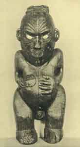

  
[Intangible Textual Heritage](../../index)  [Pacific](../index) 
[Index](index)  [Previous](om06)  [Next](om08) 

------------------------------------------------------------------------

p. 41

# CHAPTER II

### THE MAUI CYCLE

OF all the myths from the Polynesian area, probably none have been more
frequently quoted than those which recount the deeds and adventures of
the demigod Maui. Among the Polynesians themselves almost every group
had its own versions of the tales, and the large number of variants,
many of which have fortunately been recorded, make the Maui cycle one of
the most important for the study of this whole area.

Maui, the hero of these tales, is generally described as one of a series
of brothers, the number varying from three in Rarotonga to six in some
of the New Zealand versions, although in Mangaia he is spoken of as
having no brother. [1](om30.htm#fn_127) As in
hero tales generally, he is usually the youngest child, and in New
Zealand especially the older Mauis are described as stupid or forgetful,
while Maui, the hero, is clever or mischievous. [2](om30.htm#fn_128) Thus the elder brothers used
spears without barbs and eel-pots without trap-doors, and wondered why
they were unsuccessful; but the youngest invented the barb on the spear
and the trap-door for the eel-pot, and so succeeded where they failed.
These two elements, i. e. that the hero is one of a number of brothers
and that the others are stupid or foolish while he is wise and clever,
are very strikingly developed in the Melanesian myths, [3](om30.htm#fn_129) which often record two brothers
and in which there is sometimes a greater antithesis of good and evil
than is. implied in the Polynesian myths. In the New Hebrides and
vicinity, indeed, the hero at times appears under the name of
Maui. [4](om30.htm#fn_130) While in the
non-Maori parts of the Polynesian area

p. 42

\[paragraph continues\] Maui's birth is generally not dissimilar to that
of his other brothers, in New Zealand the hero is declared to have been
an abortion, which his mother wrapped up in her apron or topknot, and
either abandoned in the bush or threw into the sea. [5](om30.htm#fn_131) Although thus deserted by his
parent, Maui survived, [6](om30.htm#fn_132) for
the unformed child was tended by supernatural beings and reared to
manhood, some versions declaring that he was taken up into the
sky-world. There he grew up and engaged in a conflict with Maru (by one
account, an elder brother) [7](om30.htm#fn_133)
whose crops he ruined by sending rain or snow upon them, for which Maru
revenged himself by causing frost to kill Maui's crops, whereupon, in
retaliation, the hero slew him. [8](om30.htm#fn_134) Having at length reached
maturity, Maui determined to seek out his parents and brothers, and came
upon the latter engaged in playing at *niti* or *teka*. In this game
reeds, fern stalks, or spears are cast so as to rebound from a small
hillock of earth and slide along the ground, the winner being he whose
*niti* goes farthest. After the brothers had hurled their spears, Maui
asked to be allowed to throw, and as he did so he shouted his name, but
the others at once disclaimed him and said that he had no right to be
called Maui. He asked them, however, to summon their mother that she
might decide, yet when she came, she at once declared that he was no
child of hers and bade him begone. Maui next asked her to recall her
past, and then she remembered that which she had cast away. Maui
declared this to have been his origin and that his ancestors had saved
him and brought him up. His mother finally recognized him, declared him
her youngest son, and made him her favourite. [9](om30.htm#fn_135) This episode of the return of
the abandoned child is strikingly parallel to tales current in
Melanesia, [10](om30.htm#fn_136) where a
deserted child joins others who are playing a game and is ultimately
recognized by his parent. So far as reported, this incident does not
occur elsewhere in Polynesia, except in Nieue. [11](om30.htm#fn_137)

Of the many exploits of Maui three seem to be most widely

p. 43

spread, and these may, therefore, be first considered. They are fishing
up the land, snaring the sun, and the quest of fire. As an example of
the first of these feats we may take one of the New Zealand
versions [12](om30.htm#fn_138) Maui had an
ancestress to whom it was the duty of the elder brothers to carry food,
but they neglected her and ate it themselves. Maui offered to take their
place, but when he came to his ancestress, he found her ill, one half of
her body being already dead, whereupon he wrenched off her lower jaw,
made from it a fish-hook, which he concealed about him, and then
returned to his home. His brothers did not like to have him accompany
them on their fishing trips, but Maui hid in their canoe, and when they
were out at sea next day, he disclosed himself. At first they were going
to put him ashore, but finally they agreed to let him stay, since they
thought that he could not fish if they did not give him a hook. Nothing
dismayed, Maui took out his magic hook, struck his nose with his fist
until it bled, and baited his hook with the blood. [13](om30.htm#fn_139) Lowering his line, he soon got
a tremendous bite and at last hauled in the land, like a great fish,
from the bottom of the sea. Telling his brothers not to cut it up, he
went away, but they disobeyed him and began to hack with their knives,
thus causing the great fish to struggle, break the canoe, and kill the
brothers, while, owing to the cuts made by them, the land became rough
and rugged. In some versions of the myth the land so hauled up was that
of Tonga; in others, it was New Zealand, which some of the Maori called
Te-ika-a-ma-ui, "The Fish of Maui."' According to another account, [14](om30.htm#fn_140) the magic fish-hook was made
from the jaw-bone of Maui's oldest son, whom Maui had killed for this
purpose, the bait being the ear of this same child; and for three moons
he laboured to drag up the great fish with the aid of Rupe, a pigeon, to
whom he gave one end of the line.

It is in New Zealand that the story of this exploit of the hero is told
with the greatest wealth of detail, although Hawaii also furnishes
versions nearly as full. [15](om30.htm#fn_141)
Here the reason is

p. 44

given why the brothers did not like to have Maui go fishing with them.
He was not a very good fisherman, but was full of mischievous tricks by
which he secured the catch actually taken by his brothers. When one of
them began to haul in a prize, Maui would cry, "Look out, we have both
caught the same fish," and would rapidly pull in his line, so manœuvring
as to foul that of the other. As the fish was brought near the canoe, he
would then slip his hook toward the head of the fish and flip it over
into the canoe, thus causing his brother's line to slacken, and then,
holding up the fish, he would say, "Oh, you lost your fish. Why didn't
you pull steadily?" [16](om30.htm#fn_142) When
at last the brothers allowed the tricky fellow to accompany them again,
he baited his magic fish-hook with a bird, sacred to his mother, Hine;
but the fish which he caught was so huge that he asked his brothers to
help him haul it in, and as the land began to emerge from the sea, he
cautioned them not to look back or the prize would be lost. One of the
brothers disobeyed, and at once the line broke and the land also, so
that, instead of a great single mass, it was fractured into a group of
islands. Central Polynesia and Tonga [17](om30.htm#fn_143) present, so far as published
materials go, much briefer accounts and in almost all cases attribute
the same feat to Tangaroa also or some other deity or demigod. The
episode seems to be but little known in Samoa. [18](om30.htm#fn_144) There it is attributed solely
to Tangaroa and is a variant of the story of how, in the beginning, he
cast a rock down from the sky to serve as an abiding place for his
daughter, the snipe, in the world of waters. From the evidence it would
appear that the episode was one which was a part of the older structure
of Polynesian mythology and which in the central and western areas had
been overlaid by later elements. Outside of the Polynesian region
comparable myths have so far been noted in certain of the New
Hebrides, [19](om30.htm#fn_145) Fotuna, [20](om30.htm#fn_146) Union Group, Gilbert
Islands, [21](om30.htm#fn_147) and New
Britain. [22](om30.htm#fn_148)

A Hawaiian version [23](om30.htm#fn_149) of the
snaring of the sun may be taken as an example of Maui's next exploit.
Maui's mother was

p. 45

much troubled by the shortness of the day, occasioned by the rapid
movement of the sun; and since it was impossible to dry properly the
sheets of *tapa* used for clothing, the hero resolved to cut off the
legs of the sun so that he could not travel so fast. His mother,
accordingly, made strong ropes for him and sent him to his blind old
grandmother to get added assistance. He found her cooking bananas, and
as she laid them down one after the other, Maui stole them. At length
discovering her loss, but unable to see the culprit, she sniffed about
angrily until she smelt a man, whereupon she asked who it was, and when
Maui told her that he was her grandson, she forgave him and presented
him with a magic club to aid him in his attack on the sun. Maui now went
off eastward to where the sun climbed daily out of the underworld, and
as the luminary came up, the hero noosed his legs one after the other
and tied the ropes strongly to great trees. Fairly caught, the sun could
not get away, and Maui gave him a tremendous beating with his magic
weapon. To save his life, the sun begged for mercy, and on promising to
go more slowly ever after, was released from his bonds.

Substantially the same form of the story is found in New Zealand. [24](om30.htm#fn_150) Maui "observed that the time
between the sun's rising and setting was very short, and he said to his
brothers, 'Let us tie the sun, that it may not go so fast, that man may
have time to provide food for himself.' But his brothers said, 'Man
cannot go near to the sun on account of the heat.' Maui said, 'You have
seen the many acts that I have performed. I have taken the form of a
bird, and again resumed that of a man, while you have ever had the form
of men. And now, my brothers, I can do what I propose, and even greater
acts than this.' His brothers consented, and commenced to plait ropes. .
. . When these had been made Maui took his weapon, made of the jaw-bone
of his progenitor . . . and his brothers took their weapons and the
ropes, and they . . . journeyed till they had got near where the sun
came up. Maui, addressing

p. 46

his brothers, said, 'Beware you do not surprise and unnecessarily
startle the sun; but let his head and shoulders be fully within the
noose, and be ready when I call to pull the opposite ends of the ropes.
When the sun is caught, I will rise and beat him. But let the ropes be
securely fastened that he may be held for some time. And O young men! do
not heed his cry of pain. Then we will let him go.'

"The sun came up like blazing fire, and when his head and shoulders had
entered the noose Maui encouraged his brothers to action by saying 'Now
pull.' They did so, and the sun drew his limbs together with a twitch.
Maui rushed at him with his weapon, and scarce had the sun time to call
before Maui was belabouring him, and continued to so do for some time.
When they let him go he went away crippled, and in the anguish of his
pain he uttered another of his names, Tama-nui-a-te-ra (great child of
the sun), and said, 'Why am I so beaten by you, O man! I will have my
revenge on you for having dared to beat the great child of the sun.' He
departed on his way, but was unable to travel so fast as before."

It will be noted that this and other New Zealand versions, [25](om30.htm#fn_151) like all those so far recorded
from the rest of Polynesia, [26](om30.htm#fn_152) lack the incident of the visit
to the blind grandmother. This episode of the stealing of food from a
blind person is, however, widely current in Polynesia, but is, as a
rule, told in connexion with another hero, Tawhaki, whose adventures and
relationship will be considered later. On the other hand, it is not
uncommon in Melanesia, [27](om30.htm#fn_153)
and is also found in Micronesia [28](om30.htm#fn_154) and Indonesia. [29](om30.htm#fn_155) In the Society Group a somewhat
different aspect is given to the story by the fact that the purpose was
not to make the sun go more slowly, but to bring it nearer, so that it
might more quickly heat the stones that Maui used in cooking his
food. [30](om30.htm#fn_156) In Samoa the
adventure, albeit in a somewhat abbreviated form, is attributed not to
Maui but to the Sun-Child, some of whose other adventures are widely
spread in Polynesia.

p. 47

The third of the great exploits usually accredited to Maui is that of
the fire-quest. As with much of the Maui cycle, the fuller versions have
been best preserved in New Zealand. [31](om30.htm#fn_157) According to these, Maui and
his brothers lived with their mother, but every morning she disappeared
before they awoke, and none knew whither she went. Determining to solve
the mystery, Maui stopped up every chink and cranny in the house, thus
preventing the morning light from coming in, [32](om30.htm#fn_158) so that his mother overslept,
and Maui, waking in time, saw her leave the house, pull up a clump of
reeds or grass, and disappear down the opening thus revealed. Adopting
his favourite disguise of a bird, he followed, flying down the aperture:
to the world below, where he revealed himself to his parent and demanded
food. The fire being out, his mother was about to send a servant to
secure some, when Maui volunteered to bring it and accordingly went to
the house of his ancestor Mafuike, an old woman who was the owner and
guardian of fire. Of her he begged a brand, and she gave him one of her
fingers, in which fire was concealed. He started away, but when out of
sight, quenched it in a stream and returned for more. She gave him
another finger, which he extinguished in a similar manner, and thus got
from her in succession all her fingers and toes, except the last, with
which, in anger, she set the world afire. [33](om30.htm#fn_159) Maui fled, but was pursued by
the flames, which threatened to consume everything, so that in distress
he called upon rain, snow, and hail to aid him, and they, coming to his
assistance, succeeded in putting out the conflagration and thus saved
the world. In some versions Maui then returned to this world, having
conquered the fire-deity; but in others the latter threw the last of the
fire into various trees, which since then have preserved the germ of
fire, which can be called forth by friction. Similar tales have been
recorded from several of the other Polynesian groups. [34](om30.htm#fn_160) The practical absence of this
myth from the Society Group is probably due to the very small amount of
myth material so far

p. 48

published from there; on the other hand, the whole Maui cycle is
apparently less important in this Group than elsewhere.

The various versions of this legend which have been recorded in the
Polynesian area present minor differences which would seem to be
significant, and a consideration of some of the separate incidents of
this myth may, therefore, be instructive. In the first place, the idea
that fire was originally obtained from the underworld (a feature found
in all these Polynesian versions) is one which also occurs in
Melanesia; [35](om30.htm#fn_161) although, on
the other hand, a more usual explanation in this area is that fire was
either brought from another land by some animal after several
unsuccessful attempts or was accidentally discovered. [36](om30.htm#fn_162) In the Polynesian versions of
Maui's exploit the method by which his parent and he reached the
underworld varies considerably. Thus, in the form outlined above, the
opening to the nether world is concealed under a tuft of reeds or grass,
and this same idea appears in both the Samoan version and in that from
Nieue. Forms of the tale from New Zealand, [37](om30.htm#fn_163) Samoa, and Mangaia (Cook
Group), however, state that the parent went to a rock or cliff, and
repeating a charm caused it to open, thus revealing the entrance to the
lower world. This "Open Sesame" incident by itself is found in numerous
other myths from New Zealand," as well as from the Chatham Islands [38](om30.htm#fn_164) and Tahiti, [39](om30.htm#fn_165) and is reported also from
British New Guinea [40](om30.htm#fn_166) and
from Halmahera. [41](om30.htm#fn_167) Still
another way of descent to the underworld, namely, by pulling up one of
the house posts, occurs in one of the Maori versions, as it does in that
from Manihiki.

In the New Zealand myths the underworld deity from whom Maui secures
fire is described as an old woman, whereas in practically all the other
portions of Polynesia where the myth is found this divinity is male--a
distinction which is possibly significant in view of the fact that in
Melanesia we find an old woman as the owner or guardian of fire, from
whom it is stolen or by whom it is given to mankind. [42](om30.htm#fn_168) Again, when Maui asks

 

 

PLATE VII

Wooden figure representing an ancestor or possibly some minor deity. New
Zealand. Peabody Museum, Cambridge Massachusetts.

 

p. 49

the New Zealand fire-goddess for fire, she takes off and gives to him
one of her fingers or toes, the igneous element thus being obtained from
the body of its owner. This incident is also found in the Chatham Island
versions, and in a slightly modified form in the Marquesas, though it is
lacking in other portions of Polynesia; but it is interesting to note,
on the other hand, that this same conception of the obtaining of fire
from the body of its owner occurs both in Melanesia [43](om30.htm#fn_169) and in Micronesia. [44](om30.htm#fn_170) Where this myth is recorded in
the Polynesian area, Maui is given merely a firebrand by the deity. In
the Maori tales Maui has no fight with the owner of fire, but this is an
important element in the versions elsewhere. In some cases (Mangaia,
Manihiki, Marquesas, Society Group) Maui kills the fire-god, although in
the Manihiki myth he miraculously restores him to life afterward. In
Samoa (and in one version from the Marquesas) he does not kill the
fire-god, but in wrestling with him tears off one of his arms, sparing
the other at the deity's urgent request, a feature which seems to have
analogues in Micronesia and Melanesia. [45](om30.htm#fn_171)

The incident of the rain being invoked to extinguish the conflagration
which threatens to destroy the world is also known from the Melanesian
area. [46](om30.htm#fn_172) From the foregoing
it would appear that we must admit that Melanesian elements are to be
recognized particularly in the New Zealand and Chatham Island versions
of the myth, and perhaps in the Marquesas as well.

It will be noticed that in discussing this exploit of Maui no reference
has been made to Hawaiian versions, this being due to the significant
fact that Hawaii, alone of all the Polynesian groups, lacks the tale
completely, although it possesses one of wholly different character.
According to the Hawaiian story, [47](om30.htm#fn_173) when Maui and his three
brothers were out fishing, they saw a fire burning on the shore, but on
going in search of it, the birds (mud-hens) who had made it put it out
and ran away. After several attempts to surprise them, Maui stayed

p. 50

on shore and sent his three brothers out in the canoe, thinking thus to
fool the clever birds; but when they perceived that one of the Maui
brothers was missing from the boat, they refused to build a fire. At
last Maui hit upon a stratagem. Setting up in the canoe a roll of *tapa*
arranged to look like a man, he hid on shore while his brothers put to
sea with the dummy. The birds were deceived and set to work to build a
fire, but before they had finished, Maui, who could not restrain his
impatience, rushed up and caught one of them, threatening to kill it
unless it divulged the secret of how to make fire. The bird tried to
cheat him several times by giving him false information, but at last, in
peril of its life, told him the correct sorts of wood to use, and so the
mystery was learned. In revenge for their attempted treachery Maui then
rubbed the head of the bird with a firebrand, and so ever since these
birds have had a red spot on the top of their heads.

In speaking of the more usual version of Maui's exploit it was pointed
out that a wide-spread myth of the origin of fire in Melanesia and
Indonesia declared that animals or birds brought it from a distant
land. [48](om30.htm#fn_174) While this is by no
means an exact parallel to the Hawaiian tale, it presents the nearest
approach to it of any of the myths of the origin of fire that are known
from the whole Pacific area.

One of the exploits attributed to Maui is that of raising the sky. In
recounting the cosmogonic myths it has been shown that in New Zealand,
and also in portions of central and western Polynesia, this elevation of
the heavens was performed by one or other of the great gods and is thus
in reality a portion of the cosmogonic beliefs. As an episode of the
Maui cycle, the incident seems to be lacking in New Zealand, [49](om30.htm#fn_175) while prevalent in central and
western Polynesia and Hawaii. In Hawaii and Samoa the versions are
nearly similar. The heavens were formerly, it is said, very low, and
Maui volunteered to raise them if a woman would give him a draught of
water from her gourd. She agreed, and by a series of exertions Maui
lifted

p. 51

the sky, first to the level of the tree-tops, next to the mountain-tops,
and then by a mighty effort thrust it up to its present height. [50](om30.htm#fn_176) The deed is here accomplished
in a rather commonplace manner, wholly by Maui, or Tiitii, as he is
called in Samoa, and no question of any deity whatever is
involved. [51](om30.htm#fn_177) In Hawaii no
other form of the episode seems to exist, but in Samoa [52](om30.htm#fn_178) there are several variants,
according to which the sky is raised by another being at the behest of
Tangaloa. Two types appear in the remainder of central Polynesia from
which we have material available. There is, first, that where the action
is attributed to one of the deities, usually Ru; [53](om30.htm#fn_179) and secondly, that form which
ascribes the deed to Maui, aided by Ru. [54](om30.htm#fn_180) Almost throughout this
area [55](om30.htm#fn_181) the myth is
characterized by the statement that before the sky was raised it was
held up by plants, which owe their flat leaves to the pressure so
exerted. As was suggested on a previous page, the episode of the
elevation of the heavens seems to have been originally a part of the
cosmogonic myths prevalent throughout the Polynesian area, with the
exception of Hawaii. In New Zealand it remained such, owing to the
rupture of all communication with the rest of Polynesia after the period
of the great migrations of the fourteenth century; but in central
Polynesia, on the other hand, it largely lost its true cosmogonic
character and was assimilated by the Maui cycle, being carried as such
to Hawaii, which lacks any other form, though vestiges of the older
cosmogonic type linger in the central area.

In the Maui cycle Hawaii presents a local and characteristic version of
the fire-quest, a theme which seems universally present in one form or
other. New Zealand, on the contrary, shows an episode not found in any
other portion of Polynesia--Maui's attempt to secure immortality for
mankind. One cannot do better than quote Grey's version of this
tale. [56](om30.htm#fn_182)

"Maui . . . returned to his parents, and when he had been with them for
some time, his father said to him one day, 'Oh,

p. 52

my son, I have heard from your mother and others that you are very
valiant, and that you have succeeded in all feats that you have
undertaken in your own country, whether they were small or great; but
now that you have arrived in your father's country, you will, perhaps,
be at last overcome.'

"Then Maui asked him, 'What do you mean, what things are there that I
can be vanquished by?' And his father answered him, 'By your great
ancestress, by Hine-nui-te-po, who, if you look, you may see flashing,
and as it were, opening and shutting there, where the horizon meets the
sky.' And Maui replied, 'Lay aside such idle thoughts, and let us both
fearlessly seek whether men are to die or live forever.' And his father
said, 'My child, there has been an ill omen for us; when I was baptizing
you, I omitted a portion of the fitting prayers, and that I know will be
the cause of your perishing.'

"Then Maui asked his father, 'What is my ancestress Hine-nui-te-po
like?' and he answered, 'What you see yonder shining so brightly red are
her eyes, and her teeth are as sharp and hard as pieces of volcanic
glass; her body is like that of man, and as for the pupils of her eyes,
they are jasper; and her hair is like the tangles of long seaweed, and
her mouth is like that of a barracouta.' Then his son answered him, 'Do
you think her strength is as great as that of Tama-nui-ite-Ra, who
consumes man, and the earth, and the very waters, by the fierceness of
his heat? . . . But I laid hold of Tama-nui-ite-Ra, and now he goes
slowly.' . . . And his father answered him, 'That is all very true, O,
my last born, and the strength of my old age; well, then, be bold, go
and visit your great ancestress who flashes so fiercely there, where the
edge of the horizon meets the sky.'

"Hardly was this conversation concluded with his father, when the young
hero went forth to look for companions to accompany him upon this
enterprise: and so there came to him for companions, the small robin,
and the large robin, and the thrush, and the yellow-hammer, and every
kind of little bird,

p. 53

and the water wag-tail, and these all assembled together, and they all
started with Maui in the evening, and arrived at the dwelling of
Hine-nui-te-po and found her fast asleep.

"Then Maui addressed them all, and said, 'My little friends, now if you
see me creep into this old chieftainess, do not laugh at what you see.
Nay, nay, do not I pray you, but when I have got altogether inside her,
and just as I am coming out of her mouth, then you may shout with
laughter if you please.' And his little friends, who were frightened at
what they saw, replied, 'Oh sir, you will certainly be killed.' And he
answered them, 'If you burst out laughing at me as soon as I get inside
her, you will wake her up, and she will certainly kill me at once, but
if you do not laugh until I am quite inside her, and am on the point of
coming out of her mouth, I shall live, and Hine-nui-te-po will die.' And
his little friends answered, 'Go on then, brave sir, but pray take good
care of yourself.'

"Then the young hero started off, and twisted the strings of his weapon
tight round his wrist, and went into the house, and stripped off his
clothes, and the skin on his hips looked mottled and beautiful as that
of a mackerel, from the tattoo marks, cut on it with the chisel of
Uetonga, and he entered the old chieftainess.

"The little birds now screwed up their tiny cheeks, trying to suppress
their laughter; at last the little Tiwakawaka could no longer keep it
in, and laughed out loud, with its merry cheerful note; this woke the
old woman up, she opened her eyes, started up, and killed Maui."

This version lacks one element [57](om30.htm#fn_183) which appears in some, i. e.
that, to accomplish his purpose, Maui must pass through into the world
of night or death and then return, for thus, and thus only, could man
survive the coming fate. [58](om30.htm#fn_184)
In his attempt he succeeds in the first portion of the self-appointed
task, yet is caught and killed just as the victory is all but gained.
Although this is one of the favourite tales of Maui in New Zealand,
there are variant recensions of his attempt to secure immortality

p. 54

for man, and these have considerable interest because, like that just
discussed, they seem to be confined to New Zealand and to show
unmistakable relationship to the tales of other areas. According to the
other myths, it is the moon who is responsible for the fact that death
is lasting. Maui wished that man might not die forever, and so said to
Hina, the moon, "Let death be very short--that is, Let man die and live
again, and live on forever," whereupon Hina replied, "Let death be very
long, that man may sigh and sorrow." Maui again said, "Let man die and
live again, as you, the moon, die and live again," but Hina said, "No
let man die and become like soil, and never rise to life again." And so
it was. [59](om30.htm#fn_185)

We have here one of those simple tales, told in some form or other by
many peoples, which account for death by declaring it to be the result
of a dispute between two persons, one wanting immortality for man, the
other not. Often, as in this instance, the case is settled merely by
fiat; in others there is some form of conflict or other means of victory
by one of the disputants; while very frequently the desired regeneration
is compared to that of the snake which casts its skin and is thus
renewed. This type of myth appears to be wholly lacking in Polynesia
outside of New Zealand, with the exception of Tahiti, where the incident
is, however, not related of Maui, and where the moon takes the positive
instead of the negative side. [60](om30.htm#fn_186) It is perhaps significant that
similar tales, or those ascribing the origin of death to some mistake or
misunderstanding, are widely current both in Melanesia [61](om30.htm#fn_187) and in Indonesia. [62](om30.htm#fn_188) The prevalence of legends of
this character in New Zealand and of the more elaborated theories of the
origin of death, as shown in the myth of Maui and Hine-nui-te-po, may
well be interpreted, in view of their occurrence in Melanesia, as part
Of the demonstrated Melanesian influence in Maori mythology. Their
absence in the rest of Polynesia, taken in connexion with their presence
in Indonesia, is not so easy to explain, unless on the ground that they
have been overlooked or not recorded.

p. 55

The capture and imprisonment of the winds is one of the minor feats
often attributed to Maui in New Zealand, [63](om30.htm#fn_189) where he is said to have caught
and confined in caves all but the west wind, which eluded him. In
Samoa [64](om30.htm#fn_190) the winds are
gathered up and put in a canoe or coco-nut; while in the Chatham
Islands [65](om30.htm#fn_191) they are
collected in a basket, not by Maui, but by another hero, Tawhaki.

Two other episodes forming part of the New Zealand cycle of Maui stories
remain to be considered. In the first of these Maui turns his
brother-in-law into a dog, usually as a result of being angered by some
action, such as that of eating up the bait prepared for fishing. There
are many variants of the tale. [66](om30.htm#fn_192) In some the unsuspecting
brother-in-law is transformed while Maui is cleaning his head; in others
Maui moulds and models the sleeping victim into his canine shape; while
in others again he produces the result by hauling his canoe over the
body of his brother-in-law, whom he has asked to serve as a skid. [67](om30.htm#fn_193) So far as published material
goes, this tale is not found outside of New Zealand.

The other episode is that where Maui kills Tuna, the eel lover of his
wife. [68](om30.htm#fn_194) The latter went one
day to the stream to get water, and while she stood on the bank, Tuna
came up in the guise of a great eel, struck her with his tail, knocked
her into the stream, and maltreated her. Angry at this, Maui laid down
two logs on which Tuna might cross over, and then, hiding, killed the
eel as he came, after which various plants, trees, fish, and monsters of
the deep were derived from the creature's head and body. [69](om30.htm#fn_195) Unlike the previous episode,
this seems to be more or less closely related to other incidents found
elsewhere in Polynesia.

In Samoa, [70](om30.htm#fn_196) the Union
Group, [71](om30.htm#fn_197) Mangaia, [72](om30.htm#fn_198) and Tahiti [73](om30.htm#fn_199) a myth told to account for the
origin of the coco-nut must be regarded as related. According to the
Mangaian version, Ina, a maiden, was accustomed to bathe in a certain
pool. One day a great eel crept up to her and touched her, and this
occurred

p. 56

again and again until finally the eel threw off his disguise and
revealed himself as a beautiful youth named Tuna, who thereafter,
accepted by Ina, became her lover and visited her in human form,
resuming his animal shape when he left. At last Tuna declared that he
must depart for ever, but that on the following day he would make one
final visit as an eel in a. great flood of water, when Ina must cut off
his head and bury it. She did this, and according to his request visited
the spot daily. For some time nothing was to be seen, but at length a
green shoot became visible and finally grew into a beautiful tree. In
course of time this produced fruits, which were the first coco-nuts, and
on each nut, when husked, the eyes and face of Ina's lover can still be
seen. In this form the tale occurs only in tropical Polynesia, i. e. in
the region where the coco-nut is found; but in New Zealand, where this
fruit does not grow, the legend seems to have assumed a slightly
different aspect, and it is apparently lacking in Hawaii, although the
coco-nut is abundant there. [74](om30.htm#fn_200)

Two aspects of this myth are worthy of further consideration. The
"Beauty and the Beast" incident (i. e. the lover who comes in animal
guise) is one widely current in parts of Melanesia [75](om30.htm#fn_201) and Indonesia, [76](om30.htm#fn_202) but apart from this central and
western portion it does not appear to be common in Polynesia. [77](om30.htm#fn_203) The origin of the coco-nut from
the buried head of an animal or person is very wide-spread in
Melanesia [78](om30.htm#fn_204) and occurs also
in Indonesia. [79](om30.htm#fn_205) The myth
is, to be sure, one to which the general resemblance of the coco-nut to
the human head might be expected to give rise, and in view of this its
absence from Hawaii is interesting.

------------------------------------------------------------------------

[Next: Chapter III. Miscellaneous Tales](om08)
