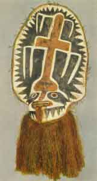

  
[Intangible Textual Heritage](../../index)  [Pacific](../index) 
[Index](index)  [Previous](om10)  [Next](om12) 

------------------------------------------------------------------------

p. 105

# CHAPTER I

### MYTHS OF ORIGINS AND THE DELUGE

APPARENTLY one of the clearest characteristics of the mythology of the
Melanesian area is the almost total lack of myths relating to the origin
of the world. With one or two exceptions, the earth seems to be regarded
as having always existed in very much the same form as today. In the
Admiralty Islands [1](om32.htm#fn_311) a
portion of the population believed that once there was nothing but a
wide-spread sea; and one myth states that in this sea swam a great
serpent, [2](om32.htm#fn_312) who, desiring a
place on which he might rest, called out, "Let the reef rise!", and the
reef rose out of the ocean and became dry land. Another version differs
in that a man and a woman, after having floated upon the primeval sea,
climbed upon a piece of driftwood and wondered whether the ocean would
dry up or not. At last the waters wholly retired, and land appeared
covered with hills, but barren and without life; whereupon the two
beings planted trees and created foods of various sorts. In New Britain,
among the coastal tribes of the Gazelle Peninsula, [3](om32.htm#fn_313) we find the familiar story of
the fishing of the land from the bottom of the sea, a task which was
accomplished by the two culture hero brothers, To-Kabinana and
To-Karvuvu, some of whose other deeds will be recounted later. The same
story in slightly greater detail is found also in the southern New
Hebrides. [4](om32.htm#fn_314) This conception
of a primeval sea is found widely in central Polynesia, Micronesia, and
Indonesia, and it is perhaps significant that it apparently occurs in
Melanesia only on its northern margin, where contact with non-Melanesian
peoples would theoretically be expected. A much closer

p. 106

affiliation with Polynesia is shown, however, in another class of
origin-myths to which we may now turn.

If there is little interest in the beginning of the world in the
Melanesian area, the same cannot be said of the origin of mankind, for
on this subject there is considerable and widely variant material. Three
types of myths may be recognized: one, that in which mankind is directly
created by some deity or pre-existing being; second, that in which man
comes into being spontaneously or magically; and, third, that where
mankind descends to earth from the sky-land.

In the Admiralty Islands it is said [5](om32.htm#fn_315) that Manuai was alone and longed
for a wife; so he took his axe, went into the forest, and cut down a
tree, and after he had fashioned the trunk into the figure of a woman,
he said, "My wood there, become a woman!", and the image came to life.
In the Banks Islands a somewhat more elaborate tale is told. [6](om32.htm#fn_316) Qat was the first to make man,
cutting wood out of the *dracaena*-tree and forming it into six figures,
three men and three women. When he had finished them, he hid them away
for three days, after which he brought them forth and set them up.
Dancing in front of them and seeing that they began to move, he beat the
drum before them, and they moved still more, and "thus he beguiled them
into life, so that they could stand of themselves." Then he divided them
into three pairs as man and wife. Now Marawa, who was a malicious,
envious fellow, saw what Qat had made and determined to do likewise. So
he took wood of another sort, and when he had fashioned the images, he
set them up and beat the drum before them, and gave them life as Qat had
done. But when he saw them move, he dug a pit and covered the bottom
with coco-nut fronds, burying his men and women in it for seven days;
and when he dug them up again, he found them lifeless and decomposed,
this being the origin of death among men. [7](om32.htm#fn_317) According to another version
from this same area, [8](om32.htm#fn_318) while
the first man was made of red clay by Qat, he created the first woman of
rods and rings of

p. 107

supple twigs covered with the spathes of sago palms, just as they make
the tall hats which are used in the sacred dances.

A tale of the creation of man from earth is told in the New
Hebrides. [9](om32.htm#fn_319) "Takaro made
from mud ten figures of men. When they were finished, he breathed upon
them, breathed upon their eyes, their ears, their mouths, their hands,
their feet, and thus the images became alive. But all the people he had
made were men and Takaro was not satisfied, so he told them to light a
fire and cook some food. When they had done so, he ordered them to stand
still and he threw at one of them a fruit, and lo! one of the men was
changed into a woman. Then Takaro ordered the woman to go and stay by
herself in the house. After a while, he sent one of the nine men to her
to ask for fire, and she greeted him as her elder brother. A second was
sent to ask for water, and she greeted him as her younger brother. And
so one after another, she greeted them as relatives, all but the last,
and him she called her husband. So Takaro said to him, 'Take her as your
wife, and you two shall live together.'" A still different version is
that from New Britain. [10](om32.htm#fn_320) In
the beginning a being drew two figures of men upon the ground, and then,
cutting himself with a knife, he sprinkled the two drawings with his
blood and covered them over with leaves, the result being that they came
to life as To-Kabinana and To-Karvuvu. The former then climbed a
coco-nut-tree which bore light yellow nuts, and picking two unripe ones,
he threw them to the ground, where they burst and changed into two
women, whom he took as his wives. His brother asked him how he had come
to be possessed of the two women, and To-Kabinana told him. Accordingly,
To-Karvuvu also climbed a tree and likewise threw down two nuts, but
they fell so that their under side struck the ground, and from them came
two women with depressed, ugly noses. So To-Karvuvu was jealous because
his brother's wives were better looking than his, and he took one of
To-Kabinana's spouses, abandoning the two ugly females who were his own.

p. 108

\[paragraph continues\] Another version [11](om32.htm#fn_321) from the same region brings out
more clearly the distinction between the characters of the two brothers
and serves, moreover, to account for the two marriage classes into which
the people are divided. To-Kabinana said to To-Karvuvu, "Do you get two
light-coloured coco-nuts. One of them you must hide, then bring the
other to me." To-Karvuvu, however, did not obey, but got one light and
one dark nut, and having hidden the latter, he brought the
light-coloured one to his brother, who tied it to the stern of his
canoe, and seating himself in the bow, paddled out to sea. He paid no
attention to the noise that the nut made as it struck against the sides
of his canoe nor did he look around. Soon the coco-nut turned into a
handsome woman, who sat on the stern of the canoe and steered, while
To-Kabinana paddled. When he came back to land, his brother was
enamoured of the woman and wished to take her as his wife, but
To-Kabinana refused his request and said that they would now make
another woman. Accordingly, To-Karvuvu brought the other coco-nut, but
when his brother saw that it was dark-coloured, he upbraided To-Karvuvu
and said: "You are indeed a stupid fellow. You have brought misery upon
our mortal race. From now on, we shall be divided into two classes, into
you and us." Then they tied the coco-nut to the stern of the canoe, and
paddling away as before, the nut turned into a black-skinned woman; but
when they had returned to shore, To-Kabinana said: "Alas, you have only
ruined our mortal race. If all of us were only light of skin, we should
not die. Now, however, this dark-skinned woman will produce one group,
and the light-skinned woman another, and the light-skinned men shall
marry the dark-skinned women, and the dark-skinned men shall marry the
light-skinned women." And so To-Kabinana divided mankind into two
classes.

Turning now to the second type of tales of the origin of mankind, the
belief in a direct or indirect origin from birds may first be
considered. In the Admiralty Islands, according to

p. 109

one version, [12](om32.htm#fn_322) a dove bore
two young, one of which was a bird and one a man, who became the
ancestor of the human race by incestuous union with his mother. Another
recension [13](om32.htm#fn_323) has it that a
tortoise laid ten eggs from which were hatched eight tortoises and two
human beings, one man and one woman; and these two, marrying, became the
ancestors of both light-skinned and dark-skinned people. At the other
extremity of Melanesia, in Fiji, [14](om32.htm#fn_324) it is said that a bird laid two
eggs which were hatched by Ndengei, the great serpent, a boy coming from
one and a girl from the other. A variant of this is found in Torres
Straits where, according to the Eastern Islanders, a bird having laid an
egg, a maggot or worm was developed from it, which then was transformed
into human shape. [15](om32.htm#fn_325)

Myths of the origin of men or of deities from a clot of blood are of
interest in their relation to other areas in Oceania. One version again
comes from the Admiralty Islands. [16](om32.htm#fn_326) A woman, named Hi-asa, who
lived alone, one day cut her finger while shaving *pandanus* strips.
Collecting the blood from the wound in a mussel-shell, she put a cover
over it and set it away; but when, after eleven days, she looked in the
shell, it contained two eggs. She covered them up, and after several
days they burst, one producing a man and the other a woman, who became
the parents of the human race. [17](om32.htm#fn_327) In the neighbouring island of
New Britain [18](om32.htm#fn_328) one account
gives a similar origin for the two brothers To-Kabinana and To-Karvuvu.
While an old woman was wading in the sea searching for shellfish, her
arms pained her, and so, taking two sharp strips of Pandanus, she
scratched and cut first one arm and then the other. [19](om32.htm#fn_329) The two strips of pandanus,
thus covered with her blood, she laid away in a heap of refuse which she
intended to burn; but after a time the pile began to swell, and when she
was about to set fire to it, she saw that two boys had grown from her
blood--from the blood of her right arm, To-Kabinana, and from that of
her left arm, To-Karvuvu. [20](om32.htm#fn_330)
At several Points in German New Guinea [21](om32.htm#fn_331) we find similar tales of
children

p. 110

originating from clots of blood, although here, we must note, they are
not considered as the parents of mankind.

An origin of the human race from plants seems definitely stated only in
the Solomon Islands, [22](om32.htm#fn_332)
where it is said that two knots began to sprout on a stalk of
sugar-cane, and when the cane below each sprout burst, from one issued a
man and from the other a woman, these becoming the parents of
mankind. [23](om32.htm#fn_333) With this we may
compare the tales from New Britain. [24](om32.htm#fn_334) Two men (sometimes described as
To-Kabinana and To-Karvuvu) were fishing at night, and while they were
so engaged a piece of wild sugar-cane floated into the net, where it
became entangled. Disengaging it, they threw it away, but again it was
enmeshed and was once more discarded. When, however, it was caught for
the third time, they determined to plant it, and did so. Taking root,
the cane grew, and after a time it began to swell, until one day, while
the two men were absent at work, the stalk burst and from it came out a
woman who cooked food for the men and then returned to her hiding-place.
The two came back from their work and were much surprised to find their
food ready for them; [25](om32.htm#fn_335) but
since the same thing occurred the next day, on the following morning
they hid themselves to see who it was that had prepared their food.
After a time the stalk opened and the woman came out, whereupon they
immediately seized her and held her fast. In some versions, the woman
then became the wife of one of the men, and all mankind are supposed to
be descended from the pair. An origin of the first woman from a tree and
of the first man from the ground is given by the Papuan tribes of Elema
in British New Guinea; [26](om32.htm#fn_336)
while in the New Hebrides [27](om32.htm#fn_337)
the first female being is said to have sprung from a cowrie-shell which
turned into a woman.

An origin of man from stone is told by the Baining of New Britain. [28](om32.htm#fn_338) At first the only beings in the
world were the sun and the moon, but they married, and from their union
were born stones and birds, the former subsequently turning into

p. 111

men, the latter into women, and from these the Baining are descended.
The origin of Qat himself is ascribed in the Banks Group [29](om32.htm#fn_339) to a stone, which in the
beginning burst asunder and gave birth to the culture hero--a concept
which recalls the tales of the source of the first supernatural beings
in Tonga, Celebes) and the Union and Gilbert Groups. The third type of
myths of the beginning of mankind has thus far been reported apparently
only from one portion of German New Guinea. [30](om32.htm#fn_340)

Although Melanesia seems characteristically to lack myths of the origin
of the world, a tale recounting, the source of the sea is quite widely
spread. As told by the Baining in New Britain, [31](om32.htm#fn_341) the story runs as follows. In
the beginning the sea was very small--only a tiny water-hole, belonging
to an old woman and from which she got the salt water for the flavouring
of her food. She kept the hole concealed under a cover of *tapa* cloth,
and though her two sons repeatedly asked her whence she obtained the
salt water, she refused to answer. So they determined to watch and
eventually surprised her in the act of lifting the cover and dipping up
the salt water. When she had gone they went to the spot and tore the
cover open; and the farther they tore, the larger became the waterhole.
Terrified by this, they ran away, each carrying a corner of the cloth;
and thus the water spread and spread until it became the sea, which rose
so that only a few rocks, covered with earth, remained above it. When
the old woman saw that the sea constantly grew larger, she feared that
the entire world would be covered by it, so she hastily planted some
twigs along the edge of the shore, thus preventing the ocean from
destroying all things. [32](om32.htm#fn_342)

Of the origin of the sun and moon various tales are told. In the
Admiralty Islands it is said [33](om32.htm#fn_343) that when the sea had dried so
that man appeared, the first two beings, after planting trees and
creating food plants, made two mushrooms, one of which the man threw
into the sky, creating the moon, while

p. 112

the woman tossed the other upward and formed the sun. A different
account is given by the people of southern British New Guinea. [34](om32.htm#fn_344) According to this, a man was
digging a deep hole one day when he uncovered the moon as a small bright
object. After he had taken it out, it began to grow, and finally,
escaping from his hands, rose high into the sky. Had the moon been left
in the ground until it was born naturally, it would have given a
brighter light; but since it was taken out prematurely, it sheds only
feeble rays. With this we may compare a tale from German New
Guinea [35](om32.htm#fn_345) which recounts how
the moon was originally kept hidden in a jar by an old woman. Some boys
discovered this, and coming secretly, opened the jar, whereupon the moon
flew out; and though they tried to hold it, it slipped from their grasp
and rose into the sky, bearing the marks of their hands on its surface.
The people of Woodlark Island have another tale in which the origin of
the sun and moon is connected with the origin of fire. According to
this, [36](om32.htm#fn_346) in the beginning an
old woman was the sole owner of fire, and she alone could eat cooked
food, while other people must devour theirs raw. Her son said to her:
"You are cruel. You see that the taro takes the skin off our throats,
yet you do not give us fire with which to cook it"; but since she proved
obdurate, he stole some of the flame and gave it to the rest of mankind.
In anger at his action, the old woman seized what was left of her fire,
divided it into two parts, and threw them into the sky, [37](om32.htm#fn_347) the larger portion thus
becoming the sun, and the smaller the moon.

In all of these myths the sun and moon seem to be regarded as inanimate
objects, or at least as such in origin. Another group of tales, however,
considers them to be living beings. As an example we may take the
version given by one of the tribes of the Massim district of British New
Guinea. [38](om32.htm#fn_348) One day a woman
who was watching her garden close to the ocean, seeing a great fish
sporting in the surf, walked out into the water and played with the
fish, continuing to do this for several

p. 113

days. By and by the woman's leg, against which the fish had rubbed,
began to swell and became painful until at last she got her father to
make a cut in the swelling, when out popped an infant. [39](om32.htm#fn_349) The boy, who was named
Dudugera, grew up among the other children of the village until one day,
in playing a game, he threw his dart at the other children rather than
at the mark, whereupon they became angry and abused him, taunting him
with his parentage. [40](om32.htm#fn_350)
Fearing lest the others might really harm him, Dudugera's mother
determined to send him to his father; so she took the boy to the beach,
whereupon the great fish came, seized him in his mouth, and carried him
far away to the east. Before he left, Dudugera warned his mother and
relatives to take refuge under a great rock, for soon, he said, he would
climb into a *pandanus*-tree and thence into the sky, and, as the sun,
would destroy all things with his heat. [41](om32.htm#fn_351) So indeed it came to pass, for
excepting his mother and her relatives, who heeded Dudugera's advice,
nearly everything perished. To prevent their total annihilation his
mother took a lime-calabash, and climbing upon a hill near which the sun
rose, cast the lime into his face as he came up, which caused the sun to
shut his eyes and thus to decrease the amount of heat. [42](om32.htm#fn_352)

The concept that originally there was no night is rather characteristic
of Melanesian mythology: day was perpetual and night was discovered or
brought to mankind. In the Banks Islands, after Qat had formed men,
pigs, trees, and rocks be still did not know how to make night, for
daylight was continuous. His brothers said to him, "This is not at all
pleasant. Here is nothing but day. Can't you do something for us?" Now
Qat heard that at Vava in the Torres Islands there was night, so he took
a pig, and went to Vava, where he bought night from I-Qong, Night, who
lived there. Other accounts say that Qat sailed to the edge of the sky
to buy night from Night, who blackened his eyebrows, showed him sleep
and taught him how to make the dawn. Qat returned to his brothers,

p. 114

bringing a fowl and other birds to give notice of the dawn. He begged
his brothers to prepare beds of coco-nut fronds. Then for the first
time, they saw the sun sinking in the west, and they cried out to Qat
that it was crawling away. "'It will soon be gone,' said he, 'and if you
see a change on the face of the earth, that is night.' Then he let go
the night. 'What is this coming out of the sea,' they cried, 'and
covering the sky?' 'That is night,' said he, 'sit down on both sides of
the house, and when you feel something in your eyes, lie down and be
quiet.' Presently it was dark, and their eyes began to blink. 'Qat! Qat!
what is this? Shall we die?' 'Shut your eyes,' said he, 'that is it, go
to sleep.' When night had lasted long enough the cock began to crow and
the birds to twitter; Qat took a piece of red obsidian and cut the night
with it; the light over which the night had spread itself shone forth
again, and Qat's brothers awoke. [43](om32.htm#fn_353)

Myths of the origin of fire present a number of interesting types in the
Melanesian area. We may begin with the form widely current in British
New Guinea. According to a version told by the Motu, [44](om32.htm#fn_354) the ancestors of the present
people had no fire, and ate their food raw or cooked it in the sun until
one day they perceived smoke rising out at sea. A dog, a snake, a
bandicoot, a bird, and a kangaroo all saw this smoke and asked, "Who
will go to get fire?" First the snake said that he would make the
attempt, but the sea was too rough, and he was compelled to come back.
Then the bandicoot went, but he, too, had to return. One after another,
all tried but the dog, and all were unsuccessful. Then the dog started
and swam and swam until he reached the island whence the smoke rose.
There he saw women cooking with fire, and seizing a blazing brand, he
ran to the shore and swam safely back with it to the mainland, where he
gave it to all the people. [45](om32.htm#fn_355)

Some of the Massim tribes of eastern British New Guinea [46](om32.htm#fn_356) give quite a different origin,
according to which people had no fire in the beginning, but simply
warmed and dried their

p. 115

food in the sun. There was, however, a certain old woman called Goga who
thus prepared food for ten of the youths, but for herself she cooked
food with fire, which she obtained from her own body. [47](om32.htm#fn_357) Before the boys came home each
day, she cleared away all traces of the fire and every scrap of cooked
food that they should not know her secret; but one day a piece of boiled
taro accidentally got among the lads' food, and when the youngest ate
it, he found it much better than what was usually given him. The youths
resolved to discover the secret, so the next day, when they went to
hunt, the youngest hid at home and saw the old woman take the fire from
her body and cook with it. After his companions had returned, he told
them what he had seen, and they determined to steal some of the fire.
Accordingly, on the following day they cut down a huge tree, over which
all tried to jump, but only the youngest succeeded, so they selected him
to steal the fire. He waited until the others had gone, and then
creeping back to the house, he seized the firebrand when the old woman
was not looking, and ran off with it. The old woman chased him, but he
jumped over the tree, which she was unable to do. As he ran on, however,
the brand burned his hand, and he dropped it in the dry grass, which
caught the blaze and set fire to a pandanus-tree which was near. Now, in
a hole in this tree, lived a snake, whose tail caught fire and burned
like a torch. The old woman, finding that she could not overtake the
thief, caused a great rain to fall, hoping thus to quench the
fire, [48](om32.htm#fn_358) but the snake
stayed in his hole, and his tail was not extinguished. When the rain had
stopped, the boys went out to look for fire, but found none, because the
rain had put it all out; but at last they saw the hole in the tree,
pulled out the snake, and broke off its tail, which was still alight.
Then making a great pile of wood, they set fire to it, and people from
all the villages came and got flame, which they took home with them.
"Different folk used different kinds of wood for their firebrands and
the trees from which they took their brands

p. 116

became their *pitani* (totems)." A snake in this tale plays the part of
the saviour of fire; but in other forms of the myth the is the real
source or bringer of flame. A version from the Admiralty Islands [49](om32.htm#fn_359) runs as follows: The daughter
of Ulimgau went into the forest. The serpent saw her, and said, "Come!"
and the woman replied, "Who would have you for a husband? You are a
serpent. I will not marry you." But he replied, "My body is indeed that
of a serpent, but my speech is that of a man. Come!" And the woman went
and married him, and after a time she bore a boy and a girl, and her
serpent husband put her away, and said, "Go, I will take care of them
and give them food." And the serpent fed the children and they grew. And
one day they were hungry, and the serpent said to them, "Do you go and
catch fish." And they caught fish and brought them to their father. And
he said, "Cook the fish." And they replied, "The sun has not yet risen."
By and by the sun rose and warmed the fish with its rays, and they ate
the food still raw and bloody. Then the serpent said to them, "You two
are spirits, for you eat your food raw. Perhaps you will eat me. You,
girl, stay; and you, boy, crawl into my belly." And the boy was afraid
and said, "What shall I do?" But his father said to him, "Go," and he
crept into the serpent's belly. And the serpent said to him, "Take the
fire and bring it out to your sister. Come out and gather coco-nuts and
yams and -taro and bananas." So the boy crept out again, bringing the
fire from the belly of the serpent. And then having brought the food,
the boy and girl lit a fire with the brand which the boy had secured and
cooked the food. And when they had eaten, the serpent said to them, "Is
my kind of food or your kind of food the better?" And they answered,
"Your food is good, ours is bad." [50](om32.htm#fn_360)

Similar to this in that the igneous element was obtained from snakes,
but on the other hand suggesting affinities with the fire-quest of the
Polynesian Maui, is a myth current in New Britain. [51](om32.htm#fn_361) There was once a time when the
Sulka were

 

 

Plate XIII

Mask worn in dances in which the participants represent ghosts and
sprits. The mask is made of a light bamboo frame, covered with *tapa*,
or beaten bark-cloth. The fringe covers the wearer down to the ankles.
Elema tribe, Gulf of Papua, New Guinea. Peabody Museum, Cambridge,
Massachusetts.

 

ignorant of fire; but one day a man named Emakong lost one of his
ornaments, which fell into a stream. Taking off his loincloth, he jumped
in and dove to recover the lost object, but was amazed, on reaching the
bottom, to find himself in the yard of a house.. Many people came up and
asked him his name, and when he replied that he was called Emakong, one
of them said, "Oh, that is also my name," whereupon he took the
bewildered man to his house and gave him a new loin-cloth. Great was
Emakong's astonishment to see a fire in the house. At first he was
afraid of it, but after he had been given cooked food and had found this
much better than the raw viands which he had always eaten before, he
lost his fear of the new thing. When it became night, the crickets began
to sing and this also alarmed him, for in the world above there was no
night, and crickets were unknown. His terror became still greater,
however, when the heard resounding claps of thunder from every side and
saw all the people turn into snakes in order to sleep. His namesake
reassured him, however, and said that he need not fear, for this was
their custom, and that when day should come again, all would return to
their human form. Then, with a loud report, he also changed into a
snake, and Emakong alone retained the shape of man. In the morning, when
the birds sang to announce the coming day, he awoke, and with a crash
all the serpents again turned into men. His namesake now did up a
package for him, containing night, some fire, some crickets, and the
birds that sing at dawn, and with this Imakong left, rising through the
water. On reaching the shore, he threw the fire into dry grass, but when
the people saw the blaze and heard the crackling of the flame, they were
greatly alarmed and all fled. Emakong, however, ran after them and
telling them of his adventures, explained to them the use of the things
that he had brought.

Although not cosmogonic in the stricter sense of the term, we may
conveniently include here the myths given to account for the origin of
death. According to the version current in

p. 118

\[paragraph continues\] Ambrym, [52](om32.htm#fn_362) the good and the malicious
deities were discussing man after he had been made. The former said:
"Our men seem to get on well, but haven't you noticed that their skins
have begun to wrinkle? They are yet young, but when they are old, they
will be very ugly. So when that happens, we will flay them like an eel,
and a new skin will grow, and thus men shall renew their youth like the
snakes and so be immortal." But the evil deity replied: "No, it shall
not be that way. When a man is old and ugly, we will dig a hole in the
ground and put the body in it, and thus it shall always be among his
descendants." And because the one who has the last word prevails, death
came into the world. [53](om32.htm#fn_363)

With this we may compare another form of myth as told in the Banks
Islands, [54](om32.htm#fn_364) according to
which, in the beginning men did not die, but cast their skins like
snakes and crabs, and thus renewed their youth. One day an old woman
went to a stream to change her skin and threw the old one into the water
where, as it floated away, it caught upon a stick. When she went home,
her child refused to recognize her in her new and youthful form, and to
pacify the infant, who cried without ceasing, she returned and got her
old skin, and put it on again. From that time men have ceased to cast
their skins and have died when they grew old.

According to other tales, death was due to a mistake. Thus in the Banks
Islands it is said [55](om32.htm#fn_365) that
in the beginning men lived forever, casting their skins, and that the
permanence of property in the same hands led to much trouble. Qat,
therefore, summoned a man called Mate ("Death") and laid him on a board
and covered him over; after which he killed a pig and divided Mate's
property among his descendants, all of whom came and ate of the funeral
feast. On the fifth day, when the conch-shells were blown to drive away
the ghost, Qat removed the covering, and Mate was gone; only his bones
were left. Meanwhile Qat had sent Tagaro the Foolish to watch the way to
Panoi, where the paths to the underworld and the upper

p. 119

regions divide, to see that Mate did not go below; but the Fool sat
before the way of the world above so that Mate descended to the lower
realms; and ever since that time all men have followed Mate along the
path he took.

Still another explanation is that death was due to disobedience. Thus
the Baining in New Britain say [56](om32.htm#fn_366) that one day the sun called all
things together and asked which wished to live forever. All came except
man; so the stones and the snakes live forever, but man must die. Had
man obeyed the sun, he would have been able to change his skin from time
to time like the snake, and so would have acquired immortality.

As a last example of this class of myths we may take one which
attributes the origin of death to ingratitude. In the Admiralty Group
one account [57](om32.htm#fn_367) states that a
man once went out fishing; but since an evil spirit wished to kill and
eat him, he fled into the forest. There he caused a tree to open, and
creeping inside, the tree closed again, so that when the evil being
came, he did not see his victim and went away, whereupon the tree
opened, and the man came out. The tree said to him, "Bring to me two
white pigs," so the man went to his village and got two pigs, but he
cheated the tree in that he brought only a single white one, the other
being black whitened with chalk. For this the tree rebuked him and said:
"You are unthankful, though I was good to you. If you had done what I
had asked, you might have taken refuge in me whenever danger threatened.
Now you cannot, but must die." So, as a result of this man's
ingratitude, the human race is doomed to mortality and cannot escape the
enmity of evil spirits.

Of deluge-myths from the Melanesian area, only a few have been reported
which do not bear the marks of missionary influence. As told in British
New Guinea, [58](om32.htm#fn_368) the story
runs that once a great flood occurred, and the sea rose and overflowed
the earth, the hills being covered, and people and animals hurrying to
the top of Tauaga, the highest mountain. But the sea

p. 120

followed and all were afraid. Yet the king of the snakes, Raudalo, did
not fear. "At last he said to his servants, 'Where now are the waters?'
And they answered, 'They are rising, lord.' Yet looked he not upon the
flood. And after a space he said again, 'Where now are the waters?' and
his servants answered as they had done before. And again he inquired of
them, 'Where now are the waters?' But this time all the snakes, Titiko,
Dubo and Anaur, made answer, 'They are here, and in a moment they will
touch thee, lord.'

"Then Raudalo turned him about, and put forth his forked tongue, and
touched with the tip of it the angry waters which were about to cover
him. And on a sudden the sea rose no more, but began to flow down the
side of the mountain. Still was Raudalo not content, and he pursued the
flood down the hill, ever and anon putting forth his forked tongue that
there might be no tarrying on the way. Thus went they down the mountain
and over the plain country until the sea shore was reached. And the
waters lay in their bed once more and the flood was stayed."

Another tale [59](om32.htm#fn_369) from this
same region presents features of interest. One day a man discovered a
lake in which were many fish; and at the bottom of the lake lived a
magic eel, but the man knew it not. He caught many fish and returned the
next day with the people of his village whom he had told of his
discovery; and they also were very successful, while one woman even laid
hold of the great eel, Abaia, who dwelt in the depths of the lake,
though he escaped her. Now Abaia was angry that his fish had been caught
and that he himself had been seized, so he caused a great rain to fall
that night, and the waters of the lake also rose, and all the people
were drowned except an old woman who had not eaten of the fish and who
saved herself in a tree. [60](om32.htm#fn_370)
The association of snakes and eels with the deluge in these tales
strongly suggests the type of deluge-myth current in parts of
Indonesia, [61](om32.htm#fn_371), and known
also apparently in the Cook Group. [62](om32.htm#fn_372)

p. 121

From the examples given it may be seen that the origin-myths of
Melanesia show clear evidence of composite origins. From small groups
like the Admiralty Islands several quite different legends accounting
for the same thing have been collected, and throughout the whole area a
striking variety exists. in how far we are justified in attributing one
set of myths to the older Papuan stratum and another to the later
Melanesian layer is very difficult to say, since but little from the
purer Papuan tribes of the area has as yet been recorded. Comparison
with Polynesia and Indonesia suggests that the myths of the origin of
the sea, of mankind as originally having had the power to renew their
youth by changing skins, and of the obtaining of fire from or with the
aid of snakes, were primarily Papuan, for no traces of either appear in
Indonesia, and only the former is found in somewhat mutilated form in
Samoa, but nowhere else in Polynesia. Other themes, however, such as the
origin of human beings from eggs or from a clot of blood, are widely
known in Indonesia and also occur in western and south-western
Polynesia, and would seem to be immigrant elements from the great
culture stream which, passing from Indonesia eastward into the Pacific,
swept with greatest strength the north-eastern and south-eastern parts
of Melanesia.

------------------------------------------------------------------------

[Next: Chapter II. Culture Hero Tales](om12)
