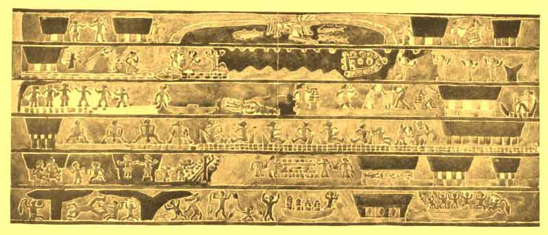
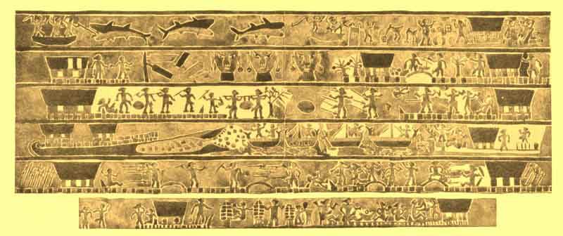

  
[Intangible Textual Heritage](../../index)  [Pacific](../index) 
[Index](index)  [Previous](om20)  [Next](om22) 

------------------------------------------------------------------------

p. 248

# CHAPTER I

### MYTHS OF ORIGINS AND THE DELUGE

DETAILED myths of creation or origin are largely lacking from the
Micronesian area, and the fragmentary cosmogonic material varies widely.
The belief that this world and the sky-world have always existed,
together with an apparent lack of interest in their origin, seems
characteristic of the Pelew Group [1](om38.htm#fn_679) and the western Carolines; [2](om38.htm#fn_680) although in the latter islands,
at least, the original earth is modified and made habitable. According
to this account, Ligobund, a female deity, descended from the upper
realm to the earth, but finding this a desert and infertile, she caused
plants and fruit-trees to grow, accomplishing it by the power of her
mere command. From the central Carolines [3](om38.htm#fn_681) the material is not much fuller.
Here there was in the beginning a deity, Lukelang, who first created the
heavens and then the earth; but since the latter was bare and desert, he
took trees and plants from heaven and set them in the world which he had
made. In the Gilbert Group [4](om38.htm#fn_682)
we are told only that Nareau and his daughter, Kobine, made heaven and
earth.

The conception of an original sea, on which a deity floated in the
beginning, [5](om38.htm#fn_683) seems
characteristic of the Marshall Group or at least of that portion of it
which is comprised in the Ralick Chain. [6](om38.htm#fn_684) At the very first there was only
the sea, which was limited to the south by a low, far-reaching reef and
to the north by a swamp. A being named Loa said to the sea, "Behold thy
island reef," and a reef appeared; and again he spoke, "See thy sand,"
and the reef was covered with soil. Once more he said, "See thy plants,"
and the earth was covered

p. 249

with living things; and when for the fourth time he spoke, "See thy
birds," birds appeared. Then one of them, a gull, flew up and stretched
out the arching sky as a spider spins her web. That this idea of an
original sea was not foreign to the Carolines seems to be shown by a
myth reported from Yap, [7](om38.htm#fn_685)
according to which in the beginning a great tree grew upside down, its
roots being in the sky, and its branches touching the sea. In the boughs
of this tree was born a woman to whom Yelafaz, a sky-deity, gave sand
which she strewed upon the sea and thus formed the earth. Although the
tale includes a jumble of ideas derived from missionary contact, these
features of the tree and of the strewing of the sand upon the primeval
sea are probably aboriginal, for the former is known also in
Borneo, [8](om38.htm#fn_686) and the latter
occurs widely throughout Indonesia. [9](om38.htm#fn_687)

The fullest and most interesting creation-myth comes from the little
island of Nauru (Pleasant Island), which lies almost exactly on the
Equator, just west of the Gilbert Group. According to this tale, [10](om38.htm#fn_688) in the beginning there were
only the sea and Areop-Enap, "Ancient Spider," who floated above in
endless space. One day Ancient Spider found a great rounded object, a
tridacna mussel, and taking it in his hands, he looked at it from all
sides, for he wanted to know if there was not an opening in it, so that
he might crawl within; but there was none. Thereupon he struck the great
shell, and as it sounded hollow, he concluded that there was nothing in
it after all. He tried in vain to open his treasure, and at last,
repeating a charm and making another attempt, he succeeded in prying the
mighty valves slightly apart. At once he crept inside, but could see
nothing for it was dark there because sun and moon were not yet made;
moreover, he could not stand upright, since the space within the shell
was too small. Ancient Spider sought everywhere on the chance that he
might find something, and at last discovered a snail. Putting this under
his arm, he lay down and slept for three days that he might give power

p. 250

to the snail; then he laid it aside and sought again, his search being
rewarded by another larger snail, which he treated like the first. After
this, taking the smaller one, he said to it, "Can you lift the roof a
little, so that we might sit up?" The snail replied, "Yes," and raised
the shell slightly; whereupon Ancient Spider took the snail, set it
before the western half of the tridacna shell, and made it into the
moon. There was now a little light, and by it Ancient Spider saw a large
worm or grub, who, when asked if he could raise the roof still higher,
suddenly came to life and said, "Yes." So he laboured, and the upper
shell of the tridacna slowly rose higher and higher, while salty sweat
ran from the worm's body, and collecting in the lower shell, became the
sea. [11](om38.htm#fn_689) At last he raised
the upper shell very high, and it became the sky; but Rigi, the worm,
exhausted by his great work, fell and died. From the other snail Ancient
Spider now made the sun and set it on the east side of the lower shell,
which became the earth.

Another version, [12](om38.htm#fn_690)
admittedly less original, presents interesting similarities to
Polynesian and Indonesian tales. According to this, the great primeval
divinity was Tabuerik, the deity of lightning and thunder, who, in the
form of an omnipotent bird, soared in the beginning over chaos, [13](om38.htm#fn_691) for the heavens still lay prone
upon the earth and sea. [14](om38.htm#fn_692)
Then Rigi, a butterfly, flew over land and water and separated them, and
other deities thrust the skies up to their proper place. A further
possible element of Polynesian type is the fact that in the larger group
the first beings were two worms, one of whom (a female) was named Lajnan
("Cliff" or "Rock"). [15](om38.htm#fn_693)

The myths relating to the origin of man are as varied as those just
considered. Several tales accord a divine origin to mankind. In the
western Carolines [16](om38.htm#fn_694) it is
said that Ligobund descended from the sky to the earth, and after making
this habitable, gave birth to three children who became the ancestors of
mankind. Somewhat more detailed accounts come from the central portion
of the group. [17](om38.htm#fn_695) After Luk
had created

 

 

PLATE XXI

A AND B

Portion of the carved and painted decoration on the beams of a
priest-king's house in the Pelew Islands. The scenes represent episodes
in myth and legend, but the particular story to which this series
relates is not known. After Meyer, *Bilderschriften des ostindischen
Archipels und der Südsee*, i, Plate III.

p. 251

the earth and planted it, he sent down his daughter, Ligoapup, who,
becoming thirsty, drank some water which had collected in the hollow of
a tree. Without knowing it, with the water she swallowed a tiny animal,
and made fruitful by this, she bore a girl-child. She, when she had
reached maturity, became the mother of a daughter, who in her turn gave
birth to a boy; and from a rib taken from this boy, after he had grown,
a man was derived, who married Ligoapup and became the ancestor of the
human race. The incident of the rib is probably an element derived from
missionary teaching and well illustrates how such exotic features may be
incorporated into native tales; but it becomes especially interesting
when taken in connexion with some of the other myths which, though
wholly native, ascribe somewhat similar origins to man or deities.

Thus, in the neighbouring island of Mortlok it is said [18](om38.htm#fn_696) that Ligoapup, after drinking
the water from the hollow in the tree, bore a girl-child, and that then
from her arm was born a boy, and from one eye another boy, from the
other eye a second girl. From these the human race is descended. With
this we may compare the origin ascribed to several living beings in the
western Carolines, [19](om38.htm#fn_697) the
Marshall Group, [20](om38.htm#fn_698) and
Nauru, [21](om38.htm#fn_699) these being born
or bursting forth from blood-blisters or boils on the bodies of one of
the deities. [22](om38.htm#fn_700)

In Indonesia [23](om38.htm#fn_701) the belief
in the origin or birth of certain of the deities from a rock was well
developed in some instances; and it is interesting (and perhaps
significant) to find the same concept in the Micronesian area as well,
where, in the Gilbert Group, it is said that in the beginning Na Rena or
Rigi came out of a rock. [24](om38.htm#fn_702)
It is likewise to be noted that in the Marshall Group [25](om38.htm#fn_703) we find the theme of Blood-Clot
Child again, an origin from a clot of blood being given in the Ralick
Chain for two of the deities.

A divine source for the human race is, however, not the only belief
which is held, for it is widely asserted that the first ancestors of
mankind were made. In the Pelew Group we merely

p. 252

find the statement [26](om38.htm#fn_704) that
the two original deities created the first human beings, the male god
making the first man and the female divinity shaping the first woman. In
the Gilbert Group, at the other extremity of Micronesia, Nareua was
said [27](om38.htm#fn_705) to have set fire to
a tree, and mankind originated from the sparks and ashes, which were
carried in all directions. In Nauru [28](om38.htm#fn_706) Ancient Spider turned stones
into men; but these became the supporters of the heavens and were not
ordinary human beings. Indeed, no clear statement of the source of
mankind appears to be given in this group; some of the deities, even,
have no origin ascribed to them. Thus, Ancient Spider set out, after the
world was created, to see if there were any other beings beside himself,
and he came to a land where he found men and women sitting on the shore
in the shade of the trees. Since he could not discern their faces
clearly and wanted to know their names, he made, from the dirt under his
finger-nail, a being, gave it wings, and told it to fly to the people
and find out what they were called. So the bird-like being flew and
settled upon the nose of one of the people. Another, seeing this, called
out, "Tabuerik! kill it." Thereupon the bird flew to the others, and
each time he thus learned the person's name, until he had got them all.
Then he returned to Ancient Spider and told him the names.

Throughout Micronesia mankind is believed to have been originally
immortal, or intended to be so, and to have become mortal as a result of
special causes. Thus in the Pelew Group [29](om38.htm#fn_707) Obagat wished that men should
not die, and for this reason desired to place a stone in their breasts
that they might be as lasting and as strong as the stone and not require
food; but the Rail was opposed to this view and advised that only breath
be put in man's bosom so that he might be, subject to disease and death.
Obagat, however, unwilling to despair, sent his son to get the water of
life to assure immortality to man; but when the liquid was brought in a
taro leaf, the

p. 253

malicious bird caused a branch of a tree to strike and tear it so that
the precious fluid was spilled upon the tree, which thus acquired long
life and immortality, while man remained mortal.

In the central Carolines [30](om38.htm#fn_708)
mortality was decreed for man by Olofat. Luk, the highest deity, asked,
"How shall it be with men? Shall they fall ill and die, and then live
again?" But Olofat answered, "When men die, they shall remain dead." In
the western Carolines a different tale is told. [31](om38.htm#fn_709) In the beginning a woman named
Mili'ar had two children, and when she grew old, she said to them,
"After I am dead, you must bury me; but on the seventh day come and dig
up my body. Thus I shall be alive once more, and beautiful and young
again." Soon afterward, the old woman died as she had foretold and was
duly buried; but when the son and daughter came away from the grave
together, they saw a fine pandanus-tree and stopped to eat its fruit.
Here they lingered for several days enjoying themselves, and only too
late did they awake to the fact that the seven days had passed and that
they had not fulfilled their promise. They hurried to their mother's
grave, but found that she had died a second time, and thus, because of
their delay and forgetfulness, all men thereafter were mortal. Although
the story embodies one or two details suggestive of missionary teaching,
it is clearly aboriginal in origin. Another version [32](om38.htm#fn_710) from this same region states
that in the beginning man did not die for ever, but like the moon, rose
again. Each month, when the moon waned and disappeared, men fell into a
short sleep; and when it reappeared, they awoke; but an evil spirit did
not approve of this and so arranged that death was permanent.

Of the origin of the sun and moon several contrasted beliefs are held.
In the Pelews [33](om38.htm#fn_711) the two
original deities were said to have shaped them from stone with an adze
and then to have cast them up into the sky; whereas in the Gilbert
Group [34](om38.htm#fn_712) the sun and moon,
together with the sea, were the offspring of the

p. 254

first two beings created by Na Reau. After he had formed the first pair,
Na Reau departed, saying, "I leave you here so that you may watch over
this land, which is mine. See to it that you do not increase, for I will
not agree to have any children here. If you disobey my commands, I shall
punish you." De-Babou and De-Ai, however, did not heed the words of
their creator, and De-Ai bore three children, the sun, the moon, and the
sea. Informed by the eel, his messenger, that his commands had been
disobeyed, Na Reau took his great club and came to the island where he
had left De-Babou and De-Ai; but in terror they fell down before him,
begging him not to kill them, for, said they, "We find that our children
are a great aid to us, since the sun makes it light, so that we can see;
and when it goes to rest, the moon takes its place; and our third child,
the sea, abounds with fish and supplies us with food." When Na Reau had
heard their plea, he saw that it was just, and forbearing to execute his
intention, he went away.

The source of fire is variously explained. In the Pelew Group [35](om38.htm#fn_713) Obagat, who is here a friendly
deity, seeing an old woman suffering from sores about her mouth, due to
eating raw fish and taro, took pity on mankind and taught them how to
make fire by rubbing two sticks together. In the central Carolines [36](om38.htm#fn_714) Olofat was the owner or lord of
fire, which he sent down to earth by the aid of a bird, who took the
flame in its beak, and flying from tree to tree, put the seed of fire
into them in order that men might extract it by rubbing sticks
together. [37](om38.htm#fn_715)

In Nauru two tales relating to fire are told. According to one of
them [38](om38.htm#fn_716) the retreating tide
once left two fishes imprisoned in a tiny pool, but this soon
evaporated, and the fishes perished. From the maggots engendered in the
rotting fish were derived two women, [39](om38.htm#fn_717) one of whom wished, one
evening, to go fishing, but had no fire with which to light her torch.
She sought everywhere, but being unable to find any, she took two sticks
and rubbed them together; and after a while her finger

p. 255

came in contact with the groove which she had made by rubbing and was
burned. Looking into the groove, she saw fire and sang,

"Fire, Fire, whence do you come?  
Fire, Fire, do you come from the nails of my finger?  
Fire, Fire, do you come from the nails of my toes? [40](om38.htm#fn_718)  
Fire, Fire, be warm, become hot, make the sparks glow,  
Very hot, frightfully hot, terribly hot;  
It is called e-kainir."

Then the flame blazed up, and she was able to light her torch; and thus
the Nauru people first got their fire. The other tale is not so much of
the origin of the fire, but it presents features of interest for
comparison. According to this [41](om38.htm#fn_719) Areop-It-Eonin ("Young Spider")
was born miraculously from a boil upon Dabage, the tortoise; and when he
had grown up to be a boy, he determined to visit the heaven-land. He
climbed up through all the heavens until he came to the last, where were
only Lightning and Thunder and Ancient Spider, the latter of whom called
to Young Spider and asked, "Whence do you come?" The boy replied, "O!
no, I do not come from a distant country, but from below;" whereupon
Ancient Spider said, "How can you ascend hither, if your home is in your
distant land?" The boy answered, "I was running about and saw this
country, and I saw you and came hither." "Very well," said Ancient
Spider, "you may stay here, and we will live in my house;" but Ancient
Spider laughed, for he knew how clever Areop-It-Eonin was and what was
his origin, so he said, "Go, and get some fire from the house of
Lightning, so that we may cook our fish." Young Spider started off, and
as he went, the old man said to him, "You must not wave the brand about,
else you will wake up the old woman's husband, Thunder, and then he will
strike you." Young Spider, however, laughed scornfully at this warning,
and coming to the house of Lightning, he said to her, "Give me a
fire-brand." She got one for him, and shaking her head, said, "You must
not clap your hands in impatience, for my husband will wake and beat me,
and I shall

p. 256

flash out at you;" but the boy cried out loudly, "Give me a fire-brand."
Accordingly she gave it to him, and as he went away, he whirled it round
and round; and then Thunder woke up, for the fire flamed brightly, and
he ran after the youth to strike him; but the latter turned about and
broke one of Thunder's arms, so that he fell weeping to the
ground. [42](om38.htm#fn_720) The similarity of
this to the Polynesian tales of Maui's bringing of fire [43](om38.htm#fn_721) is most significant.

Flood-myths have thus far been reported only from western
Micronesia--from the Pelews and the western Carolines. In the
latter [44](om38.htm#fn_722) it forms the
conclusion to a long tale. A man and his wife, who was of supernatural
origin, had endeavoured in vain to satisfy the hunger of her father,
whose name was Insatiable, and who also was of heavenly origin, but had
grown so huge that he filled the whole council-house and had eaten all
the coco-nuts on the island. One day the husband, Kitimil, went out to
look at his sugar-cane field, and seeing that a mouse had been eating in
it, he came home and told his wife, Magigi, about it. Thereupon she
said, "My father must be hungry; therefore he comes to eat the
sugar-cane"; and though her husband replied that this was impossible,
Magigi insisted, asserting that her father had the power to turn himself
into a mouse. Kitimil, still incredulous, set a trap in the field that
evening, and on hearing it spring during the night, shouted for glee.
When his wife asked why he rejoiced, he said that at last he had found
the mouse which had been eating his crop, [45](om38.htm#fn_723) but Magigi was terrified and
exclaimed, "Alas! it is certain that you have caught and killed my
father. Go, and bring him here." Accordingly Kitimil went and brought
the body of the mouse, but when he looked in the council-house where his
father-in-law used to be, only to find it empty, he finally knew that
his wife had been right. Thereupon Magigi said to him, "In the morning I
will decide what we had better do "; and when the day dawned, she told
Kitimil to take four of the mouse's teeth and his blood, and then to
bury the body.

p. 257

After Kitimil had done this, Magigi said to him, "Now a great storm will
come, and the sea will rise in flood, and all the people of Yap will be
drowned [46](om38.htm#fn_724) We must,
therefore, climb the highest mountain, and build on its top a
pile-dwelling of seven storeys." So they took some leaves and oil and
the teeth and the blood of the dead mouse and went to the top of a very
high mountain, where they built a pile-dwelling, seven storeys in
height; and on the seventh day a great storm of rain and wind came, and
the sea rose and covered all Yap. When the water reached the top of the
mountain, Kitimil and his wife climbed into the lower storey of their
house; and as the waters continued to rise, they went up higher and
higher until they reached the topmost storey. Since, however, the deluge
still rose, Magigi took some oil, and putting it on a leaf, laid it on
the water; whereupon the flood at once began to abate, and the storm
ceased. Finally the land was dry again, and they came down out of the
house, saying, "There is no one else left alive in Yap." Yet one other
man had survived by lashing himself to an outrigger of a canoe and
anchoring it to a great stone; and after they had found this man, Magigi
and Kitimil returned to their home, where Magigi bore seven children,
who scattered over all the land.

The Pelew version [47](om38.htm#fn_725) is much
more simple. Here the flood was caused in revenge by the friends of a
minor deity who had been killed. Only to one old woman did they reveal
their plans, advising her to take refuge on a raft; but though she did
this, the rope with which she anchored it was too short, and so, as the
waters rose, they covered the raft, and she was drowned. Her body
drifted far away, but her hair caught in the branches of a tree, and
there she was turned to stone and may be seen to this day.

------------------------------------------------------------------------

[Next: Chapter II. Miscellaneous Tales](om22)
