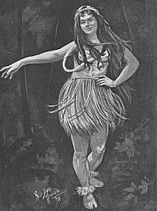

  
[Intangible Textual Heritage](../../index)  [Pacific](../index) 

------------------------------------------------------------------------

[Buy this Book at
Amazon.com](https://www.amazon.com/exec/obidos/ASIN/B0024FAH3E/internetsacredte)

------------------------------------------------------------------------

<table width="75%">
<colgroup>
<col style="width: 50%" />
<col style="width: 50%" />
</colgroup>
<tbody>
<tr class="odd">
<td width="50%" data-valign="TOP"></td>
<td width="50%" data-valign="CENTER"><h1 id="unwritten-literature-of-hawaii" data-align="CENTER">Unwritten Literature of Hawaii</h1>
<h2 id="the-sacred-songs-of-the-hula" data-align="CENTER">The Sacred Songs of the Hula</h2>
<h3 id="by-nathaniel-b.-emerson" data-align="CENTER">by Nathaniel B. Emerson</h3>
<h4 id="section" data-align="CENTER">[1909]</h4></td>
</tr>
</tbody>
</table>

------------------------------------------------------------------------

[Contents](#contents)    [Start Reading](ulh00)    [Page
Index](pageidx)    [Text \[Zipped\]](ulh.txt.gz)

------------------------------------------------------------------------

|                                                                                                                           |
|---------------------------------------------------------------------------------------------------------------------------|
|  |

Emerson's classic study of the Hula is a gold-mine of information for
explorers of Hawaiian language, music, dance and culture. He gives the
full annotated Hawaiian text of the songs, along with a free English
translation.

As in many other traditional cultures, Hawaiian art, dance, music and
poetry were highly integrated into every aspect of life, to a degree far
beyond that of industrial society. The poetry at the core of the Hula is
extremely sophisticated. Typically a Hula song has several dimensions:
mythological aspects, cultural implications, an ecological setting, and
in many cases, (although Emerson is reluctant to acknowledge this) frank
erotic imagery. The extensive footnotes and background information allow
us an unprecedented look into these deeper layers. While Emerson's
translations are not great poetry, they do serve as a literal English
guide to the amazing Hawaiian lyrics.

While Emerson does not describe the Hula dance *per se* as much as one
would like, he does provide very detailed background information on the
cultural setting in which the Hula was performed, including ritual
procedures of the Hula schools, or halau. One other weak point is that
the illustrations are primarily sketches of plants mentioned in the
songs, musical instruments and so on; only two of them portray Hula
dancers (one of which is fully clothed!). The book notably includes
musical transcriptions of a number of songs, including the Hawaiian
anthem, [Hawai'i Ponoi](ulh25.htm#page_172).

This book is a must-read for anyone who wants to acquire a deep
understanding of traditional Hawaiian culture.

------------------------------------------------------------------------

[Title Page](ulh00)  
[Prefatory Note](ulh01)  
[Contents](ulh02)  
[Illustrations and Musical Pieces](ulh03)  
[Introduction](ulh04)  
[I.--The Hula](ulh05)  
[II.--The Halau; the Kuahu--Their Decoration and Consecration](ulh06)  
[III.--The Gods of the Hula](ulh07)  
[IV.--Support and Organization of the Hula](ulh08)  
[V.--Ceremonies of Graduation; Début of a Hula Dancer](ulh09)  
[VI.--The Password--The Song of Admission](ulh10)  
[VII.--Worship at the Altar of the Halau](ulh11)  
[VIII.--Costume of the Hula Dancer](ulh12)  
[IX.--The Hula Ala’a-Papa](ulh13)  
[X.--The Hula Pa-ípu, Or Kuólo](ulh14)  
[XI.--The Hula Ki’i](ulh15)  
[XII.--The Hula Pahu](ulh16)  
[XIII.--The Hula Úli-ulí](ulh17)  
[XIV.--The Hula Puíli](ulh18)  
[XV.--The Hula Ka-laau](ulh19)  
[XVI.--The Hula Íli-íli](ulh20)  
[XVII.--The Hula Ká-éke-éke](ulh21)  
[XVIII. An Intermission](ulh22)  
[XIX.--The Hula Niau-kani](ulh23)  
[XX.--The Hula Ohe](ulh24)  
[XXI.--The Music and Musical Instruments of the Hawaiians](ulh25)  
[XXII.--Gesture](ulh26)  
[XXIII.--The Hula Pa-hua](ulh27)  
[XXIV.--The Hula Pele](ulh28)  
[XXV.--The Hula Pa’i-umauma](ulh29)  
[XXVI.--The Hula Ku’i Molokai](ulh30)  
[XXVII.--The Hula Kieléi](ulh31)  
[XXVIII.--The Hula Mú’u-mú’u](ulh32)  
[XXIX.--The Hula Kolani](ulh33)  
[XXX.--The Hula Kolea](ulh34)  
[XXXI.--The Hula Manó](ulh35)  
[XXXII.--The Hula Ilío](ulh36)  
[XXXIII.--The Hula Pua’a](ulh37)  
[XXXIV.--The Hula Ohelo](ulh38)  
[XXXV.--The Hula Kilu](ulh39)  
[XXXVI.--The Hula Hoo-na-ná](ulh40)  
[XXXVII.--The Hula Ulili](ulh41)  
[XXXVIII.--The Hula O-niu](ulh42)  
[XXXIX.--The Hula Ku’i](ulh43)  
[XL.--The Oli](ulh44)  
[XLI.--The Water of Kane](ulh45)  
[XLII.--General Review](ulh46)  
[Glossary](ulh47)  
