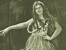

  
[Intangible Textual Heritage](../../index)  [Pacific](../index) 
[Index](index)  [Previous](ulh29)  [Next](ulh31) 

------------------------------------------------------------------------

[Buy this Book at
Amazon.com](https://www.amazon.com/exec/obidos/ASIN/B0024FAH3E/internetsacredte)

------------------------------------------------------------------------

  
*Unwritten Literature of Hawaii*, by Nathaniel B. Emerson, \[1909\], at
Intangible Textual Heritage

------------------------------------------------------------------------

p. 207

# XXVI.--THE HULA KU’I MOLOKAI

The hula *ku’i Molokai* was a variety of the Hawaiian dance that
originated on the island of Molokai, probably at a later period than
what one would call the classic times. Its performance extended to the
other islands. The author has information of its exhibition on the
island of its name as late as the last quarter of the nineteenth
century. The actors, as they might be called, in this hula were arranged
in pairs who faced each other and went through motions similar to those
of boxing. This action, *ku’i*, to smite, gave the name to the
performance. The limiting word Molokai was added to distinguish it from
another still more modern form of dance called *ku’i*, which will be
described later.

While the performers stood and went through with their motions, marching
and countermarching, as they are said to have done, they chanted or
recited in recitative some song, of which the following is an example.
This they did with no instrumental accompaniment:

He ala kai olohia, [a](#fn_387)  
He hiwahiwa na ka la’i luahine,  
He me’ aloha na’u ka makani hanai-loli, [b](#fn_388)  
E uwe ana i ke kai pale iliahi.  
5 Kauwá ke aloha i na lehua o Kaana. [c](#fn_389)  
Pomaikai au i kou aloha e noho nei;  
Ka haluku wale no ia a ka waimaka,  
Me he makamaka puka a la  
Ke aloha i ke kanaka,  
10 E ho-iloli nei i ku’u nui kino.  
Mahea hoi au, a?  
Ma ko oe alo no.

p. 208

\[Translation\]

*Song*

Precious the gift of heart's-ease,  
A wreath for the cheerful dame;  
So dear to my heart is the breeze  
That murmurs, strip for the ocean.  
5 Love slaves for wreaths from Kaana.  
I'm blest in your love that reigns here;  
It speaks in the fall of a tear--  
The choicest thing in one's life.  
This love for a man by his wife--  
10 It has power to shake the whole frame.  
Ah. where am I now?  
Here, face to your face.

The platitudes of mere sentimentalism, when put into cold print, are not
stimulating to the imagination; moods and states of feeling often
approaching the morbid, their oral expression needs the reenforcement of
voice, tone, countenance, the whole attitude. They are for this reason
most difficult of translation and when rendered literally into a foreign
speech often become meaningless. The figures employed also, like the
watergourds and wine-skins of past generations and of other peoples, no
longer appeal to us as familiar objects, but require an effort of the
imagination to make them intelligible and vivid to our mental vision. If
the translator carries these figures of speech over into his new
rendering, they will often demand an explanation on their own account,
and will thus fail of their original intent; while if he clothes the
thought in some new figure he takes the risk of failing to do justice to
the intimate meaning of the original. The force of these remarks will
become apparent from an analysis of the prominent figures of speech that
occur in the mele.

*Mele*

He inoa no ka Lani,  
No Náhi-éna-éna;  
A ka luna o wahine.  
Ho’i ka ena a ka makani;  
5 Noho ka la’i i ka malino--  
Makani ua ha-aó;  
Ko ke au i hale, ea.  
Punawai o Maná, [a](#fn_390)  
Wai ola na ke kupa  
10 A ka ilio naná,  
Hae, nanahu i ke kai;  
Ehu kai nána ka pua,  
Ka pua o ka iliau,

p. 209

Ka ohai o Mapépe, [a](#fn_391)  
15 Ka moena we’u-we’u,  
I ulana ia e ke A’e,  
Ka naku loloa.  
Hea mai o Kawelo-hea, [b](#fn_392)  
Nawai la, e, ke kapu?  
20 No Náhi-éna-éna.  
Ena na pua i ka wai,  
Wai au o Holei.

\[Translation\]

*Song*

A eulogy for the princess,  
For Náhi-éna-éna a name!  
Chief among women!  
She soothes the cold wind with her flame--  
5 A peace that is mirrored in calm,  
A wind that sheddeth rain;  
A tide that flowed long ago;  
The water-spring of Maná,  
Life-spring for the people,  
10 A fount where the lapping dog  
Barks at the incoming wave,  
Drifting spray on the bloom  
Of the sand-sprawling ili-au  
And the scarlet flower of ohai,  
15 On the wind-woven mat of wild grass,  
Long naku, a springy mattress.  
The spout-horn, Kawelo-hea,  
Asks, Who of right has the tabu?  
The princess Náhi-éna-éna!  
20 The flowers glow in the pool,  
The bathing pool of Holei!

This mele inoa--name-song or eulogy--was composed in celebration of the
lamented princess, Nahienaena, who, before she was misled by evil
influences, was a most attractive and promising character. She was the
daughter of Keopuolani and younger sister of Kamehameha III, and came to
her untimely death in 1836. The name was compounded from the words *na*,
the, *áhi*, fires, and *énaéna*, hot, a meaning which furnishes the
motive to the mele.

------------------------------------------------------------------------

### Footnotes

[207:a](ulh30.htm#fr_400) *Kai olohia*. A calm
and tranquil sea. This expression has gained a poetic vogue that almost
makes it pass current as a single word, meaning tranquillity, calmness
of mind. As thus explained. it is here translated by the expression
"heart's-ease."

[207:b](ulh30.htm#fr_401) *Makani hanai-loli*.
A wind so gentle as not to prevent the bêche de mer (*loli*),
sea-anemones, and other marine slugs from coming out of their holes to
feed. A similar figure is used in the next line in the expression *kai
pale iliahi*. The thought is that the calmness of the ocean invites one
to strip and plunge in for a bath.

[207:c](ulh30.htm#fr_402) *Kauwá ke aloha i na
lehua o Kaana*. Kaana is said to be a hill on the road from Keaau to
Olaa, a spot where travelers were wont to rest and where they not
infrequently made up wreaths of the scarlet lehua bloom which there
abounded. It took a large number of lehua flowers to suffice for a
wreath, and to bind them securely to the fillet that made them a garland
was a work demanding not only artistic skill but time and patience. If a
weary traveler, halting at Kaana, employed his time of rest in plaiting
flowers into a wreath for some loved one, there would be truth as well
as poetry in the saying, "Love slaves for the lehuas of Kaana."

[208:a](ulh30.htm#fr_403) *Punawai o Maná*. A
spring of water at Honuapo, Hawaii, which bubbled up at such a level
that the ocean covered it at high tide.

[209:a](ulh30.htm#fr_404) *Ka ohai o Mapépe*. A
beautiful flowering shrub, also spoken of as *ka ohai o Papi’o-huli*,
said to have been brought from Kahiki by Namaka-o-kaha’i.

[209:b](ulh30.htm#fr_405) *Kawelo-hea*. A
blowhole or spouting horn, also at Honuapo, through which the ocean at
certain times sent up a column of spray or of water. After the volcanic
disturbance of 1868 this spouting horn ceased action. The rending force
of the earthquakes must have broken up and choked the subterranean
channel through which the ocean had forced its way.

------------------------------------------------------------------------

[Next: XXVII.--The Hula Kieléi](ulh31)
