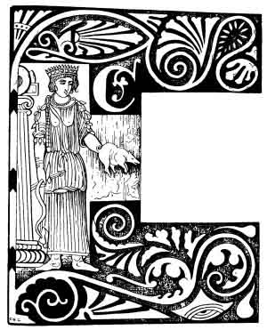
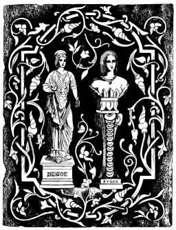
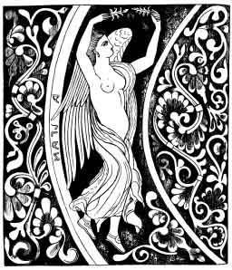
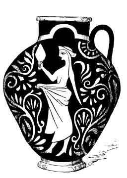

[Intangible Textual Heritage](../../index)  [Neo-Paganism](../index) 
[Index](index)  [Previous](err08)  [Next](err10) 

------------------------------------------------------------------------

p. 107

# CHAPTER VI

### CARRADORA

CARRADORA was in her life *una strega buona*--a good
witch--who protected infants against other or evil witches. She appears
to be well known. While the following story was being narrated, the one
who told it paused, not remembering the name of the plant which was use,
Whereupon an old woman who was present--not from the Romagna, but a
Florentine--gave it at once as *corbezzolo* (arbutus).

I infer from this that the story is widely spread.

p. 108

"There was once in the country a lady who had a small baby. It was a
pretty child, but day by day it began to weaken--diminuire--nor did the
mother know what to do. Then she was advised to go to Carradora, who
could explain it all, because she was a witch who did good as well as
harm (*il male*).

"Then the lady went to the witch, who said: 'Go to thy home and put the
babe to bed, and put a knife in the window, and then return to me.' So
the lady did, and returned to Carradora, who said" 'Witches come by
night to suck the blood of thy child, and it must be prevented.'

"Then the witch took *corbezzole*, and thorns, and put them in red bags
and bound them to the door-posts and windows, and then took the entrails
of a very small pig (*un maialino*), and said

"'Questi sono gl'interiori  
D'un piccolo maiale,  
Che servono per le strege  
Discacciar, e gl'interiori  
Di si bella bambina  
Sono giovani quanto lei cara,  
Ed e proprio ad atta  
Per amare. E le corne  
Alle strege bisogna fare,  
Che qui dentro non possino più entrare.'

Then Carradora took the child and made a skein of thread (*ne fecé un
gonlitolo*) and threw it in the air, and so it was cured."

The story was imperfectly told, because it was mentioned in connection
with it, that thorns in the form of a cross were either laid in the
window or should be put in a window to keep witches from entering.

Carna or *Cardæa* was a very ancient Roman minor goddess. "Some
writers," says PRELLER, "describe her as a goddess who strengthened the
heart and entrails. Others call her *Cardea*, a goddess of the
door-hinges, and class her with *Forculus* and *Limentius*." Of her he
relates the following, which has certainly an extraordinary resemblance
to what I have related:--

"There was by the Tiber an ancient grove of Helernus, to which the
Pontifices brought offerings. Hence came the nymph who was really called
Cranæ, but who, by means of Janus, became Carna, or goddess of all
hinges of doors, (doors?) and entrances or exits. As a nymph she was
chaste as Diana, and by speedy flight avoided the glance of every man.
But she could not escape the double sight of Janus who won her love and
gave her for reward the *jus cardinis*, or sway over all hinges, and the
white thorn (*spina alba*) in order to keep evil from all doors, and
especially to exclude the witches who come in the night to suck the
blood of children.

"Proca was the daughter of a Latin prince. When the child was only five
days old the witches began to stick its blood. The nurse came and saw
the marks of the witches' claws on the baby's cheeks--the child was pale
as a faded leaf. So they went to Carna--or Cardea--who first touched the
door-posts and threshold thrice with arbutus (Italian, corbezzole), and
sprinkled the entrance with water, and took the entrails of a
sucking-pig in her hand. Then she said;--

p. 109

"'Ye night-birds (witches) spare the bowels of the babe  
The tender creature is for dainty boys;  
Heart for heart!  
Bowels for bowels  
Soul for soul!'

"Then she laid the entrails in the open air, and no one dared to look at
them." (This, I am sure, means that they went away without looking back
at them.) "After that no witch could enter, and the child soon
recovered."

This is essentially the same story with the one previously narrated. But
quite independently of it, I was informed long before that the *white
thorn* laid in a window kept witches from entering, and that the
entrails of a pig were a most potent means of exorcising them. That the
Latin Cardea should have become Carradora is natural enough.

Carnea-Cardea seems to have been interested in pigs. It is remarkable
that the dish of pork and beans (which, as Sir THOMAS BROWNE remarks,
the Jews and Pythagoreans contrived to spoil between them) was sacred to
her; it was eaten in her honour on the 1st of June. This fact alone
would convince any native of Boston that she must have been the most
genial, humane, and æsthetic spirit in existence--*cui pulte fabacia et
larido sacrificatur* [1](#fn_11)--and I am not
sure that, if a copy of this work should ever find its way to the Hub,
the modern Athenians will not erect a church or temple to her, unless
indeed they have one already, for there are few things which they do not
know, and nothing which they have not tried in the way of religion. In
any case it is a remarkable historical fact that pork and
beans--probably baked--was an Athenian dish, associated with the deepest
mythological mysteries.

#### VIRA

Of this spirit I have the following account and story:--

 

"Vira is a fairy who, from a fairy (*fate*) in her life, became a spirit
who by day and night is always in the forests. And when she sees any
handsome young man busy in cutting wood, or making charcoal, if he
pleases her she appears to him in the form of a very beautiful girl--*da
farne a bagliarie*--such as to dazzle him -and then he finds his work
all done to his hand, or else she shows him a treasure.

One day she found a handsome youth who was in great sorrow because he
was so poor. He began to cut wood, yet wept while so doing because he
could bring nothing home to his mother. Then Vira appeared to him and
said:--

 

p. 110

 

"'Buon giovane non ti disperare,  
A far fortuna ti voglio mandare,  
Vi e un piccolo paiese vicina à Benevento  
E la vi c la figlia del re  
Che aspetta it mago delle sette teste,  
Che vada a mangiarla l'aspetta,  
A sedere al balcone ma pero basta  
Che uno vada dal re con le teste del mago,  
Che sia stato capace d'ammazarlo.'

("'Good youth be not in despair!  
There's a small place near Benevento  
Where dwells a king who has a daughter fair,  
Who waits for the seven-headed ogre  
Who will devour her, but her father there  
Hopes that some one ere long may slay him,  
And bring the ogre's heads unto him.')

And he who will do this may wed the princess. Now this ogre has been
slain by the Signore Slaniani, who will now carry the heads to the king
and claim the hand of his daughter, but that is reserved for thee and
not for him. For when the heads were put on a waggon to be carried to
the king I took from them their seven tongues, and thou shalt carry
these tongues to the king and say that thou didst slay the ogre and that
thou dost wish for his daughter. Then the king will say that it was
another who gained the victory, the proof being that he has the heads.
To which thou wilt reply, "Who should be the conqueror--the one who has
the heads or the tongues?" And it will be admitted that the victor would
have secured the tongues although he might have neglected the heads, but
that it would be most unlikely that he would have cut out and thrown
away the tongues.'

"And thus did Vira  
The youth was clad in splendid attire,  
He too was very beautiful,  
Boldly he went to the king,  
Boldly he claimed to have slain,  
Single-handed, the ogre,  
And asked for the beautiful princess  
As a reward for his valour.  
'It may not be' said the king  
'He who slew the monster  
Has brought with him its heads,  
No better proof can be found.'  
'A better proof is the tongues,'  
Answered the youth, undaunted,  
'And I can show all the seven.'

But the Signore Slaniani maintained that these were not the tongues of
the ogre, because no one could have taken them from the heads, which had
never been out of his sight. Then the king said

"'Well, then bring here the heads  
If they all have their tongues  
The princess shall be your wife,  
And this youth must be cast into prison, p.
111  
But, if the tongues are gone,  
Gone with them are your chances,  
You'll be a prisoner then,  
And the youth shall have the maiden.'

"But as he had no witnesses Signore Slaniani depended on the heads, and
what was his amazement to find when they were brought that the tongues
were gone.

"Therefore it came to pass  
That the poor youth who was favoured  
By the help of the fairy  
Carried away the reward.  
So it often goes in this world  
He who does the hard work  
Often misses his pay,  
When some one more favoured by fortune  
Steps in and secures the prize.  
Higher beings than man  
Play with us all like toys.  
The youth was as nothing in this  
All that he won he owed  
To the loving spirit Vira."

 

This is, as regards the incident of the dragon's or *maga's* heads and
tongues, a very common fairy tale. We have the last echo of it in
Quentin Durward, where the hero appears with the head of William de la
Mark, the Wild Boar of Ardennes. But it is very peculiar that in this
version the whole principle of the story is reversed. In the others it
is the true slayer of the dragon who gets the tongues, and the impostor
who has the heads but in this story.

"The page slew the boar,  
The king had the gloire."

This indicates an extremely archaic form of the tale. Among rude races
it is the crafty man who is most admired. The Algonkin Indians call
their great god *Glooskap* or *Glûsgabe*, which means "the Liar," as Dr.
J. G. Brinton declares, because they thought it the most distinguishing
attribute of wisdom to be able to deceive. Highly civilised people are
ashamed to boldly admire such a mean trick as that which was played by
the *protégé* of Vira. It cannot have escaped the reader that, taking
these tales and myths as a whole, they indicate a really primæval
antiquity. Their morality is antique and they are all based on the idea
that human beings or fairies who are a kind of human beings (a belief
which Prætorius and many more defended only two hundred years ago),
became

p. 112

spirits or deities. This is the very oldest form of supernaturalism, or
animism. And in accordance with it is this naïf admiration of deceit.

But what is most interesting in this tale is the name VIRA, that of the
heroine who is described distinctly as a fairy "who is always in the
forests." In ancient times the *Vira* was strictly a sylvan spirit, and
is thus mentioned by PRELLER (Rom. *Myth*., p. 89): " But the women of
ancient times whom we call *scias* (wise women or witches) . . . were
also called in early times *Viræ* or *Vires*, for this form also occurs,
and they were indeed chiefly known as *Baumnymphen* (*tree*-nymphs) the
word *virere* and *viridis* being clearly connected with this name." But
the name being very old Italian, seems to be peculiarly appropriate to a
very old story of the Toscana Romagna. "The race of wood women," says
PRELLER, "is generally indicated by the Greek names of *Nymphs* and
*Dryads*, while in the very earliest Italian antiquity, and in hoary
popular tradition, they are called *Viræ*, *Vires*, *Virgines* and
*Viragines*." In the story which we have given, Vira acts more like a
witch than a fairy.

Taking the name Vira into consideration, with other characteristics, it
is therefore possible that we have here perhaps the most ancient form of
the legend.

#### BERGOIA

Bergoia is a spirit *sempre perfido*, always treacherous, who was in her
lifetime a very mischievous witch. Yet when young she was really good,
and she was in a great and wealthy family by whom she was loved like a
daughter. And there was a young girl; a daughter of the family, who also
loved her very dearly. But little by little, no one knew how or why it
was, Bergoia began to change her nature and became as evil as she had
before been amiable.

"Now the change was so great that the young lady was certain that some
strange cause lay behind it, and being a very shrewd girl she resolved
to watch Bergoia closely, and find out what it meant. And one evening
when Bergoia bade her go to bed early, she did so, but kept awake to
watch. And when midnight came, she heard the voice of a man without,
singing:--

"'O Bergoia! O bella Bergoia  
Vieni mi aprire,  
Che da questa finestra,  
Non posso salire,  
Bada i tuoi padroni non sveglia,  
Perche con te una affare  
Abbiamo da combinare;  
Se questa affare combineramo,  
La tua signorina stregheremo, p. 113  
Se la tua signorina  
Non mi farai stregare,  
Una strega di te faro diventare.'

("O Bergoia! fair Bergoia  
Come open unto me!  
For thou knowest through the window  
I cannot come to thee.  
Beware, lest the master wakes,  
For we have work to do;  
There is witch-work which calls us, Bergoia  
Witch-work for me and you;  
We must bewitch the maiden  
And win her from her home;  
Unless the spell pass on her,  
A witch thou must become!')

Then the young lady, terrified at what she had so nearly escaped, ran
screaming to her parents, and told them what she heard. Then he who had
called, and who stood without, in a rage changed himself into a black
dog, [1](#fn_12) and disappeared in a terrible
flash of lightning with Bergoia, who was never seen on earth as a true
woman again.

"After her death, Bergoia became a spirit of thunder and lightning, and
was seen darting in the fire--*si converte molte volte in saietta*. She,
however, often took human form, and would go to a house and ask for food
and shelter; if she obtained it she would content herself with making
thunder and lightning roar and flash, and if her hosts showed fear then
there would come hail to devastate their crops. But woe to those who
utterly refused her shelter, for then there would come a flash
(*saietta*) which would destroy or burn the house, or set fire to the
trees.

So men lose thousands on thousands  
Of money by crops destroyed,  
For the flash is a ray of fire,  
And the bolt like a splint of iron,  
And he who is struck by it dies,  
As he may by the deadly odour  
Which lightning spreads around.  
Such is the work of Bergoia.

Sometimes it comes to pass that Bergoia fancies a youth, and passes the
night with him. He is bewitched and makes love, but never sees her, for
she comes and goes in darkness, and suddenly departs in a flash of
lightning which kills her paramour.

"And so she is ever doing evil to all,  
Evil to those who have never done her wrong."

 

The Tusci, as OTTFRIED MÜLLER observes, had in their mythology an
extraordinary number of spirits of thunder and lightning, furies and
infernal witches,

p. 114

and, as I have observed, there are a great many in the Romagnolo
mythology. [1](#fn_13) The Etruscan, like the
Turanian everywhere--and the Mexican so far as we know it--seems to have
been a religion or cult which was, especially in a certain stage, one of
blood and of the grotesque horrors which always appeal to primitive man.
In such religions thunder and storms, death, bloody sacrifices and evil
spirits take precedence of more refined conceptions. The god is always a
human sorcerer who continues to haunt mankind and exercise the same
functions which he practised while living. No one can fail to recognise
very distinct traces of this in these Romagnolo traditions.

This account speaks of "the deadly odour which lightning spreads
around." The Hungarian gypsies say that it has a smell like garlic.

It may be observed that these Tuscan legends deal, not indirectly, but
very evidently and closely, with their original myths. Many of the names
of Etrusco-Italian deities are preserved in them almost unchanged. Now
in no part of the Roman empire was the worship of Ceres so zealously
maintained as in the Tuscan land; hence the idea of a wandering goddess,
going about in disguise, soliciting shelter and food, and cruelly
punishing those who treat her unkindly, appears more than once in these
traditions. And it cannot be denied that by considering them as a whole,
comparing one incident with another, or all the special characteristics
of the legends, no one can fail to see that all agree marvellously with
what we know of Etrurian or Old Latin origins, and manifest little
admixture from other sources.

This being true, it is curious that there was an Etruscan minor goddess
named *Begoe* who appears to have communicated to mortals the whole
theory and system of thunder, or an *ars fulguritorum*, which was
preserved with other writings, after the time of Augustus, in the temple
of the Palatine Apollo. *Fulguritus* really means *id quod est fulmine
ictum*--that which is thunderstruck. Begoe was at least one who was
concerned with thunder, storms, and the spoiling of harvests. But
here--as in all such cases--I only make a mere suggestion, to be
corrected or set aside by those who are better qualified to decide.

Bergoia in this Tuscan myth kills animals and men at a flash or in an
instant.

p. 115

 

BEGOE (THE FIGURES FROM GORI MUS. ETRUS.)

p. 116

"Begoe," as we are told (*History of Etruria*, by Mrs. Hamilton Gray)
"slew an ox simply by whispering in its ear the fearful name of the
Highest." This I think refers to lightning. "The highest and most
irresistible of all the powers dwells in the divine and mysterious
*name*--"the supreme name," with which Hea alone is acquainted. Before
this name everything bows in heaven and in earth and in Hades, and it
alone can conquer the Maskin (evil spirits), and stop their ravages. "
Awe her (Ninkigal) with the names of the great gods " (Fox Talbot, cited
in Lenormant, *Magie Chaldaienne*). Thus *nomen est numen*, according to
Varro, to which we may here appropriately add *et numen est lumen*--the
divinity being lightning.

#### BUGHIN

Of this spirit I have the following account:--

Bughin is a spirit who does both good and evil. About harvest time he
causes the *carbonchiato* [1](#fn_14) in the
grain, or makes it become black, whence the bread made from it is also
dark, having such a vile smell and taste that it cannot be eaten, which
is a sad loss for the poor peasants--*e cosi i poveri contadini se
avessero la disgrazia*. And when they have suffered much from this, say
for three or four years, then they take two or three ears of wheat or of
the grain (*spighe di grano*). These the peasant must husk or shell
(*sfarlo*), clean, and put them on the hearth where it is very hot, and
throw the refuse out-of-doors, and when putting the grain on the hearth
say:--

"'Metto questo grano carbonchiato  
Perche lo spirito di Bughin mi ha rovinato,  
A lui mi voglio raccomandare,  
E lo voglio tanto pregare,  
Che aquesta male voglia riparare  
Se questa grazia mi vuol fare,  
Questo grano in mezzo della stanza  
Mi deve fare saltare!'

("'As these rusted grains I see,  
I fear Bughin hath ruined me  
Therefore unto him I pray,  
That this harm may pass away;  
May this corn now be a sign  
That all is well for me and mine,  
May it, if I escape a doom,  
jump to the middle of the room!')

"Should the heated grains burst and jump well, it is a sign that the
rust or mildew will not attack the grain. But the peasant must be on the
look-out to secure two grains of wheat of the very first which ripen
before the smut, or carbonchiato, manifests itself."

The Romans had a god or rural deity who presided over the rust in wheat.

p. 117

His name was *Robigo*, and there is much about him in the lore of the
Latin harvest gods, of whom I would say incidentally that they seem to
have been the prototypes of the same "Corn gods" in Germany, or sprung
from the same source. The Latins had indeed quite a minor mythology of
these. Seia, or Segetia, guarded the seed while in the ground. She was
also called Fructiseia and Semonia. Segesta attended to it when
sprouting. The Deus Nodotus aided the development of the
joints--*dicitur dens qui ad nodos perducit res satas* (ARNOBIUS, iv. 7
; ap. PRELLER). Volutina formed the husk, Patelena opened the car
(*vide* Patelana). With these were twelve male gods who presided over
all the separate processes of sowing and harvesting, besides the Deus
Spinensis who was invoked to keep the crop free from thorns and weeds.
In Bolognese, *Robigo* would easily and naturally be changed to
*Bughin*--*big*, the root, becoming *bug* or *bugh* by many analogies.
*In* is a common termination for proper names.

#### GANZIO

"Festa para Conso : Census tibi cætera dicet;  
Ipso festa die dum sua sacra canes."  
                                 OVID, *Fastorum Lib*. iii

The *contadino* when in difficulty on any subject has always his choice
between appealing to a Christian saint or an ancient heathen god: "One
good if the other fails." So if his horse be ill, he may begin with a
prayer to Saint Antony of whom I was told that :--

"He is a saint who protects all animals, especially horses. And when one
has a horse in bad condition he goes to Saint Antonio and says:--

"'Saint Antonio min benigno!  
Di pregarvi non son digno  
Ma voglio voi pregare,  
Che il mio cavallo mi volete liberare  
Da tutte le malattie;  
Sano et svelte me le farete stare!'

("'Most benign Saint Antony!  
Though unworthy I may be,  
Vet to thee I pray, of course,  
And beg that thou wilt free my horse  
From all evils in him found,  
Make the creature safe and sound!")

But should Saint Antony turn a deaf ear to this humble petition, the
suppliant appeals to a much older, and therefore probably more
experienced

p. 118

deity, that is *Ganzio*, who is "of the horse, horsey," as he dwells in
stables, and who, though not devoid of trick or vice, is always willing
to give his aid as an experienced "vet." when politely requested. Of him
I have the following account:--

"Ganzio is the spirit who is over horses. Now it is not with evil intent
but for fun that it often happens when a coachman goes into the stables
Ganzio makes the horses misbehave, and throws impediments in the way,
especially if the master be waiting without, and very impatient, begins
to scold.

"However, if the master do not become too angry, or treat the coachman
badly, Ganzio contents himself with making the horse rear and curvet a
little (*fa fare qualche capriciola*). But if the master is unreasonably
angry, then the horse will take the wrong road if it be possible, or get
into a dangerous place, or leap or bolt, but still without hurting his
rider.

Now if it be thought that Ganzio is playing these tricks the rider
should say:--

"'Ganzio, Ganzio, benedetto tu siei!  
Buono quante bello. Son cattivo, ai  
Bene ragione trattero bene i servitori,  
Giacche tu me ai data  
Una lezione, ma ti vengo a pregare,  
Ganzio non me piu spaventare  
Che mi ai fatto una gran paura  
Ma e vero la valuta,  
Ganzio viene in casa mia,  
Vieni a tenermi compagnia  
Ma non farmi spaventare,  
Nei burroni non mi gettare.'

Ganzio, Ganzio, heed my song  
Thou art right and I am wrong,  
I will treat the servants better,  
And will mind thee to the letter  
For the present I implore,  
That thou frighten me no more  
Also that thou'lt ever be  
In my house, as company;  
And may I ne'er again be seen  
So near the edge of a ravine!'")

 

I must remark that my informant did not very well recall this
incantation, and "pieced it up," so to speak, as well as she could. But
who was this Ganzio originally? *Consus* was a very old Roman minor
deity, who was closely connected with animals, and especially with
horses and races. "The Greeks," says PRELLER "declared that on account
of the chariot-races at his festival, and his altar buried in the earth
that he was the same as their Poseidon Hippios." It is to be remarked
that he was regarded as being very kind and considerate to animals,

p. 119

therefore on his festival all horses and mules were allowed to rest, and
were crowned with flowers and otherwise well treated.

Consus would naturally become Conso or Consio, in Italian, which in
Tuscan is *Chonsio*, the *ch* in Romagnola often changing to a *g*, as,
for instance, *Ionbrigoli* for *lombrici* (earthworms), and *piga* for
*pica* (wood-pecker or magpie), old Umbrian *pei qu*. This etymology may
or may not "hold water," I only suggest it as the only one which occurs
to me. But, according to it, Consus would almost inevitably become
Consio and Ganzio.

I forgot to mention that Ganzio may be invoked for any matter relative
to a horse.

#### ALPENA

"Der Name der Göttin Alpan erkhärt sich durch Vergleichung
stammverwandter Namen von ahnlichen Gottheiten bei den Indern und
Germanen." "Diese schafft und bringt nach der Darstellung des
Spiegelbildes durch die Luft dahin schwebend den Schmuck der
Pflanzenwelt."--CORSSEN, *Über die Sprache der Etrusker*.

Alpena, as I was told, is a beautiful female spirit who always flies in
the air. She is very charming, and in addition to her name is entitled
*La Bellaria*. She is a *la dea dei fiori*--the goddess of flowers. The
name recalls the Etruscan ALPAN, who was also an aerial goddess, or
rather peri, who appears on a mirror from Vulci now in the Vatican (vide
Mus. Etrusc. Vaticana, i., vol. xxiii., and Gerhard, Etrus. Spiegel, v.,
28 f. t., cccxxxi. f. 2141) as holding leaves or flowers. Every detail
as given to me agrees curiously with what is said of Alpan, by Corssen
(*Über die Sprache der Etrusker*, vol. i., p. 255). "Alpan," he says,
"creates the ornamental part of the world of plants, and brings it,
sweeping through the air, in the train of Adonis, the goddess of
spring." The name *Alpena*, with the description of her attributes, were
given to me, not as the result of inquiry, but as information,
volunteered by a peasant woman.

As Alpena or Alpan is, like Albina, one of the *Lichtgöttinin*, or
goddesses of light, it is probable, from the similarity of name, that
they are the same. From Alpan the Etruscans developed another goddess,
*Alpanu*, or *Alpnu*, who appears to have been an inferior form of Venus
(vide CORSSEN, *Über the Sprache der Etrusker*--a work of no value as to
philology, but full of curious materials).

It is remarkable that in modern Tuscan tradition there are several
spirits of light and air called Bellaria, corresponding to the
Etrusco-Roman group of Eos and the nymphs of the dawn. Though Eos had
few temples ("*rarissima templa per orbem*," OVID, *Met*., xiii., 588),
the Etruscans made great account of her, and her son Memnon (Memrun)
often occurs on vases (*vide* 

Die Weltkörper in ihrer

p. 120

mythisch symbolischen Bedeutung, von J. B. Friedrich, 1864). All of the
Etruscan

 

ALPAN (Alpena or Albina )  
(From Corssen. The ornament from a vase.)

 

winged spirits bearing flowers, and connected with rainbows, clouds,
air, and light, were in fact *Bellarie*, and a part of the *Lasæ*, who
carry bottles probably of

p. 121

perfume--though it may have been something more substantial--wherewith
to welcome the soul of the life-weary mortal entering heaven. As is
beautifully set forth in my own French romance of *Le Lutin du Chateau*,
which was refused by Hachette because of its worldly-minded gaiety and
freedom from blue-nosed straight-lacedness.

 

------------------------------------------------------------------------

### Footnotes

[109:1](err09.htm#fr_11) MACROBIUS, i., 12, 33

[113:1](err09.htm#fr_12) "Any voodoo is supposed
to change himself into a black dog, black wolf, black cat, owl or bat at
night. The way to stop the metamorphosis is to find either the human or
the animal skin and salt it. These black animals spit fire at you if you
have their human skin; but you must not fear, but hold it fast until you
have salted it well."--MARY A. OWEN.

[114:1](err09.htm#fr_13) The Tuscans (Tusker)
who devoted much attention to investigating thunder and lightning . .
recognised three kinds--that which gave counsel or advice, that which
confirmed events and indicated how something which had happened would
turn out, and the third which came unexpectedly and predicted according
to circumstances. It would weary the reader should I relate more of this
greatly spun-out lightning-lore. For further details he may consult;
SENECA, *Naturæ Quest*., ii., 32, &c.; PLINY, *Hist. Nat*., ii., 539
VALERIAN, *De fulminum significationobus* in *Grævii Thesaur.*, v., p.
600; MÜLLER, *Die Etrusker*; CREUZER, *Symbolik*, 3rd ed., vol. iii., p.
650; NORK, *Real Worterbuch*, vol. i., p. 160; DÖLLINGER *Heidenthum*,
p. 461; FRIEDRICH, *Symbolik der Natur*.

[116:1](err09.htm#fr_14) *Carbonchio*, a disease
in grain by which it appears black and scorched. The smut or mildew,
*Carbonchioso*, affected with the smut, burnt or scorched (BARETTI'S
Italian Dictionary).

------------------------------------------------------------------------

[Next: Part One: Chapter VII--TITUNO](err10)
