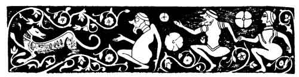
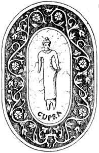

[Intangible Textual Heritage](../../index)  [Neo-Paganism](../index) 
[Index](index)  [Previous](err12)  [Next](err14) 

------------------------------------------------------------------------

p. 182

# CHAPTER X

### CUPRA

Ex eo tempore . . . illum sic concubisse secum, ut viri cum fœminis
solent, nec percipiente viro, cum simul in lecto essent,"--BODINUS, lib.
2, capit. 7

OF this spirit all that I know is given in the
following strange story:--

"Cupra is a folletto, or spirit, who when *se prende a sinpatia una
donna*, he takes a liking to a woman, and inspires her with it, follows
her about all the time even by day.

"There was once in a town in La Romagna a girl of extraordinary beauty,
who was moreover strangely fortunate in all things--*quello che
desiderava e quello che le appariva*. Now it came to pass that waking in
the night she found that she had by her a very beautiful youth, and this
happened often, till at last she told her mother of it.

"Her mother bade her carefully close the door, and not to go to bed till
morning. And he came all the same; but the mother, who was secretly
watching, saw no one. Then she strewed leaves all about, thinking that
when this mysterious lover passed over them there would be a rustling.
And he came and made a great noise with the leaves and laughed loudly,
but not a leaf stirred. Then the mother, being angry, said to her
daughter: 'Go to bed, and I will lie by thy side; but I do not believe
that there is any one here save us.'

"Then Cupra laughed aloud and sang:--

 

p. 183

 

"'Si--sono a letto,  
Con tua figlia,  
E incinta  
D'un bel bambino:  
Son' un spirito folletto  
Che la tua figlia voglio amar,  
E molti figli voglio creiar,  
Molti figli io l'avro,  
E tua figlia  
Sempre amero.'

("'Yes--I am lying  
Here by thy daughter  
She has by me, too, unborn,  
A beautiful boy.  
I am a spirit  
Who loves her--you'll see  
She will bear many  
More children to me,  
And your fair daughter  
Long loved shall be!')

Now after this nobody would marry her; yet she was happy and contented,
for she had all she desired, being long and well loved by her *amante*."

 

There is in this a little, as it were, of Cupid and Psyche, which
beautiful myth doubtless grew out of some rude and simple old story of a
girl and a spirit lover. I have no doubt that the tale as here given is
a mere fragment. As among the Red Indians, we find loose pieces of
stories, sometimes fitted into one another.

It cannot fail to strike the reader that there is a very loose moral
tone--a gay and festive sensuousness evident in these tales. These
*folletti* are all, when not terrible, very much like the Fauns and
Sylvans, spirits of yore, from whom they are, beyond all doubt,
legitimately descended. In fact the spirit of Dyonisia, the Worship of
Bacchus and Venus, and of Pan--of Dryads and Oreads, and a multitude of
hard-drinking, free-loving, rakish divinities, all of whom, from great
Jove himself down to the Satyrs, set the example of embracing every
pretty woman who came in their way, could hardly be wanting among people
who still actually invoke these deities by their old names. And this
is--*inter alia*--a strong confirmation of the heathen antiquity of all
this Tuscan lore.

I deem this thing well worth dwelling on, that while in the folk-lore
and fairytales of the rest of Europe there is but little account of
fairies, brownies, elves, and Sylvan goblins seducing maidens and
abusing wives, it is in the Romagna at the present day their chief
mission or amusement. A ringing melody of forest glee does not come more
surely from the *Waldhorn* of a hunter when sounded by

p. 184

some skilful woodcraftsman than a tale which is "naughty, but nice," to
youthful sinners, comes when conversation turns on these mysterious
beings. I could have made a very distinguished acquaintance
indeed--namely, that of the Lord Chancellor--had I published in a book
all the Merrie Tales of the kind which I have, or could have, heard of
such "shoking" culpabilities--which seem to be almost the only kind of
abilities now manifested by these " geniuses." In all which they are
true as steel to the traditions of their ancestors, the *dii minores*,
the minor or sylvan gods, of whom Pico della Mirandola--whose tomb is
not far off from here--informs us that "Saint Augustin declares in the
fifteenth book of the City of God, that 'the *Silvani* and *Fauni* have
many times sinned with women, who, however, greatly desired it, the end
thereof being that they lay with them. And that certain demons, called
by the French Dusii, went about continually seeking such carnal
iniquity, and--*mettendola ad effetto*--putting it into effect.'"

All of these, as I have shown in chapters on them--Fauns, Silvani, and
Dusii--still live in the Romagnola. There the *contadina* maiden half
fears and half hopes in the forest shades, as twilight falls, to meet
with a handsome, roguish, leering, laughing lover; there, it may be,
among reedy rocks, will rise from the whitening water of the headlong
stream some irresistible Elf. *Ma--che volete*? Girls will be girls!

This Cupra tale is much like one in BODINUS, where, however, the devil
himself is the lover, and a girl of twelve his *bonne fortune*. They may
both have come from a common source.

According to PRELLER (*Römische Mythologie*), there was on the coast of
Picenum a goddess named *Cupra*, who is supposed to be a Juno, of
Etruscan origin. Her temple was renewed by Hadrian. "But the name is
probably to be explained by the Sabine word *cyprus* (good), whence the
Vicus Cyprius in Rome and a *Mars Cyprius* in Umbria." I do not feel
authorised to suggest any connection between these names and that of the
Cupra in the story. Nor do I insist on any *positive* identity of *any*
of my discoveries with ancient ones. There may have been, for aught I
know, mistakes or misunderstandings as regards any or all these names. I
have simply written down what I gathered, and I dare say there will be
correctors enough in due time to verify or disprove it all.

All of the old Etrusco-Roman deities were in pairs, male and female,
hence possibly the modern confusion as to certain names. They also
"crossed" one another. "Thalna, or Cupra," says George Dennis (*The
Cities and Cemeteries of Etruria*, 1878), "was the Etruscan Hera or
Juno, and her principal shrines seen, to have been at Veii, Falerii, and
Perusia. Like her counterpart among the Greeks and Romans, she appears
to have been worshipped under other forms,

p. 185

according to her various attributes, as Feronia, Uni,
Eilithya-Lucothea." The incident of the leaves connects Cupra with
classic lore. Gerard (*Gottheit: der Etrusker*, p. 40) thinks Thalna is
descriptive of Cupra as a goddess of births and light. We learn the name
of Cupra from Strabo, v., p. 241. Of which Noel des Vergers says in
*L'Etrurie et les Etrusques*, Paris, 1862, that:--

 

"Junon, que Strabo appelle Cupra, bien que nous ne trouvious pas ce nom
sur les monuments ceramiques ou les miroirs, avait comme Jupiter un
temple dans l'arx ou la citadelle des villes Etrusques."

 

#### WALNUT WITCHES

 

"In Benevento a nut-tree stands,  
And thither by night from many lands,  
Over the waters and on the wind,  
Come witches flying of every kind,  
On goats, and boars, and bears, and cats,  
Some upon broomsticks, some like bats,  
Howling, hurtling, hurrying, all  
Come to the tree at the master's call."  
                                  DOM PICCINI,

Ottava della Notte

"Sott'acqua e sotta viento,  
 Sott' 'e nuce 'e Veneviento."  
                      

Neapolitan Saying

 

It is probable that one of the earliest supernatural conceptions formed
by man was that of the *T'abu*, or *Taboo*. It was that if the witch, or
shaman, or conjuror wished to guard, or keep, or protect a certain
property from depredators, he by magic power or spells caused the person
trespassing to suffer. If a sorcerer or a chief had a valuable weapon or
ornament, spells were pronounced over it to protect it, and if it were
stolen some mysterious disease soon after attacked the thief. By a
little judicious poisoning here and there of suspected offenders, the
*taboo* of course soon came to be firmly believed in and dreaded.
Naturally enough it was extended to trees bearing valuable fruit, fields
and their crops, wives and cattle. Then in time everything belonging to
priests and chiefs was *tabooed*. In the Pacific islands at the present
day where the natives have not been civilised, it often happens that a
man who has eaten fruit, or even touched an article belonging to a
chief, though he did not know at the time that it was prohibited, will
soon die of mere fear. The laws of *taboo* in Fiji and many other places
were so numerous and intricate that if written out they would make a
work quite as extensive and difficult to master as Blackstone's
Commentary. Little by little it entered into every relation of life.
Wherever the power of the priest came--and it went

p. 186

everywhere--there was the terrible *taboo*. It sat by every fireside--it
was with man when he awoke in the night; there were kinds of food which
must not he eaten, certain positions which must not be assumed, thoughts
which must not be entertained. There were words which must never be
spoken, names of the dead which must never be uttered; and as people
were named from things, therefore language was continually changing.
Over all and under all and through all was the *taboo*, or will of the
priest.

In CATLIN'S great work on the North American Indians there is the
portrait of a Chippeway emaciated to a living skeleton. There was, about
fifty years since, in his country, in a remote place, a vast mass of
virgin copper, which was regarded with superstitious reverence. The
sorcerers of the tribe had decreed that any Indian who should guide a
white man to this great nugget would surely be accursed and die. One
man, tempted by gifts, and in an hour of temporary freethought, broke
the ban and led a white trader to the mysterious *manitou*. Then came
the reaction. He believed himself to be accursed, and so pined away. A
traveller in Fiji has recorded that a native having once by mere
accident touched something which belonged to a chief, and learned that
it was *taboo*, died in a few days from terror.

An accurate and impartial history of the development of *taboo*, or
prohibition, would be the history of religion and of the human race. As
regards church property it became known as *sacrilege*--the conversion
of sacred things to secular uses. The exempla of the preachers of the
Middle Ages show us the doctrine of *taboo* carried to the extremes of
absurdity. RABELAIS ridiculed these extravagances, but the shafts of his
wit fell back blunted, even as the arrows of the scoffer missed the mark
when shot at a leaf taken from the Holy Decretals. But *taboo* is yet
strong everywhere. I can remember that once when I was a very small boy
I unwittingly--this was in a New England village--injured a pamphlet or
book which had been lent by the local clergyman. "Don't you know,"
exclaimed a lady who was reproving me, "that that book belongs to Dr.
L------?" And I was aghast, for I felt that the crime was far greater
than if the injured property had belonged to one of the laity.

Making every allowance for the natural limitations and necessities of
Evolution, *taboo* was productive of some good but also of great evil.
At present, its old mission being worked out among enlightened people,
the bad is predominant under the influences of the Church it was so
freely, so recklessly, and so unscrupulously applied that millions of
lives were crushed by it or made needlessly miserable. It enforced
celibacy; it compelled injudicious charity, which enlarged the area of
poverty instead of relieving it; it made idleness, coloured by
superstition,

p. 187

holy; it exalted in every way the worthless idle shaman, or sorcerer,
above the productive citizen; it laid great curses and eternal damnation
on trifling offences, on no offences, and on the exercise of natural
human rights and privileges. And it still contrives to do so to an
extent which few realise. For the prohibition or punishment, or causing
suffering in any form whatever, when it is applied to anything which is
not in itself wrong, is *taboo*. But what is wrong? That which injures
others. And what are injuries? Firstly, those which the law defines as
to person and property, directly or indirectly, in law or equity.
Secondly, those which are conventional and spring out of our artificial
social conditions. These are mostly of the feelings, or
sentimental--regarding which it becomes us to exercise the strictest
discipline over ourselves, and to make the *utmost* allowance for
others.

It is as regards these conventional and sentimental wrongs in social
relations, and in really artificial matters, that *taboo*, be it
religious or secular, makes its tyranny most keenly felt. Not to wander
too widely from the subject, I can only say that a vast amount of all
social injustice does not spring, as is generally assumed, or supposed,
from unavoidable current causes, but from mere custom and use derived
from tradition. He who will look carefully, honestly, and above all
boldly, into this, will be astonished to learn how powerful still is the
old shaman of the very earliest stage of barbarism. The demon of the
Threshold--he who lay in wait at the very entrance of the first hut of
humanity--is still lurking by thine though thou seest him not.

It would be interesting to know how many objects which were regarded as
accursed and bedevilled owed their evil repute in the beginning to
*taboo*. During the Middle Ages, and indeed from earlier times, the
walnut-tree was regarded as being dear to demons and specially chosen by
witches as a place of meeting. Among the Romans it typified darkness or
evil, hence it was believed that if it stood near an oak they mutually
injured one another, because the latter was sacred to Jove, the god of
lightning, the principle of light (NORK, *Realwörterbuch*, vol. iii., p.
387. FRIEDRICH). In the earliest mythologies the nut was an erotic
symbol. On the bridal night the married pair among the Jews praise God
for planting the nut-tree in the Garden of Eden; and among the Romans it
was a custom *spargere nuces* to scatter nuts on such occasions. "But as
sensual passion is a allied to sin, it is plain that the walnut-tree is
also a demoniac symbol. The Rabbis declared that the devil chose it for
a favourite resting-place, and advised people never to sleep under it,
because every twig thereof has nine leaves, and on every leaf dwells a
devil." (FRIEDRICH, *Symbolik*, p. 315).

BUNSEN (*Rom*. iii., 3, 210), tells us that there once stood in the

Piazza della

p. 188

*Chiesa del Populo* a great walnut-tree whose leaves were so infested by
devils that Pope PASCHAL the Second cursed it, had it cut down, and a
church built where it had stood--an act quite becoming a shaman or
voodoo in every respect. *Maledicta sis o nuce!* " Be thou d----d, oh
walnut-tree, root and branch, nuts and bark, und to hell vit you! "

All of this rubbish of eroticism, diablerie and darkness, doubtlessly
gathered about the tree from many sources, but the beginning of it all
was that some early sorcerer, to save his walnuts, informed his
neighbours that the tree was tabooed and that devils sat on it to
torment those who should rob it. I have heard of a German preacher of
the mob who explained the origin of evil by the fact that, "Eve did rop
a *Baumgart*" (or orchard), and I know a perfectly authentic case of
theology in the nursery, in which a small girl, being asked why God
forbade Adam and Eve to eat the apples, replied that He wanted them for
pies, but was corrected by another, who told her, "No-that He wanted to
keep them for his *winter* apples"--that kind being usually prohibited
to children. However, in any case it was the first *taboo* on record;
and because simple Adam and Eve had been created of a heedless curious
human nature, and not wise enough to resist Satan, the incarnate spirit
of genius and evil, their descendants have been damned eternally to hell
by hundreds of millions. Which cheerful myth in no respect invalidates
the many great truths which abound in the Bible, as PAINE and INGERSOLL
argue--nay, it contains a *great* truth: that idle curiosity and
childish disobedience are a great source of evil. The Jews regarded
unflinching, unconditional obedience, with no allowance for human
weakness, as the law of laws. It was well for them as they were, but it
was going too far to make it all in all. It had held Egypt together in
good condition for thousands of years, and MOSES, who was a great
student of laws, applied it. But it is not applicable to England. or
America, or indeed to any republic, or semi-republic, to-day.
Freethought now has its rights, and is a law like others.

But to return to our trysting-tree--the walnut. As all the witches of
Germany were accustomed to assemble on the Blocksberg, so those of all
Italy had their rendezvous or sabbat, or, in Italian, *treguenda*, at a
great walnut-tree in Benevento.

This terrible tree is mentioned by many writers on witchcraft, and
allusions to it are very common in Italian literature, but I never met
with anything in detail till I found a pamphlet--*De Nuce Maga
Beneventana*--which is by PETER PIPERNUS, and forms a supplement to his
work *De Effectibus Magicis*, of which I have elsewhere written. In
which, as it never rains but it pours, I met with such an excess of
information that I had some trouble in condensing it, the work being
composed on the picturesque, but not lucid principle, followed by

p. 189

PRÆTORIUS, of writing down anything whatever about everything which
comes into one's head, on slips of paper, which are then thrown into a
basket without numbers, and set up by the printer as they occur. So,
after eight pages of skimblc-skamble, including a short essay on the
sins of keeping bad company and of telling indecent stories, or *comicas
fabulas de stupris virginum*, we see a gleam of coming day in a chapter
on Nuts in general, with the comforting assurance that, as a tree, the
walnut is endowed by Nature with both good and bad qualities--of which
chapter we may note that if the walnut really does possess the
extraordinary number of medical and other virtues ascribed to it by
PIPERNUS, it is no wonder that it was supposed to be in the highest
degree supernatural--albeit not a word is said in it of catsup or
pickles. Could the men of old have foreseen the sauces of to-day, and
the part which walnuts would play in them all, Heaven only knows what
witchcraft they would have ascribed to them!

Finally we come to the fact that from the testimony and traditions
recorded in the manuscripts of an old witch-trial, and from information
gathered by many holy Inquisitors, that it was believed in the
fraternity of sorcerers that not only from the times of the Lombards,
but even from those of the ancient Samnites, there had ever been at
Benevento an immense walnut-tree which was in leaf all the year (the
same talc was told of old Druidical and German oaks), the nuts of which
were of a pyramidal form, "*qua tragularibus lineis emittebat*." These
nuts sold for a high price, people believing that they protected against
accidents, earthquakes, and cured epilepsy, also that they were sure to
produce male offspring, *retentis intra matricem nucleis*. And they were
also valuable amulets against witchcraft, though used by witches in much
deviltry. I think that we have here a hint of the curious triangular
nuts which come from the East, and of which such numbers are sold in
Florence, made into rosaries. These are also carried singly as magical
amulets. There is a variety of them found in China which exactly
resembles the head of a buffalo, horns and all. I have specimens of both
kinds.

Next we have the topography of the region where the tree grew--for
PIPERNUS approaches the enemy very gradually--and finally of the field
in which this King of Darkness stands, as our author puts it very
neatly, "more like a *Nox* than a *Nux*." Which pun of darkness casts,
however, not a little light on the tenebrific nature of this tree, and
its noxious nature, with the suggestion that it was the mere resemblance
of name which drew to it an association with the powers of the
underworld. PIPERNUS gives us a long array of causes why the nut-tree
was dreaded by Christians, and loved by witches, the only sensible one
of which is that it was of yore, because of its dense shade, sacred to
Proserpine, Night, and the Infernal Gods.

p. 190

Well, as it happened that the good people of Benevento had a great
walnut-tree where they worshipped serpents, or "divinity in the likeness
of a beast, which is vulgarly called a viper," and what was also
horrible, held horse-races in which the riders caught at bunches of
sumach suspended in the tree--after the fashion of the profane and
ungodly game of flying horses and hand-organ which we have seen at
irreligious, worldly-minded, country fairs. There was in Benevento a
great saint, Barbatus, to whom these goings-on of the heathen with their
great moral show of snakes and races, and the rest of the circus, were a
terrible annoyance--for then, as now, two of a trade did never yet
agree. Competition was not, with him, the soul of business. The ruler of
that region was ROMUALDUS, who was a heathen. And BARBATUS tried to
convert him, but he did not convert worth a button. In vain did BARBATUS
flourish and coruscate his miracles--*et miraculis coruscans*--round the
head of this impenitent mule--I could almost fancy that Rom must have
been a gypsy. His only reply was to the effect that "that cock won't
fight." For I must mention that it is also recorded that he kept
race-horses and game-cocks--and that there is in bad Latin mournful
evidence of the truth of it all.

By and by there were rumours of war in the land. Constantinople--I mean
CONSTANTIUS--the emperor, was coming *innumera multitudine suorum
collecta*, with a vast army to wipe out Benevento. Romualdus was a hard
fighting man, but as Saint CHRYSOSTOM said, "There is no use in a goat's
trying to buck against a bull." He was reduced to extremes, and it was
finally found that CONSTANTINE, like a true and gentle Christian, had
decreed that on a certain day he would take the city and put every human
being in it, *utriusque sexus*, to death.

Arrepta occasione--BARBATUS saw his opportunity and improved it. He held
a grand public meeting, in which he attributed all these troubles to
that nasty Viper, and their heathenish horse-races, and wicked walnuts.
I dare say, too, that they had wine with their walnuts--but of this the
history says nothing. And he ended by telling them that if they would
raise their eyes above vipers and walnuts, and the turf, up to heaven,
they would all be saved. Whereupon Romualdus said if that would save the
town, he, for one, would raise *his*--and, to cut the tale short, CÆSAR
CONSTANTINE and his army, *Beneventum non penetrabit*--"did not take
Beneventum."

And then BARBATUS had a beautiful time. He cut down the walnut-tree,
killed the snakes, stopped the horse-races, confiscated all the
"poultry" of the cock-fights, threw the gaffs into the river ("they used
slasher-gaffs in all pits in those days," *Alectromachia*, vol. i.), and
what with baptizing, confessing, and burying, got to be as rich.

p. 191

It is not difficult to see how this miracle was worked. When you are in
correspondence with your CONSTANTINE, it is easy to arrange that he
should not penetrate to your Beneventum. A chief who, like ROMUALDUS,
might be obliged to fight to the death by force of public opinion when
it was only a question of war, could nicely compromise on a miracle. The
entire history of the progress of Christianity in Sweden, Norway, and
Denmark, is a chronicle of heathenism extinguished by brute force, or
marriages, or by this same old trick of BARBATUS.

The nut-tree was cut down, but the king never dies. It is true, adds
PIPERNUS, that there is now in the same place another tall and great
walnut-tree, in the hollow of which three men might hide-and near this
are sometimes found bones and bits of flesh, the signs of witches'
banquets--probably chosen to take the place of the ancient one. As
appeared by the testimony of one VIOLANTA, who being
interrogated--probably with a rack and red-hot pincers in the Christian
manner of 1519 (that being the date)--said that she had been at such a
tree. There they worshipped Diana (not the devil--he was only adored in
Germany) or Herodias, the goddess of dancing, who, however, as before
said, appears in Rabbinical writings as Lilith, who was the Hebrew
Diana, or mother of all the witches, and held high revel and "had a good
time."

It may be observed that PIPERNUS declared that women became pregnant
simply by means of the nuts from this tree. There is no mention of male
assistance in this matter. Very recently, as a write, I inquired in
Florence if there was any account current of magical properties in
walnuts, and was promptly told the following tale, regarding which I had
made no suggestions and given no hints whatever. It was written out for
me, not by any means in choice Italian.

 

"The country of Benevento is in the Romagna, and that is the real *posto
delle streghe*, or witch meeting. place. One evening a gentleman went to
walk with his daughter whom he adored. And as they passed under a
walnut-tree, and there were so many fine nuts, she desired to eat of
them. But hardly had she eaten one when she felt herself ill, *alla
stomaco*, and went at once home, and to bed. And all her family were in
despair, because they loved her tenderly.

"Nor was it long before they saw her body increasing in size, and
thought she was *incinta*, or with child, and began to treat her
harshly, till at the end of nine months she gave birth to a little lamb;
it was very beautiful, and her parents knew not what to think of this,
phenomenon. And they questioned her closely as to whether she had ever
had a lover, but she swore this had never been the case, and knew
nothing beyond this--that she felt ill after having eaten the walnut.

"Then the father took his daughter to the tree, and she ate another nut;
when all at once the tree vanished, and there appeared an old witch, who
touched the lamb, when it became a handsome young man, and the witch
said, 'This is the lover whom you would not permit your daughter to
marry. I by my sorcery made him enter and leave her (*sortire dalle sue
viscere*), and so shall she be compelled to wed him.'"

 

On hearing this mystical tale I remarked, "Then the lover became father
to himself?" "*Sicuro*--certainly," was the reply. Here I might tell the
story of the

p. 192

nun who became possessed, or as some say, *enceinte*, by swallowing a
*diavoletto*, or little devil, in a lettuce leaf, she having taken her
salad without first praying, and so on, such tales, suggested by
meditations on immaculate conception not being rare. But what is to the
purpose is to show that the idea of the walnuts of the tree of Benevento
producing such results is ancient and widely spread. The story seems to
be a witch parody of the birth of Christ.

The witches of Benevento do not seem to have been by any means a bad
lot. In this story they appear as succouring--in a strange way to be
sure--a pair of unfortunate lovers, which is certainly the ideal of
human benevolence to most young ladies. And in Spain, Ireland, and
elsewhere, the fairies have taken from them the credit of a tale which
is very much to their credit, and which was attributed to them lang
syne. This is the story of the Hunchback who lost his hump. Among the
two or three hundred jolly little comediettas in which good-natured,
honest *dummklug* STENTORELLO is the hero, and which are played at
present all the time in Florence, there is one called The Witches of
Benevento, which is founded on the legend, and I find it in PIPERNUS.
Perhaps your memory may be a little rusty--*nulladiméno*--anyhow, I will
tell it, with interpolations.

 

"There was a man named Lambertus Alutarius, who was a hunch-back, gay
and cheerful, popular with everybody. One night, returning home by the
light of the moon, he passed near the great Walnut-Tree of Benevento.
There he saw a great assembly of people, men and women, in fine array,
dancing and singing, jolly as sand-boys--but their song was strange and
somewhat monotonous, for it was merely:--

"'*Ben venga it Giovedi e Venerdi*.'

("'Welcome Thursday and Friday!')

Thinking they were a party of reapers--*putans esse messores*--by way of
helping them on, Lambert, catching the tune, sang in rhythm:--

"'E lo Sabato, e la Domenica.'

("'And Saturday-Sunday too.')

Which was so well done that the dancers all burst out laughing, and
feeling respect for such an admirable poet, pulled him out, made him
dance and feast with them. And then a merry devil" (PIPERNUS calls him a
diabolus, but he must have been a jolly one) "jumped up behind, and with
one tremendous jerk, which was like drawing a tooth, causing great but
momentary pain--*intenso sed molnentaneo dolore*--took away his hump. At
which Lambert screamed out, O JESU, *Virgo* MARIA! when the whole
*spuk*, or enchantment, vanished--lights, plate, dishes, all the
splendour and glory of the festival had gone. Still Lambert had not
exactly the feeling of one who treads alone some banquet hall
deserted--for the hump had gone too with all the witches, and he found
himself a magnificently tall, straight figure;--when witches *do* do a
thing, they 'does it handsome,' as a certain 'unfortunate nobleman ' was
in the habit of saying.

"He went home and knocked in the early dawn, while it was three-quarters
dark, and la signora Lambert looking out bade him begone. *Quis est iste
temerarius*?--'Who is that cheeky vagabond?' was her

 

p. 193

 

indignant cry. *Lambertus tuus*--"Thy Lambert!' he replied. 'The voice
indeed is Lambert's,' she answered, 'but you're not the man.' And then
*alia voce proclamans*--raising a row--she called in all the neighbours
and relations, who, after duly examining him and listening with awe and
delight to his tale of the adventure by the great Walnut-Tree, passed
him on as all right. But the change in his personal appearance must have
been very great, for our author states that 'the next day when he walked
the streets of Altavilla even his best creditors did not recognise him.'
To which he adds in an airy, impudent manner, 'Such cases are very
common with us,' and many writers record them *quos brevitate
omittimus*--which I omit for want of room.'"

 

I should like to have seen some of those "numerous cases."

It is--as I have before remarked--very remarkable that in Italy there
arc two very distinct and contradictory currents of Witch-lore. One is
the true old Latin-Etruscan legend, in which the witch is merely a
sorceress or enchantress, generally benevolent and kind. She is really a
*fata*, like the French *fée*, who is always a lady, loving children and
helping poor men. There is in this witchcraft nothing to speak of, of
selling souls to the devil, and all the loathsome abominations of living
only for evil. There are good witches and bad, the old Canidia of Horace
still exists, but though she lames donkeys and blasts vines, she does
not make a specialty of getting people to hell. The Italians seem to
have believed that men could do that abundantly well for themselves,
without help.

The other current is of the diabolical sort, and it is due almost
entirely to the Church and the priests. This is the kind which caused
the witch-mania, with its tortures and burnings. It is very curious that
despite all the efforts of Saint Barbato, and an army of theologians
after him, the old genial classic associations still survive, and the
witches of Benevento are still believed to be a beautiful, gay and
festive society, whose queen is Diana--with very little of Hecate-Hexe
in her. In proof of this I am supplied with another legend by the same
authority as that from whom I obtained the tale of the lamb.

 

"There was at Benevento a poor family whose members gained their living
by going about the country and getting fruit, which they sold. One day
the youngest son was roaming, trying to see what he could find, when he
beheld a Walnut-tree--but one so beautiful *che era una cosa di non
credere*--'twas hardly credible what nuts were on it!

"Truly he thought he had a good thing of it, but as be gathered the nuts
they opened, and from every one came a beautiful little lady who at once
grew to life-size. They were gay and merry, and so fair,--*parevano
occhi di sole*--they seemed like eyes of the sun. Sweet music sounded
from the leaves, they made him dance; 'twas a fine festa!

"But he did not for all that forget why he had come there, and that the
family at home wanted bread. But the ladies, who were fairies (*fate*),
knew this, and when the dancing was over they gave him some of the nuts.
And they said: 'When you shall be at home open two of these, keep a
third for the king's daughter, and take this little basket-
(*pagnerina*) full to the king. And tell the queen's daughter not to
open her walnut till she shall have gone to bed.'

"And when he had returned and opened his nut there poured from it such a
stream of gold that he

 

p. 194

 

found himself richer than the king. So he built himself a castle of
extraordinary splendour, all of precious stones. And opening the second
nut there came from it such a magnificent suit of clothes that when he
put it on he was the handsomest man in the world.

"So he went to the king and was well received. But when he asked for the
hand of the princess, the monarch replied that he was very sorry, but he
had promised his daughter to another prince. For this other the princess
had no love at all, but she was enamoured *a prima vista* with the
youth.

"So she accepted the nut, and went to bed, but oh wonder! what should
come out of it but the young man who had asked her in marriage! Now as
she could not help herself, and, moreover, had no special desire to be
helped, she made the best of it, and suffered him not only to remain,
but to return, which he did, zealously, full many a time; with the
natural result that in the course of events the princess found herself
incinta, or with child, and declared that 'something must be done.'

"And this was arranged. She went to her father and said that she would
never marry the prince to whom he had betrothed her, and that there
should be a grand assembly of youths, and they should agree that, let
her choose whom she would, they would support her choice. So it was
done, and there were feasts, balls, and at last a great assembly of
young men.

"Among these appeared her own lover--*quel giovane delle noce*--'that
young man of the walnuts.' And he was dressed like a poor peasant, and
sat at the table among the humblest who were there. Then the princess
went from one to the other of those who wished to marry her. And she
found some fault in every one, till she came to her own lover, and said:
'That is the one whom I choose,' and threw her handkerchief at
him--which was the sign that she would marry him.

"Then all who were present were enraged that she should have selected
such a *pezzente*, or beggar, nor was the king himself well pleased. At
last it was arranged that there should be a combat, and that if the
young man could hold his own in it he might marry the princess.

"Now he was strong and brave, yet this was a great trial. But the Ladies
of the Walnut Tree helped their friend, so that all fell before him.
Never a sword or lance touched him in the fray, he bore a charmed life,
and the opposing knights went down before him like sheep before a wolf.

"*Fu il vicitore*. He was the victor. And he wedded the daughter of the
king; and after a few months she gave birth to a *bel bambino*--a
beautiful babe who was called, in gratitude to the fairy ladies, The Nut
of Benevento. And so they were happy and contented."

 

I have done scant justice to this poem--for a poem it was, as I heard it
sung with feeling and expression, and yet there was in it neither metre
to speak of nor rhyme to mention, only such as the beautiful Italian
language supplies to all who can sing. It does not seem to be known to
all that all Italian fairy tales are really poems, and often sung by the
*contadine*--as were all the American Red Indian traditions. The witches
of the Walnut-Tree appear in this tale as fairies, but 'tis all one-they
are the same charming souls as those who remove Lamberto's hump, and
make the young man his own father. I cannot deny that they certainly do
manifest a decided disposition to play the most eccentric erotic tricks,
and confirm what William Grant Stewart says of the Scotch fairies, that
"their appetites are as keen and voluptuous as their inclinations are
corrupt and wicked"--wicked here meaning what I once heard another
Scotchman define as "vara leecherous." It will be observed that the
walnut which produces a child is effectively given in another guise in
this tale, and that this, coupled with the assertion of PIPERNUS,
induces me to believe that in substance these two tales are

p. 195

extremely ancient. They are also valuable in proof of the fact that, in
spite of the incessant efforts of the monks to carry out the declaration
made in Psalm xcvi. 5, that "all the gods of the Gentiles are devils,"
there were exceptions in which the beautiful and benevolent spirits of
the ancient time survived the Hebrew-Catholic calumnies. It is worth
noting that the last half of this talc corresponds exactly with an
incident narrated in an Icelandic saga.

But to return to our Walnut-tree. Janet Ross tells us in her Land of
Manfred that Monsignor SCHINOSI gave her the following from a MS.
history of Benevento by Nicastro:--

 

"In the time of Romuald the Longobards worshipped golden vipers, and the
Duke himself, though he had promised to Bishop Barbatus that he would
embrace Christianity, had an altar in his palace on which stood a winged
two-headed golden dragon, with two sphinxes in jasper on either side,
and various idols from the temple of Isis. This angered the bishop, who,
helped by the Duchess Theodorada, his disciple, went with an axe and
broke the dragon and idols to pieces. Of the fragments of the winged
monster he made a chalice for his church. lie then cut down the tree."

 

It may be all as true as the other tale, but this account of gold
vipers, dragons, and Egyptian idols has a bric-à-brac shop-look which
seems to have come--if a look can come--from the rococcanut of some
later writer. But it may be all right. *Non nobis tantæ componere
lites*.

#### WITCHES AND WITCHCRAFT

"Oc eru ther hiner mestu flaugd konur, ther kanna Galldra oc fiolkyngi,
so ecki standist noytt vid them."

("And there are many evil women who know incantations and magic, so that
no one can harm them.")--ULF UGGASON'S *Saga*.

"It seems to me strange," I remarked one day, "that no *men* seem to
practise witchcraft!"

"Oh, but there are, though," remarked my Head-Collectress. "Why, there
is a priest here in Florence who is a *streghone*."

"Santo! Now, if you had told me there was a thief in the police I should
not have been astonished. But he can't be a real wizard."

"*Ma si*. GESUALDA there knows him. And you can see him yourself if you
want to."

I thought on the whole I did not want to. For I knew that, in the first
place, I should be introduced as a *stregone Inglese*, and then
something came into my head about one CATO, who marvelled that one agur
could look another in the face. Not that I had any fear of mutual
smiling or winking--the confessional

p. 196

gives a command of countenance beyond words. But I was seized with great
admiration of a priest who could be honest enough to call himself by his
right name, and asked how he came to practise our noble profession.

"Ah!" cried the witch, with a smile, "he couldn't help himself. He had
to become one. He was called in to confess a witch who was dying, and
did not know with whom he had to deal. So she got her confession, and
then said she had something to leave him. Would he have it? Oh, wouldn't
he! *Si, sicuro*. 'Then,' she cried, 'I leave you my witchcraft!' And
before he could say a word she was dead and off, and he found himself a
wizard."

Some time after I had written the foregoing sentence I received from
another source the following additional authentic information regarding
this goblin priest, of whose real existence I have not the least
doubt:--

 

"This priest was called in to convert an old woman, who, saying that she
had something, continually repeated: 'I have no relations--to whom shall
I leave it? to--whom shall I leave it? I cannot leave this world till
that is left.' Then the priest said: 'Leave it to me!' Then the old
woman at once gave him a small key to a certain box or casket, and died.
When the priest opened the casket he found in it a mouse. And so the
spirit of witchcraft came on him.

"And when it comes, if the witch touches any person, he or she will be
bewitched, and waste away or die. But this priest, being a good man,
would not touch or embrace people at such times, but, going into the
country, touched trees, or grain, or maize, and whatever he touched
dried up. So he did as little harm as was possible; but for all this he
could not help being a wizard."

 

This story is extremely interesting from the mention of the mouse. This
was the soul of the witch. Prætorius, in his *Anthropodemus Plutonicus*,
tells a marvellous story of a witch whose soul came out of her mouth as
a red mouse, which idea Goethe uses in Faust. As my informant was
herself in the sisterhood of sorcery, I have no doubt that she made out
as strong a case as was possible to prove that all the power and
sanctity of the Church and of Christianity could not avail to remove the
awful might of *stregoneria*. But she *believed* what she narrated to
me, and it is interesting to know that in the city of Florence in the
month of January, 1891, there were people who believe in a prehistoric
Shamanism which is stronger and mightier than that of the Church. Ages
have lapped over ages, the Etruscan and Sabine-Latin and Roman and
Christian cults have succeeded one to the other, but through it all the
witch and wizard, humble and unnoted, have held their own.

But, in fact, as I became familiar with the real, deeply seated belief
in a religion of witchcraft in Tuscany, I found that there is no such
great anomaly after all in a priest's being a wizard, for witchcraft is
a business, like any other. Or it may come upon you like love, or a
cold, or a profession, and you must bear it till you can give it or your
practice to somebody else. What is pleasant

p. 197

to reflect on is that there is no *devil* in it. If you lose it you at
once become good, and you cannot die till you get rid of it. It is not
considered by any means a Christianly, pious possession, but in some
strange way the *strega* works clear of Theology. True, there are
witches good and bad, but all whom I ever met belonged entirely to the
*buone*. It was their rivals and enemies who were *maladette streghe*,
*et cetera*, but the latter I never met. We were all good.

What seems incredible and utterly contradictory to all this is the fact
that during the Middle Ages witchcraft, supposed to be based on a
compact with the devil, raged in Italy--witness the rubbish written by
PICUS DE MIRANDOLA, GRILLANDUS, PETER PIPERNUS, and scores more. And it
is absolutely true that before this Hell carnival, and after it, and
deep, deep under it, there was alive all the time among the *people* the
old ante-Etrusco-Roman sorcery, and with it another witchcraft which had
nothing to do with hell or devils, or original sin or anything
Hebrew-Persian-Christian--and it lived, unheeding learned men and
priests and their piety.

The witch-mania died, and the Church is dying fast, and yet here, in
Tuscany, the witchcraft without a devil or a god--the Shamanism of
oldest times with a little later Etruscan-Roman colouring, still
survives--as indeed everything in this book indicates. The knowledge
inspires a very strange reflection as to what the real nature of the
Northern Italian can be like. For such a capacity for survival indicates
character. The conservatism of the old Roman was his peculiar trait. It
was not a blind adherence like that of the Egyptian to an established
order of things, for it was based on common sense. This is strongly
manifested in the works of CATO and of VARRO on agriculture. They
strictly observed all the old rites; nay, they even taught spells, much
like the incantations of the witches. But under it all there was a
spirit of independence. CATO says (*De Agricultura*, c. 3, 5): "Rem
divinam, nisi Conpititalibus in conpito aut in foco ne
facit--haruspicem, augurem, hariolum, Chaldæum ne quem consulisse velit,
segetem ne defrudet, nam id infelix est."

Italy has never wanted in her darkest hours--as in the days of
CRESCENTIUS, or in those of the Borgias--for CÆSAR BORGIA aimed at a
united Italy; and MACHIAVELLI was a true patriot--a few enlightened
minds. So it seems to me that even in this peasant witchcraft which held
its own despite the Church, there is a kind of conservatism which will
not yield, to the Church, that is to a form of supernaturalism which is
too powerful. It is blind, humble, and ignorant, but it has a kind of
vitality and of independence which indicates great power.

It is not so very absurd, in the face of hypnotism and the known
influences of the imagination (whatever that may be), for ignorant
peasants to believe in a

limited

p. 198

amount of spells and magic. CATO did as much, and he was as sensible a
man as ever lived. What is wonderful in it is that his limited amount of
superstition has held its own against the stupendous, subtle influence
of a far greater superstition. It may be as Marcellus says, *Venenum,
veneno vincitur*.

When I have been asked by people of average ordinary minds "In what do
gypsies believe?" it often occurred to me that the proper answer would
be "In just what you do--that is, in nothing at all." For the mere
indifferent, unthinking admission of the truths of a religion, or the
existence of a God, does not constitute *faith*, and there are very few
persons, let us say in London, who, if a new kind of religion should
become fashionable, would not fall in to it with very little thought as
to its real nature. But a question in science, be it of chemistry,
political economy, public health, navigation, or morals, cannot be thus
easily acquiesced in, for it demands *active* intelligence. A priest
settles a disputed point in theology very easily by his *ipse dixit*,
but a lawyer cannot clear his client by merely expressing his conviction
of his innocence. He must work hard to prove his point.

But however lukewarm an indifferent Christian may be, there is always
that to be drawn from his general course of life which shows the faith
in which he was born, and so as regards Tuscan or other witches and
wizards, While they make no profession of any doctrines, one can deduce
from their traditions and spells several curious and very original
points, which were doubtless at one time taught or believed in with
great zeal. They are as follows:--

The reader will have observed from several passages or anecdotes in this
work that witchcraft as it now exists in Italy is utterly unlike the
same as it was or is represented to be in Northern Europe. Sometimes the
latter as it was taught by priests, with its principle of selling the
soul to the devil, and as a thing entirely, vile and diabolical,
appears. But this is all Christian. The real *stregoneria* of Italy, and
especially of Tuscany, is *in se* absolutely heathen. It has nothing to
do with pacts with Satan, or hell, or heaven. When the devil, or devils,
are mentioned in it, they are under false colours, for they are simply
spirits, perhaps evil, but not beings solely intent on destroying souls.
According to Roman Catholic, and I may truly add early Protestant,
doctrines there are incredible swarms of devils (far outnumbering the
good spirits), who are all the time occupied in tempting and damning
mankind, in most cases succeeding with great ease.

The Italian *stregoneria* is like an endowment. It may be voluntarily
assumed by keeping company with witches, studying their lore, and taking
part in their enchantments. But this may be done either in a good or
evil spirit, and in neither case is the soul to be damned for it in a
Christian sense. The witches evidently are not so far advanced in
humanity and the religion of illimitable Divine mercy

p. 199

and love as to conceive that a soul can be sent to hell eternally for a
forgotten *Ave Maria*, as is beautifully illustrated by a number of
well-authenticated Catholic tales. The gift of witchcraft is not indeed
for every one. Many long for it, but in fact very few attain it in its
upper or higher grades. But one who gets it must keep it till some other
person will take it--in which case the witch is, as it were, absolved
and washed clean of all her sins. Nay, she can cunningly induce an
unsuspicious person to take the power, by pretending to leave her a
legacy--the precious legacy being her *stregeria*. For as she cannot die
while she is a witch, and very often desires to do so, either to go to
heaven or otherwise occupy herself, it sometimes requires all her
ingenuity to work off the commodity. As I have mentioned, there is now a
priest in Florence who was thus taken in by a dying witch, who after
getting absolution from him, ungratefully swindled him by offering a
legacy which he accepted and which turned him into a wizard. And now he
runs about town, alternately confessing and conjuring--giving the
sacraments I suppose "in either form," like an eclectic doctor who
treats his patients either allopathically or homeopathically, just as
they prefer.

Italian witchcraft may be lost, in Venice, by the witch's spilling even
one drop of blood while she is exercising her supernatural power, or
even by being caught at it. In a Florentine story, told in another
place, a girl is un-witched by being violently detained from going to
the sabbat. All of this indicates a radically different kind of witch
from the one described by Sprenger' Bodinus, Wierus, and a thousand
other writers.

But what is most remarkable of all is the belief that very great wizards
and witches when they die become great spirits, who sweep over the
country in clouds or vapours or storms, or wander on earth disguised as
mortals. This is precisely the doctrine of North American Red Indians,
among whom one hears continually of Glooskaps, Manobozhos, and
Hiawathas, once human sorcerers, but never a word of any Great Spirit,
except at treaties with the Government and interviews with missionaries,
such a being having been quite unknown to them till they heard of him
from the whites. In the shamanistic stage, man is always Euhemeristic,
and makes his departed friends or great men into spirits.

It is also believed in the Romagna that those who are specially of the
*strega* faith die, but reappear again in human forms. This is a rather
obscure esoteric doctrine, known in the witch families but not much
talked about. A child is born, when, after due family consultation, some
very old and wise *strega* detects in it a long-departed grandfather by
his smile, features, or expression. So the world-old Shamanism of the
Grand Lama of Thibet is maintained--that strange and mysterious centre
of the world's earliest "religion."

p. 200

Dr. O. W. HOLMES has shrewdly observed that when a child is born, some
person old enough to have triangulated the descent, can recognise very
often the grandparent or great-uncle in the descendant. In the witch
families, who cling together and intermarry, these triangulations lead
to more frequent discoveries of palingenesis than in others. In one of
the strange stories in this book relating to Benevento, a father is born
again as his own child, and then marries his second mother. But the
spirit of the departed wizard has at times certainly some choice in the
matter, and he occasionally elects to be born again as a nobleman or
prince. Hence the now and then startling phenomenon of a count or
marquis with an unusual amount of intelligence, for which nobody can
account, not even on the ground of a clever and handsome German tutor,
or a season in London or Paris. There are always some wise men in Italy
who are true and honest patriots, and according to the doctrines of
*stregeria* we owe them all to the very ancient and learned if not quite
respectable college of wizards, to which, however, if this doctrine be
true, the country owes its salvation. At any rate the idea is original,
and it might be adopted to advantage in some other countries where the
statesmen are certainly no conjurors.

Since writing the above I obtained the following information regarding
the transmigration of souls, and the reappearance of ancestors in their
descendants. And a precious time I had to disentangle or make sense of
it--which may serve as a hint to those who come after the pioneer in
such a wilderness, who has made the path straight for them, not to sneer
at him for "inaccuracy." Truly my informant was not wanting in faith or
zeal, but she was far inferior to a Passamaquoddy Indian who has been
trained in tradition in the art of understanding one's self.

 

"Sometimes in his life a man may say, 'After my death I may be born
again a wizard, (for) I would like to live again!' But it is not
necessary even to declare this, because if he has said such a thing,
even unthinkingly to witches--*senza neppure pensarvi ai stregoni*--they
hear and observe it. So it will come to pass that he may be born again
even from the children of the children of his children, and so be his
own great-great grandson, or great-grandson, or grandson.

"And when such a one is born he or she is known as wizard or witch, for
such an one will have fierce eyes (*con occhi burberi*), very lowering
or evil, very thick hair, and such are the most malignant of all. And
such a one was born in apart of the Romagna called Castrocaro. This was
a girl who grew up with a wicked mind, and a hard heart, or rather no
heart at all, so that as a woman she had none for her own children. And
she said one day that she would be born again as a witch to be revenged
on those whom she bated, which meant everybody, for she loved nobody.

"And so it came to pass many years after, the wife of her nephew gave
birth to a daughter with lowering bad eyes, and heavy black hair, the
very picture of a witch,. And in a dream the mother heard

This thy child  
Is not thy child,  
But an evil witch  
Who will be full wild! p. 201  
And befal what may befal,  
She will do much ill to all!

And so it turned out that she was re-born a girl in form, but really a
spirit of evil and revenge; for before long everybody in Castrocaro was
ill and the children bewitched. The poor mother was obliged to become a
witch, and obey her terrible daughter, and do all the wicked deeds which
she commanded, and dared confess it to no one.

"The father of this terrible being at last understood the whole, and
acted thus: He arranged a grand festivity and ball in a great open
public place. And he assembled there on one side all who had been the
victims of the witch, while on the other were many priests with holy
water. At eleven o'clock they had supper, and at twelve the witches
wished to escape. But the priests held them fast, and obliged the
daughter to cure, or unbewitch, all her victims. And they bound her with
ropes and sang

"'Tutto il male che tu ai fatta,  
Tu to possa riparare,  
E in cielo tu tu non possa andare,  
Ne in forma di gatto e di nessuno animate,  
Tu possa tornare  
*Requia sean tinpace. Amen!*'

("'Every sin beneath the sun  
Due to thee must be undone  
Happiness thou ne'er shalt know,  
Unto heaven thou canst not go,  
As a cat no more thou'lt glide,  
Or in such form on earth abide,  
Neither shalt thou vex or slay men,  
Requiescat in pace. Amen!')

And then the witch-spirit, making a terrible sound as of rattling
chains, and spreading fire, disappeared and was never seen again."

 

In this we may trace the process by which the witch or sorcerer, by
being *re-born*, becomes more powerful, and passes to the higher stage
of a spirit. This is extremely interesting, because it gives a clearer
understanding of the method by which the man or woman who is feared is
developed to a god. It is quite the same in Brahminism, or Buddhism, or
Tibetan Shamanism. New incarnations in human form give greater power.
This story is the more remarkable because the narrator was perfectly
convinced of its truth.

In connection with this tale, the narrator observed that there are
witches very good as well as very bad, and an aristocracy far above the
vulgar or common kind. She, in fact, impressed it on me that there are
the same distinctions in the world of sorcery as in this of ours.

"The belief that men could become gods," writes Mrs. Hamilton Gray
(*Hist. of Etruria*), " is very old Etruscan. In the Acherontic Books of
Tages, translated by Labeo, there were certain rites through which the
souls of men

p. 202

could become gods, entitled "Dii-Animales," because they had been human
souls. These were first Penates and Lares, before they could become
superior divinities." Which agrees accurately with the modern belief as
here set forth.

What is very peculiar is that these devotees believe in two distinct
sets or systems of supernatural beings--one of the saints, angels, and
the "hierarchy celestial" of the Scriptures, and the other of "the
spirits," which latter, when examined, turns out to be the old Etruscan
mythology, with such Shamanic additions as have been made to it by the
deaths of distinguished wizards. As illustrating both this and the
belief in the power of a promise or vow once made to the spirits, I give
a curious story, which is the more curious because the woman from whom I
obtained it absolutely believed in its truth. Its proper place would
perhaps have been among the Spirits, as it was given me to illustrate
the manner in which spirits, or *folletti*, came into existence; but it
has a closer relation to what is discussed in this chapter.

#### ZANCHI

Zanchi was a man who was generally loved and esteemed, and who was
devoted to his family. He had first one wife, who died, and then
another, who did not live long, and by each of these he had a son. His
heart was, however, passionately set on having a daughter. Then he
married again, and had two more sons by this third wife, at which he was
*tutto disperato*, or almost desperate. to think that he could not have
so small a favour granted, which would have been such a great one to
him. Now, of his children all died save two. And he continued to pray
for a daughter, and appealed not only to all the saints, but also to the
ancient spirits of the land, declaring that if he could only have his
desire he would gladly die--that is, provided he could revisit earth and
see the child.

"Now this vow did not pass unnoticed; for though the saints heeded it
met the spirits did, and not long after he had a daughter, whom he loved
dearly; but when the little girl was eight months old, the vow was
called for, and the father left this world for another. Now his widow
was a tender-hearted and devout woman, loving the sons of her husband as
much as; her own daughter. And every night she prayed before an image
for her son and husband who had passed away.

"And one night she saw a form bending over the sleeping daughter, and as
it looked up she saw that it was the spirit of her husband. And so he
came night after night. In time the widow died; but Zanchi, from his
vow, became a spirit, and continued to visit his children, especially
the daughter."

 

Here we see that a man, by a prayer to the heathen spirits of old,
becomes one of them. There is no indication that he was punished--he
simply is transferred entirely into another region.

It may be observed from all the incantations in this book, that even the
worst of the mischief-making by Italian witches is based on individual
ill-feeling. In German or English witchcraft the sorceress acts from
"pure cussedness," On general principles, not sparing friend or foe, and
doing anything which would please the devil. The *Stregone* or the
*strega*, acts from jealousy, envy, or personal

p. 203

hatred. Or he or she injures a person because of being paid to do it to
please a third person. The *folletti*, or spirits, do mischief, but it
is because the peasants never bless them, or, worse still, speak
disrespectfully of them. It is said quite exceptionally of *Spulviero*
that, when alive as a wizard, he was so evilly-disposed that he injured
every one indifferently. This would have only been his duty, according
to the pictures of his class as drawn by the old ecclesiastical
witch-doctors. In Italy revenge is almost as deeply cherished as it is
in the frontier lands of America--hence we find a great deal of it in
witchcraft; but this is mere human nature.

The following sketch of witchcraft is very curious, as giving in fullest
form the counter-charm against sorcery. It was partly recited, partly
sung or murmured:--

 

"In the Tuscan Romagna are always many witches, and twice a week they
meet in council.

"Witches great and small,  
Meet to consider  
What they must be doing  
On Friday and Tuesday.  
On Friday and Tuesday  
Then they hold meeting  
In other forms, changed  
To dogs, cats, or mules,  
Of goats there are many,  
And go forth to follow  
The tasks which are set them.

"Now it happened two years ago (1889) that a poor woman had a very
beautiful baby, two months old. And one morning, after having attended
to it, she went forth to work out of the house, when, turning round, she
saw a strange cat leap out of her door. And feeling that it was a witch
who had injured her child, grasping the cat in a great rage, she tore
from it a handful of fur.

"Entering the house,  
She sought in the chamber--  
Sought for her infant--  
On the bed, under,  
But nowhere could find it,  
When in the fireplace  
She heard a strange wailing;  
And in the fireplace,  
On coals hot-glowing,  
'Mid the wood flaming,  
She saw the baby,  
As in a glory,  
Quietly seated,  
Harmed in nothing.

p. 204

"So she took her child up, and being sure that this was witchcraft, she
made a charm.

"For she put the cat's hair  
In a red scarlet bag,  
With the juniper berries,  
Frankincense and cummin,  
Salt, crumbs of bread,  
Many iron filings,  
Horse-scrapings in powder,  
With a witch-medal,  
Three black-headed pins,  
Three red, and three yellow,  
Three cards from a pack  
From a pack which is Roman  
The seven of spades,  
Which causes confusion  
The seven of clubs,  
Which makes tears and sorrow;  
And the queen of spades,  
Ordained for the witches. [1](#fn_24)

"Then all this is put under a heavy weight--let it be as heavy as
possible--and then say

"'All of this I do  
For the accursed witch,  
That she may not live,  
Nor eat, nor drink (in peace)  
And I put not this bog  
Under the weight,  
But the body and soul  
Of that witch accursed,  
That she may not live or stand  
Until she gives health  
Again to my child!'

"Then the witch will come again to the door every day in the form of a
cat, wailing and imploring peace. And so this one came; and then the
woman took a skein (*gomitolo*, a bottom) of thread, and threw it three
times in the air. Then the child recovered its health and the mother
burned the cat's hair and so there was an end to the bewitchment." [2](#fn_25)

 

It seems, as if, by the putting the child in the fire, where it sat
unharmed, there is a reminscence of Ceres, who did the same with the
infant Triptolemus, to make it immortal. (See also the *Homeric Hymn to
Demeter*--jbh) Perhaps the witch did it to make a witch. of it. There is
no explanation of the reason, and it seems altogether misplaced and
mysterious, unless this be the cause of it. If we take it altogether,
this story is as strange--one may say as classical--as any of Roman
times.

p. 205

Witches of a certain class have their homes in wild and strange places.
Thus I have been told that--

 

"When one passes by a cavern where witches dwell--*o sian folletti, o
siano le fate*--or it may be goblins or fairies--one makes the sign of
*la castagna*, and repeats:--

"'O strega maladetta!  
Che da me tu possa stare  
Sempre distante!'"

("'Oh witch accursed!  
Mayst thou ever be  
Far away from me!'")

 

Information on this subject was often given to me in such a mad,
eccentric manner with wild sounds that it is really difficult to convey
it by writing. The following was half-sung, half-recited; but the "*si,
si*," or "yes, yes," was always sung, and sometimes with a strange
laugh:--

 

Witches make boats with the feathers of birds. And in a minute they
fly--

    "In a minute they fly  
    Over land and rivers  
    But you must beware, *si, si!*  
How you make children's beds with feathers.  
    And if one has children, *si, si!*  
With the feathers of beds they will do them great harm.  
    And you'll find within them, *si, si!*  
Crowns made with feathers in the form of a capon.  
    And look out for that, *si, si!*  
    *Dal farci dormir i bambi*  
    *Se non veli volete fare stregar*.  
    If you want the children to sleep,  
    And not have them bewitched,  
You must keep them away from feathers.  
    And now it is finished, *si, si!*  
    Tell your story, my friend, *si, si!*  
    For mine has come to an end, *si, si!*"

 

In this wild song, which was not improvised but repeated as if it were
well known, and a part of some longer narrative (my informant was very
particular as to my putting *si, si* in the right places), the allusion
to boats made of feathers is classical. "Feathers," says FRIEDRICH, "are
a symbol of flight and inspiration. So the Muses were represented as
having feathers on their heads to express poetic flight and rapture."
"They had won them from the Sirens." The allusion to the capons is
explained in the chapter on the Spell of the Black Hen.

p. 206

But there was in all this mad witch-song a something mocking, and, as it
were, unexplained. Perhaps the final recommendation to keep children
from *feathers*--that is, from poetry and inspiration--unless we would
have them become witches or lunatics, explains it all. But the reader
cannot fail to observe that in many of the incantations which I have
given there is an inexplicably wild mysterious spirit, which seems
derived from unknown sources, and which differs entirely from those of
other countries. There is hardly a trace of it in the gypsy incantations
of WLISLOCKI, or in those of the English Book of Fate.

As there are witches good and bad, so they give presents which may bring
good or evil fortune; but these must be accepted with great suspicion,
or a man may find himself *indiavolato*, or bedevilled, ere he knows it.
If one has unwittingly accepted from some old woman dried chestnuts, or
nuts, or almonds, and then suspects she is a witch, they should not be
eaten, or he may find himself bewitched.

 

"In such a case, let him wait till Tuesday or Friday, and then take
green broom-plant (ginestra), exactly at noon or midnight. Then make the
broom into a cross, and put it on the fire, and on it the gifts of the
suspected witch, and say:--

"'Se sei una strega!  
Strega, strega, strega!  
Tu sia maladetta,  
E sia per il camin  
Maladetta, tu possa saltare  
Come queste nuoce--  
(O qualunque altra cosa sia)  
Brucciata tu possa restare!'

("'If thou art a witch!  
Witch, witch, witch!  
Cursed shalt thou be  
And if, like these nuts,  
I can see thee jump,  
jump up through the chimney,  
And burn away from me!')

But the witches are crafty. One of their tricks is to let fall an
enchanted ring. And if any person picks this up, and puts it on a
finger, he will begin to waste away like a burning candle. Then he,
finding this, must make a great fire of broom (*ginestra*), and
*barracotolo di ginestra* and put the ring close by the fire and say:--

"'Se questo anello e stregato  
Su per il cammino possa saltare,  
Incompagnia della granata  
Che io ho appogiato,  
Appogiato al focolare!'

 

p. 207

 

("'If this ring should be bewitched,  
May it up the chimney fly  
With the broom which I for peace  
Have leaned against the mantlepiece!')

"Then if the ring be bewitched it will fly up the chimney, but he prompt
at that instant to make the *castagna* with both hands, else it will
fall back and the man be as bewitched as ever."

 

There is yet another incantation when one has received any gift of
eatables from an old woman. Take a broom and put it by the fire, and
throw some of the suspected food into the flame and say:--

 

"'Se la robba  
Che tu o vecchia indegnata  
Mi ha data,  
Lei e' stregata,  
Nel tempo stesso che la butto,  
Nel fuoco o vecchia indegnata;  
Tre colpi possa fare,  
Uno sopra il cammino,  
Che tu possa accetare,  
Uno dalla finestra,  
Che quella sempre arda e la tempesta,  
Ed uno della porta  
Che in casa mia entrare  
Più non possa!  
Strega, strega, strega  
Vile e nera, brutta strega!"

("'If these things which here I see,  
By thee, vile witch, bewitched be,  
In the fire the things I throw,  
And as sign to let thee know  
Three blows I strike, to let thee see  
One on the chimney, straight at thee,  
One on the window at thy form  
And may it stir thee like a storm  
And one at last upon the door,  
That thou mayst never enter more!  
Witch, witch, accursed witch,  
Vile and dark and black as pitch!'")

 

It may be here observed that witches of the wicked kind work their worst
spells by means of giving food, and that this forms a much more
prominent feature in Italian sorcery than in any other. Thus they make
people into animals or compel them to believe themselves changed into
persons of another sex. For this they were famed of old as Fulgosus
(lib. 8, cap. 2) relates: "There are in Italy

p. 208

certain women, who by certain kinds of food, act on human minds so that
they believe themselves to be what they are not." These ideas were
probably produced firstly by *suggestion* or hypnotism, and secondly by
administering certain poisons, such as stramonium which causes strange
delusions. Fulgosus, indeed, suggests that these are delusions, and that
probably the turning men into pigs by Circe, and the Egyptian girl who
believed herself to be a mare and was cured by Hilarion, were all cakes
baked from the same meal. In which the reader will no doubt agree with
him.

The street-boys and canaille, who are as cruel in Italy as in other
countries, have a very easy method for ascertaining whether an old woman
is a witch. Should you see one in the street, you must follow her,
making the sign of the *castagna*, and cry out many times aloud at her,
"Witch, witch, witch! *Fico!*' (a fig, meaning the sign of the
*castagna*). And if she turns round and answers: "Zident!" (Romagnola,
in Italian, *Accidente!*) "Bad luck to you!" you may be sure she is a
witch. But she must reply with this word, and not with any other.

The witch is not so much identified in Italy with the broom as a steed,
as in Northern Europe. She generally rides a goat. But she is kept away
or exorcised with a broom, which is of very old Latin origin. The broom
was anciently a symbol of purification--hence a magic protection against
evil spirits who love dirt. Thus VARRO relates that when a child was
born, the threshold was touched with a broom, a hatchet, and a pestle,
to keep away spirits, which is quite like the Romagnola custom of laying
a broom across the door to prevent the entrance of witches. In fact, in
every one of the instances which I have collected the only allusion to
the broom as regards witches is as a thing which they utterly dread.
What Silvanus (regarded as a mischief-making spirit) chiefly dreaded was
the broom, the hatchet, and the pestle, or the three principal symbols
of culture, cleanliness, and fertility.

Since writing the foregoing I have learned the following, which proves
that the whole of the ancient rite as described by VARRO is still
observed.

 

"When a babe is born, to free it from witches one should take a hatchet,
a pestle, and a broom, and all these are to be put in a cross on the
threshold of the door, and the one who does this must say:---

"'Tutto questo l'ho incrociato  
Perche voialtre strege maladette,  
Il soglio della mia (casa)  
Non potete traversare!'"

("'With these things a cross I make,  
Cursed witches, for your sake,  
That ye may no further come,  
To trouble me in this my home!'")

 

p. 209

The *pestle*, for some reason, is regarded as being very effective in
magic.

Witches in Italy as in the Danubian provinces love to dance and rock and
fly in wild mazes, chasing one another on the summits of waving
branches, and when these move much in but little wind you may be sure
that they or the fairies are there.

 

"On the tops of waving trees,  
When they're bending in the breeze,  
That is where the witches dance,  
How they caper, and they prance  
Up and down to a piper's tune,  
Frisking in the light of the moon!"

 

#### HAIL AND CLOUD MEN

Hast thou entered into the treasures of the Snow? or hast thou seen the
treasures of the Hail?"--Job. xxxviii. 22.

Fleeting clouds--sailors of the air!"--SCHILLER

I think it is WASHINGTON IRVING who describes a man who wished that he
were superstitious because he fancied that such a person must live in a
kind of fairy-land. WALTER SCOTT, too, was always wanting to believe
what his strong Scotch common sense, fortified by education, rejected.
And if the faith of the Middle Ages had not taught men that every
supernatural conception whatever not included in the teachings of the
Church was hellish, and fairies and elves, devils, men might certainly
in the old days of belief have been much happier, and surrounded
themselves with ever-varying, many-wreathing, golden-starred canopies,
recognising a spirit-artist's hand in the dew, decking with liquid pearl
the bladed grass, seeing eyes of light in rain-drops, and hearing
love-whispers in the breeze. It is worth considering that though CHAUCER
wrote that in his time-

"Now can no man see non elves mo."

Yet that the instant the curse, or ban, of the Church was removed from
poetry by the Reformation, Fairy-land revived and flourished in the
works of SHAKESPEARE, and indeed in those of hundreds if not thousands
of other writers. In truth, although its *first* causes were dying out,
it received such a great development that its real power was greater
than ever, like a strawberry-vine, which, dying in one place, sends out
its tendrils to another, and from being barren at first, becomes in a
few removes fertile, bearing abundant ivory blossoms and coral
golden-spotted fruit. Which indeed holds well, because the strawberry is
*par eminence* the fairy-fruit--Jerome Bosch in a picture gives it the
power of changing

p. 210

men into strange beings. This has been little considered. The Elf, who
had been a literal and yet very limited, or almost commonplace being to
the peasant, became apotheosised to the refined and cultivated minds of
the golden age of English literature into an Ariel. And in sober truth,
there is no such exquisite worship of Elfland as is to be found in the
works of SHAKESPEARE, HERRICK, DRAYTON, and in innumerable ballads and
legends which this fairy Renaissance called to life. Bishop CORBET was
quite wrong when he said that the fairies

"Were of the old profession,"

or Catholic. They were all devils damned under the Church, and only
became delightful little deities to the Protestants.

This view may be new to many of my readers, but it is worth seriously
considering how *very* valuable a highly cultivated sense of art, or an
instinct for the beautiful, preserves men from evil and revolting
influences. The peasantry in Italy to this day do not quite identify
witches with the horrible hags of Germany and England, who meet simply
to worship the devil. Their chief is not the dirty vulgar Devil but
beautiful lady--like Diana. Herein we have the result of a certain
refinement of art which even the monks could never quite extinguish.

Not only is it true that a man who believes--like a Red Indian--that
every tree and stone has its indwelling spirit, is always in a kind of
fairy-land, but what is also worth envying, he is never alone. When he
sits in woodland wild 'neath green or russet tree, he knows the presence
of the Elves, or sees by many a sign where they have passed. Every relic
of the olden time, arrow-heads, pottery, and hollow flints, have been
touched by fairy hands, much more those older relics of an older time,
rocks, rivers, and forests.

There is to the truly refined or cultivated mind an infinite field for
this feeling, if its possessor is very familiar with such lore, for with
it we too can live in Fairyland, and--

 

"By a spell to us unknown,  
We can never be alone."

 

I do not think that SHAKESPEARE or HERRICK really "believed " in the
existence of fairies, but I am very sure that no peasant of the tenth
century ever peopled the forests and fields with more beautiful fairies
and associations than they did. And, after all, *who knows* how much
life and mystery and fairydom and spirithood *really* lies hidden in
nature--what elements and senses and laws underlying laws not as yet
known to us? Sleep on, and dream--it

p. 211

is not yet time for man to be quite aroused from his rest--you may lie a
little longer!

Read, master, and inwardly digest, oh reader, all this folk-lore of the
olden time. It will do you no harm though your mind were as full of
fairy fancies as ever that of Don Quixote's was of the dreams of
chivalry. For while the childlike charm or poetry is none the less, the
historical value and the lessons which it teaches are of very great
value. You will have read this book to little purpose if it has not
induced you to reflect on the fact that by studying the stupendous
errors of the past we learn how much of them still remain, and how few
of us *realise* it.

There is, however, a distinct charm in knowledge of what man has really
believed, whether it be true or false. I love to look at the knurls or
knots in trees, and remember that they are caused by the heads of
witches buried near them, and forcing themselves again to life; or to
peer through a flint with a hole in it to help my sight, and perhaps see
Elves. Or watch the clouds like ships--"sailors of the air"--and think
of the "treasures of hail" stored in them!

And this recalls one of the strangest and most daintily beautiful
conceptions of the olden time--that there is afar in Cloudland a
mysterious city called Magonia, where the hail is manufactured, and
whence it is carried in ships which look to us like "clouds sailing
along in golden sunset green."

The monks who bedevilled, belittled, and dirtied everything, added to
this fancy that these ships were loaded and manned by witches and devils
in order to destroy crops, and that for return cargo they were freighted
with the fruit thus injured or destroyed. On which subject the
tenth-century Archbishop AGOBARD of Lyons delivered himself as
follows [1](#fn_26):--

 

"Most people are so stupid and unintelligent that they believe and
declare that there is a land called Magonia, from which come ships
sailing through the air, which receive on board all the fruit which is
destroyed by hail and storms. And that the sorcerers who cause the
storms are in connection with the ship-people, and are paid by them."

 

The same bishop relates that he himself once saved the lives of four
human beings, three men and a woman, whom the populace wished to stone
to death because they believed that they were people from Magonia, who
had fallen from a cloud-vessel, having been "shipwrecked" during a
thunder-storm. It is to be

p. 212

deeply regretted that the bishop did not give us some account of this
quartette--how they looked, and what language they spoke. I fancy myself
that they would have proved to be gypsies!

"Like ships far off and out at sea!" Reader, is there not a charm in
this conception; and will you not sometimes recall it when you sit at
evening and look at the rosy, golden sunset--it may be at the
trysting-tree-and see the cloudlets steering in the fiery sea, and wish
that you two could take passage therein for the beautiful, far-away,
forgotten city--for Magonia, whose walls are of aerial amethyst, and
citadels of vapoury emerald?

 

"All over doth this outer earth  
    An inner earth enfold,  
And sounds may reach us of its mirth,  
    Over its pales of gold;  
There spirits live, unwedded all  
    From the shapes and lives they wore,  
Though oft their printless footsteps fall  
    By the hearths they loved before.  
We mark them not, nor hear the sound  
    They make in threading all around,  
Their bidding sweet and voiceless prayer  
    Float without echo through the air  
Yet often in unworldly places,  
    Soft Sorrow's silent vales,  
We mark them with uncovered faces  
    Outside their golden pales;  
Yet dim as they must ever be,  
    Like ships far off and out at sea,  
With the sun upon their sails."

 

Floating away, away, and ever on: gleaming in glory on the heavenly
plane--blending in darkness, glittering in rain, or in hail-diamonds
seeking earth again, mingling and changing like all things for ever!
Thou hast been there many a time and oft in very truth, and there thou
wilt be many time, thou Child of the Mist, or ever Eternity shall end!

Sic vita. But I learn from PRÆTORIUS, in his *Anthropodemus Plutonicus*,
that these *Graupenmenschen*, or Hail-men of Magonia, are rare
elfin-artists, and that now and then they fashion their ware in strange
forms, and even enter into their work themselves, or else by magic might
cause small fairies to appear in it, in order to mystically forebode
strange things.

"Very memorable is that which happened in the year of Christ 1395, when
there fell, like a rain of pebbles, wonderful hailstones on which were
human faces, both male and female. The former had beards like those of
men. The female bore long hair and veils, which were seen by a very
credible man, who also had them in his hands, as CRANZIUS declares in
*Wandal*, lib. 9, c. 3.

p. 213

"And in Cremona, in the year 1240, in the cloister of Saint Gabriel,
there fell a hailstone on which could be seen, as if most carefully
engraved, the form of a cross, with the face of the Lord Christ, and the
letters JESUS NAZARENUS. And one of the drops of water from it wetting
the eyes of a blind man caused him to see. As appears by the writer
VINSICH, *Histor*. lib. 30, c. 138, and from him MAJOLUS, p. 15. d.
tom.; also NAUCLERUS, *Gener*. 41."

 

Which well-authenticated fact should of itself show that the inhabitants
of Magonia were good Christians--"and wider."

 

"M. HEINRICH GOBALD in *Breviar. Histor*., p. 473, declares that in
1650, on the 18th of June, as announced from Presburg, there was a
terrible hailstorm, such as no one had ever beheld. The stones were of
very varied forms, and some of them were like Turk's heads,"

 

From which soon came wars, famines, revelations and revolutions,
adulterers and harlots struck dead, and from this it was deduced that--

 

"A Child of Midnight will ere long reign, and his rule will be hard as
iron and full of grief; when pestilence, hunger, and war will take the
upper hand. Yet first will he govern Moscow with much peace, and become
a mighty monarch."

 

Which is followed by forty pages of grim and wild prophesying as to what
will take place in the year 1666, as foreboded by the hailstones.

I, and it may be you also, oh reader, have seen a great and a small
hailstone stuck together, so as to much resemble a Turk's head with a
turban; but truly it never occurred to us that there was a volume of
political presage therein. We did not even think of the Child of
Midnight which, by the way, is a fine term, and might serve for the
title of a novel or poem. Yet when you see the cloud-ships far sailing
in the sky, you may perchance recall the mysterious city of Magonia, and
when hit by a hailstone regard it as done in sport by the fairy artisans
of that famed town.

What appears from several authorities is that what seem to us to be
"fleeting clouds--sailors of the air," are in reality mysterious barks,
or very often spirits, hastening across the sky, the ships and sailors
of "cloud-land gorgeous land" bent on errands far away; of which there
is a very strange story told by Meteranus (*Niederland Histor*., b. 28).
Firstly be it remembered that as the Norse heroes of Valhalla meet every
day to rehearse their ancient duels, and fight and be killed, and then
revived, so the mysterious dwellers in the land of air return to earth
on the anniversary of some great battle of the olden time, just as in
America the battles of Bunker Hill, Concord, Saratoga, and others, even
as late as that of Gettysburg, are celebrated by spectral armies, who
fight by night the conflict o'er again. So it came to pass that in the
land of Angouléme in France, in December, 1608, many small clouds came
drifting o'er the sky, looking

p. 214

like the pebbles on the strand moved by the rising tide. Then, one by
one and two by two, they began to fall, softly and gently as snowflakes,
to earth--"One by one and two by two, they to a mighty squadron
grew"--and as they touched ground they suddenly became warriors. "All,"
as Meteranus declares, "were very tall, straight, handsome men, having
blue weapons, flags, and everything else cerulean or sky-blue--and of
them all were 12,900. And they divided into two armies, and fought from
five o'clock in the afternoon till nine, when they all vanished."

But it is mostly in the silent desert or in lonely mountains, in hidden
places far beyond the plain, that we see these beings who are *corpore
aërea*, *tempore eterna* (airy of form, yet with eternal soul), who go
fleeting over the sky on mystic errands bent. Sometimes they pause,
however, for a time, either of their own free-will or at a sorcerer's
spell, and build up, at a thought, cloud-capt towers and gorgeous
palaces, rosy and golden in the setting sun, pillared domes, pearly
citadels, and rows on rows of battlements, repeated like giant stairs
until high lost in the air. To those who are "gifted," these appear to
be actually humanly built; and no wonder, for they are only made to seem
like clouds to delude mankind. For Magonia truly is--

 

"A great strange city, lovelier in its lights  
Than all the golden greenness of the hills,  
And in its shadows glorious far beyond  
The purple dropping skirts of thunder-cloud,  
A city of all colours and fair shapes,  
And gleams of falling water day and night . . .  
Lit up with rainbow fountains in the day,  
Lit up with rain of coloured stars by night . .  
And out beyond and sleeping in the light  
The islands and the azure of the sea,  
And upwards, through a labyrinth of spires  
And turrets, and steep alabaster walls,  
The city rises--all its jewelled fronts  
Shining to seaward . . .  
Until at last through miles of shadowy air  
The blue and violet mountains shut the sky." [1](#fn_27)

 

I had written the foregoing in the city of Florence in May, 1891, when I
was conversing one day with a woman who came into the house just as a
storm was raging without. And she said: "I was going to the post-office,
and as I went some one said to me, 'Truly thou art a witch, for the
hailstones leap up from beneath thy feet.'"

p. 215

Then we all laughed, and I asked if witches made hail; and this was the
answer, which I wrote down, word for word, in Italian:--

 

"People say that when the weather becomes bad (*quando it tempo si
guasta*), and thunder and lightning begin, that it is a storm caused by
wind, and that the dark clouds are water, and the wind bears along those
clouds which shed water. But really it is a very different thing. For up
in the sky there are cities made by the witches and wizards who were
once driven out of paradise or who left this world, and they have made
for themselves another world in heaven.

"But even in heaven they keep those evil feelings (*tengono sempre i
suoi rancori*) which they ever had, and so they choose the worst
weather, so that they may do much mischief to men. And then they enter a
vessel (*barca*) and load it with hail; and all the clouds which we see
are not clouds of air, but boats. Then their leader takes a hailstone
and throws it at a witch, and so they all pelt one another and sing:--

"'Tiro queste granate,  
Ma non tiro le granate,  
Le tiro perche si devono  
Convertire tutte in grandine  
E voglio sperare  
Che tutta la campagna  
A male voglia andare  
E cosi tutti di fame  
In terra dovranno andare!'"

 

This spell was sung also in Romagnola, and it means:--

 

("'I throw these grains of hail,  
But not merely these grains,  
1 throw them that they may convert  
All (the rain) to hail  
And I wish, I hope,  
That all the country  
May suffer from it,  
And all the people therein  
May go their graves from hunger!"

 

Of this Hail-land in heaven I received another history, which is
different in a few details, but which, I think, is not less
interesting:--

 

"People when they see clouds in air say it is *air* (vapour) and a sign
of rain, but there is more in them than they suppose. For there is in
the sky another world made by wizards and witches who, when they died,
were not admitted to heaven, and so they made a world for themselves,
which has a sea (lake) in it. And when the weather is dark, and clouds
fly before the storm, those clouds are boats full of hail, and in them
are wizards and witches, who throw the hail at one another, and so it
falls to earth and does great harm. When this happens one should invoke
the spirit of thunder (Tituno or Tignia).

"The light, small clouds which pass along in sunlight in fine weather
are small boats in which are girls and children whom the witches have
taken and keep as prisoners. But sometimes when it is pleasant they send
them out sailing in the air."

 

p. 216

I have, indeed, a third account in MS. devoted to these captives, but
after six readings I have been obliged to give it up as unintelligible.
It is only additional testimony. There is something to the effect that
the witches have mirrors with which they flash out signals to the boats
to return, or with which they make lightning.

Witches on earth sometimes pay visits to this Magonia, or Cloud City
land, but they run a risk of being caught or killed in the storms of
their own raising. Thus Friedrich Panzer tells us in his Bavarian Tales,
that during the first half of the last century there was such a
tremendous tempest, with hail, in Forchheim in Upper Franconia, that the
people feared lest the whole town should be destroyed. Then the
Franciscan brothers met in their cloister garden, when, just as the
first blessing was pronounced, lo! a beautiful woman, stark-naked, was
thrown headlong from a passing thunderstorm on the grass in their midst;
and the holy brothers, greatly amazed at this, doubtless to them,
utterly novel sight, drew near, when they recognised in her who had
indeed dropped in on them so suddenly, the wife of the town miller, a
woman long suspected of witchcraft. Whereupon one of the monks threw a
garment over her, and she was brought into the cloister--"By means of
which," says the account (somewhat obscurely), "they averted from her
the death by fire." Which means, I suppose, that she made so favourable
an impression on the Franciscans that they protected their *proie
inattendue* (vide *Le Moyen de Parvenir*) from being roasted.

The conduct of these sorcerers and witches, unfit for heaven and averse
to earth, building for themselves starry palaces and rose-red citadels
with all the glory Dream to genius yields, reminds me of what Professor
Shairp remarks of Shelley, and that very markedly indeed:--

 

"The real world-existence as it is to other minds he recoiled
from--shrank from the dull, gross earth which we see around us--nor less
from the unseen world of Righteous Law and Will which we apprehend. The
solid earth he did not care for. Heaven--a moral heaven--there was that
in him which he would not tolerate. So, as Mr. Hutton has said, his mind
made for itself a dwelling-place midway between heaven and earth,
equally remote from both--some interstellar region, some clear, cold
place

'Pinnacled dim in the intense inane,'

which he peopled with ideal shapes and abstractions wonderful or weird,
beautiful or fantastic, all woven out of his own dreaming phantasy."

 

Once in a while one of these dwellers in the violet Nifelheim, or
Magonia, escapes and comes down to earth, and is born as a Shelley or a
Keats--I think that Mr. J. A. Symonds is really one of them--or a
Swinburne, or Ruskin, or Heine, or Carlyle, or Victor Hugo, or anybody
else who is magnificently illogical, splendidly rhapsodical, sublimely
egoistical (or subjective)--men whose thoughts

p. 217

are streamed and dashed with startling hues, and who think showers of
stars, and who, when they do teach us something new--

 

"Shoot out a scarlet light which seems as if  
The torch of some explorer shone in them,  
Revealing mysteries of caverns deep  
Which had been hidden from the birth of Time."

 

So from old days these hardened stories live as if trenched in ice, like
mammoths in Siberia, to the world unknown till some discoverer reveals
them, and then there is marvelling here and there that such things could
have been so long frozen up. So into time old time returns again, and
the ancient medals, thus disinterred, are all the more beautiful for
their rust. And it went deeply to my heart that after I had read the
story of Magonia, and thought it was a tale utterly dead on earth and
embalmed in a chronicle, to find a sorceress in whose faith it lives. It
was as if an Egyptian mummy, revived, had suddenly spoken to me, and
told me a tale of Thebes, or declared that Cloud-Cuckoo land was a
reality which he had known when he beheld--

 

"Against an orange sky a purple cloud,  
A cloud that did not change nor melt nor move,  
And still there were faint shadows in the cloud  
A mystery of towers and walls and hills,  
And the shadow of a great dome in the midst,  
All purple."

 

How deeply (or one may say how terribly) impressed the Italian peasantry
are by the belief that hail is caused by devils and witches appears from
the following from a London newspaper of September, 1891. It is curious
as involving the ancient Roman belief in the sacred power of bells as
devil-drivers which was in later times turned to such good account by
the priests:--

 

"The schoolmaster is still but very moderately abroad in Italy, as the
priest of Montalto in that country has too good reason to know. When a
storm comes on there it is the practice to ring frantically one of the
church bells, which is supposed to have good effect on the temper of the
clerk of the weather. This was duly done by the sexton one day last
week, and indeed it is lucky for him that he does not hold office in our
climate, or he would scarce have left the belfry this summer. However,
the priest has the misfortune to be far too much ahead of his flock, and
stopped the ringing, telling the people to come into church. As soon as
the bell ceased the hail began, and no sooner had the priest reached the
altar than a peasant named Marca bitterly upbraided him for causing the
hail by stopping the bell. Producing a billhook, he attacked the priest,
who parried one-blow, but presently received a fearful gash, a woman,
said to be Marca's mother, meanwhile calling out, "Give it him!' Marca
then fled, and has not yet been caught. A little more spent by the
Italian Government on spelling-books and a little less on ironclads
might possibly prevent such unpleasant contingencies."

 

Truly Marca was much more of a heathen than a Christian. The spirit of
old Rome was great in him-he would not yield to feeble modern faith.

p. 218

#### STORIES OF WITCHES AND GOBLINS

Story-telling in the Tuscan Romagna is an institution with observances.
The peasants in winter meet together, "perhaps ten, there may be twenty
or thirty, around a fire, and first of all recite with due solemnity a
*rosario*, or five paternosters with the *aves* and other prayers, and
then begin to *raccontare*, or relate tales of fairies, witches and
*folletti*." This very ancient custom is still very generally observed.
First of all some old man gives a story, which is commented on,
eliciting from the hearers their own reminiscences, then another is
suggested, and so the folk-lore is kept alive. In the year 1808 there
was published in Bulgnese, or Bolognese--which is, with trifling
difference, the same dialect as that which these peasants speak--a
translation of Neapolitan fairy tales, which appears to be in the main
taken from the Pentamerone of Gian Battista Basile, but which is very
much varied to suit new surroundings. Hence the same stories, now known
all over Italy, have penetrated to the Romagna. But they have, in the
Bolognese region, many of which no traces are to be found in the usual
range of Italian legends, and very often even the latter have here
either taken of later years, or derived from very ancient sources,
elements and characteristics which are quite peculiar, and often
bewildering; all of which the folk-lorists of the future will doubtless
duly consider and sift even to powder.

The following are a few of the tales which I have heard. I could have
given many more--several do indeed occur in other portions of this
work--but I have been too much occupied with other subjects, nor indeed
would space or the publisher permit further addition.

#### THE WITCHES AND THE BOAT

"There were two witches, mother and daughter, who lived by the sea-side,
and the younger was a beautiful girl, who had a lover, and they were
soon to be married. But it began to be reported that the women were
given to sorcery and had wild ways, and some one told the young man of
it, and that he should not take such a wife. So he resolved to see for
himself by going to their house, but intending to remain till midnight,
when, he knew, if they were witches they could not remain longer at
home. And he went and made love, and sat till it was after eleven, and
when they bade him go home he replied, 'Let me sit a little longer,' and
so again, till they were out of patience.

"Then seeing that he would not go, they cast him by their witchcraft
into a deep sleep, and with a small tube sucked all his blood from his
veins, and made it into a blood pudding or sausage (*migliaccino*),
which they carried with them. And this gave them the power to be
invisible till they should return.

"But there was another man on the look-out for them that night, and that
was the brother of the youth whom they had put to sleep, for he had long
suspected them, and it was he who had warned his brother. Now he had a
boat, and as he observed for some time every morning that it had been
untied and used by

 

p. 219

 

some one in the night, he concluded it was done by these witches. So he
hid himself on board carefully, and waited and watched well.

"At midnight the two witches came. They wished to go to Jerusalem to get
garofani (clove gilly powers, or the clove plant, much used in magic).
And when they got into the boat the mother said:--

"'Boat, boat, go for two!'

But the boat did not move. Then the mother said to the daughter,
"Perhaps you are with child--that would make three." But the daughter
denied it. Then the mother cried again:--

"'Boat, boat, go for two!'

"Still it did not move, so the mother cried again:--

Vai per due, vai per tre,  
Per quattro, per cuanto tu vuoi!'

("'Go for two or three or still  
For four, as many as you will!')

Then the boat shot away like an arrow, like lightning, like thought, and
they soon came to Jerusalem, where they gathered their flowers, and,
re-entering the boat, returned. Then the boatman was well satisfied that
the women were witches, and went home to tell his brother, whom he found
nearly dead and almost out of his mind. So he went to the witches and
threatened them, till they gave the youth the *migliaccino*. And when he
had eaten it, all his blood and life returned, and he was well as
before. But the witches flew away as he arose, over the house-tops, and
over the hill, and unless they have stopped they are flying still.

 

BERNONI tells this story in his narratives of Venetian witches, but less
perfectly, since he makes no mention of a lover or of the witches
sucking and restoring his blood. In the classical tales of APULEIUS and
others, sucking the blood was the chief occupation of the *striga*, for
which reason I think that this may be the earliest version of the tale.
In the Venetian story the boat goes to Alexandria and the boatman while
there obtains fresh dates and leaves, which he exhibits on returning as
a proof of his adventure. The obtaining the mystic clove flowers gives a
far better reason for the voyage. HAWTHORNE has written a story in which
a boat full of witches, in the form of cats, make such a trip to obtain
*rosemary*, also a witch-herb.

#### LA VENDETTA DI PIPPO

"There was a man named PIPPO, and he had not been long married to a
young and beautiful wife when he was obliged to go on a long journey.
And it so chanced that this journey was by accident prolonged, nor did
his letters reach home, so that his wife, who was young and very simple,
believing all the gossip and mischievous hints of everybody, soon
thought that her husband had run away. Now there was a priest in

 

p. 220

 

the village who was *bastanza furbo*--not a little of a knave--and to
him she bitterly complained that her husband had abandoned her, leaving
her *incinta*, or with child.

"At this the priest looked very grave, and said that it was very wicked
in her husband to act as he had done; yes, that it was a mortal sin for
which both she and Pippo would be damned, even to the lowest depth of
hell, because she would give birth to a child which had only been begun,
and not finished, for that it would probably be born without a head or
limbs, and she would be very lucky if only a hand and foot, or the eyes
were wanting. And that all women who bear such monsters would be
certainly condemned to the worst.

"Now the wife, being only a simple *contadina*, was very devout, and
went frequently to confession, and, believing every word which the
priest said, was terribly frightened, and asked him what could be done
in this case? Then he replied that there was a way to remedy it, which
he should most unwillingly employ, yet still to save her soul, and for
the child's sake, he would try it. And this was that she should pass the
night with him, when by his miraculous power as a priest, and by his
prayers, he would so effect it that the infant would be perfected--and
so she could be freed from sin. But he made her swear an oath not to
tell a word of all this to any human being, and especially not to Pippo,
else all would fail. So she assented, and the priest had his will.

"Now no one knew it, but PIPPO was a *streghone*, or wizard, and casting
his mind forth to know how all was going on at home, learned all this
fine affair which had passed. Then returning, instead of going to his
house, he put on the form of a beautiful nun, and went to the priest's.
The priest had two young sisters, famous for their extraordinary beauty,
and PIPPO was very kindly received by them as well as by the brother.
And when he begged for a night's lodging, the two young girls bade him
sleep with them, which he did, of course seducing them thoroughly.

"The next morning, being alone with the priest, he first ogled him, and
as the other caught eagerly at the chance of sinning with a nun, he
plainly asked him if they should not go into the cellar, *per fare
l'amore*. At which the priest was enraptured; but when they were alone
together PIPPO assumed his natural form, which was a terrible one, and
said: 'I am PIPPO, whose wife thou didst wrong with thy lies. Evil hast
thou done to me, but I have done worse to thy sisters, and worst of all
to thee, for now thou art accursed before God, thou false priest!' And
the prete could do nothing and say nothing. And there came before him
all the time many spirits who mocked him, and he had to leave holy
orders. And this was the revenge of PIPPO."

 

I should have omitted this very Bocaccian tale had it not been that it
illustrates very strikingly the antipathy of the believers in witchcraft
and the spirits of old for the priests. A merely loose, licentious story
makes no such deep moral or immoral impression on the Southern European
mind as it does on the Northern, but the distinctly placing wizard
against priest, or old sorcery against Christianity, is, if the reader
will reflect, a very singular incident. It is in this that the point
lies for a *strega*, and it is most remarkable as showing that such
antagonism between Shamanism and the Church should still. exist, as it
has undoubtedly existed through the ages. I may add that among the tales
received after this work had gone to press is one entitled *The priest
Arrimini*, in which a priest becomes a wizard, manifesting, like this
narrative, a marked heathen or anti-Christian spirit.

p. 221

#### PISPI

"In a district of La Romagna, there was a man named PISPI, who was a
great robber; yes, one who carried away vast treasures and yet was never
detected. He would go to a *café* and meet gentlemen, whom he had
plundered immensely, and on departing he would say, 'Signori, I am
PISPI, the famous robber,' but nobody could catch him or lay hands on
him, and when they met him they did not recognise him at any time, for
he changed his face and form continually, until at last it was generally
believed that he was a devil.

"But he really was a wizard. And at last he lay dying, but could not
die. And he groaned, and implored those present to take his power, but
none would accept it because he was believed to be a devil. At last some
one put two brooms under his bed, and so he died. But his spirit had no
peace, for he had left a treasure. Now PISPI was really a good spirit,
because he robbed very rich people and gave a great deal to the poor.
Then he sought about for some poor and deserving man, and finally found
one in a prisoner who was condemned to the galleys for life, and he said
to him, 'I will by my conjuring deliver thee from thy sufferings and set
thee free. Then go into the woods in such a place, and there stands an
oak-tree called *Istia*, buried one yard's depth you will find a
treasure, it is in a boot and in an earthen pot. And when thou art rich
and free do not forget the poor!' And so PISPI had peace, and the poor
prisoner became rich and happy."

 

It would not have been worth while to give this vulgar and rather flat
tale, had it not been for the name of its hero. PISPI is a typical
thief, and in Holland the mandrake, which is there supposed to grow from
the droppings of a thief's brain, &c., on the gallows, is called
*Pisdifje*, or little brain-thief. He who has this *pisdifje* can enter
all houses, open all doors, and rob freely, without being detected. This
root was called by many names, such as mandrake, mandragora, alraun,
gallows, mannikin and earth-mannikin in Germany, and was regarded as a
demon and received offerings or a kind of worship. There is of course no
rational philological connection between the names of Pispi and
Pisdifje, but the connection of associations between these names and the
thief who could never be detected, and the root-demon who enables a
thief to avoid detection, is very curious indeed. It may be remarked in
this connection that the *Vocabulario delle Lingue Furbesche*--or
Vocabulary of Thieves' Tongues--indicates much intercourse in common
between the thieves of Northern Italy and those of Germany.

#### THE WITCH CAT

It has been well said that one half the world does not know how the
other half lives, and while collecting these instances of strange
superstitions, I am tempted to think that almost one half does not at
all understand how the others think, feel, or what is the moral
atmosphere which they breathe. We *know* that there is no truth in
anything supernatural, but these others who appear to be so ignorant and
indifferent live in a different life, and see and hear--or believe they
see and hear--ghosts and marvels and all strange things. Witness the

p. 222

following, which the woman who told it to me certainly believed she had
witnessed:--

 

"When I was a small child I went frequently to the house of a woman who
had a *bambina*--a girl baby--and we often made a noise when playing
together, but woe to us whenever we did so, playing with the cat, for
the child's mother said that cats are all wizards and witches. As I
indeed learned only too soon how true it was.

"There lived near us another woman who had also a little girl; this
child was very impertinent. One day while we three were playing together
and making a tumult, my friend gave this other one a cuff. So she ran
howling to her mother, and the woman said to the mother of my friend, 'I
will be revenged for this; and, *per troppo fu vero*, it was only too
true. For after a few days my little friend fell ill and no one knew
what was the matter, nor could any doctor explain the malady.

"Then her mother began to think that the woman who had threatened
vengeance was a witch. And she was sure of it when she observed that a
cat came by night into her house, and that it, instead of lying down
always remained standing! So she watched, and when at midnight the cat
came again, she took it and bound it to the child's bed and beat it with
all her might, saying, 'Cure my child or I will kill you!'

Then the cat spoke with a human voice, and said, 'I can endure no more.
Let me go and your child shall be well.' But at that instant there was
heard a horrible roar and clanking of chains as if many demons were
about, and the mother instead of letting the cat free went and called
the priest that he might give his blessing. And the mother clipped the
hair from the cat, and in the morning when the church-bell rang the cat
became nothing more nor less--*non divento altro*--than the woman who
had vowed revenge. And so she could no longer be a witch; and all the
neighbours seeing her naked, and without a hair left, knew what she was,
and so she practised witchcraft no more."

 

This is interesting because it shows plainly the belief derived from
pre-Christian times, that the witch once detected, or stripped in this
case literally--of her disguise, can no longer be a witch. Here it is
not a question of a soul sold to the devil, but only of power held on a
very precarious condition.

Apropos of this subject, I have the following in a letter by Miss Mary
A. Owen:--

The negroes in Missouri say some cats are real cats and some are devils,
you never can tell "which is which," so for safety it is well to whip
them all soundly. The voodoo does not whip her own cat, but she excepts
none other. A strange black cat that runs in at one of your doors and
out at another, puts "a trick" on somebody in the house. A grown-up
black cat which comes and cannot be driven away voodoos the whole house
in spite of blows.

#### THE DWARFS

"Von wilden Getwergen  
Han ich gehoeret sagen,  
Sie sin in Holn Bergen."  
                   

Das Nibelungenlied

One day I inquired if there were any Elves, or little dwarfs, in La
Romagna and I was at once informed that there were, in these words;--

p. 223

 

"*Dei nani!* Dwarfs! There are many. They dwell in lonely places, far
away in the mountains, deep in them, in caves or among old ruins, and
rocks. Sometimes a contadino sees one or more; he may behold them far
away, going home very early between night and day, hurrying before the
sun rises to get into their homes. They live like other people, they are
good and bad like other people, but they are *folletti*, really. I will
tell you an old, a very old, story about them:--

"Once there was a girl who had been betrayed by her lover and abandoned
for another, and so she, in a wild fit, determined to go in search of
him.

"Over the high blue mountain,  
Over the rolling rivers,  
Through the wet grass,  
Along the hard highway,  
Into noisy cities, in churches,  
Where there were people or none,  
*Si mise in cammino  
D'andare in cerca di lui*,  
She set herself on the journey  
To go in search of him.

And when she had travelled many days and longed for a little rest, she
came to a small house far away among the rocks and knocked at the door.
There came out a little dwarf, who asked her what she wanted. And she
answered:--

"'Good friend, a little lodging,  
I beg it in charity,  
For my feet are weak and weary  
I am seeking, seeking my lover,  
Whom I wish to kill for his falsehood,  
Yet I hope I shall not find him,  
Because I love him still.'

Then she entered and supped and went to bed. And at midnight there came
leaping and laughing and frolicking into the room swarms of little
dwarfs or goblins--*tutti uomini piccioli*--who shouted for joy at
seeing her. And they pulled her hair and danced on her, and tweaked her
ears and nose, and she, in a rage, pushed and beat them and gathered
them up and threw them as she could against the wall, but they did not
mind it in the least, but climbed in crowds like bees on her bed till
dawn came, when they disappeared, when she fell asleep.

And waking she rose and went her way, when from a hill came out another
dwarf, who said

"'Stop and talk with me;  
I can truly tell thee  
Where to find thy lover,  
And if thou would'st find him  
Come to me at midnight,  
And I'll truly tell thee  
Where to find thy lover!'

 

p. 224

 

Then the girl replied:--

"'*Dammi la tua mano,  
Pegno de la parola!*'

("'Give me, then, thy hand;  
Pledge that truth thou speakest.')

But the dwarf answered:--

"'I cannot give my hand,  
As 'tis given by mortals,  
For I am a spirit,  
And spirits were the goblins  
Who this night did tease thee,  
Still thou didst well please them  
For thou didst show spirit.'

Then at midnight the girl went to the dwarf, and he gave her a feather,
and she was turned into a swallow, and he said:--

"'Fly upon the wind  
As the wind directs thee  
Follow, follow, follow,  
And thou'lt find thy lover  
And when thou hast found him  
Then thou wilt have travelled  
Two months' distance, but I  
By my incantation  
Truly shall have made thee  
Fly it in a minute.  
When thou seest thy lover  
Touch him with this feather,  
Then he'll love thee only,  
Nor think upon the other.'

Then he will wed thee after three days, but during the time thou must
come every day at noon to my grotto and say:--

"'Grotto, grotto, grotto!  
By the incantation  
To call on all good spirits,  
Enchant, I pray, my lover,  
So that he may never  
Love another woman!  
So that three days over,  
He may be my husband!'

"And when the three days had passed she touched him with the feather,
and resumed her own form, and by his side--

"E si incominciaro  
A baciare,  
E altre donne  
Non potiede più amare p. 225  
La sua prima amante  
Le tocco sposare.  
Tutto e finito  
Non vioglio piu narrare."

"Then the pair began  
Kissing as before;  
And too other women  
He made love no more,  
But married her; the story  
Now is fairly o'er."

 

Then the pair began Kissing as before; And too other women He made love
no more, But married her; the story Now is fairly o'er."

The swallow as the bird of spring brings luck; hence in Tuscany
swallows' feathers tied with a red string form an amulet. This story is
only a variation from one in Grimm's *Kinder und Haus Märchen*, but it
may be observed that there is in the Tuscan tale more of chiaro-oscuro
and incantation. In fact I cannot imagine one of this country without
the latter. The magic song enters into everything of the kind. This was
probably the case in ancient times in Germany, but as stories become
fairy tales for children alone, it naturally disappears, and the
narrative alone is then the subject of interest. These Romagnolo stories
are all in that state when the narrator--as I have often tested--will
tell or sing them just as requested. This is the case among all
primitive people in the magic epoch, and I might with truth, had I
pleased, have given any story in rude metre as well as prose. Sometimes
the rhymes and attempt at metre are unmistakable, and in such cases I
have given them in a form as near to the original as I could make it.
But in the original, two or even three lines are often run into one and
the voice modulated to suit the variation.

#### THE APPLE-TREE

Had I found the following story in any country save the Romagna Tuscana,
I might have passed it by as possibly modern. But in this region the
peasantry have learned so very little that is new, that novelty in their
legends and customs is very exceptional. This is the tale, which I have
somewhat abridged:--

"Once there was a beautiful lady who married a wealthy and handsome
lord. And the great desire of his heart was to have an heir, but as his
wife bore no children he became almost mad with disappointment and rage,
threatening her with the worst ill-usage and torture unless she became a
mother. And she spent all her time in prayer and all her money on the
poor, but in vain. Then her husband hated her altogether, and took a
maid-servant in her place. And finding her one day giving a piece of
bread to some poor person, he had her hands cut off, so that she could
no more give alms. And she lived among the lowest servants in great
distress.

"One day there came to the castle a friar, who begged for something in
charity of her; and she replied

 

p. 226

 

that she had nothing to give, and that if she had aught she could not
give it, being without hands. And so he learned how she had been
treated, for she said:--

"'Because I have not bore a child  
My husband is with anger wild,  
For giving alms, the truth I say,  
He had my hands both cut away;  
Heaven help me, and help the poor!  
For I can give them nothing more!'

"Then the friar looked a long time at her in silence, considering her
extreme misery and goodness, and said:--

"'Lady, in the garden go,  
Where an apple-tree doth grow,  
Fairer one did never see;  
Lady fair, embrace that tree,  
And as you embrace it, say  
These words as closely as you may:

"'"Pano o mio bel pomo!  
A te con grande amore,  
Ti voglio abbraciare,  
Che mio marito  
In letto con se questa notte,  
Mi possa portare,  
E; cosi possa ingravidare  
E che il mio marito  
Mi possa amare!"'

("'"Apple-tree, fair apple-tree  
With my love I come to thee.  
I would be to-night in bed  
With my husband as when wed:  
May I so become a mother.  
Grant this favour; and another  
Still I earnestly implore  
May he love me as before!"')

And this done, take from the tree two apples and eat them. And go to
your husband and he will love you and take you to his bed, and you will
in time bear two beautiful babes.'

"And so it came to pass, and the husband bitterly regretted his cruelty
and the loss of her hands. And she bore the two children; but the girl
who had been a servant and his mistress persuaded him that his wife had
been unfaithful, and that they were not his. Then he took a donkey, on
it were two panniers, and he put a babe into each and sat her in the
middle, and bade her ride away.

"So she rode on in utter grief and sorrow, hardly able with her stumps
of arms to manage the children or to drive. But at last she came to a
well and stooped to drink. And lo! as soon as she did this her hands
grew again, for it was the fountain which renews youth and life. Then
her heart grew light, for she felt that fortune had not left her. And
indeed all went well, for she came to a castle where no one was to he
seen. And she entered and found food on the tables, and wine and all she
required everywhere, and, when she and

 

p. 227

 

the children had eaten, at the next meal there was food again. Now this
castle belonged to fairies, who, seeing her there, pitied her and cared
for her in this manner.

"And considering her case they sent a Dream to her husband. And the
Dream came to him by night and told him all the truth, how his wife had
been true to him, and how evilly he had done. Then he rode forth and
sought far for the castle till he found it. And he took her and the
children home. And as they came near the gate they saw before it a
statue which had never been there. Now the wicked servant had said, 'May
I be turned to stone if this be not true which I have said of thy wife.'
And the words were remembered by the fairies (spirits), for they hear
all things. And the statue was the figure of the girl turned to stone.
But the husband and the wife lived together happily ever after."

 

The story is the widely spread one of patient Griselda and Genevieve de
Brabant, and was perhaps in truth that of many a suffering wife in early
times. But the conception from the apple-tree suggests the story of
Juno, who conceived Mars without the help of Jupiter from the touch of a
flower (OVID, *Fasti*, V. 253). The fountain of youth in this story also
recalls the golden apples of the Hesperides, and especially those
guarded by the Scandinavian Iduna, which kept the gods young. There is a
mass of myths in all countries connecting the apple-tree with generation
and birth. So in this story, as in all which come from this country,
there are throughout sketches and touches which are possibly copied from
more ancient pictures. It is worth observing, that even in this story
the incantation must be spoken to the tree before it exerts its
fertilising power.

#### IL SPIRITO DEL GIUOCO

This is a curious and evidently very ancient tale, probably
modernised:--

 

"He is an evil spirit now-as one may say, a devil-but he was once long
ago, before any tree which is now growing had begun to sprout, a
handsome and rich young lord: yes, he had as many olive-trees as I ever
ate olives, and more vines than I ever drank glasses of wine; but he
wanted more, and so he gambled. Now some men spend all their patrimony
in a jolly way, but he wasted his, quarrelling, cursing, and
blaspheming. And at last, when nothing was left of all he had but some
barren fields, and he was mad for money to play with, he looked at the
wretched farm which remained and said:--

"'This, too, I would sell,  
Yes, and to the devil,  
And give him my soul to boot  
When my life comes to an end:  
Yes; he might kill me with lightning.  
And a roaring crash of thunder  
Bursting up from the earth,  
If, when I went, I could burn  
All the crops of grain,  
Vines, mulberries, figs,  
And the olives--blast them! p. 228  
Which I see all around and afar!  
Once they were mine; see the grain  
Shining like gold in the sun;  
Gold I had--gold I lost!  
Gold is our only life;  
What if the devil could give me  
Power to win at play!  
And then when I won  
To hear the thunder roar,  
With a flash of lightning,  
As the card turned  
Burning the crops,  
Homes and all,  
Of those who once stripped me.  
Aye; and when dead  
*E quando saro morto!*  
I would haunt the gambling room,  
And if some fellow won  
Make him hear thunder  
And see lightning to fright him  
(Of course burning his crops).  
But if some poor devil-like me  
Would pray to me for aid  
When he has lost at play,  
Then I would gladly give him  
The devil's own luck at cards,  
And-burn up the crops of his enemies,  
To whom he had sold his lands!'

"When the young man returned home he found *un bel signore*--a fine
gentleman--waiting to see him. And the stranger said, very politely:--

You wish to sell, I think,  
That little estate of yours,  
And I am willing to buy:  
You are a bold, brave fellow  
Galante di prim'ordine.  
I like to please such men,  
For I know when the time shall come  
For them to enter my service,  
They make the best of servants.  
Well, I agree to your terms,  
All your demand you shall have  
Luck at cards for life  
Thunder and lightning included  
You shall have your riches again:  
*Le richezze torneranno*.'

So it came to pass, and for a long time he won. And it was observed that
when he played high at he last card there always was heard a clap of
thunder, and a great storm raged somewhere, near or far. Years

p. 229

passed, but one day, when his time had come, there was a tremendous
burst of fire which lighted the room--and lo! the gambler appeared all
at once like a glowing coal from head to foot, and a voice exclaimed:--

"'That which was asked for  
Was granted to fulness;  
This is thy last day,  
This is thy final hour  
Thou didst ask for the lightning  
Thou hast had it;  
Thou hast it now  
Now live in its fire!'

"*E cosi sprafondo nella terra*--and so he sank into the ground. And
they remembered what he had said, and many regretted him, and when they
were in trouble and needed his help they called on him. And they said:--

"'Spirit of thunder and lightning  
Spirit of help! Help us!  
For of thee we have great need  
As thou wert as are we,  
Aid us, aid us in our play  
Make us win much money,  
Else ruin is before us;  
Thou wilt not abandon us  
We hope that thou wilt come  
And play in our company."

 

There is apparent in this tale something of a modern spirit of
composition, as if it had been subjected to liberties. But though the
form may have been changed, there is reason to believe that under the
mosses and flowers is an ancient rock. As no one can listen long to an
Algonkin Indian story without coming to *meteoulin*, or sorcery, so all
these Romagnolo tales turn on the transformation of a man to a spirit,
and are therefore myths, and extremely interesting as indicating the
process by which myths were first made. Gambling is so deeply seated in
the Italian, as it was in the old Latin, nature--every man, woman, and
child in the entire population buys, on an average, at least ten lottery
tickets every year--that a spirit of play would naturally be one of the
first placed in a popular pantheon. Therefore it is probable that from
an early time there has been a legend of some Don Juan or Don Giovanni
di Tenorio, whose main vice was not women but play. It may be remarked,
indeed, that in a great proportion of Italian tales gambling, and not
drinking or lust, is supposed to be the chief cause of moral
destruction.

p. 230

#### PATÁNA

"*Patalena* protected the growing or shooting corn. In Germany such a
deity was called the *Roggenmutter*, whence the saying to children:

Leave the flowers standing!  
    Go not into the corn!  
There the Roggenmutter  
    Stands from night to mom  
    Now adown she's ducking,  
    Now all up she's looking,  
She will catch the children all,  
Who look for flowers, great or small."'  
                    FRIEDRICH,

Symbolik

 

The following story is very curious in several respects:--

 

"Patána was a beautiful girl, but she had a stepmother who was a witch,
and malicious too, so that she kept Patána shut up in a tower, into
which no one was allowed to go. The old woman went every day into the
city to sell milk. One day she passed by the king's palace. Now the king
had a son whom he loved so much that there was nothing else in the world
for which he cared.

"The young prince was at the palace window, and held in his hand some
pebbles. The old woman came and sat down opposite, putting her pitchers
of milk on the ground. And the young prince, out of heedless mischief,
threw a pebble and broke a pitcher. The old woman, being angry, cried to
the youth:--

"'Tu sei il figlio del re  
E crederesti di esser piu potente di me,  
Ed io ti faro vedere, ai!  
Che saro piu potente assai.'

"'Though the king's son thou mayst be,  
And think thou hast more power than me,  
I can show thee, and I will,  
That I have more power still;  
Thou shalt have no joy in life  
Till fair Patána is thy wife,  
And that will never come to pass,  
For thou shalt never have the lass.'

"Then the prince had no more rest nor happiness by day or night. And at
last he went out into the world to seek for Patána, travelling far, till
one day he met a poor old man who begged something to eat for he was
starving. The prince gave him something, and said, ' Thou art not so
wretched as I am, for I can have no rest till I shall have found the
beautiful Patána, and I know not where she is.'

"The old man replied, 'That I can tell thee-

Go along the road  
Till thou seest a tower  
Rising in a forest; p. 231  
There Patána dwells  
With her stepmother,  
But be sure to go  
When the witch is absent,  
And be sure to give  
Food to everything  
Which is in the tower,  
Even the smallest pot  
By a magic spell  
Will tell the old witch all,  
Unless it has been fed  
Take this pebble too,  
It will give thee power  
To speak with the witch's voice,  
And then cry aloud  
"Beautiful Patána,  
Fairer than a sun ray,  
Let thy tresses down  
And then draw me up!"'

So he did, and was drawn up into the tower, where Patána received him
with joy. Then they made a great pot full of *pappa* (bread crumbs
boiled), and he fed, as he thought, all the furniture and utensils, all
except one earthenware pot, which he forgot. And this was the chief spy,
and it betrayed him.

"Then Patána took a comb, a knife, and a fork, and said, 'Let us be
free!' and the door of the tower opened, and they fled. But before long
beautiful Patána, looking behind, saw her mother-in-law flying after
them, for the pot which had not been fed had told her all, and the way
which they had gone. Then beautiful Patána stuck the fork in the earth,
and it became a church and she was the sacristan. And the witch, not
recognising her, asked her if she had seen the king's son go by with a
girl. And the sacristan replied:--

"'This is not a time  
To answer idle questions,  
Twice the bell has rung  
For mass, come in and hear it!'

"Then the witch went away in a rage, and they proceeded. But before long
they saw her flying after them again. Then the beautiful Patána threw
down the comb and it became a garden and she the gardener. When the
witch came up she put the same question as before, and Patána answered

"'If you wish to chase them,  
You'll have need of horses  
I have two to sell you,  
Fine ones at a bargain,  
Pray come in and see them!'

Then the witch in a rage went home to the tower, and the pot told her
that the garden was only a comb and that the gardener was the beautiful
Patána. So she set out again, and they soon saw her flying after them.
Then beautiful Patána threw down the knife, and she became a *vasca*
(basin of a fountain, or reservoir), and the prince a fish swimming in
it. But this time ere she made the change she said:

p. 232

"'Here I take this knife  
And plant it in the ground,  
That I may become  
Now a sparkling fountain,  
And my love a fish;  
May he swim so well  
That the witch now coming  
May never, never catch him!'

"And the witch coming up tried and tried to catch the fish, but in vain.
So at last in a rage she  
cried:--

"'Mayst thou leave Patána,  
Leave her in the castle,  
If to thy home returning  
Once thy mother kiss thee  
Thou'lt forget Patána!'

So she departed. And when they came to the castle the young prince left
Patána there for a while to go and see his parents, being determined,
however, that his mother should not kiss him. And she, being overjoyed
to see him, tried to do so, but he avoided it. Then every preparation
was made for his marriage, and he, being weary, fell asleep, and then
his mother kissed him. When he awoke he saw all things got ready for a
wedding, but he could not remember anything about the bride.

"So time passed, and he was about to marry another lady. When beautiful
Patána heard this she went to the palace and said to the cook, 'I am the
lady of the castle, and I wish to make a present for the wedding dinner,
and that it shall be two fishes.' Then she had the oven made ready, and
bade the wood go into it, and it went in of itself, and then bade it
burn, and then went into the fire and came out, and there were two such
fine fish as no one had ever beheld. And when they were carried to the
table everybody was amazed at them, and the cook being called, when
asked where they were caught, replied they had not been caught but made
by the lady of the castle as a gift.

"Then the bride, who was herself something of a witch, said, 'Oh, that
is nothing; I can do that.' But the wood did not obey her, and when she
entered the oven it blazed up and she was burned to death.

"And as this was done the two fishes on the table began to converse one
with the other, as follows:--

"'Dost thou remember  
How the king's son  
Entered the tower?'

"'Well I remember  
How he fled away  
With beautiful Patána.'

"'Dost thou remember  
How she preserved him  
From the wild sorceress?'

"'Well I remember  
The church and the garden,  
The fish and the fountain.'

p. 233

"'Dost thou remember  
His Mother's kiss,  
How he forgot Patána?'

"'Well I remember  
All the strange story,  
But now he remembers.'

"Then the prince, who heard this, remembered all. So he married the
beautiful Patána, she who is now the Queen of the Fairies."

 

This is perhaps the commonest of all Italian fairy tales, and in some
form it is known all over Europe. I have given it here because the name
of the heroine, *Patána*, is interesting as connected with some of the
incidents of the story. *Patána* was a Roman goddess who appears with
greatly varied names, sometimes as a derivation from Ceres or a Cerean
deity, and sometimes as Ceres herself. Thus there was Patelena, who
opened the husk of grain, Patellana and Patella, who induced the grain
to come forth, or presided o-ver it when it came to light. She was the
goddess of the sprouting grain or of growth (Vide Bughin, p. 160).

 

"Thus," says PRELLER (*R. Myth*., p. 592), "she was the goddess of the
harvest, the blonde Ceres of the Greeks, and, in fact, as the goddess of
crops seems to have been chiefly known under this name in ancient Italy.
At least the Inguvinic tablets mention a goddess Padella, and the Oscan
votive tablet a PATANA, which are most probably identical with Patella,
as is the deity Panda. It even seems that this name was the common one
for such a goddess instead of the Roman-Latin Ceres."

 

I had asked my authority if she knew the name of any spirit who caused
crops, trees, or the like, to grow. She at once suggested *Patána*, who
in a tale made a garden, a church, and a fountain spring out of the
earth. These are of some little value taken in connection with the name.
VARRO \[*De vita pop. Ro*. cited in PRELLER\] mentions that this Panda,
or Pandana, "whom AELIUS thought was Ceres, had a sanctuary where bread
was given to those who took refuge in it." In the Italian tale bread
boiled in water is given to all the articles of furniture and utensils
to eat, even as the spirits of the dead are pacified by food; here the
furniture may mean the refugees, who receive pap or boiled bread.

As *Patána* has been confused with Ceres, and made into her minor, or
daughter, so it is possible that the heroine of the story has changed
place with the stepmother. In this case we have a very curious parallel
to Ceres pursuing Persephone, or Proserpina. In the one, as in the
other, a mother--mother-in-law--pursues the fugitives, Ceres puts
Triptolemus on the fire to make him immortal (which occurs in a
Romagnola witch-tale), in this story *Patána* herself enters the fire.
In Rome Ceres was regarded as a foe to

p. 234

marriage, "*Alii dicunt Cererem proper raptum filire nuptias execratam*"
(SERV, V. A. iii., 139). And it is evident that in our legend she
opposes the match for no apparent reason. Ceres in the Latin legend is
mocked by a boy, the son of Metanira, and punishes him by changing him
to a lizard, the witch mother of *Patána* is angered by the young prince
and inflicts a penalty.

It is perfectly true that with some ingenuity parallels like these may
be established between almost any fairy tale and some ancient myth. But
where we have a leading *name* in common with corresponding incidents,
we may almost assume an identity of origin. If we found the story of
Whittington and his cat among South American Indians we might suppose it
had originated there. But if the hero was called Whittington, or even
Vidindono--as it probably would be--we might very well assume
transmission. Till within a very few years the apparent coincidence
system as a proof of origin was extravagantly overdone, and has since
been succeeded by an opposite one, which has in turn been carried to as
absurd extremes. The best test for the value of these Romagnolo
traditions, as remains of antiquity, is to carefully study them as a
whole, and compare them as a whole with what we know of Etrusco-Latin
myth and legend. There may be error in any one mirror detail, however
strong the identity may appear to be, but there can be none as regards
the æsthetic or historic spirit and character of a great number of
incidents taken together.

It may be added in reference to the tell-tale pot which was not fed,
that the forgotten or neglected fairy who revenges herself for the
slight is of very ancient origin. We find her first in Discord, who was
enraged at not being invited to the marriage of Tethys and Pelius
(LUCIAN, *Dialog. Marin*., v.; cf. HYGNI, *fol*. 92, COLUTHUS, *De raptu
Helen*, v. 60). This incident reappears in the Middle Ages in the fairy
who was not invited to be present at the birth of Oberon, and therefore
condemned him to remain a dwarf. This is not necessarily derived from
tradition, but it may have its value, as indeed all incidents may in
folk-lore-a fact which is much too frequently and rudely set aside by a
large class of the critics who peel away the onion till there is nothing
left, forgetting that to have any result or profit one must stop after
removing the rough outside leaves. There is a spirit in tradition as
well as the letter.

Schedius in an enumeration of minor Roman deities includes "Patellana
seu Patula."

p. 235

#### IL MORO

"There was in the Romagne a rich lady who was unkindly treated by her
husband because she had no children. And he often said to her that
unless she gave birth to a son or daughter, and that soon, he would
leave her and take another. So the poor signora went every day to the
church to pray to God that He would be so gracious as to give her a
child; but it was not granted to her, therefore after a time she went no
more to church and ceased to give alms.

"One day she stood quite disconsolate at the window, because she loved
her husband and met with no return, when, from a window opposite, a dark
signore (*Signore Moro*--a Moor or Negro, as in German) called to her,
and she, raising her head, asked him what he would have?

"The Moor, who was a wizard, or magician (*uno streghone, o sia uno
magliatore, o maliardo*), replied, 'Look me steadily in the eyes, and
then all will go well with thee. And this night when thy husband shall
embrace thee think steadily of me, and thus thou wilt be *incinia*, or
with child.'

"This came to pass, and the poor lady was very happy to regain the love
of her husband, and at the same time become a mother. But joy flies like
the clouds, and so did hers, for when her child was born it was dark as
the Moor, yes, and looked altogether like the Moor himself. Then the
husband abandoned both wife and child, saying that the infant was none
of his. And the lady reproved the Moor, saying that he had betrayed her.

"But the MOOR replied, 'Grieve not, O good lady, for I can still make
peace between thee and thy husband. To-morrow a charity sermon will be
preached, and when the friar shall give thee benediction, put the child
on the ground and let it go whither it will.' So the lady did. Now her
husband never went to any church, but, hearing that there was to be a
famous preacher this day, he was present. And when the lady put the
little babe on the ground, what was her utter amazement to see it rise
and run on its little feet, and go to its father, and embrace him with
its little hands, and say, in distinct words: '*Babbo, perdona mamma, é
innocente*'--'Papa, pardon mamma, she is innocent; and thou seest it is
a miracle of God that I have come to thee.' And from that time the babe
never uttered a word till he had come to the age when children usually
talk.

"Then the father, being moved by the. miracle, was reconciled with his
wife, and they returned home together and lived happily."

 

This will suggest much which is familiar to the reader, such as Othello,
Tamora, and Aaron, the beautiful sorceress and her negro in the *Arabian
Nights*, and chiefly the mysterious story of the French queen and the
black page. What is chiefly remarkable in it is that sorcery is Made
superior to religion, for ail is effected by the Moor, though in the end
the miracle is wrought in a church, and is, so to speak, given to God.

The incident of a babes speaking is found in the folk-lore of every
land; but it is remarkable that the earliest instance of it in Europe is
that of the Etruscan infant Tages, who was ploughed out--possibly in the
place whence I derived this tale.

#### THE WITCH LEA

"This witch was a wealthy lady, very self-willed and licentious, who
often changed her lovers. So she would keep one for a time, and when she
was tired of him she would lead him into a room in which there was a
trap-door in the floor, through which he would fall into a deep pit, and
into a

p. 236

subterranean dungeon, where he miserably perished. And so she had many
victims, and the more she sacrificed the better pleased she was, for she
was a wicked sorceress, insatiable in lust and murder.

"But it went not thus with one of her lovers, who knew her nature. And
when she asked him to pass the secret gate, he replied:--

"'Thou, vilest of women,  
Thinkest because thou art rich and powerful  
That all must bow before thee?  
Rich and powerful, and beyond that  
A harlot and coquette,  
Vile thou art. To hide thy dishonour,  
Thou sendest many to God--  
Makest thy lovers die.

"'But so thou wilt not do with me, for I too am of the wizards, a son of
a witch, and more powerful than thou art. And at once thou shalt have
proof of it.

"'Three times I call thee,  
Lea, Lea, O Lea!  
Thou art cursed from the very heart,  
By my mother and by me,  
For thou didst kill my brother;  
For that I come to condemn thee  
A serpent thou shalt become,  
Every night as a serpent  
Thou shalt suck the blood of corpses  
The corpses of thy dead lovers;  
But first of all thou shalt go  
Unto the body of my brother,  
Thou shalt put life into him,  
Breathe into him, revive him.  
Henceforth all men shall know thee  
As an accursed witch!'

"And so it came to pass that after three days the dead brother was
revived, but the beautiful Lea was always a serpent witch."

 

It would seem as if there were an echo in this tale of the Libitina, the
goddess of lust itself, as well as of death. "Ab lubendo libido,
lubidinosus, ac: Venus Libentina et Libitina" (VARRO, 1. 1, vi. 47; apud
PRELLER, p. 387.) She was also the generally recognised goddess of
corpses and of the dead. PRELLER quotes several instances to illustrate
the fact that death and luxuriant life--*schwellendes Leben*--were thus
intimately connected in one myth, in a single person, and that the
Sabine Feronia was paralleled with the Greek Persephone, and Flora.
There are also the affinities between Venus and Proserpine.

p. 237

The story has a great resemblance to one of Odin, which has been set
forth in a German poem by Herz. It also recalls--

"The proud and stately queen  
By whose command, De Buridan  
Was thrown at midnight in the Seine."

That is to say, the well-known legend of the Tour de Nesle. But I
believe that this is a very old Italian tale, and possibly archaic,
because the connection between lust and death is so strongly and
strangely marked in it. That Lea is given the form of a serpent in order
to revive the dead cannot fail to strike every one who is familiar with
classic serpent-lore.

It is far too bold a conjecture that the word Lia or Lea is derived from
Libitina; but it is certain that the characteristics of the two are the
same. Libitina was also known among the Romans as Lubia, and as a
goddess of lust (PRELLER, 581), "*cui nomen ab libidine*" (AUGUST. iv.
8), and the name may have been still more abbreviated. The step from
Libia, or Livia, to Lia, would be in peasant dialect almost inevitable.
We must always remember the fact in such cases that the tale is from the
same country as the ancient characters.

#### WIZARD SAINTS

It was the most natural thing in the world that there should be certain
blendings, compromises, and points of affinity between the
*Stregeria*--witchcraft, or "old religion," founded on the Etruscan or
Roman mythology and rites--and the Roman Catholic: both were based on
magic, both used fetishes, amulets, incantations, and had recourse to
spirits. In some cases these Christian spirits or saints corresponded
with, and were actually derived from, the same source as the heathen.
The sorcerers among the Tuscan peasantry were not slow to perceive this.
How deeply rooted the old religion really is, occasionally, even to-day,
may be inferred from the story told in *Faflon*, of the peasant who,
whatever happened, never neglected to bless the folletti-meaning the
rural deities. As for the families in which *stregheria*, or a knowledge
of charms, old traditions and songs is preserved, they do not among
themselves pretend to be even Christian. That is to say, they maintain
outward observances, and bring the children up as Catholics, and "keep
in" with the priest, but as the children grow older, if any aptitude is
observed in them for sorcery, some old grandmother or aunt takes them in
hand, and initiates them into the ancient faith. That is to say it was
so, for now all this is passing away rapidly.

p. 238

Certain saints are regarded as being *folletti*. A *folletto* is a
generic term for almost any kind of spirit not Christian. Fairies,
goblins, spectres, nymphs, are all called by this name. There is a
*Manuale di Spiriti Folletti* published at Asti (1864), which includes
devils, vampires, undines, and comets under this word. [1](#fn_28)

The chief of the goblin-saints is Saint Antonio, Antony, or Anthony.
This character was remarkably familiar with strange spirits of all
kinds. The priests represented that he was beset and tempted by devils;
but the sorcerers knew that all their dear and beautiful gods, or
*folletti*--their Faflon-Bacchus and Bella Marta of the Morning--were
called devils, and so had their own ideas on the subject. They did not
object to being tempted by these "devils" when they came as beings of
enchanting beauty, to fill their wine-cellars and give them no end of
good luck in gambling and naughty love. Even the priests made it very
prominent that Antony *commanded* all kinds of devils and
*folletti*--ergo he was a conjuror and *streghone* and "in the
business," like themselves. "Saints Antonio and Simeone cannot be
saints," said a *strega* to me, "because we always perform incantations
to them in a cellar by night." This of course is always done to heathen
spirits, and never to saints. But what is very conclusive is this: It is
decidedly a matter of witchcraft, and most un-Christian, to say the
Lord's prayer either backwards, or "double"--that is, to repeat every
sentence twice. This--the *pater-noster a doppio*--will call any heathen
spirit in double quick time; and it is peculiarly addressed to Saint
Antony, and bears his name.

Thus when one has lost anything--*quando si perde qualche cosa*--you say
a double paternoster to San Antonio, thus:--

"Pater noster--Pater noster!  
Qui es in coelis--Qui es in coelis!" &c., &c.

"Ma dire il paternoster cosi e della stregheria, e non della vera
religione Cattolica" ("But to say the paternoster thus, is of
witchcraft, and not the real Catholic religion"). So said one who had
received a liberal education in the art.

Quite as heathen does this saint appear in the following ceremony, every
detail of which is taken from ancient sorcery: When a girl wishes to win
or reclaim a lover, or, indeed, if anybody wants anything at all, he--or
generally

p. 239

she--puts two flower-pots, containing *l'érba San Antonio*, one on
either side of an open window at midnight, with a pot of rue in the
centre. These must be bound with a red-scarlet ribbon, made in three
knots, and pierced or dotted with pins, as a tassel (*fatto con tre nodi
e puntati con tre spilli per fiocchio*), and turning to the window,
say:--

"Sant' Antonio, min benigno,  
Di pregarvi non son digno,  
Se questa grazia mi farete,  
Tre fiammi di fuoco per me facete;  
Una sopra la mia testa,  
Che per me arde e tempesta,  
Una canto at mio cuore,  
Che mi levi da questo dolore,  
Una vicino, alla mia porta  
Che di questa grazia non se ne sorta  
Se questa grazia mi avete fatto,  
Fate mi sentir tre voci!  
    Porta bussare  
    Uomo fistiare,  
E cane abbiare!

English:--

("My benign Saint Antony  
I am not worthy to pray to thee,  
This grace I modestly require;  
Pray light for me three flames of fire,  
And of these the first in turn  
On my head may storm and burn,  
One I pray within my heart,  
That all pain from me depart,  
And the third beside my door,  
That it may never leave me more.  
If this grace be granted me,  
Let three sounds be heard by me  
    A knock at a door,  
    A whistle, before,  
Or the bark of a dog--I ask no more.)

"When this prayer shall have been uttered, wait attentively at the
window, and if a knock at a door be heard, or a man whistling, or a dog
barking, then the request--*grazia*--will be granted; one alone of these
sounds will suffice to make it known. But should a dark (*nero*) horse
or mule pass, or a hearse, bearing a corpse, then the prayer is refused.

"But if a white horse goes by, the favour will be conceded-via con molto
tempo-after some time shall have passed."

 

It may always be borne in mind that though this be addressed to a
mediæval

p. 240

saint, there is every probability, and, judging by every analogy and
association, a certainty, that San Antonio is some Roman or Etruscan
spirit in Christian disguise. For all the details of the ceremony are
old heathen, as is the divination by sounds.

Saint Antony protects his friends from many troubles, but specially from
witchcraft. Therefore they say to him in Romagnola:--

"Sant' Antogne, Sant' Antogne  
Sopre came, liberez dai sase!  
Liberez dai asase!  
E dal streghi chliùvengu,  
In camia a stregem  
I mi burdel chi 'e tent bel!  
Sant' Antogne e santa pia,  
Tui lontan el Streghi da camia,  
So ven el streghi in camia  
Ai buttar dre la graneda,  
Chi vega via!"

In Italian:--

"Santo Anto super (sopra) il cammino  
Liberate ci dagli assassini!  
Liberate ci dagli assassini!  
E dalle Strege che non vengano  
In casa mia a stregare  
I miei bambini che sono tanti belli,  
Santo mio, Santo pio!  
Tenetemi lontano le strege.  
Di casa mio!  
Se viene le strege in casa mia,  
Buttatele dietro la granata  
Che vadino via!"

("Saint Antony on the chimney-piece  
Let our fears of murderers cease!  
Free us from all evil which is  
Round us--specially from witches  
Who come in our minds bewilderin'  
To enchant my pretty children:  
Saint Antonio--I pray  
Keep such creatures far away!  
If you'll throw the broom behind 'em,  
I at least will never mind 'em!")

This is not very beautiful poetry, but it is as good as the original,
which is not in either form "written in choice Italian." The reader may
judge from them

p. 241

what trouble I have sometimes had to disentangle an incantation from the
bristling dialect in which it was surrounded.

In allusion to Saint Antony on the chimney-piece I was informed that he
is specially the *folletto*, or spirit, of the fireplace. Which makes
him quite the same as the Russian Domovoy, and gives him--which is worth
noting--a distinct place as a Lar or *spiritus domesticus, lar
familiaris*.

Santo Eliseo, is unquestionably at first sight Elisha. He has a bald
head, and appears as the destroyer of bad boys. But-scratch a Russian
and you find a Tartar--when we look into this interesting Christian he
appears to be sadly heathen, even jovial, for there is a distinct trace
of Jupiter in him. When a young lady finds that her lover is going
astray, she, after the fashion followed in the blackest witchcraft,
takes some of the hair of her lover, goes into a cellar at midnight and
curses, blasphemes, and conjures after the following good old Tuscan
style:--

"Santo Elisæo dalla testa pelata,  
Una grazia mi vorrete fare,  
I ragazzi da un leone  
Li avete fatti mangiare,  
Spero di me vi non vorrete dimenticare  
Stanotte a mezza notte,  
Dentro alla cantina,  
Vi verro a portare  
I peli del amor mio  
Perche una paruccha  
Ve ne potrete fare,  
E nel posto dei peli  
Del amor mio  
Tutti diavoli e strege  
Li farete diventare,  
Che non possa vivere,  
Non possa stare,  
Che non abbia più pace,  
Ne a bere ne a mangiare,  
Fino che l'amor mio  
Alle porte di casa mia,  
Non fanno ritornare;  
Non le diano pace,  
E con altre donne  
Non la facciano parlare!"

In English:--

"Saint Elisoco, bald-headed one!  
For a special favour I pray;  
'Tis said that boys once by a lion  
Were eaten for you one day; p. 242  
Therefore I trust from your memory  
I shall -not pass away.  
Here in this cellar at midnight  
Ever devoted and true,  
I have brought some hair from my lover,  
To make a wig for you:  
And for all the hairs  
Which I have taken away,  
May just as many devils  
About him ever play,  
May he not live,  
Or stand or think,  
Or know any peace,  
Or eat or drink  
Until he shall come  
Again to my door,  
With true love returning  
As once before,  
Nor with other women  
Make love any more!"

Truly a curious invocation, and a nice occupation for a Christian saint!
But who was this Elisæo, or Elisæus? There was of yore a certain Jupiter
Elicœus, or Aclisæus, not unconnected with lions, who was well known in
this same Tuscan land; but I leave all this to others. Elisha of the
Bible was a wonderful worker of miracles, and this may have established
him as a magician among the Tuscans.

Saint Elia is Saint Elias. He appears in the following prescription and
invocation:--

 

"To cure an affliction of the eyes, take three roots bound with a red
ribbon, three leaves of trefoil and then say

"'Stacco queste trefoglie per Santo Elia,  
Che il mal d'occhio mi mandi via.'

("'I take these three leaves by Saint Elias,  
That he may banish the pain from my eyes.')

Then take three peppercorns and a bit of cinnamon, three cloves, and a
large handful of salt, and put all to boil in a new earthenware pot, and
let it boil for a quarter of an hour. During this time put your face
over it so that the eyes may be steamed, and keep making *la castagna*
(the sign of the thumb between the fingers) into the pot and say:--

"'Per ------ che maladetto sia!  
(Then spit thrice behind you)  
Per Santo Elia, Santo Elia, Santo Elia!  
Che il male degli occhi mi mandi via!'

"And this must be done for three days."

p. 243

Another sorcerer-saint is Simeon. As he is sometimes called Simeone
Mago, there cannot be the least doubt that he is quite confused with
Simon the Magician; in fact, I ascertained as much from a witch who was
much above the average of the common people as regarded education. For
when people are not encouraged to study the Bible, such little mistakes
are of unavoidable occurrence. But before I conclude this chapter I
shall show that there is a complete confusion in Italy between old
sorcery and Christianity, and that the priests, far from opposing it, in
a way actually encourage and aid it, on the principle that you can
always sell more goods where there is a rival in competition. The
following was taken down word by word from a witch

#### "IL VECCHIO SIMEONE SANTO

This saint is a *folletto*--*i.e.,* a heathen spirit. There are many of
these spirits who in witchcraft are called saints. And this is not all.
For as you invoke Simeon, so you may call other spirits *faccendo la
Novena*--repeating the Novena." (This is a Roman Catholic incantation, a
copy of which was purchased for me in a cross and rosary shop.) "You
simply substitute the name of a *folletto* for Simeon--any spirit you
want.

"But for Simon himself, when you go to bed you must repeat his *Novena*
three nights in succession at midnight.

"But you must be fearless (*bisogna essere di coraggio*), for he will
come in many forms or figures, dressed like a priest in white, or like a
friar with a long beard. But do not be afraid however he may change his
form. Then he will ask, 'Cosa volete che mi avete scommodato?' ('What do
you want, that you trouble me thus?') Then answer promptly whatever it
may be that you require--three numbers in the lottery, or where a hidden
treasure is concealed, or how you may get the love of a certain woman:
*qualunque fortuna si desidera*--whatever fortune you desire.

"But be very careful in repeating the Novena not to err in a single
syllable, and to repeat it with a fearless mind (*colla mente molto
ferma*), and so you will get from him what you want.

"But if you are not \[fearless) and prompt to answer, he will. give you
a *stiaffo forte* (a sound slap or cuff), so that the five fingers will
remain marked on your face--yes, and sometimes they never disappear."

The *Novena* itself is as follows:

p. 244

"O gloriossissimo S. Vecchio Simeone che meritaste ed aveste la bella
sorte di ricevere e portare nella vostre fortunate braccie il Divin
Pargoletto Gesù--E le annunziaste e profetiziaste e le vostre Profezie
furono sante verità--Oh Santo concedetomi la grazia che vi addomando.
*Amen*."

This is the inscription under a coloured print in which Saint Simon is
represented as clad in a grey skirt to the ground, a scarlet gown to the
knee, a yellow sash and girdle, and a kind of high mitred cap--quite
such as was worn by magi and sorcerers and Egyptian priests of
yore--whence it came in the second or third century with a mass of other
Oriental properties and wardrobes to the Roman Catholic manager of the
Grand Opera of Saint Peter.

This is the account of the spell as given by one who was a believer in
this heathen Tuscan magic. In it we have, plainly and clearly, an old
heathen spirit or the magician Simon, who changed his forms like
Proteus. It is very curious to contrast this with the following Roman
Catholic method of working the oracle, as given in the Libretto di
Stregonerie, a halfpenny popular, half-pious work.

#### "IL BUON VECCHIO SIMEONE

"Procure an image or statuette in plaster of this great saint, who
presided at the circumcision of our Lord Jesus Christ, with the old
Saint Joseph and the Virgin Mary, both being the very much beloved
progenitors of the Lord God the Redeemer.

"It makes no difference if the image of the saint be of plaster or a
picture, if we repeat the marvellous Oration (Novena) dedicated to him,
and if according to the instructions in it we recite the customary
prayer.

"And it is certain that after the Novena, the good old man will appear
in some form, and give to the one praying his request; but what he
principally bestows is lucky numbers in the lottery.

"There is no occasion to fear, for the saint generally appears in a
dream while you sleep, and his form is so good and benevolent that there
is no danger of awaking trembling and terrified.

"The whole difficulty is to know how to decipher the exact meaning of
the words and signs which the saint will give. Many people miss their
meaning, according to what many have experienced, so difficult is it to
decipher and unravel the problems or 'figurations.'" [1](#fn_29)

There, reader, you have the two-take your choice. One is the downright
grim old heathen classic Proteus Simon, who requires the courage of an
old Norse hero to face him, or one of the kind who--

"Ransacked the tombs of heroes old,  
And falchions wrenched from corpses' hold,"

while the other is all rose-water--*sucré*--and light pink ribbons. But
you should have seen the sorceress who prescribed the allopathic spell!
She looked

p. 245

her part. One day I said to her that I wanted a photograph of a certain
other old woman professor of the art, but she must look animated like a
witch. "Oh, you want her to look like THIS!" cried my oracle. And she
put on for an instant the witch-look--and, as Byron says of Gulleyaz, it
was like a short glimpse of hell. She actually seemed to be another
person. Then I realised what the Pythia of yore must have looked like
when inspired--or the old Etruscan sorceress described in *The Last Days
of Pompeii*--who was possibly an ancestress of my friend. A photograph
of *that*! Why, it would be like the likeness of a devil with the
hydrophobia.

One day I gave a young woman an amulet--a stone in the form of a
mouse--for luck. Her first question was, "Will it enable me to win in
the lottery?" "For that," I replied, "you must put it under your pillow,
and pray to San Simeone." "*Si--si*," she eagerly cried, "I know the
*Novena*." When I met her some time after she declared that the mouse
(which she was wearing in a little red bag hung from her neck, but
hidden), had promptly brought her a prize in the lottery, and much other
unexpected good luck.

What we have here are two forms of sorcery--one the old Roman-Etruscan,
and the other its modification under Roman Catholic influence. I suspect
that the first was in the beginning purely Etruscan, but modified to
agree with Simon Magus. I have other forms of diabolical or heathen
spells which are unquestionably *ante* or anti-Christian, and which
agree with it so much as to prove a common origin. I will now proceed to
"further instances."

It is not remarkable that there should be saints half heathen in a
country where the established Christian religion itself makes
extraordinary and frequent compromises with common sorcery and black
witchcraft. In old times those souls of men who had slain many victims
were invoked above all others, the belief being that they carried into
the other world the audacious power which they had won by blood. This
foul and atrocious worship of dead criminals is to-day in full action in
Sicily with the cordial sanction of the priesthood, as the reader may
learn in detail from a chapter in the *Biblioteca delle Tradizioni
popolari Siciliane*, edited by GIUSEPPE PITRÉ, vol. xvii., Palermo,
1889. In it we are told that when murderers and other atrocious
criminals have been beheaded, if they do but confess and receive
absolution before death, they are believed to become a specially
favoured kind of saints, who, if invoked when any one is in danger of
being robbed and slain, come down from heaven and aid the victim. And
this is carried so far that there is actually a *chiesa delle anime de
corpi decollati* (a "church of the souls of beheaded bodies") in
Palermo, with many pictures of the holy miracles wrought by the sainted
murderers. M. PITRÉ has

p. 246

devoted twenty-five pages to this subject, showing the extent of this
vilest form of superstition and witchcraft, the zeal of its worshippers,
and the degree to which it is encouraged by the priests. There is a work
entitled Saint Francis of Assissi, *Sacred Discourses*, delivered by the
Rev. FORTUNATO MONDELLO, Palermo, 1874, in which such worship is
commended and exalted with much sham-second-hand fervour, in that
wretched fervid style of writing, which reminds one of third-rate
plaster statues of saints in Jesuit churches of the last century, which
the sculptor attempts to make holy-sentimental but has only succeeded in
rendering spasmodically silly. There is, according to him, something
exquisitely tender and beautiful in giving "to these pilgrims of
eternity when about to rise to heaven, the refreshment of that sublime
word, "Sons of penitence-fly-fly to glory!" "So religion ennobles and
sanctifies their death when they take the cross of the Redeemer," &c.,
and so forth, as usual, when the stream of such holy commonplaces is
once turned on.

What this really is, is devil-worship. These saints have been the very
scum of Sicilian brigandance, outrage, robbery, and
wickedness--incarnate fiends; and now, because they went through a mere
form of words and were sprinkled and oiled, they are adored like God,
are prayed to, and their relations are proud of them. In all this there
doe, not appear a word as to their unfortunate victims. No; because
these latter went straight to hell, having mostly died " in sin,"
without confession.

"It is believed about Naples or in Sicily, that a man will be safe not
to go to hell if he will take some flour, roll it up in a paper, carry
it to a priest who lays it on the altar near the cup and renders it
potent with the words of the consecration " (*Ibid*., p. 142). This
practice was condemned in 1638, but there are many similar ceremonies
still practised with the aid of priests. Thus in Florence if a woman
wishes to be with child, she goes to a priest and gets from him an
enchanted apple, after which she repairs to Saint Anna, *la San 'Na* who
was Lucina of Roman times, and repeats a prayer or spell. And all this
is not sorcery! Oh dear no--that is *quite* a different thing! Thana was
in fact the Etruscan Lucina, or goddess of birth, and Anna may be
derived from this. She was identical with Losna.

Saint Lawrence, or San Lorenzo, is another old heathen in disguise. He
was grilled on a gridiron. His day is the 10th of August, when
innumerable children visit his church and turn three times round before
the altar, or go round it thrice for good luck, reciting *orazioni*,
incantations, and prayers. "E ciascuna volta far mostra d'uscise di
Chiesa."

This turning or going round for luck is a remnant of the old worship of

p. 247

Fortune, and of the turning of her wheel. To this day in Sicily the
turning a knife or spinning a chair is an invocation of *Fortune*
according to Pitré.

To recur to Simon, one can hardly fail to inquire of him as the
Christian Saint of the Circumcision, since he performed the deed and
Christ submitted to it), giving us thereby a divine example, and since
the circumcision is glorified in every church, and in thousands of
pictures, as in this Novena), why do not all Catholics submit to it?
Surely the Pope, cardinals, and priesthood should conform to that which
they glorify, and set the example of. "Or if so, why not?" "Matter of
breviary, quoth Friar John."

Simeone as the Saint of Dreams has taken the place of Somnus. It may be
that Somnus, who became Somno, may have been called *Somnone* and so
coalesced with Simeone. This is mere conjecture, but by a guess
hypothesis begins, and then in time a place as theory wins. The
difference between Santo Simeone and Santo Somnone is not
tremendous--and Simeone is the Saint of Dreams.

While these sheets were going through the press, I received several
curious documents which I regret that I cannot give in detail. The first
is a legend of a spirit or sorcerer, who was on earth a priest named
*Arrimini*, who hid in the magic walnut-tree (probably of Benevento),
and acquired magic power by means of a cat-witch's blood. The second is
a strange and interesting tale of the rivalry of two witches named
*Meta* and *Goda*, in which the latter comes to grief by endeavouring to
bewitch the king's son. Both of these tales are from the Tuscan Romagna,
that of Arrimini comes from Premilcuore, and is written by Peppino, who
has been several times referred to in this book. I may here lay stress
on the fact that these witch or sorcery legends have a marked character
of their own, being all harsher, cruder, and more uncanny than the usual
Italian fairy tales, in which latter there are, however, many traces of
the former. I mention this, because in marked contrast to them I have
received with the others the tale of *Il Fornaio*, or of the baker
*Tozzi* and his daughter the fair *Fiorlinda*, which is made up of the
usual nursery-tale elements, or the cruel stepmother, the benevolent
fairy, the ugly envious daughter of the stepmother, and the young
prince. The real witch tales are told among witches and grown people,
and have a far grimmer, darker, and more occult tone than the latter.
Thus in the story of *Arrimini* it is not the *narrative* by any means
which forms its strength, but the description of the magic means and
materials obtained, which would be of no interest to any one save to
adult " professionals."

------------------------------------------------------------------------

### Footnotes

[204:1](err13.htm#fr_24) In the original--"Che
si battezza per la strega": that is, baptised or consecrated for the
witch.

[204:2](err13.htm#fr_25) I am obliged to omit
the original text for want of space.

[211:1](err13.htm#fr_26) *Des Deutschen
Mittelalters Volksglauben und Heroensagen*, von F. L. F. von DOBENECK.
Preface by JEAN PAUL RICHTER, Berlin, 1815. This Bishop Agobard was a
noble-minded man, a miracle for his age, quite free from vulgar
superstition, and determinedly opposed to that kind of Christianity
which believes that there are a million of devils tempting man where one
angel comes to his aid, and that the devil is far superior to God in
power, since he gains more souls than are saved. For such views the
bishop was greatly persecuted by the Orthodox believers, and died in
misery (vide HORST, *Dæmonomagia*).

[214:1](err13.htm#fr_27) The Disciples, by
Harriet E. H. King

[238:1](err13.htm#fr_28) According to PITRÉ
(*Usie Custome*, &c., vol. iv., p. 69) the *folletto* in Southern Italy
is only one kind of spirit--*non se ne può ammettere più d'ano*. This is
a *buon diavoletto*, and the exact counterpart of *Dusio*, or Puck, a
trifling airy Robin Goodfellow, or fairy of the Shakespeare and Drayton
type.

[244:1](err13.htm#fr_29) It is a fact worth
noting that in all religions of all ages the inspiring spirit of
oracles, like Martin Van Buren, the American President, seems to suffer
from a decided inability to give a plain straightforward answer to a
plain question. The prophecies of the Old Testament, like those of the
Pythoness, or Merlin, or Thomas Nixon, or Mother Bunch, or Trite Thomas,
or Nostradamus, are all frightfully muddled. I believe that no
theologian has ever accounted for this divine inability to speak
directly or to the point.

------------------------------------------------------------------------

[Next: Part Two: Chapter I--LA STALLA DI MAIALE](err14)
