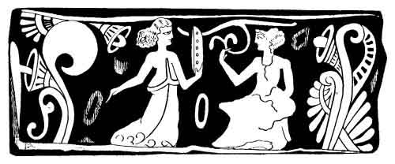
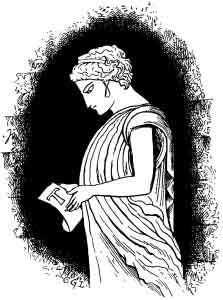

[Intangible Textual Heritage](../../index)  [Neo-Paganism](../index) 
[Index](index)  [Previous](err15)  [Next](err17) 

------------------------------------------------------------------------

p. 303

# CHAPTER III

### THE EXORCISM OF DEATH

"Begone, O Death! I fear thee not!"--*Song of the Reaper*, "*Des Knaben
Wunderhorn*"

"Carmen autem evocat: orium idem tradit . . qui pestem a suis aversam in
hastes ferret."--Livy, 1. viii

THE following very singular and uncanny spell involves
one of the deep secrets of the wise women which they do not make known.
It is entirely heathen, there being no trace of Christianity in it,
though it is used on an occasion when one would suppose that among
Catholics all the appropriate rites of the Church would be employed. It
turns upon the very

p. 304

ancient belief that death may be averted by an incantation pronounced by
a sorceress, and it is very interesting in several respects, as showing
the degree to which the old Etrusco-Roman sorcery still prevails in the
rural districts of Tuscany--albeit there is no lack of it even within
the shadow of the Duomo in Florence itself, as I well know.

I believe that I am not quite accurate when I call this "Etrusco-Roman."
For in fact the religion, such as it is, which forms the real faith of
the *strege* and their patrons, goes back to a time of which there is no
record. The Græco-Roman polytheism died before Christianity arose;
before that was the Etruscan, Oscan, Sabine, or Umbrian, and long, long
before these, the simple sorcery of the Tartar Shaman. And it is i, with
more or less picked up, by the way, from Etruscans here and Romans
there, but in the main just what it was thousands of years ago, which we
have to-day. But to the spell:--

"When one is very ill in a house, and death is feared, go to a witch and
say: 'I need a favour from thee; death will not come to my
*malato*--invalid.'

"'At mio malato non voglia far venire,  
E sono venuto da te a sentire,  
Perche tu bene me to possa dire.'

("'Death will not take my friend away,  
Therefore tell me as well you may,  
What one must do, what one must say?')

Then on the night when death is expected, the witch sleeps, and Death
appears to her in a dream, and announces to her that on a certain day
the invalid is destined for him, or will be in his power.

"Then on the night when Death comes for his victim, the witch takes a
pumpkin and makes in it eyes and nose, and two holes, and puts in them
two pods of beans, with the beans in them, to seem like horns. And when
Death is expected, the witch makes the sign of the horns (*la
jettatura*, called in Tuscany *le corne*), and--*si mette a
scongiurare*--begins her incantation, thus:--

"'O spirito di Morte indegna,  
Da questa casa tu ne puoi andare,  
Questo malatto nella notte  
Tu non potrai pigliare,  
Perche le corne a iettatura  
Ti sono venuta a fare!  
E appena l'alba sara spuntata,  
Il ammalato più non ti sarai guadagnato  
E dalla morte verra liberato!'"

"'Spirit of Death, to thee I say,  
Thou shalt not with thee bear away  
This suffering man, for at thee now  
The awful magic sign I throw; p. 305  
And when thou seest the morning dawn,  
Without thy prey thou shalt be gone,  
This time there'll be no gain for thee,  
And from thy power he'll be free!'")

This picture of the Witch defying Death is a very striking one, and it
may be studied as a subject by an artist I was assured that this is all
kept a secret from the priests; but that is the case with all the spells
described in this book.

Ovid describes in detail a ceremony which is essentially the same. There
was in Rome a feast of expiation to the Lemures, or spirits of death,
which was observed on the 9th, 11th, and 13th of May, and its object was
to conjure away death for the coming year.

"At midnight the father of the family walked barefooted through the
house, making with his fingers the sign which spirits fear--*Signaque
dat digitis, medio cum pollice junctis--occurrat tacito ne levis umbra
sibi*. (That is, he made *le corne* or *la jettatura*.) Then he washed
his hands with pure well-water--put *beans* into his mouth, and threw
them about the house without looking behind him, saying nine times:
'These I give, and with these beans I redeem me and mine!'

"Then he washed his hands again, and if he did this nine times,
repeating, '*Manes exite paterni*!' he could look around, for then the
ceremony was over."

The pumpkin-head is not mentioned here, but there are the beans and the
*jettatura*. But Prellcr distinctly declares that with the course of
time the ceremony of the Larvæ was more developed into one of terrible
apparitions, bugbears, or bogeys. "They accompanied it with imitations
of skeletons and ghastly figures." This identifies the Tuscan spell with
the Roman ceremonies, for the pumpkin is evidently meant to represent a
skull. Even in our times the hollow pumpkin, with a lamp on a pole,
being supposed to look like a skull with fiery eyes, is well known to
all rustics, and Brom Bones employs it in Washington Irving's Legend of
Sleepy Hollow to frighten Ichabod Crane. This means that Death is
frightened away by his own likeness. So among the Babylonian and
Ninevite peoples, as may be read in the Chaldæan Magic of Lenormant, the
great powers of evil among whom was Death, were more afraid of their own
likenesses than of anything else, for which reason horrible figures were
placed here and there to protect all houses. Mirrors are also a
protection against demons. I have also no doubt that though there was
really a fancy for the eccentric and odd in the Middle Age, still the
true reason for multiplying grotesque goblins everywhere was due to a
similar belief There is a strange kind of homœopathy running through the
lore of that time, a manifold application of *similia similibus
curantur*, the killing of witchcraft by witchcraft, the driving out of
devils by devils, the cure by the weapon which gave the wound, which
came to perfection in

p. 306

Paracelsus. This is not fortuitous, it occurs too frequently to be
accidental or a result of correlative causes, and I believe that this
primeval faith that Death was scared away by Death was the beginning of
it.

I believe, in fact, that just as lions and monsters for the base of
pillars can be traced back from Byzantine to Babylonian-Ninevite
architecture, so the placing grotesque images of imps, demons, and
goblins had a like origin in the same country, on the principle that the
devil shuns his own likeness. It is certainly very distinctly preserved
in this Tuscan Exorcism of Death. This belief explains the presence of
such vast numbers in Christian churches of those diabolically odd
figures which have so long been a puzzle to antiquarians. They were
meant to banish devils.

#### THE SPELL OF THE CRADLE

When I was born--it was in the city of Philadelphia--I had for nurse an
old Dutch woman named VAN DER POEL, who was supposed to be something of
a witch, or, like all old Dutch women, familiar with occult matters. One
day I, the babe, was missing, as was my cradle. The house was searched
in alarm, and at last I was found in my cradle in the garret. There were
lighted candles round it, an open Bible and a plate of salt on me. I
think there was a key or shears also, and money; but of this I am not
certain. It was explained as a ceremony necessary to secure my success,
or future happiness. Other and older printed authorities declare that it
will cause the infant to rise in life, the going upstairs being
symbolical of ascent; also that the person thus carried will become an
adept in occult lore, or sorcery and magic. From the *Journal of
American Folk-Lore*, June, 1892, I learn that among the descendants of
German colonists in North Carolina "the first time a baby is taken out
of its natal room it must be taken up" (stairs), "or it will not go to
heaven. If the door of the room steps down . . . then the person
carrying the baby must step on a chair or book with the baby in her
arms" (N. C. Hoke).

On relating this to a Tuscan witch she at once recognised it as a
well-known observance, and explained how it was carried out in the
Romagna, as follows:--

"In the Romagne there are witches good and bad. When they are attached
to any family or place, and know that a babe is born there, they enter
the house as secretly as they can and take the cradle (*culla*) with the
babe, and carry it up to the garret, or attic, that is, to the highest
room under the roof. Then the witch takes the sack (*saconcini*) of the
cradle, and lays the babe on it, and puts at its head coarse salt, and
the Bible, opened, is put at the feet. And then four gold chains and
four gold rings are put, one in every corner of the bed, and two lighted
candles are placed at the babe's head. Then with the chains the bed is
hung to the rafters (*sospesi al palco*), with the child in it, and the
witch repeats:--

p. 307

"'Io ho fatto questo  
Non per interesse mia,  
Sola per l'amore che porto,  
A questa famiglia che per quanto  
Sono gran di richezza,  
Ma che il suo figlie, più grande  
Possa venire di talento,  
E se lo ho messo sospeso  
Cosi in alto lo ho messo,  
Perche col suo talento possa venire  
La persona più alta  
E più importante di questo mondo.'"

("'This for myself I have not done,  
But for love to this little one,  
Not because his family  
Great or wealthy chance to be.  
But that he may rise, have I  
Brought him to this room so high;  
Thus may he by talents thrive,  
And be the greatest man alive!'")

Truly a kind wish, and if it always took effect there would be no lack
of talent in the world. In the Italian ceremony the benevolent witch
must, after repeating the invocation, depart without looking behind her,
and not return to the house that day, which latter condition is of
ancient Latin origin. This incantation was repeated in prose, not sung.

#### DIVINATION WITH LEAD

The custom of divining by means of melted tin or lead dropped into water
is, as FRIEDRICH remarks, of great antiquity, as may be inferred from
the fact that it has long been known to every race acquainted with these
metals. The ceremony consists of melting the lead (wax was also used
among the Latins), dropping it into water, and inferring future events
from its shapes. Then these were taken to bed by the person for whom the
oracle was destined, when, by the influence of the image, a dream would
confirm what its appearance predicted. It is barely possible that it
might have entered into the heads of people in different countries to
divine by the shapes which melted metal would assume, but that they
should all conceive taking it to bed "to dream on" is inconceivably less
probable than that it was transmitted in superstitious times from race
to race. This theory of sporadic or independent invention of myths,
customs, and superstitions has been carried of late to such
extravagance, that if we accept it all we must believe

p. 308

that barbarous man, long before he had thought of anything else,
developed all alone, wherever he existed, all the folk-lore which we now
have, and that he zealously confined it to his own race, wherever he
went! For the ideas which "naturally occur" to savages and peasants are
very few indeed, as those know who have lived among them, and as is
proved by those of the Romagna, who seem to have no superstitions which
are not as old as the days of the Romans.

Their manner of divination by means of melted lead is as follows: It is
of some importance, because it is not only elaborate, but, as can be
shown by analogy, it is very ancient in every detail:--

"You must take three seeds of a rose, three leaves of nettle, two leaves
of rue, and three seeds of cummin. Put all these together. Then take
lead, and at midnight light two tallow candles, binding them with a
(red) ribbon. Then take a plate, put the lead and the herbs on it, and
the herbs last, that is to say, put the plate on the fire, and when the
lead is melted put the herbs on it. Then pour the lead into water, and
see what forms it takes.

"Should it take the form of a river (*fiume*), it is a bad sign. But
this may be used to throw into the house of an enemy to do him evil.

"If the lead can be thrown into running water, and if it take the form
of a baptismal font (*fonte*), it is a very good omen, and should be
kept in a red bag, and this must be bound to the frame of the bed, or,
better still, be put into the bed, care being taken that no one touches
it.

"When the lead and the herbs are put into the plate one should say:--

"'Lo faccio per vedere  
Se verra la fortuna  
(O sfortuna) in casa mia.'"

("'This I do that I may see  
If good (or bad) luck will come to me!'")

I have another description of this ceremony, which is more in detail:--

"Melt the lead and put the seeds of roses, leaves of rue, and three
seeds of cummin on it. At midnight light two candles connected with a
red ribbon. When melted, hold the plate out of a window, saying

"'O strege, strege!  
Che la granata non potete vedere  
Io ve la levo per farvi piacere  
O strege, che di Venerdi  
Siete beate,  
Queste grazie me potete fare,  
E questa grazia mi farete  
Se volete,  
Se questa gra(zia) voi mi fate,  
Che il mio piombo mi faccia la forma  
    Diu na fonte . . . significa p. 309  
Anderanno bene le cose mieie,  
Si il piombo fa la forma  
Di un fiume e segno  
Che le cose vanno molto male.'

("'O witches, witches!  
Who cannot bear to see a broom,  
I have removed it to please you!  
O witches, who are happy on Friday,  
Do me this favour; ye can if you will!  
That my lead may take the form of a font,  
Which is a sign that all will go well;  
But should it he a river, 'tis a sign  
That no good fortune now is mine.'")

This was chanted so irregularly and so mingled with ordinary
conversation that I could not clearly distinguish between the spell and
the explanation. Then my informant resumed as follows:--

"Put the font into a red bag, and throw this into the house of one to
whom you wish good luck, and say:

"'Non vi butto il piombo,  
Ma la felicita  
Che venga in casa vostra!'

("'It is not lead which here I throw,  
But happiness,  
That it into your house may go!')

But to harm an enemy, throw the river into his house, and say:--

"'Non butto il piombo  
Ma la sfortuna,  
Che vengha in chasa tua,  
Che tu non possa avere  
Pace ne bene!'

"' 'Tis not lead which here I throw,  
But evil fate, that ye may know,  
E'er the spell of fate be o'er,  
Peace and fortune never more!')

"If the lead forms a river, or the bad sign, to avert it, put the lead
on the chimney-piece or in some corner, and put on the fire some of the
herb which is called, in Romagnola *felchsa*, in Italian *frecce*
(fern). It is a plant which causes great suffering to witches. And while
it is burning say:--

"'Bruccio questa robba,  
Perche voi altre streghe maladette  
Non potete avere mai bene,  
Perche io vi cerchato una fortuna  
Che non me l'avete voluta dare!'"

p. 310

("'This plant upon the coals I burn  
To do ye witches an evil turn.  
May every evil come to ye.  
I asked a favour, and I see  
That none from you has come to me!'")

I believe that this formula of mixing the lead with the ashes of the
herbs and seeds is the true ancient Roman-Etruscan one, because rue,
nettles, cummin, and rose-seed entered into the oldest incantations with
which we are acquainted. But what makes the ceremony complete and most
curious is the burning the *fern leaves* to destroy the influence of the
witches. It was specially explained to me that it was very powerful
against all sorcery and evil influences, and in every way a mysterious
and strange herb. Of it FRIEDRICH says:--

"There are very many associations of sorcery, marvels, and superstitions
connected with this plant, most of which are kept secret. . . . The
scale-fern is especially regarded by the people with great respect,
because many virtues are attributed to it--especially as a power against
evil spirits. Its roots are used in invoking those which are good or
evil. The five scales on the stalk, which are supposed to resemble a
hand, are called the hand of luck, or John's hand, and are carried as a
protection against misfortune or sorcery."

Should the lead and ashes, &c., simply amalgamate into one piece, it has
no special meaning.

Divination with lead means the making of forms or figures by the aid of
incantations, and it is therefore closely allied to the same by dropping
the white of an egg into water, and judging from the shapes which it
assumes what the future will be as regards a question asked. This is
world-old and world-wide, but in Tuscany it is practised as follows:--

"Take a glass of water at midnight, exactly. Let fall into it the white
of an egg, and say:--

"'Faccio quest' uovo,  
Perche che tu maladetta strega  
La fortuna tu possa darmi  
Un spiegazione  
Sopra questo uovo,  
Te lo lascio fuori di finestra  
Venti quattro ore  
Che in abbia il tempo  
Di farmi vedere  
La mia fortuna!'

("'I show this egg, curst witch, to thee,  
That I in turn my fate may see.  
For a day at thy command,  
On the window it shall stand,  
That my fortune I may know:  
That it shall my future show!')

p. 311

"After twenty-four hours consider it closely. If it shall have taken the
form of a burying-ground, means a death in the family; if it show a
church and a priest giving the benediction, it means a wedding. Stars
presage happiness. And if the lineaments of any person can be traced, it
means good fortune from that particular person."

The witches who attend to the egg-prophecies must be a singularly
amiable class of ladies. They are addressed with a curse, and then
modestly requested to take the trouble to arrange a prediction!

#### DIVINATION BY OIL

"Est enim evangelium signum pacis et saluberrimum OLEUM gratiæ et
misericordiæ divinae."--COQUIUS, *Histor. ac contemplatio sacra
Plantarum*. Vlissing, 1664.

There are in the streets of Florence, not far from the Signoria, houses
which were, possibly, old in the time of Dante-who knows?--or who knows
the age of anything in this land where relics of even prehistoric
culture abound, and nothing seems so strange as the new? Into one of
these houses I entered--into total darkness--felt my way upstairs to an
invisible door--knocked, and entered a large room only divided from
another by a large ancient arch. There was but a half-light from a
single window, and the whole formed a very Rembrandt-like picture. At
the table sat the fortune-teller, and before her was a glass of water
into which, with strange gestures while uttering incantations, she was
dropping oil from a bottle.

"*Che fai*--what art thou doing, daughter of a thousand witches?"

"I am making an *incantesimo*--an incantation--with oil. Do you want to
learn how to do it?"

Yes, I wanted to learn. I knew that the divination by oil was prohibited
by law and gospel, church and state, even in the edicts of Charlemagne,
and that it was in all times one of the *secreta rariora* which the
witches kept for special occasions. The author of the *Trinum Magicum,
sive Secretorum Magicorum Opus*, published in 1611, tell us: "*Aliqui
itidem aquam in vitreum catinum effundunt, oleique guttulam admiscent et
sic in aqua mira se cernere posse putan*t." In English: " Some again
pour water into a glass basin, mixing therewith a drop of oil, and so
think they see marvellous things in the water." Which was all he knew
about it, since if he could have told more he would assuredly have done
so.

The whole oracle was, however, duly, sincerely, and thoroughly consulted
in my presence, and it runneth thus, as I wrote it down, step by step:--

"Take the flask with oil--a small one--make with it thrice the sign of
the cross on the head and face, saying

p. 312

"'In nome del cielo,  
Delle stelle e della luna,  
Mi levo, questo malocchio (o altra cosa),  
Per mia maggior fortuna!'

("'In the name of heaven,  
Of the stars and moon,  
I pass away this trouble  
For better luck and soon!')

Then with the same bottle or vial, make three crosses with the right
hand over the glass of water, exactly from side to side, also making the
*corna* or *jettatura* with the forefinger and little finger of the left
hand extended, and the middle and ring-finger closed, or held by the
thumb. And these extended fingers rest on the edge of the tumbler.

While doing this the *strega* repeats:--

"'Befania! Befania! Befania!  
Chi mi ha dato il malocchio,  
Me lo porte via!'

("' Befania! Befania! Befania!  
Thou who didst cause this trouble,  
Bear it away from me!')

"Then pour in, or let fall, very carefully, three drops of oil. If they
combine at once, it is a good sign, or an affirmative to any question.
If you wish to know whether you are to find what you seek, or meet a
friend, or anything of the kind, all will go as you desire. But if the
three drops remain apart it is a bad or negative sign.

"Then to thoroughly explore all the chances, this ceremony is renewed
three times. And every time throw the water and oil into the street, or
a court. Should a man be the first to pass, all will yet go well. If a
woman, the omens are still unfavourable. And then once more make the
*castagna* or chestnut, the sign of the thumb between the fore and
middle fingers, which is far more potent than the *corna*" (even the
early Roman writers call it terrible); "note that this also is on the
edge of the glass, with the left hand, while with the right the oil is
dropped skilfully so as to make a cross of oil, or spots of oil across
the water (which has been renewed). Then cross the head and face three
times with the oil, repeating the Befania invocation three times as
before." (All of this was done with incredible quickness.)

"And if, after all, the oracle is unpropitious, drop into the glass
about a teaspoonful of salt, and repeat the formula of 'Befania.' Should
the oil turn of a whitish colour, this is a sign that the Befania
relents and that all may yet go well."

But if she be deaf to every spell, nor heed the sacred salt, then drop
into the glass a hot coal-the last desperate resource of diabolical
recklessness.

"Flectere si nequeo superbos Acheronta movebo."

This mixes the oil and water despite of all the devils. And this done
you go forth with the fierce, proud feeling that though every omen is
against you you are to prevail by a strong will. But ere departing there
is still something to be done. You express your gratitude to the Spirit
of the Fire, which is short but extremely heathen, and I have no doubt
very ancient:--

p. 313

"O fuoco benedetto,  
Chi brucia immensamente,  
E bruce tutte le gente,  
Ti prego di brucciare  
Questo malocchio,  
E chi me l'ha dato!"

("O blessed Fire,  
Thou who burnest so immensely,  
Thou who warmest all mankind,  
I pray thee to burn  
This evil spell,  
And the one who smote me with it!")

Then, as in old Latin rites, the coal and all must be thrown into a
running stream, and you depart without looking behind you. "Fers cineris
Amarilli foras, rivoque fluenti, transque caput jace, ne respexeris."
The reader will find by comparison that this charm has much in common
with the Divination by Ashes.

I must confess that I greatly admire this species of divination, and
have perfect faith in the last, or hot coal, portion of it. The witch
had by her side a *scaldino*--an earthenware brazier in the form of a
basket--just as her ancestresses always had in the days Of VIRGIL, and
perhaps long before the time of TARQUIN, and when the coal went hissing
into the oil and water her face had the beautiful expression of a
sorceress defying a fiend. It was a fine picture, and a great artist
would have appreciated the flashing black eyes under a thicket of
tangled hair--and my mind darted from the witch of Vesuvius to VIRGIL
and APULEIUS and THEOCRITUS--who had all seen the same antique and
terrible face--doubtless in the *orgasme* of the hot coal!

Other oracles and incantations "say their say," give you a "yes", or
"no," and are done with it. But in *this* you begin amiably and smoothly
with the oil, and a gentle, if heathen, incantation to the planets. You
give Fate every chance, and are prodigal with magical courtesies, or
ceremonies. But you do not give it up should the reply be unfavourable.
Not at all. You proceed to the greater piquancy of salt. Salt is polite
too--but there is an intimation in it that there is an iron hand under
your velvet glove--that you mean business and will see the thing out.
And then--salt failing--comes the red-hot coal. Should the sky fall you
will hold it up with your spear, and defy the devil. In other words,
that which was to have been, may be *compelled* to take another course
by means of persevering in enchantments. Which corresponds to prayer and
penance--in all religions whatever--all of which teach that the future
may be changed or formed to suit those who are "good."

It may not have occurred to many readers to reflect that what all such
divinations

p. 314

as this are equivalent to, is *prayer*, accompanied by formalities. When
religious people--as is very often done in America--hold meetings to
pray for a certain object or purpose, it is quite the same as if they
divined with oil and salt and invoked Befania. In the year 1859, when
THEODORE PARKER was extremely obnoxious to the rigidly orthodox of all
sects, a number of very Presbyterian pious ladies held meetings for the
purpose of praying that he might be taken away from this life; and his
death, soon after, was attributed to the fervency of their zeal. No
secret was made of this--it was boasted of in religious newspapers. I
was at the time editor of *Vanity Fair* in New York, a lady wrote a poem
gracefully satirising this Voodoo work, and I drew for it an
illustration, which I published. I do not see wherein this piously
praying a man to death differs from the very wickedest witchcraft
described in this book.

Every effort to beg or force from the Unknown or Supernatural certain
knowledge or favours, be it by prayer, fasting, incantation, or
ceremonies, is *sorcery*--call it by what name we will. From the
beginning of time men have tortured and put one another to death for
employing different methods of conjuration, the Catholic has burned and
imprisoned and made miserable to death literally millions, the Mahometan
and Brahmin and mild Buddhist have all done their best in the same
work--and not one of them has ever reflected that they were all only
shades or clouds of the same primeval witch and devil's darkness.

There is a rising light which will in time dissipate it all. This is the
sun of science. And on every side we hear petitions that the majority of
men shall still be kept in the old darkness, somewhere or in some way.
"There must be a religion--what would the *multitude* do but for a
religion?" (I never met, by the way, in all my life a man who really
considered *himself* as belonging to "the multitude.") Or, "Would you
take from man his tenderest belief--from the little child its faith in
angels and a God, &c?" To which the answer is plain and clear--which is,
that if the parents know enough to be exemplarily honest in all their
mutual dealings, and how to teach the child to be likewise, the proper
form for instinctive sentiment of any kind will never be wanting; for it
is in humanity.

There is another method of using oil, not for divination or warring oil
witches, but to bewitch, that is to fascinate men. It consists in
stealing from a church some of the oil of baptism, if you can get it--if
not, that which is blessed and put into the lamps before the Virgin or
saints will do quite as well. And if a girl anoints her lips with it,
the man who kisses her

"Will be seized with a wild, strange love;  
He'll heed not the dark world beneath him,  
He'll heed not the heaven above."

p. 315

No--all and everything will be lost in a delirium of devotion to the
*demoiselle à l'huile* before him, compared to whom the best sardine is
as nothing. He must have her without regard to expense. Now as it is the
great end and aim of all Italian (and much English) woman-nature and
life, to produce such feelings in men, it is not remarkable that this
oil-stealing is carried on to a great extent. It is a very ancient,
unholy custom, and is regarded as being to the last degree sacrilegious
by the priests, who look upon all kinds of magic and sorcery--save their
own--as doubly damnable. PAULUS GRILLANDUS who, in his time, as he
proudly informs us, ordered the torture and burning alive of hundreds of
heretics and witches, tells the following tale, apropos of naughty girls
who steal the holy wafer to make love-charms. In his work, dated 1547,
he relates that:--

"It is not now a year ago since I saw and examined two shameless and
lewd women (*due impudice mulieres*) at Rome, who were held captive by
the Reverend lord *locum tenens* of the Reverend D. Vicarii
Papæ"--(GRILLANDUS was "in society" about that time and wished to show
his skill)--"and by *examining*"--(this kind of examining meant rack and
red-hot pincers)--"I found they had taken the oil of baptism, and
anointed their lips while speaking these words: *abrenuncio tibi*; which
being done, if they kissed men, these would love them. But despite all
their craft, they atoned for their crime by suffering the extreme of
condign punishment."

This means, darkly, something worse than rack and burning alive, or
*convicta et combusta*, for to this holy griller, GRILLANDUS, such
punishment was a mere common-place.

However, in spite of church and stake, girls in Italy have kept on doing
it--*i.e.*, stealing oil--and no great wonder either, since the fear of
torture and the certainty of hell everlasting would never prevent any
true daughter of Eve from doing anything which would attract admiration.
And this is the way it is now worked, as described to me by one who was
familiar with the process:--

"When a woman wishes to inspire sincere love in any man, she should go
into church while the priests and women are singing the benediction, and
from a lamp burning before a male saint (*pure che non sia una santa*),
take from it three drops of oil, which must be blessed, but only with
the forefinger, and put them in a little dish or plate (*piattino*), and
say:--

"'Non prendo questo oglio  
Ma prendo la benedizione  
Da questo santo . . .  
(*Secondo il nome del santo*)  
Perche questa benedizione  
Vada sempre al mio amore,  
Che non possa partirsi mai  
Da questo mia, cuore!'"

p. 316

("'I take not oil for my affliction,  
But I take the benediction  
From this saint . . . (the name is here given)  
That it may move the man I love,  
And that he may ne'er depart  
While he lives from this my heart!'")

Then the little dish should be carried home and very carefully hidden so
that no one may see it, and for three Fridays in succession the lips
must be anointed with the oil. And, kissing her lover on the lips, the
girl must say:--

"Io ti baccio e ti baccio sinceramente,  
E sempre nascosto delle gente,  
Io ti baccio di vero cuore,  
E ti baccio di vero amore,  
E questo santo . . . mi vorra aiutare  
Che tu pure tu mi possa amare,  
E presto tu mi voglia sposare."

("I kiss thee, love, and most sincerely,  
In secret, for I love thee dearly,  
I kiss thee from my very heart,  
I kiss thee, dear, with truest love,  
And may Saint . . . for his part,  
The witness be my truth to prove  
That thou mine own shalt ever be,  
And that, ere long, thou'lt marry me!")

For doing and saying which trifling thing young girls were torn with
red-hot pincers, their joints pulled out of socket by the rack, hot oil
poured all over them (vide HORST, *Dæmonomagia*, SPRENGER, &c.), and
then were burned alive. That is, at Rome before the Pope, by his order,
when the Roman Church was in the full plenitude of its power,
*infallible* wisdom, and Christian philanthropy, light, and sweetness,
meekness, and mercy.

I believe that this modern Italian ceremony gives the whole truth, and
all the veritable details of the oil-stealing. I do not believe that any
such words as *abrenuncio tibi* were ever uttered. The priests in their
accusations always declare that the witches were always renouncing and
denouncing Christianity, but of all this there is hardly a trace in the
practices of the witches, as truly set forth by themselves; and
considering how they were treated, it is wonderful that they did not
abuse it on all occasions. The object of stealing the oil was to get the
mysterious occult virtue or power of the benediction uttered by the
priest, else why would it be stolen at all, and what sense would there
be to take it while denying its power? True, there is not much sense of
any kind in the whole

p. 317

proceeding, be it on the part of priest or witch, but what there is is
with the woman, who wished for nothing cruel or inhuman, but only to get
a sweetheart.

It is not magic, or sorcery, or witchcraft, when a *priest* pronounces
an idiotic incantation or spell or benediction over oil, to burn before
a lamp, or touch up a sinner with it on his death-bed. But if a girl
takes a few drops of this same enchanted liquid to attract a lover it is
a crime-deadly mortal sin. &c.

It is related that during the first occupation of Paris by the allied
army, the Cossacks not only drank the oil of the street lamps, but that
in the plenitude of their impiety they even drained to the dregs all
which was in those of the churches. Now, if stealing only three drops of
the *oleum benedictum* by a foolish young girl deserved all the tortures
of the Sacred Inquisition--and after that a passage "through flames
material and temporal unto flames immaterial and eternal"--what *should*
have been decreed to a dirty, bristling savage,
sinful-with-all-the-sins, heretic of a Cossack who "topped off" the
whole lamp? Imagination shrinks appalled before such tremendous
wickedness. When you have sent your milliner, or servant-maid, or
"female," to the Byss of the Abyss (as JACOB BÖHME calls it), of the
hell of hells, what *can* you do with the *greater* malefactor? Let us
reflect!

And a strange moral lurks behind it all. I, reader, have been--and for
that matter thou with me in the spirit--in an unholy conventicle of
witches where, according to the general testimony of all the great and
wise and good men living two hundred years ago, Satan himself was
present glowering over us who were--

"Seeking awfully by night  
An infernal base delight."

And we performed ceremonies which are distinctly described as damnable
by all the great authorities of both churches, Catholic or
Protestant--authorities, mind you, such as Luther--who are yet to-day
absolutely believed in, and deferred to. Yea, with this oil, and coal,
and hot water, and church-lamp business we damned ourselves outside of
all redemption, through all the colours of the rainbow from A to &c.
Behold, O reader, what I went through for thy sake! "Matter of
breviary," quoth Friar John.

#### PYROMANCY AND INCENSE

"Das Feuer ist heilig, und wird göttlich verehrt weil es ein reines
Element ist, und deshalb mussten seine Priesterinnen auch reine
Jungfrauen sein."--"Das Feuer," J. B. FRIEDRICH, *Symbolik der Natur*,
p. 60.

"Sic in igne præter alia elementa, sacra omnia insistebant, quod is,
crecto proximus coelo sit."--*Polydore Virgil de Inv. Rerum*.

The author of the *Trinum Magicum* (1611), referring to old Roman
divination, describes minutely that by fire. He tells us that:--

p. 318

"There is also *Pyromantia*, in which powdered resin was thrown into the
flames. If the flame rose in one, it was a good sign; if lambent and
divided, unfortunate; if in three points, a glorious *eventum* or
result; if much dispersed, an ill death; if crackling or snapping,
misfortune; if it was very suddenly extinguished, great danger."

Resin here includes or means frankincense.

The identity of the modern pyromancy in Tuscany with that of the old
Roman, whether it be by observation of flame, or by putting grain,
frankincense, or poppy leaves on coals, is very remarkable. They were
narrated to me as follows:--

#### FLAME

"Let the wood be lighted, and if in doing this the fire ignites with
difficulty, or makes ugly (*brutte*) or little flames, it is a bad sign,
either as regards events or what we may have in our mind. In the Romagna
the old men say if you would know how a thing will turn out, you must
study the fire attentively. If it burns well, all will go well; and if
ill, they will end badly. [1](#fn_37)

"If it burn with *one* flame clear and fine, it is a sign of good
fortune. Several flames, or now on one side and then on the other, with
a snapping, mean that relations or friends will soon come to visit you.

"And before consulting the fire, if you wish to get very decided omens,
repeat this:--

"'Fuoco, Fuoco benedetto!  
Alla casa mia fortuna aspetto,  
E sempre a te vengo sperare  
Che l'augurio di buono,  
Fortuna tu mi voglio dare!'

("'Fire, Fire, blessed Fire!  
Unto fortune I aspire,  
So I hope that I may see  
That thou still wilt truly be  
A fortune-giver unto me!')

"And coloured or varied flames are like broken ones."

This recalls, and that very vividly, a passage from the *Œdipus* of
SENECA:--

"*Tir*. Quid flamma? largus jamne comprehendit dapes?  
*Man*. Subito repulsit lumen, et subito occidit.  
Tir. Utrumne clarus ignis, et nitidus stetit,  
Rectusque purum verticem coelo tulit,

p. 319

Et summam in auras fusus explicant comam?  
An latera circumserpit incertus viæ.  
Et fluctuante turbidus fumo labat?  
*Man*. Non una facies mobilis flamma fuit,  
Imbrifera quales implicat varios sibi  
Iris colores, parte quæ magna poli  
Curvatæ picto nunciat nimbos sinu.  
Quis desit illi quisue sit dubites color:  
Cæmlea fulvis mista oberravit notis  
Sanguinea rursus, ultimum in tenebras abit  
Sed ecce pugnax ignis in partes duas  
Discedit--  
Immugit aris ignis et trepidant foci."

This corresponds accurately to the modern omens and incantation.

#### GRAIN ON COALS

"There was," observes the author of *Trinum Magicum*, "another kind of
Captromancy. For either grains of sesame or of black poppy were thrown
on hot coals, and from the smoke rising from them omens were drawn, as
DION CASSIUS observes." In Tuscany the divination is now as follows:--

"Take from the crop a few grains (*chicchi*), lay them on the coals, and
if they burst or pop well (*scoppira*), it is a sign that the crop for
the next year will be a good one. And if they do not burst it will be
bad. And poppies are used--but I know nothing about that."

This is perhaps the real method anciently followed.

Anciently wheat or barley, or poppy-pods were used, but as it was found
out in later times that Indian corn, or maize, exploded or "popped"
better, it has been substituted. The following is a more detailed
account of this augury:--

"Take some grains of *gran Turco*--maize--and put them on a plate, and
that on the fire at midnight and say

"'Metto questo gran Turco,  
Quanti diavoli siete  
Vi scongiuro che mi dite:  
O mi fate sapere,  
Se il mio amore  
Oggi mi viene vedere;  
Mi amore mi ama,  
Mi vuol hence mi sposerá,  
Questo, gran Turco tre cambiamenti,  
Tre cambiamenti mi fara:  
Se mi ama il gran Turco  
Fara la forma di un cuore, p. 320  
Se mi sposera fara la forma,  
La forma di un fiore;  
Ma si non mi ama,  
Fate diavoli maladetti  
Che il gran Turco non faccia forma  
Ne di cuore, e ne di fiori!"'

("'I put this corn, devils, to see,  
However many ye may be,  
I conjure you that you may tell  
Me if my lover loves me well;  
So make him come this afternoon,  
And if he means to wed me soon:  
Therefore I pray you make  
This corn a certain form to take  
Should the grain be like a heart,  
He from me will never part;  
Should the shape be like a flower,  
Soon will come the nuptial hour  
If he love me not at all,  
Then the devil take it all!  
If he love not, let there be  
Neither flower nor heart for me!'")

#### INCENSE ON COALS

This is used to ascertain who has bewitched any one or to remove the
evil spell.

"Take a *scaldino* (a receptacle of glazed crockery like a basket in
form), with charcoal glowing hot, and then take incense and cummin, and
put them on the coals. Then with a large knife in the left hand, the
*scaldino* being held in the right, go into all the rooms and above and
below the bed, pronouncing all the time the benediction. And with this
knife stir the contents. And as the cummin and incense burn, repeat:--

"'Non buco questo incenso,  
Ma buco il corpo, l'anima,  
E tutti i sentimenti  
Del corpo di quella infame,  
(O del infamo),  
Che mi ha messa  
La mala fortuna  
In casa mia!'

("'I do not pierce (or stir) the incense,  
But I pierce the body, the soul,  
And all the feelings  
Of the body of the wretch  
Who has put bad fortune  
Into my home!')

p. 321

"When all the incense is burned, put into the scaldino a leaf of yellow
paper (always yellow), and two nails tied in the form of a cross. If you
do not know who has done the harm, throw the incense and coals into a
running stream or into a river. But if you suspect any person, you have
the scaldino and nails carried into his. or her house and hide it under
the roof where it cannot be found. Do not forget to have in it the
crossed nails. Then the guilty person will be compelled, or impelled, to
undo the harm or spell; she or he will have no rest till this be done."

It is understood in this that to succeed the incense must burn freely.
In the old Roman oracles ("huc illud pertinere puto de Nymphæ o prope
Apolloniam") the incense was taken, the prayer or incantation uttered,
and the incense thrown on the fire. If it was all burned the omen was
favourable, also if it snapped out of the fire and burned, or the flame
followed it, all was still well. This did not apply to probabilities of
death or marriage--*morte nuptiisque exceptis*.

Though different as to the method and objects, there is quite enough in
common between the ancient and modern ceremony to warrant the conclusion
that the latter was derived from an old Roman source.

There is also another very interesting and evidently very ancient
incantation with burning incense, intended to remove an evil of any
kind, or to invoke good fortune from the mysterious witch known as the
Befania.

"Take frankincense, both of the best and the inferior kind, also cummin
seed. Have ready a new scaldino, which is kept only for this purpose.

"And should it happen that affairs of any kind go badly, fill the
scaldino (or earthen fire-dish) with glowing coals, then take three
pinches of best incense and three of the second quality, and put them
all *in fila*, in a row, on the threshold of the door. Then take the
rest of your incense and the cummin, and put it into the burning coal,
and carry it about, and wave it over the bed and in every corner,
saying:--

"'In nome del cielo!  
Delle stelle e della luna!  
Mi levo questo mal d'occhio  
Per mia maggior' fortuna!  
Befania! Befania! Befania!  
Che mi date mal d'occhio maladetta sia  
Befania! Befania! Befania!  
Chi mi ha dato il maldocchio  
Me lo porta via  
E maggior fortuna  
Mi venga in casa mia!

("'In the name of heaven  
And of the stars and moon,  
May this trouble change  
To better fortune soon!  
Befania! Befania! Befania! p. 322  
Should this deed be thine;  
Befania! Befania! Befania!  
Take it away, bring luck, I pray,  
Into this house of mine!')

"Then when all is consumed in the scaldino, light the little piles of
incense on the threshold of the door, and go over it three times, and
spit behind you over your shoulder three times, and say:--

"'Befania! Befania! Befania!  
Chi me ha dato il maldocchio!  
Me lo porta via!'

("'Befania! Befania!  
Befania! I say,  
Since thou gavest this bad luck,  
Carry it away!')

"Then pass thrice backwards and forwards before the fire, spitting over
the left shoulder, and repeating the same incantation."

There is in Tuscany a spell against gossips, backbiters, slanderers, and
spreaders of evil reports. It is as follows:--

"Against people who chatter evil against us (*le persone chi ciarlano
sui nostro conto*), take incense with the two fingers and the thumb
(*con tre dita*) and put it on the threshold of the door and at the
window, put a distaff and a spindle with the weight (*penzoloni*)
hanging down, and then set fire to the incense, and say:--

"'Incenso, Incenso!  
Che bene tu possa bruciare!  
E coso possono bruciare  
Le male lingue che ciarlano,  
Tanto di me, e appena  
Tu sarai bruciato,  
La rocca e il fuso  
Dalla finestra me ne andero a levare  
E anche quelle voglio bruciare,  
E cosi bruciare, e cosi bruciare,  
Pure quelle male lingue  
E di me non tornerrano più a ciarlare,  
Fino che la rocca e il fuso  
Come prima non tornera, questo come prima,  
Non potra mai tornare;  
E le linguaccie indegne  
Male di me non più potrano parlare!  
E cosi bruciare, e cosi bruciare,'" &c.

("'Incense, Incense!  
Mayst thou burn well!  
And so may burn, and so may burn  
The tongues who speak ill of me! p. 323  
Thou shalt be burnt,  
Then will I take from the window  
The distaff and spindle,  
Them too will I burn,  
And so may burn, and so may burn,  
Those evil tongues; may they ne'er return  
Unto their gossip till the distaff  
And spindle turn as once before!  
May neither turn again!  
And so may the vile, unworthy tongues  
Never speak ill of me again.  
And so may burn,"' &c.)

There is a certain classic Latin air in this invocation, a rude strength
and an ingenious expression in *tornerano*--turning and returning--as
applied to the spinning and the tongues, which is really poetical. But
what is most interesting in it is its similarity to an incantation
described by OVID. An old woman, he tells us, conjures as follows to
protect all present against slanderous tongues and the evil eye. First
she takes with three fingers three pinches of incense, and puts these
under the threshold in a mouse-hole. Then, while murmuring incantations,
she wraps woollen thread round a *reel* of dark colour, while moving
seven beans in her mouth. Finally she takes the head of a fish called
*mana* (*anima*) smeared with pitch and penetrated with a bronze needle,
sews up its mouth, and dries it by a fire into which she pours some
wine, and drinks the rest of it with the girls present. This is the
version of PRELLER, but from one line I understand that the reel means
distaff, spindle, and the leaden *penzolono*. "Tum cantata ligat cum
fascio licia *plumbo*."

PRELLER suggests r*hombo* for *plumbo*, but the weight is generally of
lead. However, all things considered, it is pretty clear that in both
ceremonies we have three pinches of incense, with the distaff and
spindle--all against slanderers.

The distaff and spindle formed an important part of classic magic, and
as PRELLER remarks, "Spinning and turning round belong in their nature
to sorcery." There is a curious illustration of this in the following
Romagnola recipe for constructing a magical scarecrow:--

#### "TO KEEP GOBLINS AND FAIRIES FROM STEALING FRUIT

Take red rags, and with them, and with a distaff and spindle, make an
image like a little old woman. Put two of these in the field or
vineyard. Then put two brooms to make a cross, and say

"'Se e uno spirito a fare,  
Che la frutta mi viene a sinpare,  
O tu veechia me li vorrai discacciare, p.
324  
Se poi fossero strege ho granate,  
Che in croce vi ho messo, mandate  
Indietro tutte le strege e stregoni,  
Che non vengono a mangiarmi i pomi!'"

("'If thou, goblin, art a fairy,  
Who hast stol'n my fruit--beware ye  
The old woman there shall scare ye!  
Or should they perchance be witches,  
There's a cross of broomsticks, which is  
Powerful, and with them grapples  
When they come a-stealing apples.'")

Should the reader think there is a ring of HERRICK in this, he may also
remark that it is fully as apparent in the Italian as in my translation.

It is believed in the North that a witch can be discovered by means of
fire. WOLF (*Deutsche Märchen und Sagen*) relates that when the children
of a peasant are bewitched, a fire is made. Should the flames unite and
form one--just as in the Italian incantation--the first person who
enters the house will be the witch.

"Little Lady Rosy-hood  
In the fire-place lives;  
Eating only coal and wood,  
Heat to all she gives.  
Bobbing up and dancing,  
Merry all the day,  
But when the wood is ashes,  
Then she no longer flashes,  
And in smoke she flies away."

#### THE SPELL OF THE LAMP

At the festival of the great mother of all life, Neith, the Egyptians
burned lamps in which were oil and salt--and this signified the new life
of the year. For salt symbolised the creation of life, and the light
that it came forth from darkness into existence; therefore this did well
suit that festival."--FRIEDRICH, *Symbolik der Natur*.

The picturesque Italian lamp, consisting of a long upright brass rod, up
and down which slides the cup with generally three wicks, the rod being
supported on a base, is of Roman origin, and well known to all
travellers. It is used in magic as follows, when a babe is bewitched, to
find out who has laid a spell on it:--

"Take a *lampada*, *detta lucerna*, such a lamp as is called a
*lucerna*, and having lighted all three of its wicks put it on a square
table with a sharpened knife and three pins.

p. 325

"Then at midnight, seated in a chair by the table, make the sign of the
*jettatura* (*le corne*). And, wishing to know the name of the person
who has bewitched anybody, you go to sleep, and it will be revealed to
you in a dream. But first repeat the following:--

"'Mary, blessed Virgin, if the illness of this child (or other person)
comes from any illness, come to me in sleep. Mary, blessed Virgin, I
commend myself to you to do me the favour that he may soon recover. But
if he be bewitched by any one, then, oh devil unchained from hell,
extinguish one of these lamps and make me to know who was the cause of
this illness, and if it be a witch that I may know her name, and that I
may find her in the form of a cat, and her life at longest may last only
three days.'

And this being done the one bewitched will recover in three days, and
not be so afflicted again."

This singular mixture of invocation to the Virgin and the devil was
further confused, apparently by the narrator's imperfect memory of the
incantation.

There is another method of using the lamp, by which names are given or
signs indicated b the lights going out, each light being first named or
numbered. This leaves the snuff of the wick smouldering, and magic used
this also in incantations. Thus Marcellus gives the following (94,
GRIMM, p. 25):--

"Si quem coire noles, fierique cupies in usu venerio tardiorem, de
lucerna quæ sponte exstinguetur, fungos adhuc viventes in potione ejus
exstingue, bibendamque inscio trade: confestim enervabitur."

Which is to the effect that to deprive a man of his virile power you
must give him wine to drink in which the glowing snuff of a wick has
been extinguished.

In Tuscany there is the following, used for any illness:--

"When any one is ill, let a lamp be placed in his room, one burning oil,
and small (*una lucernina sempre se e possibile*), and when it goes, or
burns, out, take the long, round snuff (*moccolaia*) and put it into
wine, and give this to the invalid to drink. Should he drink it
voluntarily he will get well, if he refuse it it is a sign that he will
not recover."

It is here understood that the snuff is put into the wine without the
knowledge of the patient. I should add to this that every lamp is
supposed to have its peculiar spirit, who may be invoked. That is to
say, if you buy one of these antiquely formed lamps--though any old
Roman lamp will answer the purpose--and pronounce over it in faith and
seriousness an invocation to a spirit--or what is better, get some old
woman who practises sorcery to do so for you, with incense--then you
will have by you a household spirit, elf, or fairy, who may be consulted
in many ways. And as people say in England that a fire, with its
lifelike moving flames, is "company," so the Italian girl, as she sits
and sews, finds a fairy companion in the mysterious and silent, yet
animated light of the lamp. Which wick-fire seemed so mysterious to the
Rosicrucian Lord Blaize that he wrote a book on it, and on the blessed
secrets of salt, in which book the Clothes-Philosophy of *Sartor
Resartus* was clearly anticipated. If you want such a triple lamp,
reader, you must buy an old one, and it will cost from three to five
francs.

------------------------------------------------------------------------

### Footnotes

[318:1](err16.htm#fr_37) The Voodoo thinks that
if you have any kind of burning wood before you, and there is snapping
and crackling, it indicates a serious quarrel. If a coal or spark flies
towards you it is a very serious matter indeed. To avert the threatened
trouble run at once to the fire and spit in it."--Note by MARY A. OWEN

------------------------------------------------------------------------

[Next: Part Two: Chapter IV--EVIL INCANTATIONS](err17)
