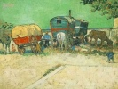
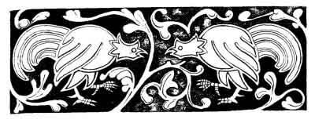
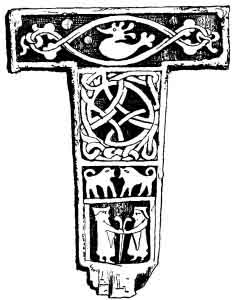

  
[Intangible Textual Heritage](../../index)  [Neo-Paganism](../index) 
[Roma](../../neu/roma/index)  [Index](index)  [Previous](gsft05) 
[Next](gsft07) 

------------------------------------------------------------------------

[Buy this Book at
Amazon.com](https://www.amazon.com/exec/obidos/ASIN/B002DUCMSI/internetsacredte)

------------------------------------------------------------------------

  
*Gypsy Sorcery and Fortune Telling*, by Charles Godfrey Leland,
\[1891\], at Intangible Textual Heritage

------------------------------------------------------------------------

p. 65

 

# CHAPTER IV

SOUTH SLAVONIAN AND OTHER GYPSY WITCH-LORE.—THE WORDS FOR A WITCH—VILAS
AND THE SPIRITS OF EARTH AND AIR-WITCHES, EGGSHELLS, AND EGG-LORE-EGG
PROVERBS—OVA DE CRUCIBUS

 THERE is current in the
whole of the Southern Slavonian provinces a vast mass of legends and
other lore relating to witches, which, in the opinion of Dr. FRIEDRICH
S. KRAUSS, may also be regarded as Romany, since it is held in common
with the gypsies. There can, indeed, be very little doubt that most of
it was derived from, or disseminated by, them, since they have been the
principal masters in magic and doctors in medicine in the Slavonic lands
for many centuries. There are others deeply learned in this subject who
share the same opinion, it being certain that the gypsies could hardly
have a separate lore for themselves and one for magic practices on
others, and

p. 66

\[paragraph continues\] I entertain no
doubt that they are substantially the same; but to avoid possible error
and confusion, I give what I have taken in this kind from Dr.
KRAUSS [1](#fn_9) and others by itself.

As the English word *witch*, Anglo-Saxon *Wicca*, comes from a root
implying wisdom, [2](#fn_10) so the pure
Slavonian word *vjestica*, Bulgarian, *vjescirica* (masculine,
*viestae*), meant originally the one knowing or well informed, and it
has preserved the same power in allied languages, as *Veaa* (New
Slovenish), knowledge, *Vedavica*, a fortune-teller by cards, *Viedma*
(Russian), a witch, and *Vedwin*, *fatidicus*. In many places,
especially in Dalmatia, witches are more gently or less plainly called
*Krstaca*, the crossed, from *Krst*, a cross, *i.e.*,
χριστό?&lt;υ?&gt;σ?&lt;?/υ?&gt; {Greek *xristó<u>s</u>*}, or *Rogulja*,
"horned," derived from association with the horns of devils. In Croatia
the Italian Striga is used, while among the Slovenes and Kai-Kroats the
term *copernica* (masculine, *coprnjak*). "But it enrages the witches so
much to be called by this word that when they hear that any one has used
it they come to his house by night and tear him in four pieces, which
they cast afar into the four quarters of the earth, yea, and thereunto
carry away all the swine, horses, and cattle, so intolerable is their
wrath." Therefore men use the word *hmana zena*, or "common woman,"
*hmana* being the Slavonic pronunciation of the German word *gemein*, or
common. In Dalmatia and far into Servia a witch is called *macisnica*,
and magic, mačija, which is, evidently enough, the Italian *magia*. But
there are witches and witches, and it appears that among the

p. 67

learned the *vjestica* differs from the *macionica*, and this from the
*Zlokobnica* who, as the "evil-meeter," or one whom it is unlucky to
encounter in the morning, is probably only one who has the evil eye. A
quotation from a Servian authority, given by Dr. KRAUSS, is as follows:—

"I have often heard from old Hodzas and Kadijas, that every female
Wallach, as soon as she is forty years old, abandons the 'God be with
us!' and becomes a witch (*vjestica*), or at least a *zlokobnica* or
*macionica*. A real witch has a mark of a cross under her nose, a
*zlokobnica* has some hairs of a beard, and a *macionica* may be known
by a forehead full of dark folds (frowns), with blood-spots in her face"
("*Niz srpskih pripoviedaka*. VUK. *vit. Vecevica. Pancevo*," p. 93.
1880.

Of the great number of South Slavonian terms for the verb to enchant or
bewitch, it may suffice to say that the commencement, *carati*, *cari
carani*, *carovnik*, &c., appear to have much more affinity to the gypsy
*chor-ava*, to steal or swindle, and *chov-hani*, a witch, than to the
Italian *ciarlatano*, and the French and English *charlatan*, from which
Dr. KRAUSS derives them.

THE VILAS-SYLVANA ELEMENTARY SPIRITS.

Among the Slavonic and gypsy races all witchcraft, fairy- and Folk-lore
rests mainly upon a belief in certain spirits of the wood and wold, of
earth and water, which has much in common with that of the Rosicrucians
and PARACELSUS, but much more with the gypsy mythology (as given by
Wlislocki, "Vom Wandernden Zigeunervolke," pp. 49-309), which is
apparently in a great measure of directly Indian origin.

"In the *Vile*," says Dr. KRAUSS, "also known as *Samovile*, *Samodivi*,
and *Vilevrjaci*, we have near relations to the forest and field
spirits, or the 'wood-' and 'moss-folk' of Middle Germany, France, and
Bavaria; the 'wild people' of Eifel, Hesse, Salzburg, and the Tyrol; the
wood-women and wood-men of Bohemia; the Tyrolese *Fanggen*, *Fänken*,
*Nörkel*, and Happy Ladies; the Roumanish *Orken*, *Euguane*, and
*Dialen*; the Danish *Ellekoner*; the Swedish *Skogsnufvaz*; and the
Russian *Ljesje*; while in certain respects they have affinity with the
Teutonic *Valkyries*." Yet they

p. 68

differ on the whole from all of these, as from English fairies, in being
more like divinities, who exert a constant and familiar influence for
good or evil on human beings, and who are prayed to or exorcised on all
occasions. They have, however, their *exact* parallel among the Red
Indians of North America as among the Eskimo, and it is evident that
they are originally derived from the old or primeval Shamanic faith,
which once spread all over the earth. It is very true, as Dr. KRAUSS
remarks, that in the West of Europe it is becoming almost impossible to
trace this true origin of spirits now regarded as merely diabolical, or
otherwise put into new *rôles*; but among the South Slavonians and
gypsies we can still find them in very nearly their old form and playing
the same parts. We can still find the Vila as set forth in old ballads,
the incarnation of beauty and power, the benevolent friends of
sufferers, the geniuses of heroes, the dwellers by rock and river and
greenwood tree. But they are implacable in their wrath to all who
deceive them, or who break a promise; nay, they inflict terrible
punishment even on those who disturb their rings or the dances which
they make by midsummer moonlight. Hence the proverb applied to any man
who suddenly fell ill: "*Naiso je na vilinsko kolo*" ("He stepped on a
fairy-ring"). From this arbitrary exercise of power we find the Vila
represented at times as a spirit who punishes and torments.

Thus we are told that there was once a shepherd named STANKO, who played
beautifully on the flute. One evening he was so absorbed in his own
music that when the Ave Maria bell rung, instead of repeating the prayer
he played it. As he ended he saw a Vila sitting on a hedge. And from
that hour she never left him, By table, by his bed, at work or play, the
white form and unearthly eyes of the spirit were close to him.

"By a spell to him unknown,  
He could never be alone."

Witches and wizards were summoned to aid him, but to no avail; nay, it
made matters worse, for the Vila now often beat him, and when,

p. 69

people asked him why it was, he replied that the Vila did so because he
refused to wander out into the world with her. And yet again he would be
discovered in the top of a tree, bound with bast; and so it went on for
years, till he was finally found one morning drowned in a ditch. So in
the Wolf Dietrich legend the hero refuses the love of *die rauhe Else*,
and is made mad by the witch and runs wild. All of which is identical
with what is told in an Algonkin tale (*vide* "The Algonkin Legends of
New England").

There are three kinds of witches or spirits among the Southern
Slavonians which correspond in every respect exactly to those in which
the gypsies believe. The first of these are the *Zracne Vile*, or aerial
spirits. These, like the spirits of the air of Scripture, are
evily-disposed to human beings, playing them mischievous tricks or
inflicting on them fatal injuries. They lead them astray by night, like
Friar Rush and Robin Goodfellow, or the English gypsy *Mullo doods*, or
bewilder and frighten them into madness. Of the second kind are the
Earth spirits, *Pozemne Vile*, in gypsy *Pcûvushi* or *Pûvushi*. These
are amiable, noble, and companionable beings, who often give sage
counsel to men. Thirdly are the Water sprites, in Slavonic *Povodne
Vile*, in gypsy *Nivashi*, who are to the highest degree vindictive at
times, yet who behave kindly to men when they meet them on land. But woe
to those who, while swimming, encounter them in streams or lakes, for
then the goblins grasp and whirl them about until they perish. From this
account by Dr. KRAUSS, it appears as if this Slavonic mythology were
derived from the gypsy, firstly, because it is more imperfect than the
latter, and secondly, because in it Vilas, or spirits, are confused with
witches, while among the gypsies they are clearly separated and
distinctly defined.

Dr. WLISLOCKI Says ("Vom Wand. Zigeunervolke," p. 253) that "gypsies are
still a race given to Shamanism, but yet they reverence a highest being
under the name of *devla* or *del*." This is, however, the case to-day
with *all* believers in Shaman or Sorcery-religion, the difference
between them and monotheists being that this highest god is little
worshipped

p. 70

or even thought of, all *practical* devotion being paid to *spirits* who
are really their saints. By close examination the Gypsy religion, like
that of the country-folk in India, appears to be absolutely identical in
spirit with that of American Indians. And I should say that the monk
mentioned by PRÆTORIUS, who declared that though God and Christ should
damn him, yet he could be saved by appealing to Saint Joseph, was not
very far removed from being a Shamanist.

The Hungarian gypsies are divided into tribes, and one of these, the
Kukaya, believes itself to be descended from the *Pçuvushi*, or
earth-fairies, according to the following story, narrated by Dr. H. von
WLISLOCKI in his paper on the genealogy and family relations of the
Transylvanian Tent Gypsies:—

"Many thousand years ago there were as yet in the world very few
*Pchuvushi*. These are beings of human form dwelling under the earth.
There they have cities, but they very often come to the world above.
They are ugly, and their men are covered with hair. (All of this
indicates a prehistoric subterranean race like the Eskimo,
fur-clad. [1](#fn_11)) They carry off mortal
girls for wives. Their life is hidden in the egg of a black hen."

This is the same as that of the *Orco* or Ogre in the Italian tale, "I
Racconti delle Fate, Cesare da Causa," Florence, 1888. Whoever kills the
hen and throws the egg into a running stream, kills the *pchuvush*.

"Once a young Pchûvush woman came up to the world and sat in a fair
green forest. She saw a very beautiful youth sleeping in the shade, and
said: 'What happiness it must be to have such a husband. Mine is so
ugly!' Her husband, who had stolen silently after her, heard this, and
reflected 'What a good idea it would be to lend my wife to this young
man till she shall have borne a family of beautiful children! Then I
could sell them to my rich Pchuvûs friends.' So he said to his wife:
'You may live with this youth for ten. years if you will promise to give
me either the boys or the girls which you may bear to him.' She agreed
to this. Then the Pchûvûs began to sing:—

p. 71

"'Kuku, kukáya  
Kames to adala?  
Kuku, kukaya.'

That is in English:—

"'Kuku, kukaya  
Do you want this (one) here  
Kuku, kukaya.'

Then the young man awoke, and as the goblin offered him much gold and
silver with his wife, he took her and lived with her ten years, and
every year she bore him a son. Then came the Pchuvush to get the
children. But the wife said she had chosen to keep all the sons, and was
very sorry but she had no girls to give him! So he went away
sorrowfully, howling

"'Kuku, kukáya!  
Ada kin jirklá!  
Kuku, kukaya!'

"That is to say:—

"'Kuku, kukaya  
These are dogs here!  
Kuku, kukaya!'

"Then the ten boys laughed and said to their father We will call
ourselves Kukaya.' And so from them came the race."

Dr. WLISLOCKI points out that there are races which declare themselves
to be descended from dogs, or, like the Romans, from wolves. It is a
curious coincidence that the Eskimo are among the former.

In all parts of Eastern Europe, as in the West, many people are not only
careful to burn the parings of their nails [1](#fn_12) and the combings of hair, for fear lest
witches and imps should work sorcery with them to the injury of those
from whom they came, but they also destroy the shells of eggs when they
have eaten their contents. So A. WUTTKE tells us in his book,

p. 72

\[paragraph continues\] "Der Deutsche
Volks Aberglaube der Gegenwart," 1869 "When one has eaten eggs the
shells must be broken up or burned, or else the hens will lay no more,
or evil witches will come over them." And in England, Spain, the
Netherlands, or Portugal, there are many who believe or say that if the
witches can get such shells from which people have eaten, unbroken, they
can, by muttering spells, cause them to grow so large that they can use
them as boats. Dom LEITAS GANET ("Donna Branca ou à Conquista do
Algarre," Paris, 1826), however, assures us that is a very risky thing
for the witches, because if they do not return home before midnight the
shell-boat perishes, "whence it hath come to pass that many of these
sorceresses have been miserably drowned."

However, an egg hung up in a house is a lucky amulet, hence the ostrich
eggs and cocoanuts resembling them which are so common in the East. And
it is to be observed that every gypsy in England declares that a
*pivilioi*, or cocoanut, as a gift brings *bâk* or luck, I myself having
had many given to me with this assurance. This is evidently and directly
derived from India, in which country there are a mass of religious
traditions referring to it.

"Once there was a gypsy girl who noticed that when anybody ate eggs they
broke up the shells, and asking why this was done received for answer:—

"'You must break the shell to bits for fear  
Lest the witches should make it a boat, my dear.  
For over the sea away from home,  
Far by night the witches roam.'

"Then the girl said: 'I don't see why the poor witches should not have
boats as well as other people.' And saying this she threw the shell of
an egg which she had been eating as far as she could, and cried,
'*Chovihani, lav tro bero*!' ('Witch—there is your boat!') But what was
her amazement to see the shell caught up by the wind and whirled away on
high till it became invisible, while a voice cried, '*Paraka*!' ('I
thank you!')

"Now it came to pass some time after that the gypsy girl was on an
island, where she remained some days. And when she wished to return,
behold a great flood was rising, and it had washed her boat away, she
could see nothing of it. But the water kept getting higher and higher,
and soon there was only a little bit of the island above the flood, and
the girl thought she must drown. just then she saw a white boat coming;
there sat in it a woman

p. 73

with witch eyes; she was rowing with a broom, and a black cat sat on her
shoulder. 'Jump in!' she cried to the girl, and then rowed her to the
firm land.

"When she was or. the shore the woman said: 'Turn round three times to
the right and look every time at the boat.' She did so, and every time
she looked she saw the boat grow smaller till it was like an egg. Then
the woman sang:—

"'That is the shell you threw to me,  
Even a witch can grateful be.'

"Saying this she vanished, cat, broom, shell, and all.

"Now my story is fairly done,  
I beg you to tell a better one."

As regards these boats which grow large or small at will we find them in
the Norse ship *Skidbladner*, which certain dwarfs made and gave to
Frey. It is so large that all the gods and their army can embark in it.
But when not in use it may be so contracted that one may hava i pungi
sino—put it in his purse or pocket. The Algonkin god Glooskap has not
only the counterpart of *Skidbladnir*, but the hammer of Thor and his
belt of strength. He has also the two attendant birds which bring him
news, and the two wolves which mean Day and Night.

Another legend given by Dr. KRAUSS, relative to witches and eggshells is
as follows—

"By the Klek lived a rich tavern-keeper and his wife. He was thin and
lean—*hager und mager*—while she was as fat as a well-fed pig.

"One day there came a gypsy woman by. She began to tell his fortune by
his hand. And as she studied it seriously she became herself serious,
and then said to him, 'Listen, you good-natured dolt (*moré*)! Do you
know why you are so slim and your wife so stout?' 'Not I.' 'My good
friend (*Latcho pral*), your wife is a witch. Every Friday when there is
a new moon (*mladi petak*) she rides you up along the Klek to the
devil's dance' (*Uraze kolo*). 'How can that be?' 'Simply enough. As
soon as you fall asleep, she slips a magic halter over your head. Then
you become a horse, and she rides you over the hills and far away over
mountains and woods, cities and seas, to the witches' gathering.

"Little you know where you have been,  
Little you think of what you have seen,

"For when you awake it is all forgotten, but the ride is hard for you,
and you are

p. 74

wasting away, and dying. Take great care of yourself on the next Friday
when there is a new moon!'

"So the gypsy went her way, and he thought it over. On the next Friday
when the moon was new he went to bed early, but only pretended to sleep.
Then his wife came silently as a cat to the bed-side with the magic
halter in her hand. As quick as lightning he jumped up, snatched it from
her, and threw it over her head. Then she became, in a second, a mare.
He mounted her, and away she flew through the air-over hills and dales
like the wind, till they came to the witches' meeting.

"He dismounted, bound the mare to a tree, and, unseen by the company,
watched them at a little distance. All the witches carried pots or jars.
First they danced in a ring, then every one put her pot on the ground
and danced alone round it. And these pots were egg-shells.

"While he watched, there came flying to him a witch in whom he
recognized his old godmother. 'How did you come here?' she inquired.
'Well, I came here on my mare, I know not how.' 'Woe to you—begone as
soon as possible. If the witches once see you it will be all up with
you. Know that we are all waiting for one' (this one was his wife), 'and
till she comes we cannot begin.' Then the landlord mounted his mare,
cried 'Home!' and when he was there tied her up in the stable and went
to bed.

"In the morning his servant-man said to him: 'There is a mare in the
stable.' 'Yes,' replied the master; 'it is mine.' So he sent for a
smith, and made him shoe the mare. Now, whatever is done to a witch
while she is in the form of an animal remains on or in her when she
resumes her natural shape.

"Then he went out and assembled a judicial or legal commission. He led
the members to his house, told them all his story, led forth the mare,
and took off the halter. She became a woman as before, but horse-shoes
were affixed to her feet and hands. She began to weep and wail, but the
judge was pitiless. He had her thrown into a pit full of quicklime, and
thus she was burnt to death. And since that time people break the shells
of eggs after eating their contents, lest witches should make jars or
pots of them."

The following story on the same subject is from a different source:—

"There was once a gypsy girl who was very clever, and whenever she heard
people talk about witches she remembered it well. One day she took an
egg-shell and made a small round hole in it very neatly, and are the
yolk and white, but the shell she put on a heap of white sand by a
stream, where it was very likely to be seen. Then she hid herself behind
a bush. By and by, when it was night, there came a witch, who, seeing
the shell, pronounced a word over it, when it changed to a beautiful
boat, into which the witch got and sailed on the water, over the sea.

"The girl remembered the word, and soon ate another egg and turned it
into a

p. 75

boat. Whenever she willed it went over the world to places where fruit
and flowers abounded, or where people gave her much gold for such things
as knives and scissors. So she grew rich and had a fine house. The boat
she hid away carefully in a bush.

"There was a very envious, wicked woman, whom the girl had befriended
many a time, and who hated her all the more for it. And this creature
set to work, spying and sneaking, to find out the secret of the girl's
prosperity. And at last she discovered the boat, and, suspecting
something, hid herself in the bush hard by to watch.

"By and by the girl came with a basket full of wares for her trade, and,
drawing out the boat, said, 'To Africa!'—when off it flew. The woman
watched and waited. After a few hours the girl returned. Her boat was
full of fine things, ostrich feathers and gold, fruit and strange
flowers, all of which she carried into her house.

"Then the woman put the boat on the water, and said, 'To Africa!' But
she did not know the word by means of which it was changed from an
egg-shell, and which made it fly like thought. So as it went along the
woman cried, 'Faster!', but it never heeded her. Then she cried again in
a great rage, and at last exclaimed, 'In God's name get on with you!'
Then the spell was broken, and the boat turned into an egg-shell, and
the woman was drowned in the great rolling sea."

Egg-lore is inexhaustible. The eggs of Maundy Thursday (*Witten
Donnertag*), says a writer in *The Queen*, protect a house against
thunder and lightning, but, in fact, an egg hung up is a general
protection, hence the ostrich eggs and cocoanuts of the East. Some other
very interesting items in the communication referred to are as follows:—

"WITCHES AND EGGS.—'To hang an egg laid on Ascension Day in the roof of
a house,' says Reginald Scot in 1584, 'preserveth the same from all
hurts.' Probably this was written with an eye to the 'hurts' arising
from witchcraft, in connection with which eggs were supposed to possess
certain mysterious powers. In North Germany, if you have a desire to see
the ladies of the broomstick on May Day, their festival, you must take
an egg laid on Maundy Thursday, and stand where four roads meet; or else
you must go into church on Good Friday, but come out before the
blessing. It was formerly quite an article of domestic belief that the
shells must be broken after eating eggs, lest the witches should sail
out to sea in them; or, as Sir Thomas Browne declared, lest they 'should
draw or prick their names therein, and veneficiously mischief' the
person who had partaken of the egg. North Germans, ignoring this side of
the question, say, "Break the shells or you will get the ague;" and
Netherlanders advise you to secure yourself against the attacks of this
disagreeable visitor by eating on Easter Day a couple of eggs which were
laid on Good Friday.

"SCOTTISH SUPERSTITIONS.—Scotch fishers, who may be reckoned among the
most superstitious of folks, believe that contrary winds and much
consequent vexation of

p. 76

spirit will be the result of having eggs on board with them; while in
the west of England it is considered very unlucky to bring birds' eggs
into the house, although they may be hung up with impunity outside. Mr.
Gregor, in his 'Folklore of the North-East of Scotland,' gives us some
curious particulars concerning chickens, and the best methods of
securing a satisfactory brood. The hen, it seems, should be set on an
odd number of eggs, or the chances are that most, if not all, will be
addled—a mournful prospect for the henwife; also they must be placed
under the mother bird after sunset, or the chickens will be blind. If
the woman who performs this office carries the eggs wrapped up in her
chemise, the result will be hen birds; if she wears a man's hat, cocks.
Furthermore, it is as well for her to repeat a sort of charm, 'A' in
thegeethir, A oot thegeethir.'

"UNLUCKY EGGS.—There are many farmers' wives, even in the present day,
who would never dream of allowing eggs to be brought into the house or
taken out after dark—this being deemed extremely unlucky. Cuthbert Bede
mentions the case of a farmer's wife in Rutland who received a setting
of ducks' eggs from a neighbour at nine o'clock at night. 'I cannot
imagine how she could have been so foolish,' said the good woman, much
distressed, and her visitor, upon inquiry, was told that ducks' eggs
brought into a house after sunset would never be hatched. A Lincolnshire
superstition declares that if eggs are carried over running water they
will be useless for setting purposes; while in Aberdeen there is an idea
prevalent among the country folks that should it thunder a short time
before chickens are hatched, they will die in the shell. The same
wiseacres may be credited with the notion that the year the farmer's
gudewife presents him with an addition to his family is a bad season for
the poultry yard. 'Bairns an' chuckens,' say they, 'dinna thrive in ae
year.' The probable explanation being that the gudewife, taken up with
the care of her bairn, has less time to attend to the rearing of the
'chuckens.'

"FORTUNE-TELLING IN NORTHUMBERLAND.—Besides the divination practised
with the white of an egg, which certainly appears of a vague and
unsatisfactory character, another species of fortune-telling with eggs
is in vogue in Northumberland on the eve of St. Agnes. A maiden desirous
of knowing what her future lord is like, is enjoined to boil an egg,
after having spent the whole day fasting and in silence, then to extract
the yolk, fill the cavity with salt, and eat the whole, including the
shell. This highly unpalatable supper finished, the heroic maid must
walk backwards, uttering this invocation to the saint:—

"'Sweet St. Agnes, work thy fast,  
If ever I be to marry man,  
Or man be to marry me,  
I hope him this night to sec.'"

FRIEDRICH and others assert that the saying in Luke xi. 12—"Or if he
shall ask an egg shall he give him a scorpion?"—is a direct

p. 77

reference to ancient belief that the egg typified the good principle,
and the scorpion evil, and which is certainly supported by a cloud of
witnesses in the form of classic folk-lore. The egg, as a cosmogenic
symbol, and indicating the origin of all things, finds a place in the
mythologies of many races. These are indicated with much erudition by
FRIEDRICH, "Symbolik der Natur," p. 686.

In Lower Alsatia it is believed that if a man will take an Easter egg
into the church and look about him, if there be any witches in the
congregation he may know them by their having in their hands pieces of
pork instead of prayer-books, and milk-pails on their heads for
bonnets;(WOLF, "Deutsche Mährchen und Sagen," p. 270). There is also an
ancient belief that an egg built into a new building will protect it
against evil and witchcraft. Such eggs were found in old houses in
Altenhagen and Iserlohen, while in the East there is a proverb, "the egg
of the chamber" ("Hamasa" of ABU TEMMAN, v. RÜCKERT, Stuttgart, 1846),
which seems to point to the same practice.

The Romans expressed a disaster by saying "Ovum ruptum est" ("The egg is
smashed"). Among other egg-proverbs I find the following:—

His eggs are all omelettes (*French*); *i.e.*, broken up.

Eggs in the pan give pancakes but nevermore chicks (*Low German*).

Never a chicken comes from broken eggs (*Low German*).

Bad eggs, bad chickens. Hence in America "a bad egg" for a man who is
radically bad, and "a good egg" for the contrary.

Eggs not yet laid are uncertain chickens; *i.e.*, "Do not count your
chickens before they are hatched."

Tread carefully among eggs (*German*).

The egg pretends to be cleverer than the hen.

He waits for the eggs and lets the hen go.

He who wants eggs must endure the clucking of the hen (*Westphalian*).

He thinks his eggs are of more account than other people's hens.

One rotten egg spoils all the pudding.

Rotten eggs and bad butter always stand by one another; or "go well
together."

Old eggs, old lovers, and an old horse,  
Are either rotten or for the worse.

p. 78

(Original:

Alte Eyer  
Alte Freier  
Alter Gaul  
Sind meistens faul.)

"All eggs are of the same size" (Eggs are all alike), he said, and
grabbed the biggest.

As like as eggs (*Old Roman*).

As sure as eggs.

His eggs all have two yolks.

If you have many eggs you can have many cakes.

He who has many eggs scatters many shells.

To throw an egg at a sparrow.

To borrow trouble for eggs not yet hatched.

Half an egg is worth more than all the shell.

A drink after an egg, and a leap after an apple.

A rotten egg in his face.

In the early mythology, the egg, as a bird was hatched from it, and as
it resembled seeds, nuts, &c., from which new plants come, was regarded
as the great type of production. This survives in love-charms, as when a
girl in the Tyrol believes she can secure a man's love by giving him a
red Easter egg. This giving red eggs at Easter is possibly derived from
the ancient Parsees, who did the same at their spring festival. Among
the Christians the reproductive and sexual symbolism, when retained, was
applied to the resurrection of the body and the immortality of the soul.
Hence Easter eggs. And as Christ by His crucifixion caused this, or
originated the faith, we have the *ova de crucibus*, the origin of which
has puzzled so many antiquaries; for the cross itself was, like the egg,
a symbol of life, in earlier times of reproduction, and in a later age
of life eternal. These eggs are made of a large size of white glass by
the Armenian Christians.

------------------------------------------------------------------------

### Footnotes

[66:1](gsft06.htm#fr_9) "Sudslavische Hexensagen,
Mittheilungen der Anthropologischen Gesellschaft in Wien." xiv. Bande,
1884. "Medizinische Zauberspruche aus Slavonien, Bosnien, der
Hercegovina und Dalmatien," Wien, 1887. "Sreča, Gluck und Schicksal im
Volksglauben der Südslaven." Wien, 1886. "Sudslavische Pestsagen." Wien,
1883.

[66:2](gsft06.htm#fr_10) "*Witch*. Mediaeval
English *wicche*, both masculine and feminine, a wizard, a witch.
Anglo-Saxon *wicca*, masculine, *wice*, feminine. *Wicca* is a
corruption of *wítga*, commonly used as a short form of *witega*, a
prophet, seer, magician, or sorcerer. Anglo-Saxon *witan*, to see,
allied to *wítan*, to know. Similarly Icelandic *vitki*, a wizard, is
from vita, to know. Wizard, Norman-French *wischard*, the original Old
French being *guiscart*, sagacious. Icelandic, *vizkr*, clever or
knowing, . . . with French suffix *ard* as German *hart*, hard, strong"
(SKEAT, "Etymol. Dictionary"). That is wiz-ard, very wife. Wit and
wisdom here are near allied to witchcraft, and thin partitions do the
bounds divide.

[70:1](gsft06.htm#fr_11) For a very interesting
account of the mysterious early dwarfs of Great Britain the reader may
consult "Earth Houses and their Inhabitants," by David MacRitchie, in
"The Testimony of Tradition." London: Trübner and Co., 1890.

[71:1](gsft06.htm#fr_12) The many superstitions
relating to cutting nails may be referred in part to the very wild
legend of the ship *Naglfara* given in STURLESON'S "Edda."

"Then in that Twilight of the Gods (the Norse Day of judgment) will come
the ship *Naglfara*, which is made of dead men's nails. In that sea it
will go forth. Hrymer steereth it. And for this cause no man should die
with his nails unshorn, for so the ship is made, and the gods would fain
put that off as long as possible" ("Edda, Gylfesgynning," 26th tale).

------------------------------------------------------------------------

[Next: Chapter V: Charms or Conjurations to Cure or Protect
Animals](gsft07)

