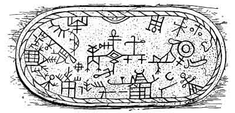
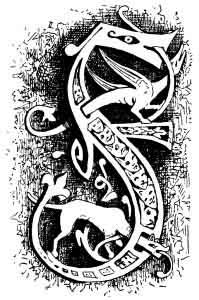
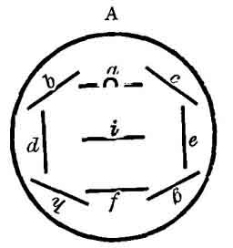
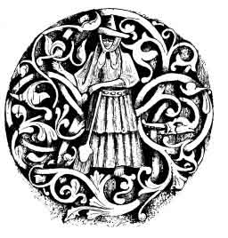

  
[Intangible Textual Heritage](../../index)  [Neo-Paganism](../index) 
[Roma](../../neu/roma/index)  [Index](index)  [Previous](gsft06) 
[Next](gsft08) 

------------------------------------------------------------------------

[Buy this Book at
Amazon.com](https://www.amazon.com/exec/obidos/ASIN/B002DUCMSI/internetsacredte)

------------------------------------------------------------------------

  
*Gypsy Sorcery and Fortune Telling*, by Charles Godfrey Leland,
\[1891\], at Intangible Textual Heritage

------------------------------------------------------------------------

p. 79

 

 

LAPLAND MAGIC DRUM

 

# CHAPTER V

CHARMS OR CONJURATIONS TO CURE OR PROTECT ANIMALS

 FROM the earliest ages a
drum or tambourine has formed such an indispensable adjunct of Shamanic
sorcery among Tartars, Lapps, Samoyedes, Eskimo, and Red Indians, that,
taking it with other associations, I can hardly believe that it has not
been transmitted from one to the other. In Hungary the gypsies when they
wish to know if an invalid will recover, have recourse to the
*cováçanescro buçlo* (*chovihanescro bûklo*) or "witch-drum." This is a
kind of rude tambourine covered with the skin of an animal, and marked
with stripes which have a special meaning. On this are placed from nine
to twenty-one seeds of the thorn-apple (*stramomium*).

p. 80

The side of the drum is then gently struck with a little hammer, and
according to the position which the seeds take on the marks, the
recovery or death of the patient is predicted. The following is a
picture of a gypsy drum as given by Dr. WLISLOCKI.

 

 

 

The wood for this is cut on Whitsunday. A is turned towards the
fortuneteller; nine seeds are now thrown on the drum, and with the left
hand, or with a hammer held in it, the tambourine is tapped. Should all
the seeds come within the four lines all will go well, especially if
three come within *a*, *d*, *e*, *f*. If two roll into the space between
*a*, *i*, it is lucky for a woman, between *i* and *f* for a man. But if
nearly all fall outside of *b*, *c*, *g*, *h*, all is unfavourable. The
same divination is used to know whether animals will get well, and where
stolen property is concealed. All of this corresponds exactly to the use
of the same instrument by the Laplanders for the same purposes. The
thorn-apple is a very poisonous plant, and the gypsies are said to have
first brought it to England. This is *not* true, but it is extremely
possible that they used it in stupefying, killing, and "bewitching." It
is very much employed at present by the Voodoo poisoners in America.

The Turks are a Tartar race, and the drum is used among them very
generally for magical purposes. I have one of these *tambouri* which, I
was assured when I bought it, was made for incantations. It is of a
diamond shape, has parchment on *both* sides, and is inscribed with the
name Allah, in Arabic, and the well-known double triangle of Solomon,
with the moon and star.

p. 81

To keep domestic animals from straying or being stolen, or falling ill,
they are, when a gypsy first becomes their owner, driven up before a
fire by his tent. Then they are struck with a switch, which is half
blacked with coal, across the back, while the following is repeated:—

"Ač tu, ač kathe!  
Tu hin mange!  
Te Nivasa the jiánen  
Ná dikh tu ádálen!  
Trin lánca bin mánge,  
Me pçándáv tute:  
Yeká o devlá, ávri  
O Kristus, trite Maria!"

"Stay thou, stay here  
Thou art mine!  
And the Nivasi when they go  
Thou shalt not see them!  
Three chains I have,  
I bind thee:  
One is God, the other (beyond)  
The Christ, the third, Maria!"

To charm a horse, they draw, with a coal, a ring on the left hoof and on
the right a cross, and murmur

"Obles, obles te obles!  
Ac tu, ac tù máy sástes  
Ná th' ávehás beng tute  
Devlá, devlá ač tute!  
Gule devlá bishálá  
E gráyeskro perá  
Miseçescro dád!  
Niko mánushenge áč  
Káske me dáv, leske áč  
Shukáres tu áč,  
Voyesá te láčes áč,  
Ashunen eftá Pçuvuse:  
Eftá láncá hin mánge,  
Ferinen ádálá  
Táysá, táysá e pedá!"

p. 82

"Round, round, and round  
Be thou, be thou very sound  
The devil shall not come to thee.  
God, God shall be with thee  
Sweet God drive away  
From the horse's body  
The Father of Evil!  
Be to (go not to) any other man  
To whom I give (sell) unto him  
Be beautiful!  
Frolicsome and good,  
Seven spirits of earth hear  
I have seven chains,  
Protect this animal  
Ever, ever!"

Then a piece of salted bread is given to the horse, and the owner spits
seven times into his eyes, by which he is supposed to lose all fear for
supernatural beings. According to the gypsies, horses, especially black
ones, can see beings which are invisible to human eyes. I have known an
old English gypsy who believed that dogs could see ghosts when men could
not. The mysterious manner in which dogs and horses betray fear when
there is apparently nothing to dread, the howling of the former by
night, and the wild rushes of the latter, doubtless led to this opinion.
The bread and salt will recall to the reader the fact that the same was
given at the ancient mysteries apparently for the purpose of
strengthening the neophyte so that he should not fear the supernatural
beings whom he was supposed to meet. It is curious to find this peculiar
form of the sacrament administered to a horse. Another protective charm
is common among the Southern Hungarian gypsies. The dung of a she-goat
dried and powdered is sifted on a horse's back and this spell recited:—

"Miseçes prejiá,  
Andrál t're perá!  
Trádá čik busčákri  
Miseçes perákri,— p. 83  
Andral punrá, andral dumno,  
Andral yákhá, andral kánná!  
Nevkerádyi av ákána,  
Ač tu, ač to čá mánge:  
Ač tu, áč tu, áč kathe!"

"Evil be gone  
From thy belly!  
Drive away she-goat's dung  
Evil from the belly,  
From the feet, from the back,  
From the eyes, from the ears  
New-born be now,  
Be thou, be thou only mine  
Stay thou, stay thou, stay here!"

There is evidently a relation here between the dung of the she-goat and
certain ancient symbols. Whatever was a sign of fruitfulness,
generation, or productiveness, whether it was set forth by the
generative organs, sexual passion, or even manure which fertilises, was
connected with Life which is the good or vital principle opposed to
death. As the goat was eminently a type of lechery, so the she-goat,
owing to the great proportion of milk which she yielded, set forth
abundance; hence the cornucopia of Amalthea, the prototype of the
she-goat Heidrun of the Northern mythology, who yielded every day so
much milk that all the Einheriar, or dwellers in Valhall, could satisfy
themselves therewith. [1](#fn_13) But the forms
or deities indicating life were also those which shielded and protected
from evil, therefore Here, the mother of life and of birth, had in
Sparta a shrine where she-goats were sacrificed to her, while at
Canuvium the statue of Juno Sospita (who was also Here), was covered
with a she-goat's skin. It is in the ancient sense of fertility
identified with protection, that the she-goat's dung is used to exorcise
evil from the

p. 84

horse by the gypsies. There is, in fact, in all of these char ms and
exorcisms a great deal which evidently connects them with the earliest
rites and religions.

In the Hungarian gypsy-tribe of the Kukuya, the following method of
protecting horses is used: The animal is placed by the tent-fire and
there a little hole is dug before him into which ninefold grass and some
hairs from his mane and tail are put. Then his left fore-hoof is traced
on the ground, and the earth within it is carefully taken out and shaken
into the hole, while these lines are repeated:—

"Yeká čunul yeká bál,  
Tute e bokh náñi sál,  
Ko tut čorel, the merel  
Sar e bálá, čunulá,  
Pal e pçuv the yov ável!  
Pçuvus, adalen tute,  
Sástes gráy ác mánge!"

"A straw, a hair!  
May you never be hungry  
May he who steals you die  
Like the hair and the straw,  
May he go to the ground  
Earth, these things to thee  
May a sound horse be mine!"

If the animal be a mare and it is desired that she shall be with foal,
they give her oats to eat out of an apron or a gourd, and say

"Trin kánályá, trin jiuklá,  
Jiánen upre pláyá!  
Cábá, pçarcs hin perá!  
Trin kánályá, trin jiuklá  
Jiánen tele pláyá,  
É çevá ándrasaváren  
Yek čumut ándre çasáren,  
Tre perá sik pçáreven!"

"Three asses, three dogs,  
Go up the hill! p. 85  
Eat, fill thy belly with young!  
Three asses, three dogs,  
Go down the hill,  
They close the holes,  
They put the moon in (them)  
Thy belly be soon fruitful!"

"The moon has here," remarks WLISLOCKI, "a phallic meaning, the mention
of the ass, and the use of the gourd and apron are symbols of fertility.
*Vide* DE GUBERNATIS, 'Animals in Indian Mythology,' in the chapter on
the ass."

There is another formula for protecting and aiding cattle, which is
practised among other races besides that of the gypsies; as, for
instance, among the Slovacks of Northern Hungary. This I shall leave in
the original—

"Dieser Verwahrungsmittel besteht darin, dass dem gekauften weiblichen
Thiere der Mann den blanken Hintern zeigt, einem mannlichen Thiere aber
eine weibliche Person. Hiebei werden die Worte gesagt—

"Sár o kár pál e punrá,  
Kiyá mánge ác táysá!

Wie der Schwantz am Bein,  
Sollst du stets bei mir sein!"

Or else:—

"Sár e minč pal e per,  
Kiyá mánge ác buter!

Wie das Loch im Leib,  
Also bei mir bleib!"

To secure swine to their owner a hole is dug in the turf which is filled
with salt and charcoal dust, which is covered with earth, and these
words uttered:—

"Adá hin tute  
Ná ává pál menge  
Dáv tute, so kámáv  
Pçuvusheyá, áshuná, p. 86  
Čores tuna muká  
Hin menge trin láncá,  
Trin máy láce Urmá,  
Ke ferinen men!"

"This is thine,  
Come not to us  
I give thee what I can  
Oh Spirit of earth, hear  
Let not the thief go!  
We have three chains,  
Three very good fairies  
Who protect us."

If the swine find the hole and root it up—as they will be tolerably
certain to do owing to their fondness for salt and charcoal—they will
not be stolen or run away.

The *Urmen*, or Fairies, are supposed to be very favourable to cattle,
therefore children who torment cows are told "*Urme tute ná bica
somnakune pçábáy*"—"The fairies will not send you any golden apples!" If
the English gypsies had the word *Urme* (and it may be that it exists
among them even yet), this would be, "*I Urme ná bitcher tute sonnakai
pábya*!"

But the mighty charm of charms to protect cattle from theft is the
following: Three drops of blood are made to fall from the finger of a
little child on a piece of bread which is given to the animal to eat,
with these words

"Dav tute trinen rátá  
Ternes te láces ávná!  
Ko tut čorel, ádáleske  
Hin rát te más shutyárdye!

Káná rátá te rátá  
Paltire per ávná,  
Yákh te yákh te báre yákh  
Sikoves çál te çál  
Ko kámel tut te çál!"

p. 87

"I give three (drops of) blood  
To become young and good;  
Who steals thee to him  
Shall be (is) blood and flesh dried up!

When blood and blood  
Pass into thy belly,  
Fire and fire and great fire  
Shall devour and devour all  
Who will eat thee!"

This incantation takes us back to grim old heathenism with hints of
human sacrifice. When the thief was suspected or privately detected it
is probable that a dose of some burning poison made good the prediction.
"The word *young*," remarks Dr. WLISLOCKI, "may be here understood to
mean *innocent*, since, according to ancient belief, there was a
powerful magic virtue in the blood of virgins and of little children.
Every new tent is therefore sprinkled by the gypsies with a few drops of
a child's blood to protect it from magic or any other accident." So in
prehistoric times, and through the Middle Ages, a human being was often
walled up alive in the foundations of a castle to insure its durability.
(*Vide* P. CASSEL, Die Symbolik des Blutes," p. 157.)

When the wandering, or tent-gypsies, find that cattle are ill and do not
know the nature of the disease, they take two birds—if possible quails,
called by them *bereçto* or *füryo*—one of which is killed, but the
other, besprinkled with its blood, is allowed to fly away. With what
remains of the blood they sprinkle some fodder, which is put before the
animal, with the words:—

"So ándre tu miseç hin  
           Avri ává!  
Káthe ker ná ávlá,  
           Miseçeske!  
Káná rátá ná ávná,  
Násvályipen ná ávná!  
Miseç, tu ávri ává,  
Ada ker ná láce;  
Dáv rátá me káthe!"

p. 88

"What in thee is evil  
          Come forth  
Here is no home  
          For the evil one!  
When (drops of) blood come not,  
Sickness comes not,  
Thou evil one, come forth!'

"Trin párne, trin kále,  
Trin tçule páshlajen káthe,  
Ko len hádjinel  
Ač kivá mánge!"

"Three white, three black,  
Three fat lie together here.  
Whoever disturbs them  
Remain to me! (Be mine!)"

To insure pigs thriving by a new owner, some charcoal-dust is mingled
with their food and these words spoken:—

"Nivaseske ná muká,  
The çál t're çábená!  
Miseç yákhá tut díkhen,  
The yon káthe mudáren,  
Tu atunci çábá len!"

"Do not let the Nivasi  
Eat thy food,  
Evil eyes see thee,  
And they here shall perish,  
Then do thou eat them!

As a particularly powerful conjuration against thieves, the owner runs
thrice, while quite naked, round the animal or object which he wishes to
protect, and repeats at every turn:—

"Oh coreyá ná prejiá.  
Dureder ná ává!  
T're vástá, t're punrá  
Avcná kirñodyá  
Te ádá pedá láves!"

p. 89

"Oh, thief, do not go,  
Further do not come  
Thy hands, thy feet  
Shall decay  
If thou takest this animal!"

Another "thieves' benediction" is as follows: The owner goes at midnight
with the animal or object to be protected to a cross-roads, and while
letting fall on the ground a few hairs of the beast, or a bit of the
thing whatever it be, repeats:—

"Ada hin tute,  
Ná ává pál menge,  
Dav tute, so kámáv;  
Pçuvuseyá áshuná!

"This home is not good,  
Here I give (thee) blood!"

The gypsies call the quail the devil's bird (*Ciriclo bengeskro*), and
ascribe diabolic properties to it. (*Vide* CASSEL, 6 and 162.) The
daughters of the Nivasi appear as quails in the fields by day, but
during the night they steal the corn. To keep them away it is held good
during sowing-time to place in each of the four corners of the field,
parts of a quail, or at least some of the feathers of a black hen which
has never laid an egg. This superstition is also current among the
Roumanian peasants of the Siebenbürgen."

The primitive meaning of the myth may perhaps be found in the Greek
tradition which regarded the quail, because it was a bird of passage, as
a type of revival of spring or of life. Hercules awakes from his swoon
when his companion Iolaus (from the Greek ιουλο?&lt;υ?&gt;σ?&lt;?/υ?&gt;
{Greek *ioulo<u>s</u>*}, youth), holds a quail to his nose. Hercules
suffered from epilepsy, for which disease the ancients thought the brain
of a quail was a specific. The placing pieces of a quail, by the
gypsies, in the corners of a field when corn is sown, connects the bird
with spring. Artemis, a goddess of spring and life, was called by the
Romans *Ortygyia*, from ορτυξ {Greek *ortuks*}, a quail. Therefore, as
signifying new life, the quail became itself a cure

p. 90

for many diseases. And it seems to be like the Wren, also a bird of
witchcraft and sorcery, or a kind of witch itself. It is a protector,
because, owing to its pugnacity, it was a type of pluck, battle and
victory. In Phœnicia it was sacrificed to Hercules, and the Romans were
so fanatical in regard to it that AUGUSTUS punished a city-father for
serving upon his table a quail which had become celebrated for its
prowess. And so it has become a devil's bird among the gypsies because
in the old time it was regarded as a devil of a bird for fighting.

The gypsies are hardly to be regarded as Christians, but when they wish
to contend against the powers of darkness they occasionally invoke
Christian influences. If a cow gives bloody milk it is thought to be
caused by her eating *Wachtelkraut*, or quail weed, which is a poison.
In such a case they sprinkle the milk on a field frequented by quails
and repeat:—

"Dav rátá tumenge  
Adá ná hin láče!  
Ráyeskro Kristeskro rátá  
Adá hin máy láce  
Adá hin ámenge!"

"I give to you blood,  
Which is not good!  
The Lord Christ's blood  
Is truly good,  
That is ours!"

If a cow makes water while being milked, she is bewitched, and it is
well in such a case to catch some of the urine, mix it with
onion-peelings and the egg of a black hen. This is boiled and mixed with
the cow's food while these lines are repeated:—

"Ko ándré hin, avriává,  
Trin Urma cingárden les,  
Trin Urma tráden les  
Andre yándengré ker  
Beshél yov ándre ker  
Hin leske máy yakhá,  
Hin leske máy páña!"

p. 91

"Who is within, let him come out!  
Three Urme call him,  
Three Urme drive him  
Into the egg-shell house,  
There he lives in the house  
He has much fire,  
He has much water!"

Then half the shell of the egg of the black hen is thrown into a running
stream and the other half into a fire.

Next to the Nivasi and Pçuvuse, or spirits of earth and air, and human
sorcerers or witches, the being who is most dreaded as injuring cattle
is the *Chagrin* or Cagrino. These demons have the form of a hedgehog,
are of yellowish colour, and are half a yard in length, and a span in
breadth. "I am certain," says WLISLOCKI, "that this creature is none
other than the equally demoniac being called *Harginn*, still believed
in by the inhabitants of North-western India. (*Vide* LIEBRECHT, p. 112,
and LEITNER, 'Results of a Tour in Dardistan Kashmir,' &c., vol. i. p.
13) The exact identity of the description of the two, as well as that of
the name, prove that the gypsies brought the belief from their Indian
home." It may here be observed that the Indian name is Harginn, and the
true gypsy word is pronounced very nearly like '*Hágrin*—the *o* being
an arbitrary addition. The transposition of letters in a word is
extremely common among the Hindu gypsies. The *Chagrin* specially
torments horses, by sitting on their backs and making water on their
bodies. The next day they appear to be weary, sad, sick, and weak,
bathed in sweat, with their manes tangled. When this is seen the
following ceremony is resorted to: The horse is tied to a stake which
has been rubbed with garlic juice, then a red thread is laid in the form
of a cross on the ground, but so far from the heels of the horse that he
cannot disturb it. And while laying it down the performer sings:—

"Sáve miseç ač káthe,  
Ác ándre lunge táve,  
Andre leg páshader páñi. p. 92  
De tu tire páñi  
Andre çuča Cháriñeyá,  
Andre tu sik mudárá!"

"All evil stay here,  
Stay in the long thread,  
In the next brook (water).  
Give thy water,  
Jump in Chagrin!  
Therein perish quickly!"

Of the widely-spread and ancient belief in the magic virtues of garlic
and red wool I have elsewhere spoken. That witches and goblins or imps
ride horses by night and then restore them in the morning to their
stalls in a wretched condition—trembling, enfeebled, and with tangled
manes—is believed all the world over, and it would probably be found
that the Chagrin also gallops them.

Another charm against this being consists of taking some of the hair of
the animal, a little salt, and the blood of a bat, which is all mixed
with meal and cooked to a bread. With this the foot of the horse is
smeared, and then the empty pipkin is put into the trunk of a high tree
while these words are uttered

"Ac tu čin kathe,  
Čin ádá tçutes ávlá!"

"Stay so long here,  
Till it shall be full!"

The blood of the bat may be derived from an Oriental belief that the bat
being the most perfect of birds, because it has breasts and suckles its
young, it is specially adapted to magical uses. In the Tyrol he who
bears the left eye of a bat may become invisible, and in Hesse he who
wears the heart of a bat bound to his arm with red thread will always
win at cards. The manes of the horses which have been tangled and
twisted by the Chagrin must not be cut off or disentangled unless these
words are spoken:—

p. 93

      "Čin tu jid', cin ádá bálá jiden."

"So long live thou, long as these hairs shall live."

It is an European belief that knots of hair made by witches must not be
disentangled. The belief that such knots are made intentionally by some
intelligence is very natural. I have often been surprised to find how
frequently knots form themselves in the cord of my eye-glass, even when
pains are taken at night to lay it down so as to be free of them.
*Apropos* of which I may mention that this teasing personality of the
eye-glass and cord seems to have been noted by others. I was once
travelling on the Nile in company with a Persian prince, who became
convinced that his eye-glass was very unlucky, and therefore threw it
into the river.

The Chagrin specially torments mares which have recently foaled;
therefore it is held needful, soon after the birth, to put into the
water which the mother drinks glowing hot coals, which are thrice taken
from the fire. With these are included pieces of iron, such as nails,
knives, &c., and the following words are solemnly murmured:—

"Piyá tu te ña ač sovnibnastár!"

"Drink, and do not be sleepy!"

Many readers may here observe that charcoal and iron form a real tonic,
or very practical strengthening dose for the enfeebled mare. But here,
as in many cases medicine makes a cure and the devil or the doctor gets
the credit. The Chagrin is supposed to attack horses only while they are
asleep. Its urine often causes swellings or sores. These are covered by
day with a patch of red cloth, which is stuck at night into a hole in a
tree, which is closed with a cork, while these words are pronounced

"Ač tu káthe  
Čin áulá táv pedá  
Čin pedá yek ruk  
Čin ruk yek mánush  
Ko mudarel tut."

p. 94

"Remain thou here  
Till the rag become an animal,  
Till the animal, a tree,  
Till the tree, a man,  
Who will destroy thee!"

Dr. WLISLOCKI suggests that "the idea of the tree's becoming a man, is
derived from the old gypsy belief that the first human beings were made
from the leaves of trees, and refers to what he has elsewhere written on
a tradition of the creation of the world, as held by Transylvanian
gypsies. The following is a children's song, in which the belief may be
traced:—

"Amaro dád jál ándro bes  
Čingerel odoy čaves,  
Del dáyákri andre pádá  
Yek čavoro ádá ávla."

"Our father went into a wood,  
There he cut a boy,  
Laid it in mother's bed,  
So a boy comes."

The Greeks believed that man was made from an ash-tree, and the Norsemen
probably derived it from the same source with them. In 1862 I published
in *The Continental Magazine* (New York) a paper on the lore connected
with the ash, in which effort was made to show that in early times in
India the Banyan was specially worshipped, and that the descendants of
men familiar with this cult had, after migrating to the Far West,
transferred the worship and traditions of the banyan to the ash. It has
been observed that the ash-tree sometimes—like the banyan—sends its
shoots down to the ground, where they take root. The Algonkin Indians
seem to have taken this belief of man's origin from the ash from the
Norsemen, as a very large proportion of their myths correspond closely
to those of the Edda. But, in brief, if the Greeks and Norsemen were of
Aryan origin, and had ever had a language in common, they probably had
common myths.

p. 95

The following is the remedy for the so-called *Würmer*, or worms,
*i.e.*, external sores. Before sunrise wolf's milk (*Wolfsmilch*,
*rukeskro tçud*) is collected, mixed with salt, garlic, and water, put
into a pot, and boiled down to a brew. With a part of this the afflicted
spot is rubbed, the rest is thrown into a brook, with the words:—

"Kirmora jánen ándre tçud  
Andrál tçud, andré sir  
Andrál sir, andré páñi,  
Panensá kiyá dádeske,  
Kiyá Niváseske  
Pçandel tumen shelchá  
Eñávárdesh teñá!"

"Worms go in the milk,  
From the milk into the garlic,  
From the garlic into the water,  
With the water to (your) father,  
To the Nivasi,  
He shall bind you with a rope,  
Ninety-nine (yards long)."

A common cure of worms in swine among the Transylvanian tent-gypsies is
to stand ere the sun rises before a *çadcerli*, or nettle, and while
pouring on it the urine of the animal to be cured, repeat:—

"Láče, láče detehárá!  
Hin mánge máy bute trásha  
Kirmora hin \[báleceske\],  
Te me penáv, penáv tute!  
Káles hin yon, loles, párnes,  
Deisislá hin yon mulánes!"

"Good, good morrow!  
I have much sorrow.  
Worms are in \[my swine to-day\]  
And I say, to you I say,  
Black are they or white or red  
By to-morrow be they dead!"

p. 96

The nettle has its own peculiar associations. According to the gypsies
it grows chiefly in places where there is a subterranean passage to the
dwellings of the Pçuvus or Earth-fairies, therefore it is consecrated to
them and called *Kásta Pçuvasengré*, Pcuvus-wood. Hence the gypsy
children while gathering nettles for pigs sing:—

"Čádcerli ná pçábuvá!  
André ker me ná jiáv,  
Kiyá Pçuvus ná jiáv,  
Tráden, tráden kirmorá!"

"Nettle, nettle do not burn,  
In your house no one shall go,  
No one to the Pcuvus goes,  
Drive, drive away the worms!"

"The nettle," says FRIEDRICH ("Symbolik der Natur," p. 324), "because it
causes a burning pain is among the Hindoos a demoniac symbol, for, as
they say, the great serpent poured out its poison on it. But as evil is
an antidote for evil, the nettle held in the hand is q. guard against
ghosts, and it is good for beer when laid upon the barrel." "From its
employment as an aphrodisiac, and its use in flagellation to restore
sexual power, it is regarded as sacred to Nature by the followers of a
secret sect or society still existing in several countries, especially
Persia" (*MS. account of certain Secret Societies*). The gypsies believe
that. the Earth-fairies are the foes of every kind of worm and creeping
insect with the exception of the snail, which they therefore call the
"gráy Pçuvusengré," the Pçuvus-horse. *Gry-puvusengree* would in English
gypsy mean the earthy-horse. English gypsies, and the English peasantry,
as well as gypsies, call snails "cattle, because they have horns."
Snails are a type of voluptuousness, because they are hermaphrodite and
exceedingly giving to sexual indulgence, so that as many as half a dozen
may be found mutually giving and taking pleasure. Hence in German
*Schnecke*, a snail, is a term applied to the *pudendum muliebre*. And
as anything significant of fertility, generation, and sexual enjoyment
was supposed to constitute a charm or amulet against witchcraft, *i.e.*,
all evil

p. 97

influences, which are allied to sterility, chastity, and barrenness, a
snail's shell forms a powerful fetish for a true believer. The reference
to white, black, or red in the foregoing charm, or rather the one before
it, refers, says Dr. WLISLOCKI, to the gypsy belief that there are
white, black, and red Earth-fairies. A girl can win (illicit) love from
a man by inducing him to carry a snail shell which she has had for some
time about her person. To present a snail shell is to make a very direct
but not very delicate declaration of love to any one. I have heard of a
lady who caused an intense excitement in a village by collecting about a
hundred large snails, gilding their shells, and then turning them loose
in several gardens, where their discovery excited, as may be supposed,
great excitement among the finders.

If pigs lose their appetites a brew is made of milk, charcoal dust, and
their own dung, which is put before them with the words: "*Friss Hexe
und verreck*!"

"In this place I must remark that the Transylvanian tent-gypsies use for
*grumus merdæ* also the expression *Hirte* (*feris*)" (WLISLOCKI). To
cure a cough in animals one should take from the hoofs of the first
riding horse, dirt or dust, and put it into the mouth of the suffering
animal with the words

"Prejiál te náñi yov ável!"

"May he go away and never return!"

To have a horse always in good spirits and lively during the waning moon
his spine is rubbed with garlic, while these words are uttered

"Miseç ándre tut,  
O beng the çal but!  
Lačes ándré tut  
Ačel ándre tut!"

"(What is) evil in thee,  
May the devil eat it much!  
(What is) good in thee,  
May it remain in thee!"

p. 98

But it is far more effective when the garlic is put on a rag of the
clothes of one who has been hanged, and the place rubbed with it: in
which we have a remnant of the earliest witchcraft, before Shamanism,
which had recourse to the vilest and most vulgar methods of exciting awe
and belief. This is in all probability the earliest form in which magic,
or the power of controlling invisible or supernatural influences
manifested itself, and it is very interesting to observe that it still
survives, and that the world still presents every phase of its faiths,
*ab initio*.

There is a very curious belief or principle attached to the use of
*songs* in conjuring witches, or in averting their own sorcery. It is
that the witch is obliged, willy nilly, to listen to the end to what is
in metre, an idea founded on the attraction of melody, which is much
stronger among savages and children than with civilized adults. Nearly
allied to this is the belief that if the witch sees interlaced or
bewildering and confused patterns she must follow them out, and by means
of this her thoughts are diverted or scattered. Hence the serpentine
inscriptions of the Norsemen and their intertwining bands which were
firmly believed to bring good luck or avert evil influence. A traveller
in Persia states that the patterns of the carpets of that country are
made as bewildering as possible "to avert the evil eye." And it is with
this purpose that in Italian, as in all other witchcraft, so many spells
and charms depend on interwoven braided cords.

"Twist ye, twine ye, even so,  
Mingle threads of joy and woe."

The basis for this belief is the fascination, or instinct, which many
persons, especially children, feel to trace out patterns, to thread the
mazes of labryinths or to analyze and disentangle knots and "cat's
cradles." Did space permit, nor inclination fail, I could point out some
curious proofs that the old belief in the power of long and curling hair
to fascinate was derived not only from its beauty but also because of
the magic of its curves and entanglements.

The gypsies believe that the Earth-spirits are specially interested in

p. 99

animals. They also teach women the secrets of medicine and sorcery.
There are indications of this in the negro magic. Miss MARY OWEN, an
accomplished Folk-lorist of St. Joseph, Missouri, who has been deeply
instructed in Voodooism, informs me that a woman to become a witch must
go by night into a field and pull up a weed by the roots. From the
quantity of soil which clings to it, is inferred the degree of magic
power which the pupil will attain. I am not astonished to learn that
when this lady was initiated, the amount of earth collected was
unusually great. In such cases the *Pchuvus* (or Poovus in English
gypsy), indicate their good-will by bestowing "earth," which, from
meaning luck or good-fortune, has passed in popular parlance to
signifying money.

 

 

 

------------------------------------------------------------------------

### Footnotes

[83:1](gsft07.htm#fr_13) "Geit suer Heidrun
heitr stendr uppi a Valholl. . . . En or spenum hennar rennr moilk. . .
tháer cro sva miklar at allir einheria verda fuldrucknir af." ("A ewe
named Heidrun stands up in Valhalla. And from her udders runs milk;
there is so much that all the heroes may drink their fill of it").
(SNORRO STURLESON'S "Edda," 20th tale).

------------------------------------------------------------------------

[Next: Chapter VI: Of Pregnancy and Charms](gsft08)

