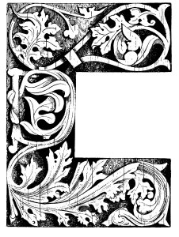

  
[Intangible Textual Heritage](../../index)  [Neo-Paganism](../index) 
[Roma](../../neu/roma/index)  [Index](index)  [Previous](gsft14) 
[Next](gsft16) 

------------------------------------------------------------------------

[Buy this Book at
Amazon.com](https://www.amazon.com/exec/obidos/ASIN/B002DUCMSI/internetsacredte)

------------------------------------------------------------------------

  
*Gypsy Sorcery and Fortune Telling*, by Charles Godfrey Leland,
\[1891\], at Intangible Textual Heritage

------------------------------------------------------------------------

p. 194

# CHAPTER XIII

### PROVERBS REFERRING TO WITCHES, GYPSIES, AND FAIRIES

Of Fairies, Witches, Gypsies,  
My nourrice sang to me ,  
Sua Gypsies, Fairies, Witches,  
I alsua synge to thee."  
         ("Denham Tract.")

 DR. KRAUSS has in his
work, "Sreca, Gluck und Schicksal im Volksglauben der Südslaven,"
collected a number of sayings in reference to his subject, from which I
have taken some, and added more from other sources.

p. 195

Of an evil woman one says, as in all languages, "*To ie vila*"—that is,
"a witch"; or it is uttered or muttered as, "*To je vila ljutica*"—that
is, "a biting (or bitter) witch"; or to a woman whom one dislikes, "*Idi
vilo!*"—"Begone, witch!" as in gypsy, "*Jasa tu chovihani*!"

Also, as in German, "*Ako i je baba, nje vjestica*"—"Though she is an
old woman she is no witch"; while, on the other hand, we have, "*Svake
baba viestica, a djed vjestac*"—"Every old woman is a witch, and every
old man a wizard."

The proverb, "*Bizi ko vistica od biloga luka*"—"she runs from it like a
witch from white garlic"—will be found fully explained in the chapter on
"The Cure of Children," in which it is shown that from early times
garlic has been a well-known witch-antidote.

Another saying is, "*Uzkostrsila se ko vistica*"—"Her hair is as
tangled, or twisted, as that of a witch"; English gypsy, "*Lâkis balia
shan risserdi sâr i chovihanis*." But this has a slightly different
meaning, since in the Slavonian it refers to matted, wild-looking locks,
while the Romany is according to a belief that the hair of a witch is
curled at the ends only.

Allied to this is the proverb, "*Izgleda kao aa su ga coprnice doniele
sa Ivanjscica*"—"He looks as if the witches had done for him (or brought
him away, 'fetched' him) on Saint John's Eve"; English Romany, "*Yuv
dikela sá soved a lay sar a chovihani*"—"He looks as if he had lain with
a witch."

"*Svaka vracara s vrazje strane*"—"Every witch belongs to the devil's
gang"—that is, she has, sold her soul to him and is in his interests.
This is allied to the saying, "*Kud ce vjestica do u svoj rod?*"—"Where
should a witch go if not to her kin or, "Birds of a feather flock
together."

"*Jasa ga vjestice*"—"The witches ride him"—refers to the ancient and
world-wide belief that witches turn men into animals and ride them in
sleep.

The hazel tree and nut are allied to the supernatural or witchly in

p. 196

many lands. For the divining rod, which—is, according to "La Grande
Bacchetta Divinatoria O Verga rivelatrice" of the Abbate Valmont, the
great instrument for all magic and marvels, must be made of "*un ramo
forcuto di nocciuòlo*"—a forked branch of hazel-nut"—whence a proverb,
"*Vracarice, coprnjice, kuko ljeskova*!"—"Sorceress, witch,
hazel-stick." This is a reproach or taunt to a woman who pays great
attention to magic and witchcraft. "This reveals a very ancient belief
of the witch as a wood-spirit or fairy who dwells in the nut itself."
More generally it is the bush which, in old German ballads, is often
addressed as Lady Hazel. In this, as in Lady Nightingale, we have a
relic of addressing certain animals or plants as if they were
intelligences or spirits. In one very old song in "Des Knaben
Wunderhorn," a girl, angry at the hazel, who has reproached her for
having loved too lightly or been too frail, says that her brother will
come and cut the bush down. To which Lady Hazel replies:—

"Although he comes and cuts me down,  
    I'll grow next spring, 'tis plain,  
But if a virgin wreath should fade,  
    'Twill never bloom again."

To keep children from picking unripe hazel-nuts in the Canton of Saint
Gall they cry to them, "*S' Haselnussfràuli chumt*"—"The hazel-nut lady
is coming!" Hence a rosary of hazel-nuts or a hazel rod brings luck, and
they may be safely hung up in a house. The hazel-nut necklaces found in
prehistoric tombs were probably amulets as well as ornaments.

Among popular sayings we may include the following from the *Gorski
Vijenac*:—

"A eto si udrijo vladiko,  
U nekakve smućene vjetrove,  
Ko u marču što udre yještice."

But behold, O Vladika,  
Thou hast thrown thyself into every storm,  
As witches throw or change themselves to cattle."

p. 197

And with these we may include the curse, "*Izjele te viestice*"—"May the
witches eat you!" which has its exact parallel in Romany. Also the
Scottish saying, "Witches, warlocks, and gypsies soon ken ae the
ither":—

"Witches and warlocks without any bother,  
Like gypsies on meeting well know one another."

I may appropriately add to these certain proverbs which are given in an
extremely rare "Denham Tract," of which only fifty copies were printed
by JOHN BELL RICHMOND, "*in. Com. Ebor.*" This quaint little work of
only six pages is entitled, "A Few Popular Rhymes, Proverbs, and Sayings
relating to Fairies, Witches, and Gypsies," and bears the dedication,
"To every individual Fairy, Witch, and Gypsy from the day of the Witch
of Endor down to that of Billy Dawson, the Wise Man of Stokesley, lately
defunct, this tract is inscribed."

WITCHES.

Vervain and Dill  
Hinder witches from their will.

The following refers to rowan or mountain-ash wood, which is supposed to
be a charm against witchcraft:—

If your whipstick's made of rowan  
You can ride your nag thro' any town.

Much about a pitch,  
Quoth the devil to the witch.

A hairy man's a geary man,  
But a hairy wife's a witch.

Woe to the lad  
Without a rowan-tree god.

A witch-wife and an evil  
Is three-halfpence worse than the devil.

p. 198

Hey-how for Hallow-e'en!  
When all the witches are to be seen,  
Some in black and some in green,  
Hey-how for Hallow-e'en!  
Thout! tout! a tout, tout!  
Throughout and about.

Cummer goe ye before, cummer goe ye,  
Gif ye will not goe before, cummer let me!

"These lines are said to have been sung by witches at North Berwick in
Lothian, accompanied by the music of a Jew's harp or trump, which was
played by Geilles Duncan, a servant girl, before two hundred witches,
who joined hands in a short daunce or reel, singing (also) these lines
with one voice:—

"'Witchy, witchy, I defy thee,  
Four fingers round my thumb,  
Let me go quietly by thee.'

"It will be seen that this is a phallic sign, and as such dreaded by
witches. It is difficult to understand why these verses with the sign
should have been given by witches."

The anti-witch rhyme used in Tweedesdale some sixty or seventy years ago
was:—

"'Black-luggie, lammer bead,  
Rowan-tree and reed thread,  
Put the witches to their speed.'

The meaning of 'black-luggie' I know not. 'Lammer bead' is a corruption
of 'amber-bead.' They are still worn by a few old people in Scotland as
a preservative against a variety of diseases, especially asthma, dropsy,
and toothache. They also preserve the wearer from, the effects of
witchcraft, as stated in the text. I have seen a twig of rowan-tree,
witch-wood, quick-bane, wild ash, wicken-tree, wicky, wiggy, witchen,
witch-bane, royne-tree, mountain-ash, whitty, wiggin, witch-hazel,
roden-quicken, roden-quicken-royan, roun, or ran-tree, which had been
gathered

p. 199

on the second of May (observe this), wound round with some dozens of
yards of red thread, placed visible in the window to act as a charm in
keeping witches and *Boggle-boes* from the house. So also we have—

"'Rowan-ash and reed thread  
Keep the devils from their speed,"'

Ye brade o' witches, ye can do no good to yourself.

Fair they came,  
Fair they go,  
And always their heels behind them.

Neither so sinful as to sink, nor so godly as to swim.

Falser than Waghorn, and he was nineteen times falser than the devil.

Ingratitude is worse than witchcraft.

Ye're as mitch  
As half a witch.

To milk the tether (*i.e.*, the cow-tie).

This refers to a belief that witches can carry off the milk from any
one's cow by milking at the end of the tether.

Go in God's name—so you ride no witches.

"Rynt, you witch" quoth Bess Lockit to her mother.

*Rynt*, according to Skeat, is the original Cumberland word for aroint,"
*i.e.*, "aroint thee, get thee gone." Icelandic *ryma*—"to make room, to
clear the way"—given, however, only as a guess. It seems to have been
specially applied to witches.

"'Aroint thee, witch!' the rump-fed ronyon cried."  
                                                 ("Macbeth")

Halliwell gives the word as *rynt*, and devotes a column to it, without
coming to any satisfactory conclusion. I think it is simply the old word
*rynt* or *wrynt*, another form of writhe, meaning to twist or strangle,
as if one should say, "Be thou strangled!" which was indeed a frequent
malediction. Halliwell himself gives "*wreint*" as meaning "awry," and

p. 200

"*wreith destordre*"—"to wring or wreith" ("Hollyband's Dictionarie,"
1593). The commonest curse of English gypsies at the present day is,
"*Beng tasser tute*!" "May the devil strangle you"—literally *twist*,
which is an exact translation of *wrinthe* or *rynt*.

"The gode man to hys cage can goo  
And *wrythed* the pye's neck yn to."  
                        ("MS. Cantab." ap. H.)

*Rynt* may mean twist away, *i.e.*, begone, as they say in America, "he
wriggled away."

They that burn you for a witch lose all their coals.

Never talk of witches on a Friday.

Ye're ower aude ffarand to be fraid o' witches.

Witches are most apt to confess on a Friday.

Friday is the witches' Sabbath.

To hug one as the devil hugs a witch.

|           |     |             |
|-----------|-----|-------------|
| As black  | }   | as a witch. |
| As cross  |     |             |
| As ugly   |     |             |
| As sinful |     |             |

Four fingers and a thumb—witch, I defy thee.

In Italy the signs are made differently. In Naples the *gettatura*
consists of throwing out the fore and middle fingers, so as to imitate
horns, with the thumb and fingers closed. Some say the thumb should be
within the middle and third fingers. In Florence the anti-witch gesture
is to *fare la fica*, or stick the thumb out between the fore and middle
fingers.

You're like a witch, you say your prayers backward.

Witch-wood (ie., the mountain ash).

You're half a witch-*i.e.*, very cunning.

Buzz! buzz! buzz!

In the middle of the sixteenth century if a person waved his hat or

p. 201

bonnet in the air and cried 'Buzz!' three times, under the belief that
by this act he could take the life of another, the old law and
law-makers considered the person so saying and acting to be worthy of
death, he being a murderer in intent, and having dealings with witches"
("Denham Tract"). Very doubtful, and probably founded on a well known
old story.

"I wish I was as far from God as my nails are free from dirt!"

Said to have been a witch's prayer whilst she was in the act of cleaning
her nails. In logical accuracy this recalls the black boy in America,
who on being asked if he knew the way to a certain place, replied, "I
only wish I had as many dollars as I know my way there."

A witch is afraid of her own blood.

A Pendle forest witch.

A Lancashire witch.

A witch cannot greet (ie., weep).

To be hog, or witch-ridden.

 

GYPSIES.

So many gypsies, so many smiths.

The gypsies are all akin.

One of the Faw gang,  
Worse than the Faw gang.

The Faws or Faas are a gypsy family whose head-quarters are at Yetholme.
I have been among them and knew the queen of the gypsies and her son
Robert, who were of this clan or name.

"It is supposed the Faws acquired this appellation from Johnnie Faw,
lord and earl of Little Egypt; with whom James the Fourth and Queen
Mary, sovereigns of Scotland, saw not only the propriety, but also the
necessity of entering into special treaty" ("Denham Tract")

"Francis Heron, king of the Faws, bur. (Yarrow) xiii. Jan., 1756
(SHARP'S "Chron. Mir").

p. 202

FAIRIES

Where the scythe cuts and the sock rives,  
No more fairies and bee-hives.

Laugh like a pixy (*i.e.*, fairy).

Waters locked! waters locked! (A favourite cry of fairies.)

Borram! borram! borram! (The cry of the Irish fairies after mounting
their steeds.  
Equivalent to the Scottish cry, "Horse! horse and hattock!")

To live in the land of the *Fair family*. (A Welsh fairy saying.)

God grant that the fairies may put money in your shoes and keep your
house clean.  
(One of the good wishes of the old time.)

Fairies comb goats' beards every Friday.

He who finds a piece of money will always find another in the same
place, so long as he keeps it a secret.  
(In reference to fairy gifts.)

It's going on, like Stokepitch's can.

A pixey or fairy saying, used in Devonshire. The family of Stokespitch
or Sukespic resided near Topsham, and a barrel of ale in their cellars
had for many years run freely without being exhausted. It was considered
a valuable heirloom, and was esteemed accordingly, till an inquisitive
maidservant took out the bung to ascertain the cause why it never run
dry. On looking into the cask she found it full of cobwebs, but the
fairies, it would seem, were offended, for on turning the cock, as
usual, the ale had ceased to flow.

It was a common reply at Topsham to the inquiry how any affair went on
"It's going on like Stokepitch's can," or proceeding prosperously.

To laugh like Robin Goodfellow.

To laugh like old Bogie;  
He caps Bogie.  
(Amplified to "He caps Bogie, and Bogie capped old Nick.")

To play the Puck. (An Irish saying, equivalent to the English one, "To
play the deuce or devil." KEIGHTLEY'S "Fairy Mythology.")

He has got into Lob's pound or pond. (That is, into the fairies'
pinfold. KEIGHTLEY'S "Fairy Mythology.")

p. 203

Pinch like a fairy. ("Pinch them, arms, legs, backs, shoulders, sides,
and shins." "Merry Wives of Windsor.")

To be fairy-struck. (The paralysis is, or rather perhaps was, so called.
KEIGHTLEY'S "Fairy Mythology.")

There has never been a merry world since the Phynoderee lost his ground.
\[A Manx fairy saying. See Train's "Isle of Man," ii. p. 14.8. "Popular
Rhymes of the Isle of Man," pp. 16, 17.\]

To be pixey-led.

Led astray by fairies or goblins. "When a man has got a wee drap ower
muckle whuskey, misses his way home, and gets miles out of his direct
course, he tells a tale of excuse and whiles lays the blame on the
innocent pixies" (see KEIGHTLEY'S "Fairy Mythology"). Also recalling
Feufollet, or the Will o' the Wisp, and the traveller who

         "thro' bog and bush  
Was lantern-led by Friar Rush."

Gypsies have from their out of doors life much familiarity with these
"spirits" whom they call *mullo dûdia*, or *mûllo doods*, *i.e.*, dead
or ghost lights. For an account of the adventure of a gypsy with them,
see "The English Gypsies and their Language," by C. G. LELAND. London:
Trübner & Co. "Pyxie-led is to be in a maze, to be bewildered as if led
out of the way by hobgoblins or puck, or one of the fairies. The cure is
to turn one of your garments the inside outward; some say that is for a
woman to turn her cap inside outward, and for a man to do the same with
some of his clothes" (MS. "Devon Glimpses"—Halliwell). "Thee pixie-led
in Popish piety" (CLOBERY'S "Divine Glimpses," 1659).

The fairies' lanthorn.

That is the glow-worm. In America a popular story represents an Irishman
as believing that a fire-fly was a mosquito "*sakin*' his prey wid a
lanthorn."

God speed you, gentlemen!

When an Irish peasant sees a cloud of dust sweeping along the road,

p. 204

he raises his hat and utters this blessing in behoof of ye
company of invisible fairies who, as he believes, caused it." ("Fairy
Mythology").

The Phooka have dirtied the blackberries.

Said when the fruit of the blackberry is spoiled through age or covered
with dust at the end of the season. In the North of England we say "the
devil has set his foot on the Bumble-Kites" ("Denham Tract").

Fairy, fairy, bake me a bannock and roast me a collop,  
And I'll give ye a spintle off my god end.

This is spoken three times by the Clydesdale peasant when ploughing,
because he believes that on getting to the end of the fourth furrow
those good things will be found spread out on the grass "(CHAMBERS'
"Popular Rhymes, Scotland," 3rd ed. p. 106).

Turn your clokes (*i.e.*, coats),  
For fairy folkes  
Are in old oakes.

"I well remember that on more occasions than one, when a schoolboy, I
have turned and worn my coat inside out in passing through a wood in
order to avoid the 'good people.' On nutting days, those glorious
red-letter festivals in the schoolboy's calendar, the use pretty
generally prevailed. The rhymes in the text are the English formula"
("Denham Tract").

He's got Pigwiggan

Vulgarly called Peggy Wiggan. A severe fall or Somerset is so termed in
the B'prick. The fairy Pigwiggan is celebrated by Drayton in his
Nymphidia" ("Denham Tract"). To which may be added a few more from other
sources.

Do what you may, say what you can,  
No washing e'er whitens the black Zingan.  
                                ("Firdusi.")

For every gypsy that comes to toon,  
A hen will be a-missing soon,  
And for every gypsy woman old,  
A maiden's fortune will be told. p. 205  
Gypsy hair and devil's eyes,  
Ever stealing, full of lies,  
Yet always poor and never wise.

He who has never lived like a gypsy does not know how to enjoy life as a
gentleman.

I never enjoyed the mere living as regards all that constitutes ordinary
respectable life so keenly as I did after some weeks of great hunger,
exposure, and misery, in an artillery company in 1863, at the time of
the battle of Gettysburg.

Zigeuner Leben Greiner Leben. (Gipsy life a groaning life. KORTE'S
"Sprichwörter d. D.")

Er taugt nicht zum Zigeuner. Spottisch vom Lügner gesagt weil er nicht
wahr-sagt. (KORTE, "Sprichwörter.")

"He would not do for a gypsy." Said of a liar because he cannot tell the
truth. In German to predict or tell fortunes also means to speak truly,
*i.e.*, *wahr* = true, and *sprechen* = to speak.

Gypsy repentance for stolen hens is not worth much. (*Old German
Saying*.)

The Romany chi  
And the Romany chal  
Love luripen  
And lutchipen  
And dukkeripen  
And huknipen  
And every pen  
But latchipen  
And tatchipen.

The gypsy woman  
And gypsy man  
Love stealing  
And lewdness  
And fortune telling  
And lying  
And every *pen*  
But shame  
And truth.

*Pen* is the termination of all verbal nouns.

                         (GEORGE BORROW, Quoted from memory.)

p. 206

It's a winter morning.

Meaning a bad day, or that matters look badly. In allusion to the
Winters, a gypsy clan with a bad name.

As wild as a gypsy.

Puro romaneskoes. (In the old gypsy fashion.)

Sie hat 'nen Kobold. ("She has a brownie, or house-fairy.")

"Said of a girl who does everything deftly and readily. In some places
the peasants believe that a fairy lives in the house, who does the work,
brings water or wood, or curries the horses. Where such a fairy dwells,
all succeeds if he or she is kindly treated" (KORTE'S "German
Proverbs").

"Man siehet wohl wess Geisters Kind Sie (Er.) ist."

"One can well see what spirit was his sire." In allusion to men of
singular or eccentric habits, who are believed to have been begotten by
the incubus, or goblins, or fairies. There are ceremonies by which
spirits may be attracted to come to people in dreams.

"There was a young man who lived near Monte Lupo, and one day he found
in a place among some old ruins a statue of a *fate* (fairy or goddess)
all naked. He set it up in its shrine, and admiring it greatly embraced
it with love (ut semen ejus profluit super statuam). And that night and
ever after the *fate* came to him in his dreams and lay with him, and
told him where to find treasures, so that he became a rich man. But he
lived no more among men, nor did he after that ever enter a church. And
I have heard that any one who will do as he did can draw the *fate* to
come to him, for they are greatly desirous to be loved and worshipped by
men as they were in the Roman times."

The following are Hungarian or Transylvanian proverbs:—

False as a Tzigane, ie., gypsy.

Dirty as a gypsy.

They live like gypsies (said of a quarrelsome couple).

p. 207

He moans like a guilty Tzigane (said of a man given to useless
lamenting).

He knows how to plow with the gypsies (said of a liar). Also: "He knows
how to ride the gypsies' horse."

He knows the gypsy trade (*i.e.*, he is a thief).

Tzigane weather (*i.e.*, a showery day).

It is gypsy honey (*i.e.*, adulterated).

A gypsy duck *i.e.*, a poor sort of wild duck.

"The gypsy said his favourite bird would be the pig if it had only
wings" (in allusion to the gypsy fondness for pork).

Mrs. GERARD gives a number of proverbs as current among Hungarian
gypsies which appear to be borrowed by them from those of other races.
Among them are:—

Who would steal potatoes must not forget the sack.

The best smith cannot make more than one ring at a time.

Nothing is so bad but it is good enough for somebody.

Bacon makes bold.

"He eats his faith as the gypsies ate their church."

A Wallach proverb founded on another to the effect that the gypsy church
was made of pork and the dogs ate it. I shall never forget how an old
gypsy in Brighton laughed when I told her this, and how she repeated: "O
Romani kangri sos kerdo bâllovas te i juckli hawde lis."

"No entertainment without gypsies."

In reference to gypsy musicians who are always on hand at every
festivity.

The Hungarian wants only a glass of water and a gypsy fiddler to make
him drunk.

In reference to the excitement which Hungarians experience in listening
to gypsy music.

With a wet rag you can put to flight a whole village of gypsies
(Hungarian).

It would not be advisable to attempt this with any gypsies in Great

p. 208

\[paragraph continues\] Britain, where
they are almost, without exception, only too ready to fight with
anybody.

Every gypsy woman is a witch.

"Every woman is at heart a witch."

In the "Materials for the Study of the Gypsies," by M. I. KOUNAVINE,
which I have not yet seen, there are, according to A. B. Elysseeff
(*Gypsy-Lore Journal*, July, 1890), three or four score of gypsy
proverbial sayings and maxims. These refer to Slavonian or far Eastern
Russian Romanis. I may here state in this connection that all who are
interested in this subject, or aught relating to it, will find much to
interest them in this journal of the Gypsy-Lore Society, printed by T. &
A. Constable, Edinburgh. The price of subscription, including membership
of the society, is £1 a year—Address: David Mac Ritchie, 4, Archibald
Place, Edinburgh.

------------------------------------------------------------------------

[Next: Chapter XIV: A Gypsy Magic Spell—The Great Secret](gsft16)

