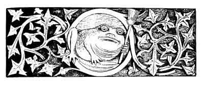
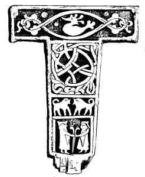
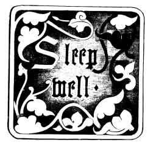

  
[Intangible Textual Heritage](../../index)  [Neo-Paganism](../index) 
[Roma](../../neu/roma/index)  [Index](index)  [Previous](gsft17) 

------------------------------------------------------------------------

[Buy this Book at
Amazon.com](https://www.amazon.com/exec/obidos/ASIN/B002DUCMSI/internetsacredte)

------------------------------------------------------------------------

  
*Gypsy Sorcery and Fortune Telling*, by Charles Godfrey Leland,
\[1891\], at Intangible Textual Heritage

------------------------------------------------------------------------

p. 255

 

 

 

# CHAPTER XVI

### GYPSIES, TOADS, AND TOAD-LORE

"I went to the toad that lies under the wall,  
I charmed him out, and he came at my call."  
                         Masque, of Queens," BEN JONSON.)

 THE toad plays a
prominent part in gypsy (as in other) witchcraft, which it may well do,
since in most Romany dialects there is the same word for a toad or frog,
and the devil. PASPATI declares that the toad suggested Satan, but I
incline to think that there is some as yet undiscovered Aryan word, such
as *beng*, for the devil, and that the German *Bengel*, a rascal, is a
descendant from it. However, gypsies and toads are "near allied and that
not wide" from one another, and sometimes their children have them for
pets, which recals the statements made in the celebrated witch trials in
Sweden, where it was said by those who professed to have been at the
Blockula, or *Sabbat*, that the little witch

p. 256

children were set to play at being shepherds, their flocks being of
toads.

I have been informed by gypsies that toads do really form unaccountable
predilections for persons and places. The following is accurately
related as it was told me in Romany fourteen years ago, in Epping
Forest, by a girl. "You know, sir, that people who live out of doors all
the time, as we do, see and know a great deal about such creatures. One
day we went to a farmhouse, and found the wife almost dying because she
thought she was bewitched by a woman who came every day in the form of a
great toad to her door and looked in. And, sure enough, while she was
talking the toad came, and the woman was taken in such a way with fright
that I thought she'd have died. But I had a laugh to myself; for I knew
that toads have such ways, and can not only be tamed, but will almost
tame themselves. So we gypsies talked together in Romany, and then said
we could remove the spell if she would get us a pair of shears and a cup
of salt. Then we caught the toad, and tied the shears so as to make a
cross—you see!—and with it threw the toad into the fire, and poured the
salt on it. So the witchcraft was ended, and the lady gave us a good
meal and ten shillings." (For a Romany poem on this incident *vide*
"English Gypsy Songs," Trübner and Co., 1875). And there is a terrible
tale told by R. H. Stoddard, in a poem, that one day a gentleman
accidentally trod on a toad and killed it. Hearing a scream at that
instant in the woods at a little distance, followed by an outcry, he
went to see what was the matter, and found a gypsy camp where they were
lamenting the sudden death of a child. On looking at the corpse he was
horrified to observe that it presented every appearance of having been
trampled to death, its wounds being the same as those he had inflicted
on the toad. This story being told by me to the gypsy girl, she in no
wise doubted its truth, being in fact greatly horrified at it; but was
amazed at the child *chovihani*, or witch, being in two places at once.

In the Spanish Association of Witches in the year 1610 (*vide* Lorent,
"Histoire de l'Inquisition") the toad played a great part. One who had

p. 257

taken his degrees in this Order testified that, on admission, a mark
like a toad was stamped on his eyelid, and that a real toad was given to
him which had the power to make its master invisible, to transport him
to distant places, and change him to the form of many kinds of animals.
There is a German interjection or curse "*Kroten-düvel*!" or
"toad-devil," which is supposed to have originated as follows: When the
Emperor Charlemagne came into the country of the East Saxons and asked
them whom they worshipped they replied, "Krodo is our god;" to which the
Emperor replied "Krodo is all the same as Kroten-düvel!" "And he made
them pay bitterly by the sword and the rope for the crime of calling
God, according to their language, by a name different from that which he
used; for he put many thousands of them to death, like King Olof of
Norway, to show that his faith was one of meekness and mercy."

It is bad to have one's looks against one. The personal appearance of
the toad is such as to have giver it a bad place in the mythology of all
races. The Algonkin Indians—who, like Napoleon and Slawkenbergius, were
great admirers of men with fine bold noses—after having studied the
plane physiognomy of the toad, decided that it indicated all the vices,
and made of the creature the mother of all the witches. Nothing could
have been more condemnatory; since in their religion—as in that of the
Accadians, Laps, and Eskimo—a dark and horrible sorcery, in which
witches conciliated evil spirits, was believed to have preceded their
own nobler Shamanism, by which these enemies of mankind were forced or
conquered by magic. Once the Great Toad had, as she thought, succeeded
in organizing a conspiracy by which Glooskap, the Shamanic god of
Nature, was to be destroyed. Then he passed his hand over her face and
that of her fellow-conspirator the Porcupine; and from that time forth
their noses were flat, to the great scorn of all honest well-beaked
Indians.

The old Persians made the toad the symbol and pet of Ahriman, the foe of
light, and declared that his *Charfester*, or attendant demons, took
that form when they persecuted Ormuzd. Among the Tyrolese it is a type
of envy; whence the proverb, "Envious as a toad." In the Middle

p. 258

Ages, among artists and in many Church legends, it appears as Greed or
Avarice: there is even to this day, in some mysterious place on the
right bank of the Rhine between Laufenberg and Binzgau, a pile of coals
on which sits a toad. That is to say, coals they seem to the world. But
the pile is all pure gold, and the toad is a devil who guards it; and he
who knows how can pronounce a spell which shall ban the grim guardian.
And there is a story told by Menzel ("Christliche Symbolik," vol. i. p.
530), that long ago there lived in Cologne a wicked miser, who when old
repented and wished to leave his money to the poor. But when he opened
his great iron chest, he found that every coin in it had turned to a
horrible toad with sharp teeth. This story being told to his confessor,
the priest saw in it divine retribution, and told him that God would
have none of his money—nay, that it would go hard with him to save his
soul. And he, being willing to do anything to be free of sin, was locked
up in the chest with the toads; and lo! the next day when it was opened
the creatures had eaten him up. Only his clean-picked bones remained.

But in the Tyrol it is believed that the toads are themselves poor
sinners, undergoing penance as Hoetschen or Hoppinen—as they are locally
called—for deeds done in human form. Therefore, they are regarded with
pity and sympathy by all good Christians. And it is well known that in
the Church of Saint Michael in Schwatz, on the evening before the great
festivals, but when no one is present, an immense toad comes crawling
before the altar, where it kneels and prays, weeping bitterly. The
general belief is that toads are for the most part people who made vows
to go on pilgrimages, and died with the vows unfulfilled. So the poor
creatures go hopping about astray, bewildered and perplexed, striving to
find their way to shrines which have perchance long since ceased to
exist. Once there was a toad who took seven years to go from Leifers to
Weissenstein; and when the creature reached the church it suddenly
changed to a resplendent white dove, which, flying up to heaven,
vanished before the eyes of a large company there assembled, who bore
witness to the miracle. And one day as a wagoner was going from
Innsbruck to Seefeld, as he

p. 259

paused by the wayside a toad came hopping up and seemed to be desirous
of getting into the wagon; which he, being a benevolent man, helped it
to do, and gave it a place on the seat beside him. There it sat like any
other respectable passenger, until they came to the side-path which
leads to the church of Seefield; when, wonderful to relate! the toad
suddenly turned to a maiden of angelic beauty clad in white, who,
thanking the wagoner for his kindness to her when she was but a poor
reptile, told him that she had once been a young lady who had vowed a
pilgrimage to the church of Seefield.

In common with the frog, the toad is an emblem of productiveness, and
ranks among creatures which are types of erotic passion. I have in my
possession a necklace of rudely made silver toads, of Arab workmanship,
intended to be worn by women who wish to become mothers. Therefore the
creature, in the Old World as well as in the New, appears as a being
earnestly seeking the companionship of men. Thus it happened to a youth
of Aramsach, near Kattenberg, that, being one day in a lonely place by a
lake, there looked up at him from the water a being somewhat like a maid
but more like a hideous toad, with whom he entered into conversation;
which became at last friendly and agreeable, for the strange creature
talked exceeding well. Then she, thinking he might be hungry, asked him
if he would fain have anything in particular to eat. He mentioned in
jest a kind of cakes; whereupon, diving into the lake, she brought some
up, which he ate. So he met her many times; and whenever he wished for
anything, no matter what, she got it for him from the waters: the end of
it all being that, despite her appalling ugliness, the youth fell in
love with her and offered marriage, to which she joyfully consented. But
no sooner had the ceremony been performed than she changed to a lady of
wonderful beauty; and, taking him by the hand, she conducted him to the
lake, into which she led him, and "in this life they were seen never
more." This legend evidently belongs to frog-lore. According to one
version, the toad after marriage goes to a lake, washes away her
ugliness, and returns as a beauty with the bridegroom to his castle,
where they live in perfect happiness.

p. 260

I have also a very old silver ring, in which there is set a toad rudely
yet artistically carved in hæmatite, or blood-stone. These were famous
amulets until within two or three hundred years.

If you are a gypsy and have a tame toad it is a great assistance in
telling fortunes, and brings luck—that commodity which, as CALLOT
observed, the gypsies are always selling to everybody while they protest
they themselves have none. As I tested with the last old gypsy woman
whom I met: "*What bâk the divvus*?"—"What luck to-day?" "*Kekker
rya*"—"None, sir," was the reply, as usual,—"I never have any luck." So
like a mirror they reflect all things save themselves, and show you what
they know not.

"I've seen you where you never were  
    And where you never will be  
And yet within that very place  
    You can be seen by me.  
For to tell what they do not know  
    Is the art of the Romany."

 

 
