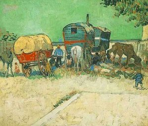

  
[Intangible Textual Heritage](../../index)  [Neo-Paganism](../index) 
[Roma](../../neu/roma/index) 

------------------------------------------------------------------------

[Buy this Book at
Amazon.com](https://www.amazon.com/exec/obidos/ASIN/B002DUCMSI/internetsacredte)

------------------------------------------------------------------------

<table width="75%">
<colgroup>
<col style="width: 50%" />
<col style="width: 50%" />
</colgroup>
<tbody>
<tr class="odd">
<td width="50%" data-valign="TOP"> 
Encampment of Gypsies with Caravans, by Van Gogh [1888] (Public Domain Image)</td>
<td width="50%" data-valign="CENTER"><h1 id="gypsy-sorcery-and-fortune-telling" data-align="CENTER">Gypsy Sorcery and Fortune Telling</h1>
<h2 id="by-charles-godfrey-leland" data-align="CENTER">by Charles Godfrey Leland</h2>
<h4 id="section" data-align="CENTER">[1891]</h4></td>
</tr>
</tbody>
</table>

------------------------------------------------------------------------

[Contents](#contents)    [Start Reading](gsft00)    [Page
Index](pageidx)    [Text \[Zipped\]](gsft.txt.gz)

------------------------------------------------------------------------

|                                                                                                                           |
|---------------------------------------------------------------------------------------------------------------------------|
|  |

The Gypsies, who call themselves Rom or Romany, are a nomadic culture
which originated in India during the Middle Ages. They migrated widely,
particularly to Europe, where they worked as farm laborers,
metalworkers, scrapdealers, and horsetraders. They also made a living as
entertainers, fortune tellers, and grifters. Persecuted by the Nazis,
and discriminated against to this day, the Rom have a long tradition of
magic and shamanism. As Leland points out, these practices have
parallels with those of other traditional pagan cultures around the
world.

This book discusses spells, incantations and talismans used within Rom
culture, as well as the more practical magic they use in their
interaction with the *Gorgios*--the non-Gypsies. It is this latter topic
which provides some of the most interesting and instructional reading.
Leland gives some generalized methods of fortune-telling which any
prospective psychic would do well to study; as well as the details of
the 'Great Secret', a magic trick in which all of your money
disappears...

Gypsy life has a romantic appeal, and Leland, who popularized Gypsy lore
in this and other books played no small part in this image-making.
However, Leland makes it abudantly clear that life on the road was hard.
The Rom people are to be admired for their survival skills in a hostile
world, and for the longevity and persistance of their culture.

------------------------------------------------------------------------

 [Title Page](gsft00)  
[Contents](gsft01)  
[Preface](gsft02)  
[Chapter I: The Origin of Witchcraft, Shamanism and Sorcery](gsft03)  
[Chapter II: Charms and Conjurations to Cure the Disorders of Grown
People](gsft04)  
[Chapter III: Gypsy Conjurations and Exorcisms](gsft05)  
[Chapter IV: South Slavonian and other Gypsy Witch-lore](gsft06)  
[Chapter V: Charms or Conjurations to Cure or Protect Animals](gsft07)  
[Chapter VI: Of Pregnancy and Charms](gsft08)  
[Chapter VII: The Recovery of Stolen Property, Love Charms](gsft09)  
[Chapter VIII: Roumanian and Transylvanian Sorceries and
Superstitions](gsft10)  
[Chapter IX: The Meetings of Witches](gsft11)  
[Chapter X: Of the Haunts, Homes and Habits of Witches in the South
Slavic Lands](gsft12)  
[Chapter XI: Gypsy Witchcraft—Magical Power and
Fortune-telling](gsft13)  
[Chapter XII: Fortune-Telling (continued)](gsft14)  
[Chapter XIII: Proverbs Referring to Witches, Gypsies and
Fairies](gsft15)  
[Chapter XIV: A Gypsy Magic Spell—The Great Secret](gsft16)  
[Chapter XV: Gypsy Amulets](gsft17)  
[Chapter XVI: Gypsies, Toads and Toad-lore](gsft18)  
