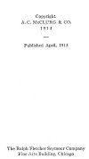

  
[Intangible Textual Heritage](../../index)  [Paganism](../index) 
[Index](index)  [Next](ppr01) 

------------------------------------------------------------------------

# PAGAN PRAYERS

### COLLECTED BY

## MARAH ELLIS RYAN

###### AUTHOR OF

##### FOR THE SOUL OF RAFAEL, INDIAN LOVE LETTERS, ETC.

 

#### CHICAGO

#### A. C. McCLURG & CO.

#### \[1913\]

NOTICE OF ATTRIBUTION  
Scanned at Intangible Textual Heritage, January 2005. John Bruno Hare,
redactor. This text is in the public domain in the United States because
it was published prior to 1922. These files may be used for any
non-commercial purpose provided this notice of attribution is left
intact.

[  
Click to enlarge](img/cover.jpg)  
Cover  

[  
Click to enlarge](img/title.jpg)  
Title Page  

p. verso

[  
Click to enlarge](img/verso.jpg)  
Verso  

Copyright

A. C. McCLURG & CO.

1913

Published April, 1913

The Ralph Fletcher Seymour Company

Fine Arts Building, Chicago

------------------------------------------------------------------------

[Next: Preface](ppr01)
