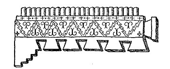

  
[Intangible Textual Heritage](../../index)  [Paganism](../index) 
[Index](index)  [Previous](ppr00)  [Next](ppr02) 

------------------------------------------------------------------------

# PREFACE

 

THIS little book of thoughts big, and thoughts childish, goes to the
reader with the hope that it bears the little known fact that Ancient
America had a written aboriginal literature--much of which was
beautiful.

The Apache and the Navajo prayers are oral, transmitted from priest to
priest through the centuries; but the Mexican are fragments, rescued
from a wide literature by the learned and courageous Franciscan,
Bernardino de Sahagun, in the Seventeenth century.

The first archbishop of Mexico took credit to himself for the burning,
in one town, of 60,000 Mexican books and manuscripts on history,
religion, law, medicine, astrology, genealogy and poetry. It was his
part of the approved battle against the false gods. For four centuries
he has had ardent imitators--which accounts for much.

The masked, dramatized prayers of the Indians of the Southwest of today,
suggested to the compiler a key to ancient Mexican rituals where god or
goddess replies directly to priest or suppliant. This is the one special
liberty taken with the records--the deity or priest is placed as the
Indian places him, in the temple of feast or sacrifice; while the
Spanish records gave only the spoken words with little to indicate the
ritual or the speakers.

The Peruvian had reached a higher spiritual and philosophic stage of
culture before his annihilation, though at loss of the spontaneous
poetic imagery, wistful or colorful, of the Mexican.

Such as they are, these prayers reflect the culture of both extinct and
living primitive peoples of the world we call the New, and they go out
for judgment side by side with the better known rituals of the world we
call the Old.

M. E. R.

 

------------------------------------------------------------------------

[Next: Contents](ppr02)
