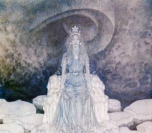

  
[Intangible Textual Heritage](../../index)  [Neopaganism](../index) 

------------------------------------------------------------------------

[Buy this Book at
Amazon.com](https://www.amazon.com/exec/obidos/ASIN/B002DUCMUG/internetsacredte)

------------------------------------------------------------------------

<table width="75%">
<colgroup>
<col style="width: 50%" />
<col style="width: 50%" />
</colgroup>
<tbody>
<tr class="odd">
<td width="50%" data-valign="TOP"> 
The Snow Queen, by Edmund Dulac [1911] (Public Domain Image)</td>
<td width="50%" data-valign="CENTER"><h1 id="the-sorceress-la-sorcière" data-align="CENTER">The Sorceress (La Sorcière)</h1>
<h2 id="by-jules-michelet" data-align="CENTER">by Jules Michelet</h2>
<h3 id="tr.-by-afred-richard-allinson" data-align="CENTER">tr. by Afred Richard Allinson</h3>
<h4 id="section" data-align="CENTER">[1939]</h4></td>
</tr>
</tbody>
</table>

------------------------------------------------------------------------

[Contents](#contents)    [Start Reading](sor00)    [Page
Index](pageidx)    [Text \[Zipped\]](sor.txt.gz)

------------------------------------------------------------------------

|                                                                                                                           |
|---------------------------------------------------------------------------------------------------------------------------|
|  |

> But the greatest revolution the Sorceress brought
> about, the chief movement of all in contradiction, in direct
> contradiction to the spirit of the Middle Ages, is what we might well
> call a rehabilitation of the belly and its digestive functions. They
> boldly proclaimed the doctrine that "nothing is impure and nothing
> unclean." From that moment the study of physical science was
> enfranchised, its shackles loosed, and true medicine became a
> possibility.--[p. 86](sor11.htm#page_86)
>
> This is a translation of Jules Michelet's La Sorcière, originally
> published in Paris in 1862. I have titled this text The Sorceress
> because that is a literal translation of the original French title.
> The original title of this translation was Satanism and Witchcraft,
> and it was later retitled Witchcraft, Sorcery and Superstition.
> However there is no need to sensationalize this book; the material is
> already sensational enough. And *women* are at the center of this
> book: peasant healers, aristocratic noblewomen, and nuns; we get an
> unparalleled look at the misery that medieval women faced, and some of
> the ways they rebelled.
>
> Michelet was one of the first to attempt a sociological explanation of
> the Witch trials. Like his successor [Margaret Murray](../wcwe/index),
> he interprets the source material very literally. Unlike Murray, he
> presents a proto-Marxist explanation for the phenomena; the witch cult
> as a primal rebellion against conventional society, one of many
> 'heretical' movements quashed by the Church. As time went on, the cult
> became institutionalized, which led to tacit toleration in some
> quarters. Michelet's portrayal of the lone sorceress as a pioneer of
> medicine and science is also memorable. Towards the end, a different
> kind of diabolical intervention is analyzed; the 'possession' of nuns
> in the 17th century, and how it was stage-managed by sadistic male
> clerics.
>
> Michelet uses a style popular in the 19th century, of interspersing
> fictional but representative incidents in with the exposition. A more
> academic style would quote pages and pages of heavily footnoted and
> very repetitive accounts. By condensing these into an short story,
> Michelet makes the book infinitely more readable. If you want an
> academically cited study, you'll have to look elsewhere, but that
> doesn't prevent this book from being a classic study of the burning
> times.
>
> ------------------------------------------------------------------------
>
>  [Title Page](sor00)  
> [Contents](sor01)  
> [Introduction](sor02)  
> 
>
> ### Part One
>
> [1. Death of the Gods](sor03)  
> [2. What Drove the Middle Ages to Despair](sor04)  
> [3. The Little Demon of the Hearth and Home](sor05)  
> [4. Temptations](sor06)  
> [5. Diabolical Possession](sor07)  
> [6. The Pact With Satan](sor08)  
> [7. King of the Dead](sor09)  
> [8. Prince of Nature](sor10)  
> [9. Satan the Healer](sor11)  
> [10. Charms and Love Potions](sor12)  
> [11. Communion of Revolt—Witches’ Sabbaths—The Black Mass](sor13)  
> [12. Black Mass Continued—Love and Death—Satan Disappears](sor14)  
> 
>
> ### Part Two
>
> [13. The Sorceress in Her Decadence—Satan Multiplied and
> Vulgarised](sor15)  
> [14. Persecutions](sor16)  
> [15. A Hundred Years’ Toleration in France](sor17)  
> [16. The Basque Witches (1609)](sor18)  
> [17. Satan Turns Ecclesiastic (1610)](sor19)  
> [18. Gauffridi (1610)](sor20)  
> [19. The Nuns of Loudun—Urbain Grandier (1633, 1634)](sor21)  
> [20. The Nuns Of Louviers and Satanic Possession—Madeleine Bavent
> (1640-1647)](sor22)  
> [21. Satan Triumphant in the Seventeenth Century](sor23)  
> [22. Father Girard and Charlotte Cadière](sor24)  
> [23. Charlotte Cadière at the Convent of Ollioules](sor25)  
> [24. Trial of Charlotte Cadière (1730, 1731)](sor26)  
> [Epilogue](sor27)  
> [Notes and Elucidations](sor28)  
> [Principal Authorities](sor29)  
