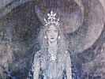

  
[Intangible Textual Heritage](../../index)  [Neopaganism](../index) 
[Index](index)  [Previous](sor12)  [Next](sor14) 

------------------------------------------------------------------------

[Buy this Book at
Amazon.com](https://www.amazon.com/exec/obidos/ASIN/B002DUCMUG/internetsacredte)

------------------------------------------------------------------------

  
*The Sorceress*, by Jules Michelet, \[1939\], at Intangible Textual
Heritage

------------------------------------------------------------------------

p. 98

### 11

### *COMMUNION of REVOLT WITCHES’ SABBATHS The BLACK MASS*

WITCHES’ *Sabbaths*. We must use the plural, for it is obvious the word
has denoted very different things at different epochs. Unfortunately, we
possess detailed accounts of such scenes only of quite late date,—reign
of Henri IV. [1](#fn_42) By that time it had
degenerated into little more than a huge carnival of lust, under
pretence of magic rites. But even in these descriptions of an
institution so far gone in decay are to be found certain marks of
extreme antiquity that bear witness to the successive periods and divers
forms through which it had already passed.

We may start with one fact that admits of no doubt, that for many
centuries the serf lived the furtive life of the wolf and the fox, that
he was a *nocturnal animal,* meaning by this, exhibiting the least
activity possible by day, being really alive only at night.

Still, up to the year 1000, when the people is still busy canonising its
saints and framing its legends, the life of daylight continues to be of
interest to him. His nocturnal Sabbaths are merely

p. 99

an unimportant relic of Paganism. He honours and fears the moon,
exerting as she does an influence over the productions of the soil. Old
women are her devotees, and burn little candles in honour of *Dianom*
(Diana-Luna-Hecaté). Goat-footed Pan still chases women and children,
under a mask, it is true, the black face of the ghostly Hallequin
(Harlequin). The festival of the *Pervigilium Veneris* is scrupulously
observed on May 1st. On St. John's day the he-goat of
Priapus-Bacchus-Sabasius is slaughtered in celebration of the Sabasia.
All this without a thought of mockery. It is the serf's harmless
carnival.

But, as we approach the year 1000, the Church is all but closed against
him by difference of language. In 1100 her officers become
unintelligible to him. Of the mysteries performed at the church doors,
what he remembers best is the comic side, the ox and the ass, etc. He
makes carols out of this material, but with an ever-increasing spice of
mockery in them—true "Sabbatic" literature.

 

We may well believe the great and terrible revolts of the twelfth
century were not without influence on these mysteries and this nocturnal
life of Werewolf and Moonrakes, of the Wild Game of the Woods, as the
cruel barons style it. These revolts may likely enough have often begun
in such moonlight festivals. The Holy Sacraments of insurrection among
serfs—drinking each other's blood, or eating earth by way of host [2](#fn_43)—were doubtless often celebrated at the
Witches’ Sabbath. The *Marseillaise* of the period, sung more by night
than by day, is perhaps a "Sabbatic chant:—

Nous sommes hommes comme ils sont  
Tout aussi grand cœur nous avons!  
Tout autant souffrir nous pouvons! [3](#fn_44)

p. 100

But the ponderous coffin lid falls back again in 1200. The Pope sits
atop, and the King, both exerting enormous pressure, and poor mankind is
immured within without hope of escape. Does the old nocturnal life
survive? Undoubtedly, and more vigorous than ever. The old Pagan dances
are revived, more fast and furious than ever. The Negroes of the
Antilles, after an intolerable day of heat and exhausting labour, forgot
all their sorrows in moonlight dances. The serf did likewise; but with
his revelry were inevitably mingled fierce anticipations of the delights
of vengeance, sarcastic buffooneries, mockeries, and caricatures of the
lord and the priest. A whole literature of the dark side of nature, that
knew never a word of that of its brighter aspects, and little even of
the *fabliaux* of the intermediate bourgeois classes.

 

Such was the essence of the "Sabbath" before 1300. For it to assume, as
it did later, the astounding character of an open war against the god of
those times, much more was needed, two things in fact, that the lowest
depths of despair should be sounded, and that *all sense of revenge
should disappear*.

This consummation is only reached in the fourteenth century, during the
Great Schism when the Papacy had migrated to Avignon, and the two-headed
Church seemed no longer a Church at all, when all the nobility of France
and the King himself are crestfallen prisoners in England, squeezing the
uttermost farthing out of their vassals to provide their ransom. Then it
is the Sabbaths adopt the imposing and grimly terrible ceremonial of the
*Black Mass*, the Holy Sacrament turned inside out, so to speak, when
Jesus Christ is defied, called up to strike his impious worshippers
dead—if he can. This devilish piece of play-acting would have been
impossible in the thirteenth century, when it would have raised a
shudder of pious horror. Later again, in the fifteenth, when every
sentiment was outworn, even that of suffering, an outburst of the sort
could never have taken place; men's spirits were unequal to so monstrous
a creation. It belongs essentially to the century of Dante.

p. 101

It was, I hold, the invention of a moment,—the frenzied outbreak of a
maddened brain, lifting impiety to the level of popular indignation. To
realise what this indignation was, we must remember how the people,
brought up by the clergy themselves in the firm belief of the
credibility and possibility of miracles, so far from supposing God's
laws immutable, had for centuries expected and hoped for a miracle,—that
never came. In vain men called for this miraculous intervention in the
day of their despair and utmost need. From that hour forth Heaven seemed
but the ally of their savage tyrants and oppressors, itself a tyrant as
blood-thirsty as any.

Hence the *Black Mass* and the *Jacquerie*.

The original framework of the Black Mass was elastic and could find room
for a thousand variations of detail; nevertheless it was strongly put
together, and in my opinion all of a piece.

I was enabled to retrace the course of this grim drama in 1857 in the
*Histoire de France*, where I recomposed its four successive Acts,—an
easy enough task. Only, at that date, I was too lavish in leaving it a
superfluity of those grotesque ornaments and after-growths the primitive
Witches’ Sabbath borrowed from modern times, and failed sufficiently to
indicate how much belongs to the old framework, so gloomy and so
terrible in its grim simplicity.

 

The date of this general framework is fixed beyond a doubt by sundry
abominable characteristics of an accursed age,—as also by the dominant
place woman holds in it, a marked peculiarity of the fourteenth century.

It is the special note of this century that woman, very far from being
enfranchised as she is, yet reigns as its queen, and this in a hundred
rude forms. She inherits fiefs in those days, brings a dowry of kingdoms
to the Sovereign. She sits enthroned in this world, and still more in
the skies. Mary has supplanted Jesus. St. Francis and St. Dominic beheld
the three worlds lying in her gracious bosom. In the immensity of her
grace she drowns the

p. 102

guilt of sin; what do I say, she abets sin. Read the legend of the nun
whose place in choir the Virgin keeps for her, while she goes to see her
lover.

In the sublimest heights, in the lowest depths, it is woman, always
woman. Beatrice is in heaven, ringed about by the stars, while Jean de
Meung, in the *Roman de la Rose*, is preaching the indiscriminate
enjoyment of women. Pure, degraded, woman is everywhere. We may say of
her what Raymond Lulle says of God: "What part is He of the Universe?
The whole."

But in the skies, in the realm of poetry, the woman that is exalted is
not the fertile mother, the parent glorified with children. It is the
virgin,—Beatrice, sterile, and dying young.

A fair English damsel, they say, visited France about 1300, to preach
the redemption of women, who deemed herself the Messiah of that creed.

 

The *Black Mass*, in its primary aspect, would seem to be this
redemption of Eve from the curse Christianity had laid upon her. At the
Witches’ Sabbath woman fulfils every office. She is priest, and altar,
and consecrated host, whereof all the people communicate. In the last
resort, is she not the very God of the Sacrifice as well?

 

There are many popular elements in it all, and yet it does not come
solely and entirely from the people. Your peasant respects force and
force alone; he holds women in light esteem. This is seen only too
plainly in all the old French "Coutumes" (see Michelet's *Origines*). He
would never have given woman the dominant place she here occupies, had
she not taken it of her own initiative.

I should be quite ready to believe the Sabbath, in its contemporary
shape, was the creation of woman's efforts, of a woman driven to
desperation, such as was the Sorceress of those days. In the fourteenth
century she sees opening before her a long and terrible career of
punishment and torments—three hundred,

p. 103

four hundred years lighted up with blazing faggots! Subsequently to the
year 1300 her medicines are adjudged to be mischievous, her remedies
condemned as poisons. The harmless spells where-by the lepers of that
time thought to alleviate their lot lead to the massacre of these
unhappy beings. Pope John XXII. has a bishop flayed alive on suspicion
of sorcery. Under such a system of blind and indiscriminate repression,
to venture little, to venture much and far, is all one, and the risk the
same. The very danger incurred increased the Sorceresses’ recklessness,
and led them to do and dare everything.

 

Fraternity of man with man, defiance of the Christians’ heaven, worship
of Nature's God under unnatural and perverted forms,—such the inner
significance of the *Black Mass*.

The altar was raised to the Spirit of the revolted serf, "*to Him who
has suffered wrong*, the Proscribed of ancient days, unjustly driven out
of Heaven, the Great Creator of the earth, the Master that makes the
plants germinate from the soil." Under such titles as these the
*Luciferians*, his adorers, did him honour, and, if we are to credit a
not improbable conjecture, the Knights of the Temple likewise.

The great marvel of all, in those times of utter poverty, is that means
were forthcoming for the nocturnal feast of fraternity which could never
have been provided by day. The Sorceress, at her own sore peril, induced
those in better circumstances to contribute, and collected the offerings
they made. Charity, as a satanic virtue, being at once crime and
conspiracy, and assuming the aspect of revolt, exercised a mighty
influence. Men stinted their meals by day to contribute to the nocturnal
feast where rich and poor met at a common table.

 

Imagine the scene,—a wide heath, often in the neighbourhood of an old
Celtic dolmen, at the edge of a wood. The picture is twofold,—on one
side the heath brightly lighted up, and the crowds of people feasting;
on the other, towards the wood, the

p. 104

choir of this church whose vault is the open heaven. The choir I speak
of is a knoll rising somewhat above the surrounding country. Midway
between the two, resinous fires burn with yellow tongues of flame and
ruddy embers, making a vague, fantastic veil of smoke.

In the background the Sorceress set up her Satan, a great wooden Satan,
black and shaggy. In virtue of his horns and the he-goat that stood by
his side, he might have passed for Bacchus; but his virile attributes
unmistakably proclaimed him Pan and Priapus. A darkling countenance,
that each saw under a different aspect. While some beheld only an
incarnate terror, others were moved by the haughty melancholy that
seemed to enfold the Exile of Eternity. [4](#fn_45)

 

*Act the First*. The superb *Introit* Christianity borrowed of
antiquity,—usual at all ceremonies where the people wound in and out in
long-drawn file under the temple colonnades, before entering the
sanctuary,—this the ancient god, come back to his own again,
appropriated for his services. Similarly, the *lavabo* was copied from
the old Pagan rites of purification. All this Satan claimed as his own
by right of ancient use.

His Priestess is always *The Aged*, this being a title of honour, but
she may as an actual fact be quite young. Lancre speaks of a Sorceress
of only seventeen, a pretty woman and atrociously cruel.

The Devil's Bride must not be a mere child; she should be full thirty
years of age, with the face of a Medea and the beauty of Our Lady of
Sorrows; her eye deep-set, tragic, and restless, her hair a dark
untamable torrent, falling round her shoulders wildly like writhing
snakes. Perhaps to crown all, the vervain crown above her brow, the
funereal ivy, and the violets of death.

She bids the children stand aloof,—till the feast. The office begins.

p. 105

"I will enter in, to this altar. . . . But, Lord, preserve me from the
Traitorous and the Overbearing" (the Priest and the Seigneur) .

Then comes the denial of Jesus, homage to the new Master and the feudal
kiss, as at the receptions of neophytes by the Templars, where all and
everything is yielded without reserve, shame, dignity, or choice,—with
this outrageous aggravation of insult added to the repudiation of their
God "that they love Satan's backside better."

It is his turn now to consecrate his priestess. The wooden god welcomes
her as of old Pan and Priapus did their female adorers. Agreeably to the
Pagan ceremonial, she gives herself to him, sits a moment on him, like
the Pythia on the tripod of the Delphic Apollo. She thus absorbs breath,
soul, life from him by way of this mimic impregnation. This done, with
equal solemnity she purifies her person. Henceforth she is the living
altar of the shrine.

 

The *Introit* is ended, and the office interrupted for the banquet. In
contrast with the nobles’ merrymakings, where they sit sword by side,
here at the feast of brothers not a weapon is to be seen, not so much as
a knife.

To safeguard the peace, each has a woman with him. Without a woman no
guest is admitted. Relation or no, wife or no, old, young, makes no
matter; but a woman each must have.

What liquors went round the board? Mead? beer? wine? heady cider, or
perry? Who can say? The last two, at any rate, first came into use in
the twelfth century.

Beverages to delude the mind, with their dangerous admixture of
belladonna, did these appear at the board as yet? The answer is
undoubtedly No! Children were present. Besides, excessive disorder of
the faculties would have hindered the dance that was to follow.

This dance, this whirling frenzy, the notorious "Witches’ Round," was
amply sufficient by itself to complete the first stage

p. 106

of intoxication. The performers danced back to back, arms behind the
back, without seeing their partner, though back often came in contact
with back. Little by little each man lost all knowledge both of self and
of her he had beside him. Old age and ugliness were abolished by a
veritable satanic miracle; she was still a woman, still lovable and
confusedly loved.

 

*Act the Second*. At the moment when the crowd, united in one and the
same giddy madness, felt itself drawn into a single personality as well
by the subtle influence of the feminine element as by a vague,
undefinable emotion of fraternity, the service was resumed at the
*Gloria*. Altar and host came on the scene. Under what form? That of
woman incarnate. By her prostrate body and humiliated person, by the
vast silken net of her hair, draggled in the dust, she (that proud
Proserpine) offered up herself a sacrifice. On her loins a demon
performed Mass, pronounced the *Credo*, deposited the offertory of the
faithful. [5](#fn_46)

In later times all this was an exhibition of indecency. But in the
fourteenth century, that period of calamity, the dread epoch of the
*Black Death*, and famine after famine, the days of the Jacquerie, and
the robberies and cruelties of the *Great Companies*,—for a people
exposed to so many perils, the effect was nothing if not serious. The
whole assemblage had the worst to fear in case of surprise. The
Sorceress herself ran the extremest risk, and in this act of defiant
daring was in a very true sense giving away her life. Nay! worse, she
was facing a perfect hell of possible torments,—tortures one dares
scarcely so much as speak of. Torn with pincers and broken on the wheel,
the breasts amputated, the skin flayed off little by little (as was done
to the

p. 107

\[paragraph continues\] Sorcerer Bishop of
Cahors), roasted before a slow fire and limb by limb, she might have to
endure an eternity of agony.

All present must indeed have been deeply stirred, when over the body of
the devoted being thus submitting to voluntary self-humiliation, prayer
and offering were made for the harvest. Wheat was presented to the
*Spirit of the Earth*, who makes the crops grow. Birds let loose—no
doubt from the woman's bosom—bore the *God of Liberty* the signs and
supplications of the unhappy serfs. What was the boon they craved? That
we, we their far-away descendants, might win enfranchisement. [6](#fn_47)

What was distributed by way of host at this strange eucharist? Not the
burlesque and abominable stuff we shall find so used in Henri IV.'s day;
but most probably the same *confarreatio* we have met with in philters,
the sacrament of love, a cake baked on her body, on the victim who
to-morrow might as likely as not pass through the fire herself. It was
her life, her death, they ate. The morsel was impregnated already with
the savour of her burning flesh.

 

Last of all, they laid on her two offerings apparently of human flesh,
representations of the *last dead* and the *last born* respectively of
the community. They shared the merit of the woman who was at once altar
and sacrifice, and the assemblage (symbolically) communicated in both
these novel elements. Triple the sacrifice, and human in all three; in
Satan's dim and gloomy rites the people was the sole object of adoration
to the people.

Here was the true sacrifice, and it was accomplished at last. Woman,
having given her very flesh to the crowd to eat, had ended her task. She
rose to her feet again, but did not leave the spot till she had firmly
established and as it were ratified the authenticity of it all by appeal
to the lightning, a defiance cast in the face of the God whose empire
she had usurped.

p. 108

In ribald mockery of the words: *Agnus Dei*, etc., and the breaking of
the wafer in the Christian Eucharist, she had a skinned toad brought to
her which she then tore in pieces. With eyes rolling horribly and looks
upturned to heaven, she decapitated the toad, repeating these strange
words: "Ah! *Philip*, [7](#fn_48) if only I had
you between my hands, I would treat you the same!"

 

Jesus making no reply to her defiance, no lightning stroke ensuing, He
was deemed vanquished. The nimble troop of demons would seize this
moment for astonishing the crowd with small miracles that impressed and
terrified the credulous. Toads—perfectly harmless creatures, but which
were believed to be deadly poisonous—were bitten and freely mangled
between their teeth. Unharmed they would leap over blazing fires and
red-hot embers, to amuse the populace and set them laughing at the fires
of hell.

Laughing? was the people moved to laughter, the ceremonial so tragic, so
bold, and reckless as it was? Impossible to say; but there can be no
doubt whatever hers was no laughing mood who first did and dared it all.
The bonfires could not fail but call up the image of those that might
ere long blaze round the stake of her own doom. Hers, too, the weighty
responsibility of safeguarding the succession of satanic sovereigns, of
training up the Sorceresses of the future.

------------------------------------------------------------------------

### Footnotes

[98:1](sor13.htm#fr_42) The least unsatisfactory
is that given by Lancre. He is a man of wit and perspicacity, and being
manifestly in relations with certain young witches, was in a position to
know the whole truth. Unfortunately, his Sabbath is confused and
overloaded with the grotesque ornaments of the age. The descriptions of
the Jesuit Del Rio and of the Dominican Michaëlis are ridiculous,
impossible portraits of a pair of silly, credulous pedants. In that of
Del Rio are found an incredible number of platitudes and absurdities.
Still, taking the thing as a whole, it contains some interesting and
valuable traces of antiquity, which I have been able to turn to account.

[99:2](sor13.htm#fr_43) At the battle of
Courtrai. See also Grimm, and Michelet's *Origines*.

[99:3](sor13.htm#fr_44)

"We are men as much as they!  
 We have a heart as big as they!  
 We can suffer no less than they!"

[104:4](sor13.htm#fr_45) This comes from Del
Rio, but is not, I should suppose, exclusively Spanish. It is an antique
trait and characteristic of primitive inspiration. Farcicalities come
later.

[106:5](sor13.htm#fr_46) This highly important
point, that woman was herself the altar, and that the office was
performed on her, we know from the trial of La Voisin, published by M.
Ravaisson, senior, among the other *Bastille Papers*. In these
imitations, of recent date, it is true, of the Witches’ Sabbath, carried
out for the amusement of the great nobles of the Court of Louis XIV.,
there is no doubt that the antique and classical forms of the primitive
Sabbath were reproduced, even in respect of a point such as this, where
the ancient ceremonial may very likely have been discontinued during the
intermediate period.

[107:6](sor13.htm#fr_47) This charming offering
of wheat and birds is peculiar to France (Jaquier, *Flagellans*, 57;
Soldan, 225). In Lorraine, and no doubt in Germany also, black animals
were offered up,—black cats, black goats, black bulls.

[108:7](sor13.htm#fr_48) Lancre, 136. Why the
name *Philip*, I have no idea. It is as impossible to give a reason as
to say why Satan, when he names Jesus, calls him little John, or
*Janicot*. Can it be she says *Philip* here, from the odious name of the
King who gave France a hundred years of English wars, who inaugurated at
Crécy the series of national defeats and cost the country the first
invasion of her soil? The long, almost uninterrupted, period of peace
that had gone before made war all the more horrible to the masses.
Philippe de Valois, author of this interminable war, was held accursed,
and perhaps left behind him in this popular ritual a never-forgotten
word of malediction.

------------------------------------------------------------------------

[Next: 12. Black Mass Continued—Love and Death—Satan Disappears](sor14)
