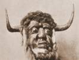

  
[Intangible Textual Heritage](../../index)  [Neopaganism](../index) 
[Index](index)  [Previous](wcwebib) 

------------------------------------------------------------------------

[Buy this Book at
Amazon.com](https://www.amazon.com/exec/obidos/ASIN/B0027ISAIM/internetsacredte)

------------------------------------------------------------------------

  
*The Witch-Cult in Western Europe*, by Margaret Alice Murray, \[1921\],
at Intangible Textual Heritage

------------------------------------------------------------------------

# ADDENDUM

### 1324 Kilkenny, Ireland.

\[This is the earliest record to give the names of all those who took
part in the ceremonies. Two of the poorer women were burned; Dame Alice
Kyteler returned to England; William Outlaw, her son, was imprisoned for
a time. Nothing is known of the fate of the rest.\]

1\. Alice Kyteler  
2. Alice, wife of Henry the Smith  
3. Annota Lange  
4. Eva de Brounstoun  
5. Helena Galrussyn  
6. John Galrussyn  
7. Petronilla de Meath  
8. Robert de Bristol  
9. Robin, son of Artis (the Devil)  
10. Sarah, daughter of Petronilla  
11. Sysok Galrussyn  
12. William Payn of Boly  
13. William Outlaw.
