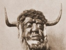

  
[Intangible Textual Heritage](../../index)  [Neopaganism](../index) 
[Index](index)  [Previous](wcweapp1)  [Next](wcweapp3) 

------------------------------------------------------------------------

[Buy this Book at
Amazon.com](https://www.amazon.com/exec/obidos/ASIN/B0027ISAIM/internetsacredte)

------------------------------------------------------------------------

  
*The Witch-Cult in Western Europe*, by Margaret Alice Murray, \[1921\],
at Intangible Textual Heritage

------------------------------------------------------------------------

# APPENDIX II

### TRIAL OF SILVAIN NEVILLON AND GENTIEN LE CLERC AT ORLEANS, 1614-15

\[This trial is included here as a specimen of purely ritual witchcraft,
without spell-casting.\]

*Arrest & procedure faicte par le Lieutenant Criminel d Orleans, contre
Siluain Neuillon, Gentien le Clerc dit Niuelle, & Mathurin Ferrand du
village de Nouan en Sologne, conuaincus de sortilege le 20 Juin 1614.*

Le Vendredy 20 Iuin 1614 ledit Lieutenant procedant à l'audition dudit
Neuillon comireur & Masson, aagé de 77 ans.

Ledit Lieutenant Criminel luy ayant dit qu'il luy vouloit faire raire on
razer le poil & changer d'habits: afin qu'il dict verité. L'accusé
s'escria en ces mots, Comment me veut-on faire mourir, Messieurs, si ie
vous confesse la verité, vous ne me ferez pas razer.

A confessé auoir esté an Sabbat prez Nouan, en vn lieu nommé Oliuet,

Dit que le Sabbat se tenoit dans vne maison, où il vit à la cheminée
com\[m\]e ledit Sabbat se faisoit, vn homme noir duquel on ne voyoit
point la teste, & deux cheures on boucs en la mesme maison ayant grand
poil noir. Il y auoit 200. personnes tons masquez, excepté vn nominé
Ferrand. Qu'allant à l'offrande aucuns baillent de l'argent comme à
l'Eglise.

Vit aussi vn grand homme noir à l'opposite de celuy de la cheminée, qui
regardoit dans vn liure, dont les feuillets estoient noirs & bleuds, &
marmotoit entre ses dents sans entendre ce qu'il disoit, leuoit vne
hostie noire, puis vn calice de meschant estain tout

\[1. *Sadducismus Debellatus*, p. 50.

2\. Id., p. 25.

3\. Cunningham, pp. 246, 251\]

crasseux. Vit que tons les assistans dançoient en bransles dos à dos, &
deux boucs ou cheures auec eux. Il y auoit des viandes si fades qu'il
n'en peut aualler, & croit que c'estoit de la chair de cheual, & que
ledit hom\[m\]e noir parloit comme si la voix fut sortie d'vn poinson:
Et vit enuiron douze enfans portez par des femmes, & que le Diable batit
vne femme auec vn baston, de ce qu'elle n'auoit pas apporté son enfant
comme elle auoit promis, bailloit ledit homme noir des gasteaux auxdits
petits enfans.

Dit que ceux qui ne vont au Sabbat, payent huict sols, qu'il y a des
processions où il a veu par fois six cens personnes, que les deux
Diables qui estoient au Sabbat, l'vn s'appelloit l'Orthon, & l'autre
Traisnesac, & qu'ils se baissoient enuers ceux qui leur emmenoient leurs
enfans comme pour les remercier, & baisoient leursdits enfans au cul.

Dit qu'il a veu le Diable en plusieurs façons, tantost comme vn bouc,
ayant vn visage deuant & vn autre derriere, ores comme vn gros mouton.

Qu'on baptise des enfans au Sabbat auec du Cresme, que des femmes
apportent, & frottent la verge de quelque homme, & en font sortir de la
sentence qu'elles amassent, & la meslent auec le Cresme, puis mettent
cela sur la teste de l'enfant en prononçant quelques paroles en Latin.

Dit aussi auoir veu des Sorciers & Sorcieres qui apportoient des Hosties
an Sabbat, lesquelles elles auoient gardé lors qu'on leur auoit baillé à
communier à l'Eglise, & que le Diable faisoit des gestes comme en
depitant sur icelles Hosties, desquelles on faisoit de lit poudre, &
quelque fois on les mettoit dans l'eau, & que le Diable estoit fort ayse
quand on luy apportoit lesdites Hosties.

Dit auoir ouy dire à Guilleaume le Clerc dit Nitelle, que pour auoir
faict mourir vn homme le Diable donnoit de recompence huict sols, & pour
vne femme cinq sols.

Dit que le Diable les bat ail Sabbat, quand ils ne sçauent rendre compte
d'auoir fait quelque mal, & qu'il leur dit en se separant vengez vous,
autrement vous mourrez.

Dit que le iour qu'on a esté a la Messe, on ne peut estre ensorcellé, on
qu'on a vn *Agnus Dei* sur soy, que bien souuent ils appellent l'Hostie
Iean le blanc, que les femmes chantent des chãsons en l'honneur du
Diable, & qu'à l'entree & sortie de table au Sabbat, on dit au Diable
nous vous recognoissons pour nostre maistre, nostre Dieu, nostre
Createur.

Que le Diable dit le Semõ au Sabbat, mais qu'on n'entend ce qu'il dit,
parce qu'il parle com\[m\]e en grõdant, & qu'il iette de la poudre par
toute l'assemblée, com\[m\]e on fait de l'eau beniste.

Vit qu'on frappoit dans l'eau d'vne baguette, & aussi tost vit comme il
luy sembloit que c'estoit de la gresle.

Dit estre allé souuent an Sabbat de son pied tout esueillé, & ne se
grassoit point, d'autant que c'estoit folie de se graisser quand on tie
va pas loing.

Dit que le Diable monstre une forme de membre viril au Sabbat, ong comme
vne chandelle, & qu'il vit vne femme qui le baisa par là.

Dit que les Sorciers ne peuuent faire mal le Vendredy, à cause que Dieu
y auoit souffert la mort, & estoit venu au monde ledit iour.

Dit qu'il y a des Sorciers qui nourrissent des Marionettes, qui sont de
petits Diableteaux en forme de Crapaux, & leur font manger de la
bouillie composée de laict & de farine, & leur donnent le premier
mourceau, & n'oseroient s'absenter de leur maison sans leur demander
congé, & luy faut dire combien de temps ils seront absens, comme trois
ou quatre iours, & si elles disent que c'est trop, ceux qui les gardent,
n'osent faire leur voyage ny outre-passer leur volonté.

Et quand ils veulent aller en marchandise ou ioüer, & sçauoir s'il y
fera bon, ils regardent si lesdites Marionettes sont ioyeuses, en ce cas
ils vont en marchandise, ou ioüer: mais si elles sont maussades &
tristes, ils ne bougent de la maison, & le plus souuent lesdites
Marionettes vsent enuers eux de grandes menaces.

Interrogé ledit Neuillon par ledit Lieutenant Criminel, si à son aduis
vn Iuge pourroit faire prendre lesdites Marionettes, veu que ce sont
Demons familliers.

Respond qu'vn bon Iuge pourroit bien faire emporter lesdites
Marionettes, d'autant qu'elles craignent fort les bons Iuges: mais qu'vn
Iuge qui ne feroit pas bien la Iustice, ny gagneroit rien, & que les
Sorciers peuuent ensorceller vn meschant Iuge, parce que Dieu l'a
abandonné.

Dit qu'il a veu bailler au Sabbat du pain benist, & de l'encens, mais il
ne sentoit bon comme celuy de l'Eglise, & que c'estoit vn des Diables
nommé Orthon qui le donnoit, lorsque Tramesabot disoit la Messe, &
qu'auant la commencer il iettoit de l'eau beniste qui estoit faicte de
pissat, & faisoit la reverence de l'espaule, & disoit, *Asperges
Diaboli*.

Ledit Neuillon estoit conuaincu par le procez, d'auoir empoisoneé &
faict mourir plusieurs personnes & bestiaux, & d'auoir faict d'autres
maux.

Gentil ou Gentie\[n\] le Clerc dit, que sa mère le presenta (dit-on) ell
l'aage de trois ans au Sabbat, à vn bouc, qu'on appelloit l'Aspic. Dit
qu'il fut baptisé au Sabbat, au Carroir d'Oliuet, auec quatorze ou
quinze autres, & que Ieanne Geraut porta du Chresme qui estoit jaune
dans vn pot, & que ledit Neuillon ietta de la semence dans ledit pot, &
vn nommé Semelle, & broüilloient cela auec vne petite cuilliere de bois,
& puis leur en mirent à tous sur la teste.

Il vit marquer plusieurs personnes, mais les femmes principalement entre
les tetins.

Qu'on baille à baiser la paix comme l'Eglise, & que cela semble vne
tuille, & qu'on y baille vn denier ou vn double allant à l'offrande,
l'eau beniste est iaune comme du pissat d'asne, & qu'apres qu'on la
iettée on dit la Messe, & que c'est le Diable qui la dit, qu'il a vne
Chasuble qui a vne croix: mais qu'elle n'a que trois barres: & tourne le
dos à l'Autel quand il veut leuer l'Hostie & le Calice, qui sont noirs,
& marmote dans vn liure, duquel la couuerture est toute veluë comme
d'vne peau de loup, auec des feuillets blancs & rouges, d'autres noirs.

Et quand ledit homme noir a ietté, ou iette de l'eau beniste, chacun des
assistans, se iette en terre comme on faict à l'Eglise sur la fosse des
trespassez, auec vn morceau de hou qui a trois feuilles au bout. Après
la Messe on dance, puis on couche ensemble, hommes auec hommes, & femme
auec des femmes. Puis on se met à table, où il n'a iamais veu de sel. Et
n'y a autre viande que grenouille & anguilles, & point de vin ains de
l'eau.

Dit qu'il a cognu des hommes & s'est accouplé auec eux; qu'il auoit vne
couppe ou gondolle par le moyen de laquelle toutes les femmes le
suiuoient pour y boire.

Qu'au Sabbat on y blasphemoit souuent, disant chardieu, c'est vne belle
chose qu'ils font blanchir pour qu'on la voye de plus loing, & puis la
mangent, & quand Ils l'ont mangé il n'y en a plus, que les Prestres font
cela pour amuser le monde, & que c'est vn beau Ianicot, qu'il y auoit
plus d'acquest en sa Marionette qu'en Dieu. Et auoit veu souuent la
Marionette dudit Neuillon, qui est comme vn gros crapaut tout noir,
comme d'vne fourrure noire, & estoit dans vne boëtte caché soubs vn
carreau, qui sautoit & leuoit quand on vouloit dormer à manger audit
crapaut. Qu'il l'a veu encore puis six sepmaines en la ruelle du lict
dudict Neuillon, & qu'il a veu qu'il l'apportoit vne autre fois dans son
manteau, qu'il luy a dit vne douzaine de fois, que s'il vouloit il luy
en feroit auoir vne. Qu'il y auoit plus profit en icelle qu'en Dieu, &
qu'il ne gagnoit rien à regarder Dieu: mais que sa Marionette luy
apportoit tousiours quelque chose.

Confesse auoir faict mourir plusieurs personnes, & qu'il sçait faire
dancer les bœufs dans vn cercle qu'il fait, & qu'vne vieille luy
apprins.

Ils furent condamnez par sentence a estre pendus & bruslez. Appel en la
Cour, ou au rapport de Monsieur Berulle, Conseiller en la seconde
Chambre des Enquestes, deux Sorciers moururent. Cependant Gentien le
Clerc seul, fut condamné par Arrest du 4 Feurier 1615.

------------------------------------------------------------------------

[Next: Appendix III. Names of Witches in Covens](wcweapp3)
