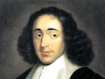

  
[Intangible Textual Heritage](../../../index) 
[Philosophy](../../index)  [Spinoza](../index)  [Index](index) 
[Previous](corr41)  [Next](corr43) 

------------------------------------------------------------------------

[Buy this Book at
Amazon.com](https://www.amazon.com/exec/obidos/ASIN/048620250X/internetsacredte)

------------------------------------------------------------------------

  
*Correspondence*, by Benedict de Spinoza, \[1883\], at Intangible
Textual Heritage

------------------------------------------------------------------------

### LETTER XLII. (XXXVII.)

#### SPINOZA TO I. B. [1](#fn_54)

\[*Concerning the best method, by which we may safely arrive at the
knowledge of things*.\]

Most learned Sir and Dearest Friend,—I
have not been able hitherto to answer your last letter, received some
time back. I have been so hindered by various occupations and calls on
my time, that I am hardly yet free from them. However, as I have a few
spare moments, I do not want to fall short of my duty, but take this
first opportunity of heartily thanking you for your affection and
kindness towards me, which you have often displayed in your actions, and
now also abundantly prove by your letter.

I pass on to your question, which runs as follows: "Is there, or can
there be, any method by which we may, without hindrance, arrive at the
knowledge of the most excellent things? or are our minds, like our
bodies, subject to the vicissitudes of circumstance, so that our
thoughts are governed rather by fortune than by skill?" I think I shall
satisfy you, if I show that there must necessarily be a method, whereby
we are able to direct our clear and distinct perceptions, and that our
mind is not, like our body, subject to the vicissitudes of circumstance.

p. 361

This conclusion may be based simply on the consideration that one clear
and distinct perception, or several such together, can be absolutely the
cause of another clear and distinct perception. Now, all the clear and
distinct perceptions, which we form, can only arise from other clear and
distinct perceptions, which are in us; nor do they acknowledge any cause
external to us. Hence it follows that the clear and distinct
perceptions, which we form, depend solely on our nature, and on its
certain and fixed laws; in other words, on our absolute power, not on
fortune—that is, not on causes which, although also acting by certain
and fixed laws, are yet unknown to us, and alien to our nature and
power. As regards other perceptions, I confess that they depend chiefly
on fortune. Hence clearly appears, what the true method ought to be
like, and what it ought chiefly to consist in—namely, solely in the
knowledge of the pure understanding, and its nature and laws. In order
that such knowledge may be acquired, it is before all things necessary
to distinguish between the understanding and the imagination, or between
ideas which are true and the rest, such as the fictitious, the false,
the doubtful, and absolutely all which depend solely on the memory. For
the understanding of these matters, as far as the method requires, there
is no need to know the nature of the mind through its first cause; it is
sufficient to put together a short history of the mind, or of
perceptions, in the manner taught by Verulam.

I think that in these few words I have explained and demonstrated the
true method, and have, at the same time, pointed out the way of
acquiring it. It only remains to remind you, that all these questions
demand assiduous study, and great firmness of disposition and purpose.
In order to fulfil these conditions, it is of prime necessity to follow
a fixed mode and plan of living, and to set before one some definite
aim. But enough of this for the present, &c.

Voorburg, 10 June, 1666.

------------------------------------------------------------------------

### Footnotes

[360:1](corr42.htm#fr_55) I. B. has been
identified by some with John Bredenburg, a citizen of Rotterdam, who
translated into Latin (1675) a Dutch attack on the Tractatus
Theologico-Politicus, but the tone of the letter renders this
improbable. Murr and Van Vloten think that I. B. may be the physician,
John Bresser, who prefixed some verses to the "Principles of Cartesian
Philosophy."

------------------------------------------------------------------------

[Next: Letter XLIII. To I. v. M. (omitted)](corr43)
