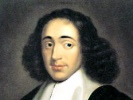

  
[Intangible Textual Heritage](../../../index) 
[Philosophy](../../index)  [Spinoza](../index)  [Index](index) 
[Previous](corr66)  [Next](corr68) 

------------------------------------------------------------------------

[Buy this Book at
Amazon.com](https://www.amazon.com/exec/obidos/ASIN/048620250X/internetsacredte)

------------------------------------------------------------------------

  
*Correspondence*, by Benedict de Spinoza, \[1883\], at Intangible
Textual Heritage

------------------------------------------------------------------------

p. 402

### LETTER LXVIII.A.

#### G. H. SCHALLER TO SPINOZA.

\[*Schaller relates to Spinoza Tschirnhausen's doings in France, and
letter to him, and makes known to Spinoza the answers contained in that
letter to Spinoza's objections in Letter LX VIII. and the request of
Leibnitz to see Spinoza's unpublished writings*.\]

Amsterdam, 14 Nov., 1675.

Most learned and excellent Master, my most
venerable Patron,—I hope that you duly received my letter with
——'s method, [1](#fn_72) and likewise, that you
are up to the present time in good health, as I am.

But for three months I had no letter from our friend von Tschirnhausen,
whence I formed sad conjectures that he had made a fatal journey, when
he left England for France. Now that I have received a letter, in my
fulness of joy I felt bound, according to his request, to communicate it
to the Master, and to let you know, with his most dutiful greeting, that
he has arrived safely in Paris, and found there Mr. Huygens, as we had
told him, and consequently has in every way sought to please him, and is
thus highly esteemed by him. He mentioned, that the Master had
recommended to him Huygens's conversation, and made very much of him
personally. This greatly pleased Huygens; so he answered that he
likewise greatly esteemed you personally, and he has now received from
you a copy of the Theologico-Political Treatise, which is esteemed by
many there, and it is eagerly inquired, whether there are extant any
more of the same writer's works. To this Mr. von Tschirnhausen replied
that he knew of none but the Demonstrations in the first and second
parts of the Cartesian Principles. But he mentioned nothing about the
Master, but what I have said, and so he hopes that he has not displeased
you herein.

\*     \*     \*     \*     \*     \*

To the objection that you last made he replies, that those few words
which I wrote at the Master's

p. 403

dictation, [1](#fn_73) explained to him your
meaning more thoroughly, and that he has favourably entertained the said
reasonings (for by these two methods [2](#fn_74)
they best admit of explanation). But two reasons have obliged him to
continue in the opinion implied in his recent objection. Of these the
first is, that otherwise there appears to be a contradiction between the
fifth and seventh propositions of the second book. For in the former of
these it is laid down, that the objects of ideas are the efficient
causes of the ideas, which vet seems to be refuted by the quotation, in
the proof of the latter, of the fourth axiom of Part I. "Or, as I rather
think, I do not make the right application of this axiom according to
the author's intention, which I would most willingly be told by him, if
his leisure permits it. The second cause which prevented me from
following the explanation he gives was, that thereby the attribute of
thought is pronounced to extend much more widely than other attributes.
But since every one of the attributes contributes to make up the essence
of God, I do not quite see how this fact does not contradict the opinion
just stated. I will say just this more, that if I may judge the minds of
others by my own, there will be great difficulty in understanding the
seventh and eighth propositions of Book II., and this for no other
reason than that the author has been pleased (doubtless because they
seemed so plain to him) to accompany the demonstrations annexed to them
with such short and laconic explanations."

He further mentions, that he has found at Paris a man called Leibnitz,
remarkably learned, and most skilled in various sciences, as also free
from the vulgar prejudices of theology. With him he has formed an
intimate acquaintance, founded on the fact that Leibnitz labours with
him to pursue the perfection of the intellect, and, in fact, reckons
nothing better or more useful. Von Tschirnhausen says, that he is most
practised in ethics, and speaks without any stimulus of the passions by
the sole dictate of reason. He adds, that he is most skilled in physics,
and also in metaphysical

p. 404

studies concerning God and the soul. Finally, he concludes that he is
most worthy of having communicated to him the Master's writings, if you
will first give your permission, for he believes that the author will
thence gain a great advantage, as he promises to show at length, if the
Master be so pleased. But if not, do not doubt, in the least, that he
will honourably keep them concealed as he has promised, as in fact he
has not made the slightest mention of them. Leibnitz also highly values
the Theologico-Political Treatise, on the subject of which he once wrote
the Master a letter, if he is not mistaken. And therefore I would beg my
Master, that, unless there is some reason against him, you will not
refuse your permission in accordance with your gracious kindness, but
will, if possible, open your mind to me, as soon as may be, for after
receiving your answers I shall be able to reply to our friend von
Tschirnhausen, which I would gladly do on Tuesday evening, unless
important hindrances cause my Master to delay.

Mr. Bresser, [1](#fn_75) on his return from
Cleves, has sent here a large quantity of the beer of that country; I
suggested to him that he should make a present to the Master of half a
tun, which he promised to do, and added a most friendly greeting.

Finally, excuse my unpractised style and hurried writing, and give me
your orders, that I may have a real occasion of proving myself, most
excellent Sir,

Your most ready servant,      
G. H. SCHALLER.

------------------------------------------------------------------------

### Footnotes

[402:1](corr67.htm#fr_73) See the next Letter.

[403:1](corr67.htm#fr_74) Letter LXVIII.

[403:2](corr67.htm#fr_75) That is, I think,
hearing from the author criticized what his precise meaning is, and
attending carefully to his arguments in favour of the opinion thus
precisely ascertained.—\[Tr.\]

[404:1](corr67.htm#fr_76) See Letters XLI.A,
XLII.

------------------------------------------------------------------------

[Next: Letter LXVIII.B. To Schaller](corr68)
