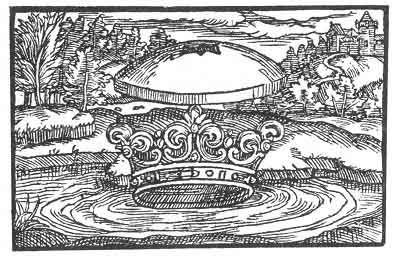

[Intangible Textual Heritage](../../index)  [Prophecy](../index) 
[Index](index)  [Previous](pop09)  [Next](pop11) 

------------------------------------------------------------------------

p. 65

 

### The Fifth Figure

'Thou hast not had the wisdom of thy crown, but has turned against the
way of the crown, and hast done much evil. A stone shall fall upon thee
that will press thee hard against thy will. For thou hast shed innocent
blood and wast unwilling to know that which thou shouldst have known and
what belongeth to a crown. He whom thou hast despised shall visit thee
from the South and from the East, ere thou canst count two or three, and
having recourse to thy allies will not avail thee for they themselves
will fall.'

------------------------------------------------------------------------

[Next: The Sixth Figure](pop11)
