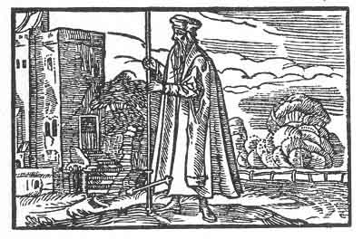

[Intangible Textual Heritage](../../index)  [Prophecy](../index) 
[Index](index)  [Previous](pop24)  [Next](pop26) 

------------------------------------------------------------------------

p. 80

 

### The Twentieth Figure

'A thing standeth upright as long as it can be upheld; but when man
alone uplifteth, then in its time, the highest will become lowest. In
this wise shall man set his wisdom against the earth and bury it
therein, from whence it hath come, and it shall give way to another. For
human wisdom may last for a time. She is compared to a flower in the
field, that is lovely and pleasing in herself. But the flower doth not
remain, much less human wisdom. It is said "Time bringeth roses," but
these also fade. Thus shall it happen to thee, because thou art of
thyself.'

------------------------------------------------------------------------

[Next: The Twenty-First Figure](pop26)
