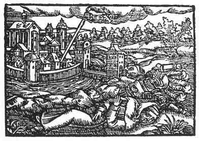

[Intangible Textual Heritage](../../index)  [Prophecy](../index) 
[Index](index)  [Previous](pop26)  [Next](pop28) 

------------------------------------------------------------------------

p. 82

 

### The Twenty-Second Figure

'Although thou hast not wholly revealed thy heart, yet there is nothing
that in its time will remain secret and not be revealed. Then shalt thou
become known to him that should know thee. For thou didst and wouldst
presume to subjugate the soft in silken and the hard in iron clothing,
and wast thinking in thy councils: Now may we not what we would, who are
they that shall prevent us? Nay, truly, it will be the soft at first,
the iron afterward, but it will cost thine own blood. Didst thou but
think of humility, not of the kingdom of this world, how well would it
be with thee.'

------------------------------------------------------------------------

[Next: The Twenty-Third Figure](pop28)
