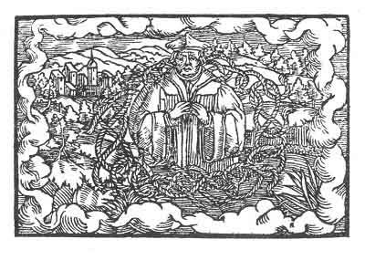

[Intangible Textual Heritage](../../index)  [Prophecy](../index) 
[Index](index)  [Previous](pop29)  [Next](pop31) 

------------------------------------------------------------------------

p. 85

 

### The Twenty-Fifth Figure

'A thing must be understood as certain and true in order to be known
without any doubt. But for this reason, that finite knowledge had faults
and defects in thy design, therefore has thou been strangled in thine
own doubts. Thou hast supposed that there is no need for closing with
the true seal, and hast thought to be a seal thyself; but therein thou
wast in error and art not what thou hast supposed thyself to be. This
will give thee a miserable death. For thou hast lived on and on in
doubt, and others with thee have built upon sand. They have wept, and
thou shalt weep yet more.'

------------------------------------------------------------------------

[Next: The Twenty-Sixth Figure](pop31)
