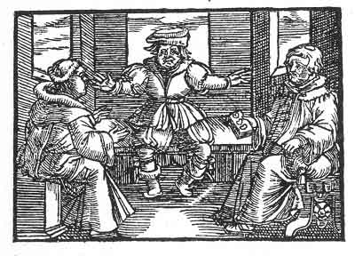

[Intangible Textual Heritage](../../index)  [Prophecy](../index) 
[Index](index)  [Previous](pop34)  [Next](pop36) 

------------------------------------------------------------------------

p. 90

 

### The Thirtieth Figure

'Thou hast often assembled, and much congregated, but the enemy was not
with thee, therefore all things thou hast resolved were to no purpose
and in vain. It must be alone that thou wilt forgo thy claims, and
reflect of whom thou art, of whom thou hast learnt, and what thou
wouldst do if thou wert to turn aside, and wouldst acknowledge thyself
and others; then wouldst thou cease. But as thou desirest to be what
thou shouldst not be, and wilt sit upon the chair of Saint Peter, and
whereas the same must fall; therefore thou mayest not continue in thy
plots, for he shall turn aside thy design who is thy master.'

------------------------------------------------------------------------

[Next: The Thirty-First Figure](pop36)
