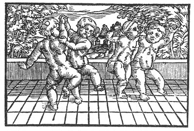

[Intangible Textual Heritage](../../index)  [Prophecy](../index) 
[Index](index)  [Previous](pop35)  [Next](pop37) 

------------------------------------------------------------------------

p. 91

 

### The Thirty-First Figure

'There shall be such a total renewal and change that they will be as
children that know nothing of the cunning and intrigues of the old. This
shall be when they count LX, a little less, but not more. [\*](#fn_1) Therefore it is well that we should
remember that the time appeareth to be a long time according to a man's
lifetime, but as a short time should we observe and consider it. For to
cause so much to fall and to be overthrown, with such a raging and
roaring lion that has so long grown, this cannot be done in a moment.
But how well shall it be with him that shall be as a little child, for
human knowledge causeth but unrest and grief.'

------------------------------------------------------------------------

### Footnotes

[91:\*](pop36.htm#fr_1) When LVX, Lux, Light,
comes.

------------------------------------------------------------------------

[Next: The Thirty-Second Figure](pop37)
